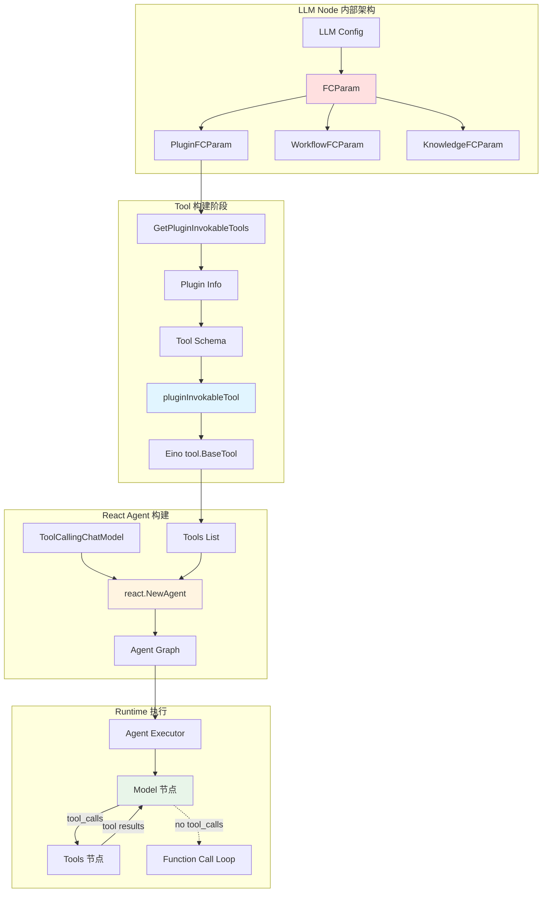
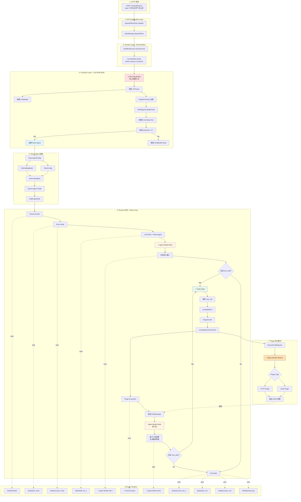
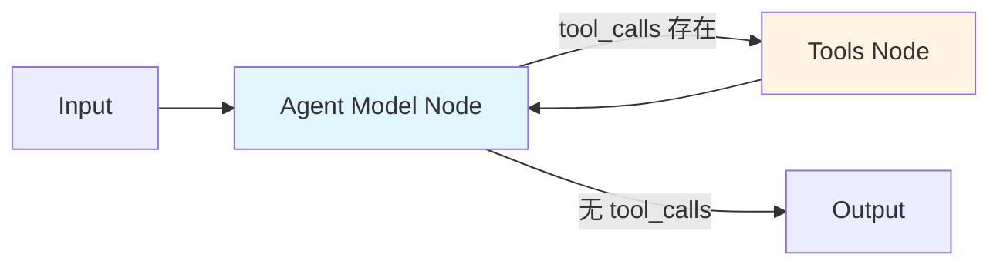
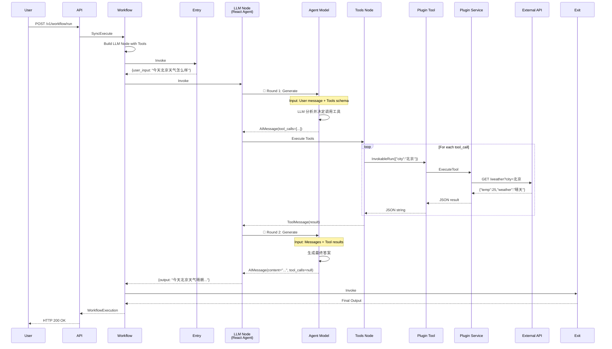
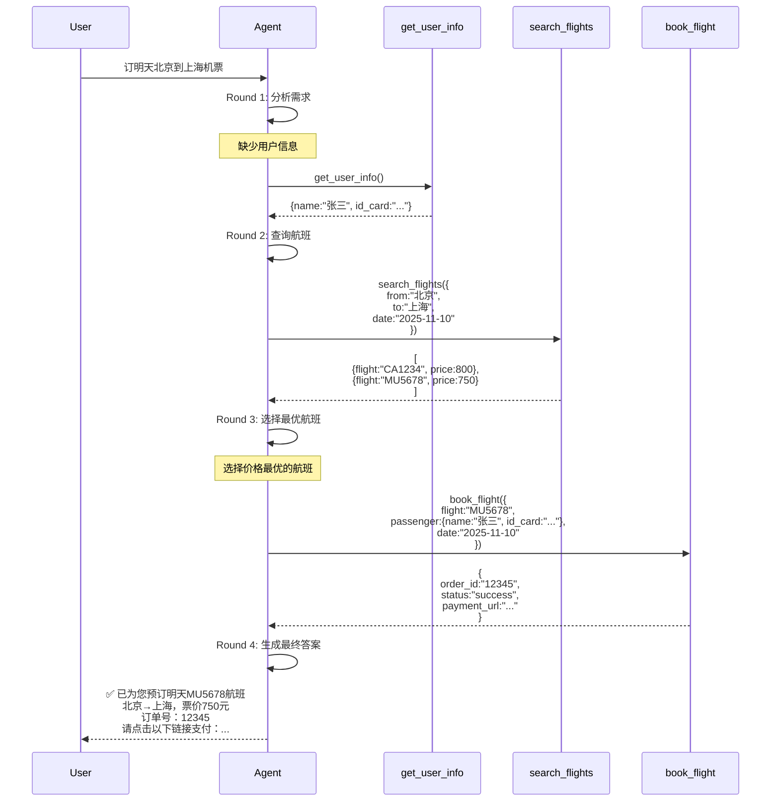

# 7.6 进阶示例：LLM Function Calling（大模型 + 技能）

> 本文档详细介绍 Coze Studio 中 LLM Function Calling 的完整实现流程
> 
> **作者**: AI 架构分析专家  
> **版本**: v1.0  
> **更新时间**: 2025-11-09

---

## 目录

- [7.6 进阶示例：LLM Function Calling（大模型 + 技能）](#76-进阶示例llm-function-calling大模型--技能)
  - [目录](#目录)
  - [7.6.1 场景描述](#761-场景描述)
  - [7.6.2 Function Calling 架构全览](#762-function-calling-架构全览)
  - [7.6.3 完整数据流图](#763-完整数据流图)
  - [7.6.4 详细代码执行流程](#764-详细代码执行流程)
    - [Step 1: LLM 节点构建 - 解析 FCParam](#step-1-llm-节点构建---解析-fcparam)
    - [Step 2: Plugin 转换为 Tool](#step-2-plugin-转换为-tool)
    - [Step 3: React Agent 创建与工作原理](#step-3-react-agent-创建与工作原理)
    - [Step 4: Runtime 执行时序](#step-4-runtime-执行时序)
  - [7.6.5 Function Calling 协议详解](#765-function-calling-协议详解)
    - [OpenAI Function Calling 标准格式](#openai-function-calling-标准格式)
  - [7.6.6 关键数据转换](#766-关键数据转换)
  - [7.6.7 多工具调用示例](#767-多工具调用示例)
    - [场景：订机票](#场景订机票)
    - [并行工具调用](#并行工具调用)
  - [7.6.8 性能优化与最佳实践](#768-性能优化与最佳实践)
    - [性能考量](#性能考量)
    - [最佳实践](#最佳实践)
      - [1. Tool Description 优化](#1-tool-description-优化)
      - [2. 错误处理](#2-错误处理)
      - [3. 安全控制](#3-安全控制)
      - [4. 参数验证](#4-参数验证)
      - [5. 调试支持](#5-调试支持)
  - [7.6.9 与普通插件节点的对比](#769-与普通插件节点的对比)
    - [使用场景建议](#使用场景建议)
  - [总结](#总结)

---

## 7.6.1 场景描述

我们分析一个**使用 Function Calling 的 Workflow**：

```
[开始] → [大模型 + 技能] → [结束]
```

**核心特性**：
- ✅ LLM 节点配置了插件作为 Tools
- ✅ LLM 可以自主决定是否调用工具
- ✅ 使用 **React Agent** 模式
- ✅ 支持多轮工具调用循环

**业务场景**：
1. 用户提问："今天北京天气怎么样，适合去颐和园吗？"
2. LLM 分析后决定调用天气查询工具
3. LLM 使用 Function Calling 发起工具调用请求
4. 系统执行工具，获取天气数据
5. LLM 基于工具返回结果生成最终答案

**Canvas JSON 结构**：

```json
{
  "nodes": [
    {
      "key": "entry",
      "type": "entry",
      "outputs": {"user_input": "string"}
    },
    {
      "key": "llm_1",
      "type": "llm",
      "config": {
        "model": "gpt-4",
        "systemPrompt": "你是一个旅游助手",
        "userPrompt": "{{user_input}}",
        "fcParam": {
          "pluginFCParam": {
            "pluginList": [
              {
                "pluginID": "12345",
                "apiId": "67890",
                "apiName": "get_weather",
                "pluginVersion": "1.0.0",
                "isDraft": false,
                "pluginFrom": "space",
                "fcSetting": {
                  "requestParameters": [
                    {
                      "name": "city",
                      "type": "string",
                      "description": "城市名称"
                    }
                  ],
                  "responseParameters": [
                    {
                      "name": "temperature",
                      "type": "number"
                    },
                    {
                      "name": "weather",
                      "type": "string"
                    }
                  ]
                }
              }
            ]
          }
        }
      }
    },
    {
      "key": "exit",
      "type": "exit",
      "inputs": {"output": "string"}
    }
  ],
  "connections": [
    {"from": "entry.user_input", "to": "llm_1.user_input"},
    {"from": "llm_1.output", "to": "exit.output"}
  ]
}
```

---

## 7.6.2 Function Calling 架构全览



**架构说明**：

1. **LLM Node 内部架构**：
   - FCParam 是 Function Calling 的配置入口
   - 支持三种类型：Plugin（插件）、Workflow（工作流）、Knowledge（知识库）

2. **Tool 构建阶段**：
   - 将配置转换为可执行的 Tool
   - 每个 Tool 包含 Schema（name, description, parameters）
   - 实现 Eino tool.BaseTool 接口

3. **React Agent 构建**：
   - 使用 react.NewAgent 创建智能体
   - 配置 ToolCallingChatModel 和 Tools
   - 导出 Agent Graph

4. **Runtime 执行**：
   - Model 节点调用 LLM
   - LLM 返回 tool_calls
   - Tools 节点执行工具
   - 循环直到 LLM 不再生成 tool_calls

---

## 7.6.3 完整数据流图



---

## 7.6.4 详细代码执行流程

### Step 1: LLM 节点构建 - 解析 FCParam

**代码位置**：`backend/domain/workflow/internal/nodes/llm/llm.go` (385-718行)

**核心代码流程**：

```go
func (c *Config) Build(ctx context.Context, ns *schema2.NodeSchema, _ ...schema2.BuildOption) (any, error) {
    var (
        tools                 []tool.BaseTool  // ⭐ 核心：tools 数组
        toolsReturnDirectly   map[string]bool
    )
    
    // 1️⃣ 构建 ChatModel
    chatModel, info, err := modelbuilder.BuildModelByID(ctx, 
        c.LLMParams.ModelType, c.LLMParams.ToModelBuilderLLMParams())
    modelWithInfo := NewModel(chatModel, info)
    
    // 2️⃣ 处理 FCParam（Function Calling 参数）
    fcParams := c.FCParam
    if fcParams != nil {
        
        // 2.1 处理 WorkflowFCParam（Workflow 作为工具）
        if fcParams.WorkflowFCParam != nil {
            for _, wf := range fcParams.WorkflowFCParam.WorkflowList {
                wfTool, err := workflow.GetRepository().WorkflowAsTool(ctx, ...)
                tools = append(tools, wfTool)
            }
        }
        
        // 2.2 处理 PluginFCParam（插件作为工具）⭐ 核心部分
        if fcParams.PluginFCParam != nil {
            pluginToolsInvokableReq := make(map[int64]*wrapPlugin.ToolsInvokableRequest)
            
            for _, p := range fcParams.PluginFCParam.PluginList {
                pid, _ := strconv.ParseInt(p.PluginID, 10, 64)
                toolID, _ := strconv.ParseInt(p.ApiId, 10, 64)
                
                // 构建 ToolsInvokableRequest
                pluginToolsInfoRequest := &wrapPlugin.ToolsInvokableRequest{
                    PluginEntity: vo.PluginEntity{
                        PluginID:      pid,
                        PluginVersion: ptr.Of(p.PluginVersion),
                    },
                    ToolsInvokableInfo: map[int64]*wrapPlugin.ToolsInvokableInfo{
                        toolID: {
                            ToolID:                      toolID,
                            RequestAPIParametersConfig:  p.FCSetting.RequestParameters,
                            ResponseAPIParametersConfig: p.FCSetting.ResponseParameters,
                        },
                    },
                }
                pluginToolsInvokableReq[pid] = pluginToolsInfoRequest
            }
            
            // 🔥 将插件转换为 InvokableTool
            for _, req := range pluginToolsInvokableReq {
                toolMap, err := wrapPlugin.GetPluginInvokableTools(ctx, req)
                for _, t := range toolMap {
                    inInvokableTools = append(inInvokableTools, newInvokableTool(t))
                }
            }
            
            tools = append(tools, inInvokableTools...)
        }
        
        // 2.3 处理 KnowledgeFCParam（知识库作为工具）
        if fcParams.KnowledgeFCParam != nil {
            // 构建知识库检索配置
            knowledgeRecallConfig = &KnowledgeRecallConfig{...}
        }
    }
    
    // 3️⃣ 创建 Graph
    g := compose.NewGraph[map[string]any, map[string]any](...)
    
    // 4️⃣ 添加 Prompt Template 节点
    g.AddChatTemplateNode(templateNodeKey, templateWithChatHistory)
    g.AddEdge(compose.START, templateNodeKey)
    
    // 5️⃣ ⭐ 关键决策：是否使用 React Agent
    if len(tools) > 0 {
        // 有工具：创建 React Agent
        m, ok := modelWithInfo.(model.ToolCallingChatModel)
        reactConfig := react.AgentConfig{
            ToolCallingModel: m,
            ToolsConfig:      compose.ToolsNodeConfig{Tools: tools},
        }
        reactAgent, _ := react.NewAgent(ctx, &reactConfig)
        agentNode, opts := reactAgent.ExportGraph()
        g.AddGraphNode(llmNodeKey, agentNode, opts...)
    } else {
        // 无工具：普通 ChatModel
        g.AddChatModelNode(llmNodeKey, modelWithInfo)
    }
    
    r, _ := g.Compile(ctx)
    return &LLM{r: r, ...}, nil
}
```

### Step 2: Plugin 转换为 Tool

**代码位置**：`backend/domain/workflow/plugin/plugin.go` (257-337行)

```go
func GetPluginInvokableTools(ctx context.Context, req *ToolsInvokableRequest) (
    _ map[int64]crossplugin.InvokableTool, err error) {
    
    // 1. 获取插件信息和工具列表
    pInfo, toolsInfo, err := getPluginsWithTools(ctx, &req.PluginEntity, ...)
    
    // 2. 为每个 Tool 创建 pluginInvokeTool 实例
    result := map[int64]crossplugin.InvokableTool{}
    for _, tf := range toolsInfo {
        tl := &pluginInvokeTool{
            pluginEntity: vo.PluginEntity{
                PluginID:      pInfo.ID,
                PluginVersion: pInfo.Version,
            },
            toolInfo: tf,  // ⭐ 包含 Tool Schema
        }
        
        // 3. 应用自定义参数配置
        if req.ToolsInvokableInfo != nil {
            if info, ok := req.ToolsInvokableInfo[tf.ID]; ok {
                tl.requestParametersConfig = info.RequestAPIParametersConfig
                tl.responseParametersConfig = info.ResponseAPIParametersConfig
            }
        }
        
        result[tf.ID] = tl
    }
    
    return result, nil
}

// Tool Info 方法（提供给 LLM 的 Schema）
func (p *pluginInvokeTool) Info(ctx context.Context) (*schema.ToolInfo, error) {
    return &schema.ToolInfo{
        Name:        p.toolInfo.Name,        // 工具名称
        Description: p.toolInfo.Description, // 工具描述
        ParamsOneOf: []schema.ToolParamInfo{
            {
                JSONSchema: p.toolInfo.InputSchema,  // 参数 JSON Schema
            },
        },
    }, nil
}

// Tool 执行方法
func (p *pluginInvokeTool) PluginInvoke(ctx context.Context, argumentsInJSON string, 
    cfg workflowModel.ExecuteConfig) (string, error) {
    
    // 1. 构建执行请求
    req := &model.ExecuteToolRequest{
        PluginID:        p.pluginEntity.PluginID,
        ToolID:          p.toolInfo.ID,
        ArgumentsInJson: argumentsInJSON,  // LLM 生成的参数
    }
    
    // 2. 调用 Plugin Service 执行
    r, err := crossplugin.DefaultSVC().ExecuteTool(ctx, req, ...)
    
    // 3. 返回结果 JSON
    return r.TrimmedResp, nil
}
```

**Tool 包装为 Eino BaseTool**：

```go
// backend/domain/workflow/internal/nodes/llm/plugin.go
type pluginInvokableTool struct {
    pluginInvokableTool crossplugin.InvokableTool
}

func (p pluginInvokableTool) InvokableRun(ctx context.Context, 
    argumentsInJSON string, opts ...tool.Option) (string, error) {
    execCfg := execute.GetExecuteConfig(opts...)
    return p.pluginInvokableTool.PluginInvoke(ctx, argumentsInJSON, execCfg)
}
```

### Step 3: React Agent 创建与工作原理

**React Agent 配置**：

```go
reactConfig := react.AgentConfig{
    ToolCallingModel: m,  // 支持 function calling 的模型
    ToolsConfig:      compose.ToolsNodeConfig{
        Tools: tools,  // 所有可用工具
    },
    ModelNodeName:    "agent_model",
    GraphName:        "react_agent",
}

reactAgent, _ := react.NewAgent(ctx, &reactConfig)
agentNode, opts := reactAgent.ExportGraph()
g.AddGraphNode("llm", agentNode, opts...)
```

**React Agent Graph 结构**：



**React Loop 详细流程**：

1. **第一轮 - Agent Model 调用**：
```
Input: {messages: [UserMessage("今天北京天气怎么样")]}
↓
LLM 分析：需要调用天气工具
↓
Output: AIMessage(
  content="",
  tool_calls=[
    ToolCall(name="get_weather", args='{"city":"北京"}')
  ]
)
```

2. **Tools Node 执行**：
```
解析 tool_calls
↓
调用 tool.InvokableRun("{"city":"北京"}")
↓
执行插件：crossplugin.ExecuteTool()
↓
返回 ToolMessage(
  tool_call_id="call_123",
  content='{"temperature":25,"weather":"晴天"}'
)
```

3. **第二轮 - Agent Model 调用**：
```
Input: {
  messages: [
    UserMessage("今天北京天气怎么样"),
    AIMessage(tool_calls=[...]),
    ToolMessage(result='{"temperature":25,"weather":"晴天"}')
  ]
}
↓
LLM 基于工具结果生成答案
↓
Output: AIMessage(
  content="今天北京天气晴朗，温度25°C，非常适合去颐和园游玩！",
  tool_calls=null
)
```

4. **结束循环**：
- 没有新的 tool_calls
- 返回最终结果

### Step 4: Runtime 执行时序



---

## 7.6.5 Function Calling 协议详解

### OpenAI Function Calling 标准格式

**第一轮请求（LLM 决策）**：

```json
{
  "model": "gpt-4",
  "messages": [
    {
      "role": "system",
      "content": "你是一个旅游助手，可以使用以下工具获取信息"
    },
    {
      "role": "user",
      "content": "今天北京天气怎么样"
    }
  ],
  "tools": [
    {
      "type": "function",
      "function": {
        "name": "get_weather",
        "description": "获取指定城市的天气信息",
        "parameters": {
          "type": "object",
          "properties": {
            "city": {
              "type": "string",
              "description": "城市名称，如：北京、上海"
            }
          },
          "required": ["city"]
        }
      }
    }
  ],
  "tool_choice": "auto"
}
```

**LLM 返回（决定调用工具）**：

```json
{
  "id": "chatcmpl-123",
  "choices": [
    {
      "message": {
        "role": "assistant",
        "content": null,
        "tool_calls": [
          {
            "id": "call_abc123",
            "type": "function",
            "function": {
              "name": "get_weather",
              "arguments": "{\"city\":\"北京\"}"
            }
          }
        ]
      },
      "finish_reason": "tool_calls"
    }
  ]
}
```

**工具执行后的消息**：

```json
{
  "role": "tool",
  "tool_call_id": "call_abc123",
  "name": "get_weather",
  "content": "{\"temperature\":25,\"weather\":\"晴天\",\"humidity\":45}"
}
```

**第二轮请求（LLM 生成答案）**：

```json
{
  "model": "gpt-4",
  "messages": [
    {
      "role": "system",
      "content": "你是一个旅游助手..."
    },
    {
      "role": "user",
      "content": "今天北京天气怎么样"
    },
    {
      "role": "assistant",
      "content": null,
      "tool_calls": [
        {
          "id": "call_abc123",
          "type": "function",
          "function": {
            "name": "get_weather",
            "arguments": "{\"city\":\"北京\"}"
          }
        }
      ]
    },
    {
      "role": "tool",
      "tool_call_id": "call_abc123",
      "content": "{\"temperature\":25,\"weather\":\"晴天\",\"humidity\":45}"
    }
  ]
}
```

**LLM 最终响应**：

```json
{
  "choices": [
    {
      "message": {
        "role": "assistant",
        "content": "今天北京天气晴朗，温度25°C，湿度45%，非常适合去颐和园游玩！建议您带上防晒用品。"
      },
      "finish_reason": "stop"
    }
  ]
}
```

---

## 7.6.6 关键数据转换

```
【阶段 1】FCParam 配置 → Tools 数组
─────────────────────────────────────────
Input:
  FCParam.PluginFCParam.PluginList = [
    {
      pluginID: "12345",
      apiId: "67890",
      apiName: "get_weather",
      fcSetting: {
        requestParameters: [{name: "city", type: "string"}],
        responseParameters: [{name: "temperature", type: "number"}]
      }
    }
  ]

Process:
  1. GetPluginInvokableTools() 获取插件元数据
  2. 提取 Tool Schema (name, description, parameters)
  3. 创建 pluginInvokableTool 实例
  4. 包装为 tool.BaseTool

Output:
  tools = [
    tool.BaseTool {
      Info() → {
        name: "get_weather",
        description: "获取城市天气信息",
        parameters: {"city": {"type": "string"}}
      },
      InvokableRun(args) → 执行插件
    }
  ]


【阶段 2】Tools 数组 → React Agent
─────────────────────────────────────────
Input:
  tools []tool.BaseTool
  model ToolCallingChatModel

Process:
  1. react.AgentConfig 配置
  2. react.NewAgent() 创建 Agent
  3. ExportGraph() 导出 Graph

Output:
  Agent Graph {
    Model Node: 调用 LLM 进行推理
    Tools Node: 执行工具调用
    Loop: Model → Tools → Model
  }


【阶段 3】用户输入 → Agent 第一轮
─────────────────────────────────────────
Input:
  {user_input: "今天北京天气怎么样"}

Process:
  1. Prompt Template 渲染
  2. ChatModel.Generate()
  3. LLM 分析并生成 tool_calls

Output:
  AIMessage {
    content: null,
    tool_calls: [
      {
        name: "get_weather",
        arguments: '{"city":"北京"}'
      }
    ]
  }


【阶段 4】Tool Calls → Tools Node 执行
─────────────────────────────────────────
Input:
  tool_calls = [
    {name: "get_weather", args: '{"city":"北京"}'}
  ]

Process:
  1. 遍历每个 tool_call
  2. tool.InvokableRun(argumentsInJSON)
  3. PluginInvoke() 调用插件
  4. crossplugin.ExecuteTool() 执行
  5. Plugin Service → HTTP Plugin → External API

Output:
  ToolMessage {
    tool_call_id: "call_abc123",
    content: '{"temperature":25,"weather":"晴天"}'
  }


【阶段 5】Tool Results → Agent 第二轮
─────────────────────────────────────────
Input:
  Messages = [
    User("今天北京天气怎么样"),
    AI(tool_calls=[...]),
    Tool(result='{"temperature":25,"weather":"晴天"}')
  ]

Process:
  1. ChatModel.Generate()
  2. LLM 基于工具结果生成答案

Output:
  AIMessage {
    content: "今天北京天气晴朗，温度25°C，非常适合去颐和园游玩！",
    tool_calls: null
  }


【阶段 6】最终输出
─────────────────────────────────────────
Output:
  {
    output: "今天北京天气晴朗，温度25°C，非常适合去颐和园游玩！"
  }
```

---

## 7.6.7 多工具调用示例

### 场景：订机票

**用户提问**：
```
"帮我订一张明天从北京到上海的机票"
```

**LLM 执行流程（多轮工具调用）**：



### 并行工具调用

**场景**：同时查询多个城市的天气

```json
{
  "tool_calls": [
    {
      "id": "call_1",
      "function": {
        "name": "get_weather",
        "arguments": "{\"city\":\"北京\"}"
      }
    },
    {
      "id": "call_2",
      "function": {
        "name": "get_weather",
        "arguments": "{\"city\":\"上海\"}"
      }
    },
    {
      "id": "call_3",
      "function": {
        "name": "get_weather",
        "arguments": "{\"city\":\"深圳\"}"
      }
    }
  ]
}
```

**执行方式**：
- **Eino 框架**：并行执行所有工具（提高性能）
- 每个工具独立执行，返回独立的 ToolMessage
- LLM 在下一轮同时接收所有结果

---

## 7.6.8 性能优化与最佳实践

### 性能考量

| 因素 | 影响 | 优化建议 |
|-----|------|---------|
| **LLM 推理延迟** | 每轮 LLM 调用 1-3s | 1. 选择更快的模型（如 GPT-4-turbo）<br/>2. 减少 system prompt 长度<br/>3. 优化 tool description<br/>4. 使用 Streaming 模式 |
| **工具执行时间** | 外部 API 调用延迟 | 1. 并行执行多个工具<br/>2. 设置合理超时（5-10s）<br/>3. 实现重试机制<br/>4. 使用缓存 |
| **循环次数** | 多次 Model-Tool 循环 | 1. 优化 tool description 减少误调用<br/>2. 设置最大循环次数（5-10次）<br/>3. 使用 tool_return_directly<br/>4. 合并相关工具 |
| **Token 消耗** | 每轮携带完整历史 | 1. 压缩工具返回结果<br/>2. 只保留必要的历史消息<br/>3. 使用流式输出<br/>4. 清理冗余内容 |

### 最佳实践

#### 1. Tool Description 优化

**❌ 不好的描述**：
```json
{
  "name": "get_weather",
  "description": "get weather",
  "parameters": {
    "city": {"type": "string"}
  }
}
```

**✅ 好的描述**：
```json
{
  "name": "get_weather",
  "description": "获取指定城市的当前天气信息，包括温度、天气状况和湿度。当用户询问天气、温度、是否下雨等问题时使用此工具。注意：只支持中国主要城市。",
  "parameters": {
    "city": {
      "type": "string",
      "description": "城市名称，必须是中文全称，例如：北京、上海、深圳。不要使用英文或简称。"
    }
  }
}
```

#### 2. 错误处理

```go
func (p *pluginInvokeTool) PluginInvoke(ctx context.Context, argumentsInJSON string, 
    cfg workflowModel.ExecuteConfig) (string, error) {
    
    r, err := crossplugin.DefaultSVC().ExecuteTool(ctx, req, ...)
    if err != nil {
        // 返回友好的错误信息给 LLM
        return fmt.Sprintf(
            `{"error": "工具执行失败", "reason": "%s", "suggestion": "请重试或使用其他工具"}`,
            err.Error(),
        ), nil  // 不返回 error，让 LLM 能理解
    }
    
    return r.TrimmedResp, nil
}
```

#### 3. 安全控制

```go
// 限制工具调用次数
const maxToolCalls = 10

func (a *ReactAgent) Execute(ctx context.Context, input map[string]any) (map[string]any, error) {
    callCount := 0
    
    for {
        if callCount >= maxToolCalls {
            return nil, fmt.Errorf("超过最大工具调用次数限制")
        }
        
        // 执行 Model → Tools 循环
        callCount++
        // ...
    }
}
```

#### 4. 参数验证

```go
func (p *pluginInvokeTool) validateArgs(argumentsInJSON string) error {
    var args map[string]any
    if err := json.Unmarshal([]byte(argumentsInJSON), &args); err != nil {
        return fmt.Errorf("参数格式错误: %v", err)
    }
    
    // 验证必需参数
    for _, param := range p.toolInfo.RequiredParameters {
        if _, ok := args[param]; !ok {
            return fmt.Errorf("缺少必需参数: %s", param)
        }
    }
    
    // 验证参数类型和值
    // ...
    
    return nil
}
```

#### 5. 调试支持

```go
// 记录每轮的 tool_calls 和 results
logs.CtxInfof(ctx, "React Agent Round %d: tool_calls=%s", roundNum, toJSON(toolCalls))
logs.CtxInfof(ctx, "React Agent Round %d: tool_results=%s", roundNum, toJSON(toolResults))

// 提供 Debug URL
debugURL := fmt.Sprintf("https://your-domain/workflow/%d/execution/%d/debug", 
    workflowID, executeID)
```

---

## 7.6.9 与普通插件节点的对比

| 特性 | Function Calling (LLM + 技能) | 插件节点 |
|-----|---------------------------|---------|
| **调用决策** | ✅ LLM 自主决定是否调用、何时调用 | ❌ 固定调用 |
| **参数生成** | ✅ LLM 根据上下文动态生成参数 | ❌ 固定参数映射 |
| **多工具支持** | ✅ 支持多工具自动选择 | ❌ 单个插件 |
| **循环调用** | ✅ 支持多轮工具调用 | ❌ 单次执行 |
| **灵活性** | ⭐⭐⭐⭐⭐ 高：LLM 可自主判断 | ⭐⭐ 低：固定流程 |
| **可预测性** | ⭐⭐ 低：LLM 行为不完全可控 | ⭐⭐⭐⭐⭐ 高：固定逻辑 |
| **成本** | ⭐⭐ 高：多轮 LLM 调用 | ⭐⭐⭐⭐⭐ 低：单次执行 |
| **延迟** | ⭐⭐ 高：每轮 1-3秒 | ⭐⭐⭐⭐ 低：毫秒级 |
| **适用场景** | 复杂对话、多步骤任务、智能决策 | 简单数据处理、固定流程 |

### 使用场景建议

**使用 Function Calling 的场景**：
1. ✅ 用户意图不明确，需要 LLM 判断
2. ✅ 需要多步骤推理和决策
3. ✅ 工具之间有依赖关系
4. ✅ 参数需要从上下文动态提取

**使用插件节点的场景**：
1. ✅ 固定的数据处理流程
2. ✅ 不需要智能决策
3. ✅ 对延迟和成本敏感
4. ✅ 需要精确控制执行逻辑

---

## 总结

**Function Calling 的核心价值**：
1. ⭐ **智能决策**：LLM 能自主决定何时调用哪个工具
2. ⭐ **灵活性**：适应各种复杂场景
3. ⭐ **可扩展**：轻松添加新工具
4. ⭐ **用户体验**：更自然的对话交互

**关键技术点**：
1. **FCParam → Tools**：配置转换为可执行工具
2. **React Agent**：实现 Model-Tools 循环
3. **Tool Schema**：LLM 理解工具的关键
4. **工具执行**：通过 crossplugin 调用插件

**性能优化要点**：
1. 优化 Tool Description
2. 限制循环次数
3. 并行执行工具
4. 压缩历史消息

---

**END OF DOCUMENT**

> 如有疑问，请参考主文档或提 Issue

