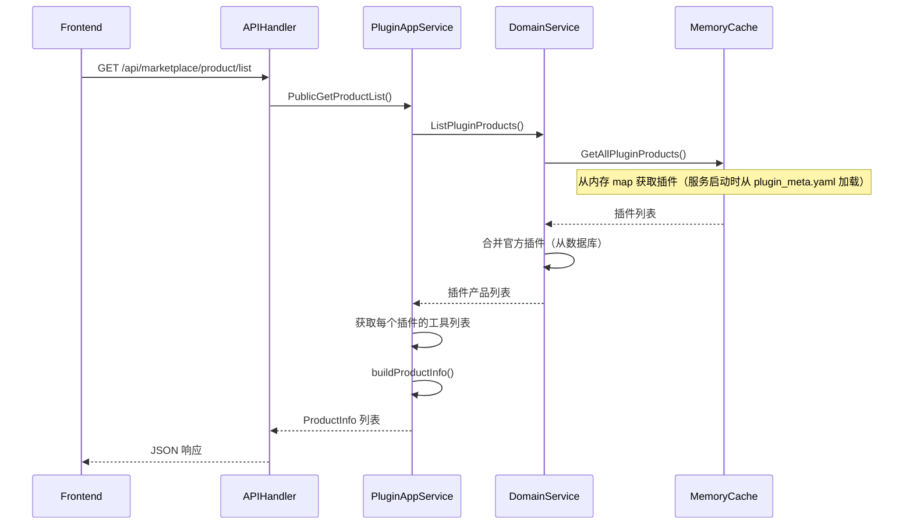
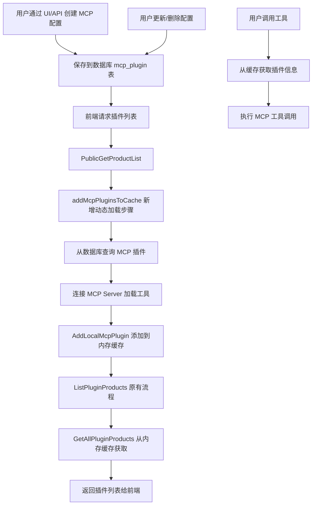
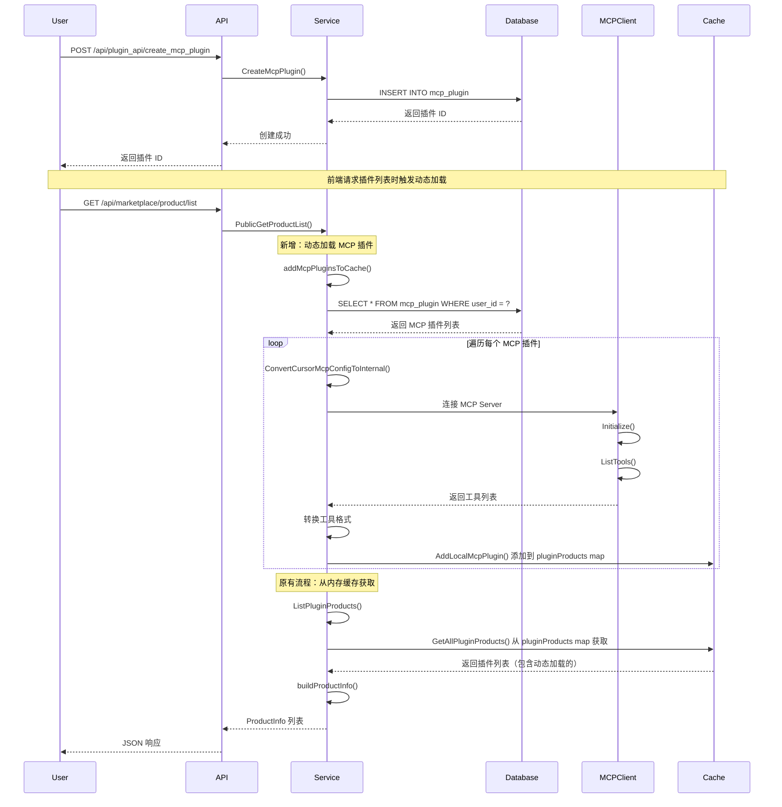

# Coze Studio 二次开发（二）支持 MCP Server 动态配置

## 背景

在[Coze Studio 二次开发（一）支持 MCP 静态配置](./coze-studio二次开发(一)支持MCP静态配置.md)中，我们实现了通过 `plugin_meta.yaml` 配置文件静态配置 MCP Server 的功能。这种方式虽然能够工作，但存在以下局限性：

1. **需要重启服务**：每次修改配置都需要重启后端服务才能生效
2. **配置管理不便**：需要手动编辑 YAML 文件，容易出错
3. **多用户隔离困难**：所有用户共享同一套配置，无法实现用户级别的个性化配置
4. **实时性差**：无法动态添加、删除或更新 MCP Server，无法满足快速迭代的需求

为了解决这些问题，我们需要实现 MCP Server 的动态配置功能，允许用户通过 UI 界面或 API 动态管理 MCP Server，无需重启服务即可生效。

## 前端探索功能加载流程

在深入动态配置实现之前，我们先分析原始代码中前端探索插件时的加载流程，了解系统如何获取和展示插件列表。这是理解动态配置实现的基础。

### API 入口


前端通过以下 API 获取插件列表：

```
GET /api/marketplace/product/list?entity_type=2&sort_type=2&page_num=1&page_size=20
```

**参数说明**：

- `entity_type=2`：表示查询插件类型（`ProductEntityType_Plugin`）
- `sort_type=2`：排序类型
- `page_num=1`：页码
- `page_size=20`：每页数量

### 原始代码请求处理流程

根据 GitHub 原始代码:https://github.com/coze-dev/coze-studio/blob/main/backend/api/handler/coze/public_product_service.go 和应用服务层代码:https://github.com/coze-dev/coze-studio/blob/main/backend/api/handler/coze/public_product_service.go，原始实现流程如下：



### 核心代码分析

#### 1. API Handler 层

根据 GitHub 代码:https://github.com/coze-dev/coze-studio/blob/main/backend/api/handler/coze/public_product_service.go，

实现非常简单：

```go
// @router /api/marketplace/product/list [GET]
func PublicGetProductList(ctx context.Context, c *app.RequestContext) {
    var err error
    var req product_public_api.GetProductListRequest
    err = c.BindAndValidate(&req)
    if err != nil {
        invalidParamRequestResponse(c, err.Error())
        return
    }

    var resp *product_public_api.GetProductListResponse
    switch req.GetEntityType() {
    case product_common.ProductEntityType_Plugin:
        resp, err = plugin.PluginApplicationSVC.PublicGetProductList(ctx, &req)
        if err != nil {
            internalServerErrorResponse(ctx, c, err)
            return
        }
    }

    c.JSON(consts.StatusOK, resp)
}
```

**关键点**：

- Handler 层只负责参数绑定、验证和路由分发
- 实际业务逻辑在应用服务层处理

#### 2. 应用服务层

根据GitHub 原始代码:https://github.com/coze-dev/coze-studio/blob/main/backend/api/handler/coze/public_product_service.go，实现如下：

```go
func (p *PluginApplicationService) PublicGetProductList(ctx context.Context, req *productAPI.GetProductListRequest) (resp *productAPI.GetProductListResponse, err error) {
    // 1. 从领域服务获取插件列表
    res, err := p.DomainSVC.ListPluginProducts(ctx, &dto.ListPluginProductsRequest{})
    if err != nil {
        return nil, errorx.Wrapf(err, "ListPluginProducts failed")
    }

    // 2. 遍历每个插件，获取工具列表并构建产品信息
    products := make([]*productAPI.ProductInfo, 0, len(res.Plugins))
    for _, pl := range res.Plugins {
        tls, err := p.toolRepo.GetPluginAllOnlineTools(ctx, pl.ID)
        if err != nil {
            return nil, errorx.Wrapf(err, "GetPluginAllOnlineTools failed, pluginID=%d", pl.ID)
        }

        pi, err := p.buildProductInfo(ctx, pl, tls)
        if err != nil {
            return nil, err
        }

        products = append(products, pi)
    }

    // 3. 关键词过滤（如果有）
    if req.GetKeyword() != "" {
        filterProducts := make([]*productAPI.ProductInfo, 0, len(products))
        for _, _p := range products {
            if strings.Contains(strings.ToLower(_p.MetaInfo.Name), strings.ToLower(req.GetKeyword())) {
                filterProducts = append(filterProducts, _p)
            }
        }
        products = filterProducts
    }

    // 4. 返回响应
    resp = &productAPI.GetProductListResponse{
        Data: &productAPI.GetProductListData{
            Products: products,
            HasMore:  false,
            Total:    int32(res.Total),
        },
    }
    return resp, nil
}
```

**关键点**：

- 直接调用 `ListPluginProducts` 获取插件列表
- 没有动态加载逻辑，所有插件都来自内存缓存
- 插件信息在服务启动时已加载到内存

#### 3. 领域服务层

**文件**：`backend/domain/plugin/service/plugin_online.go`

```go
func (p *pluginServiceImpl) ListPluginProducts(ctx context.Context, req *dto.ListPluginProductsRequest) (resp *dto.ListPluginProductsResponse, err error) {
    // 1. 从内存缓存获取所有插件产品（来自 plugin_meta.yaml）
    plugins := slices.Transform(pluginConf.GetAllPluginProducts(), func(p *pluginConf.PluginInfo) *entity.PluginInfo {
        return entity.NewPluginInfo(p.Info)
    })
    
    // 2. 按产品 ID 排序
    sort.Slice(plugins, func(i, j int) bool {
        return plugins[i].GetRefProductID() < plugins[j].GetRefProductID()
    })

    // 3. 获取官方插件（从数据库）
    officialPlugins, _, err := p.pluginRepo.ListCustomOnlinePlugins(ctx, 999999, dto.PageInfo{
        Page:       1,
        Size:       1000,
        OrderByACS: ptr.Of(true),
        SortBy:     ptr.Of(dto.SortByCreatedAt),
    })
    if err != nil {
        return nil, errorx.Wrapf(err, "ListCustomOnlinePlugins failed, spaceID=999999")
    }

    // 4. 合并官方插件
    plugins = append(plugins, officialPlugins...)

    return &dto.ListPluginProductsResponse{
        Plugins: plugins,
        Total:   int64(len(plugins)),
    }, nil
}
```

**关键点**：

- `GetAllPluginProducts()` 从内存 map 中获取插件
- 从之前源码分析插件在服务启动时通过 `loadPluginProductMeta()` 从 `plugin_meta.yaml` 加载

#### 4. 配置层（内存缓存）

**文件**：`backend/domain/plugin/conf/load_plugin.go`

```go
var (
    pluginProducts map[int64]*PluginInfo  // 插件缓存
    toolProducts   map[int64]*ToolInfo    // 工具缓存
)

// GetAllPluginProducts 获取所有插件产品（从内存缓存）
func GetAllPluginProducts() []*PluginInfo {
    plugins := make([]*PluginInfo, 0, len(pluginProducts))
    for _, pl := range pluginProducts {
        plugins = append(plugins, pl)
    }
    return plugins
}

// GetPluginProduct 根据插件 ID 获取插件
func GetPluginProduct(pluginID int64) (*PluginInfo, bool) {
    pl, ok := pluginProducts[pluginID]
    return pl, ok
}

// MGetPluginProducts 批量获取插件
func MGetPluginProducts(pluginIDs []int64) []*PluginInfo {
    plugins := make([]*PluginInfo, 0, len(pluginIDs))
    for _, pluginID := range pluginIDs {
        pl, ok := pluginProducts[pluginID]
        if !ok {
            continue
        }
        plugins = append(plugins, pl)
    }
    return plugins
}
```

**关键点**：

- 使用全局 map 变量存储插件和工具信息
- 插件在服务启动时通过 `loadPluginProductMeta()` 加载
- 所有插件都来自 `plugin_meta.yaml` 配置文件

### 原始流程总结

原始代码的插件加载流程非常简单：

1. **服务启动时**：`loadPluginProductMeta()` 从 `plugin_meta.yaml` 读取配置，加载插件到内存 map
2. **前端请求时**：
   - API Handler 接收请求
   - 应用服务层调用 `ListPluginProducts()`
   - 领域服务层从内存 map 获取插件（`GetAllPluginProducts()`）
   - 合并官方插件（从数据库）
   - 构建产品信息返回前端

**局限性**：

- 所有插件必须在 `plugin_meta.yaml` 中配置
- 修改配置需要重启服务
- 无法动态添加、删除或更新插件
- 无法实现用户级别的个性化配置

### 动态配置的切入点

基于以上分析，要实现动态配置 MCP Server，需要在以下位置进行扩展：

1. **在 `PublicGetProductList()` 中**：在调用 `ListPluginProducts()` 之前，先从数据库加载用户配置的 MCP 插件到内存缓存
2. **在 `load_plugin.go` 中**：添加函数支持动态添加插件到内存缓存（如 `AddLocalMcpPlugin()`）
3. **新增数据库模型**：存储用户配置的 MCP Server 信息
4. **新增 API 接口**：支持用户创建、更新、删除 MCP Server 配置

## 动态加载 MCP Server 解决方案

基于对原始代码的分析，我们可以在不破坏现有架构的前提下，通过以下方式实现动态配置 MCP Server：

### 整体架构设计

动态配置 MCP Server 的核心思路是：**将配置从文件迁移到数据库，通过 API 接口管理配置，在运行时动态加载到内存缓存**。



**关键设计**：

- 在 `PublicGetProductList()` 中，在调用 `ListPluginProducts()` 之前，先调用 `addMcpPluginsToCache()` 动态加载 MCP 插件
- 利用现有的内存缓存机制（`pluginProducts` 和 `toolProducts` map）
- 通过 `AddLocalMcpPlugin()` 将动态加载的插件添加到缓存，使其可以被 `GetAllPluginProducts()` 获取

### 1. 数据库模型设计

**表结构**：`mcp_plugin`

```go
// backend/domain/plugin/internal/dal/model/mcp_plugin.gen.go
type McpPlugin struct {
    ID        int64           `gorm:"column:id;primaryKey;comment:Primary Key ID"`
    Name      string          `gorm:"column:name;not null;comment:MCP Server Name"`
    PluginID  int64           `gorm:"column:plugin_id;not null;comment:Plugin ID from plugin_meta.yaml, 0 if user-created"`
    UserID    int64           `gorm:"column:user_id;not null;default:0;comment:User ID, 0 for system plugins"`
    McpConfig json.RawMessage `gorm:"column:mcp_config;type:json;not null;comment:MCP Configuration"`
    CreatedAt int64           `gorm:"column:created_at;not null;autoCreateTime:milli"`
    UpdatedAt int64           `gorm:"column:updated_at;not null;autoUpdateTime:milli"`
}
```

**字段说明**：

- `plugin_id`：如果 > 0，表示来自 `plugin_meta.yaml` 的静态配置；如果 = 0，表示用户动态创建的配置
- `user_id`：用户 ID，0 表示系统插件，> 0 表示用户创建的插件
- `mcp_config`：JSON 格式的 MCP 配置，使用 Cursor 格式存储

### 2. API 接口设计

#### 2.1 创建 MCP 插件

**接口**：`POST /api/plugin_api/create_mcp_plugin`

**请求体**：

```json
{
    "name": "我的 MCP 服务器",
    "mcp_config": {
      "remote-exec": {
        "url": "http://1.1.1.1:8001/sse",
        "transport_type": "sse"
      },
      "pairat-remote-exec": {
        "url": "http://1.1.1.4:8000/mcp/sse",
        "transport_type": "sse"
      },
      "web_search": {
        "transport_type": "stdio",
        "command": "npx",
        "args": ["-y", "websearch-mcp"],
        "env": {
          "MAX_SEARCH_RESULT": "5",
          "LANGUAGE": "en",
          "REGION": "us"
        }
      }
    }
}
```

**实现**：`backend/api/handler/coze/plugin_develop_service.go`

```go
// CreateMcpPlugin creates a new MCP plugin
// @router /api/plugin_api/create_mcp_plugin [POST]
func CreateMcpPlugin(ctx context.Context, c *app.RequestContext) {
    var req dto.CreateMcpPluginRequest
    err = c.BindAndValidate(&req)
    
    id, err := plugin.PluginApplicationSVC.CreateMcpPlugin(ctx, &req)
    if err != nil {
        internalServerErrorResponse(ctx, c, err)
        return
    }
    
    c.JSON(consts.StatusOK, map[string]interface{}{
        "code":    0,
        "message": "success",
        "data": map[string]interface{}{
            "id": id,
        },
    })
}
```

**服务层实现**：`backend/domain/plugin/service/mcp_plugin_impl.go`

```go
func (p *pluginServiceImpl) CreateMcpPlugin(ctx context.Context, req *dto.CreateMcpPluginRequest) (id int64, err error) {
    // 1. 获取用户 ID
    userID := ctxutil.MustGetUIDFromCtx(ctx)

    // 2. 验证配置格式
    mcpConfigBytes := req.McpConfig
    var cursorConfig dto.McpServersConfig
    if err := json.Unmarshal(mcpConfigBytes, &cursorConfig); err != nil {
        return 0, errorx.Wrapf(err, "invalid MCP config format")
    }

    if len(cursorConfig.McpServers) == 0 {
        return 0, errorx.New(errno.ErrPluginInvalidParamCode, 
            errorx.KV(errno.PluginMsgKey, "MCP config must contain at least one server"))
    }

    // 3. 转换为内部格式并验证
    _, err = ConvertCursorMcpConfigToInternal(mcpConfigBytes)
    if err != nil {
        return 0, errorx.Wrapf(err, "invalid MCP config: %v", err)
    }

    // 4. 删除该用户之前的配置（确保每个用户只有一个配置）
    err = p.mcpPluginDAO.DeleteAllUserCreated(ctx, userID)
    if err != nil {
        return 0, errorx.Wrapf(err, "failed to delete existing user-created MCP plugins")
    }

    // 5. 创建新配置
    id, err = p.mcpPluginDAO.Create(ctx, req, userID)
    if err != nil {
        return 0, errorx.Wrapf(err, "failed to create MCP plugin")
    }

    logs.CtxInfof(ctx, "[MCP] Created MCP plugin: id=%d, name=%s, user_id=%d", id, req.Name, userID)
    return id, nil
}
```

#### 2.2 更新 MCP 插件

**接口**：`POST /api/plugin_api/update_mcp_plugin`

**请求体**：

```json
{
    "id": 123,
    "name": "更新后的 MCP 服务器",
    "mcp_config": {
        "mcpServers": {
            "remote-exec": {
                "transport_type": "sse",
                "url": "http://10.x.x.x:8001/mcp/sse"
            }
        }
    }
}
```

**实现**：与创建类似，但会先查询现有配置，然后更新。

#### 2.3 查询 MCP 插件列表

**接口**：`POST /api/plugin_api/list_mcp_plugins`

**请求体**：

```json
{
    "page": 1,
    "page_size": 20
}
```

**响应**：

```json
{
    "code": 0,
    "message": "success",
    "data": {
        "plugins": [
            {
                "id": 123,
                "name": "我的 MCP 服务器",
                "plugin_id": 0,
                "user_id": 1001,
                "mcp_config": {...},
                "created_at": 1234567890,
                "updated_at": 1234567890
            }
        ],
        "total": 1
    }
}
```

#### 2.4 获取当前用户的 MCP 插件

**接口**：`POST /api/plugin_api/get_mcp_plugin`

**实现**：从上下文获取用户 ID，查询该用户的 MCP 插件配置。

#### 2.5 删除 MCP 插件

**接口**：`POST /api/plugin_api/delete_mcp_plugin`

**请求体**：

```json
{
    "id": 123
}
```

### 3. 配置格式转换

系统内部使用两种配置格式：

1. **Cursor 格式**（数据库存储）：兼容 Cursor IDE 的 MCP 配置格式
2. **内部格式**（运行时使用）：系统内部使用的配置格式

**转换函数**：`backend/domain/plugin/service/mcp_plugin_converter.go`

```go
// ConvertCursorMcpConfigToInternal converts cursor MCP config format to internal format
// Cursor format: { "mcpServers": { "server-name": { "url": "..." } } }
// Internal format: { "transport_type": "sse", "sse_config": { "url": "..." } }
func ConvertCursorMcpConfigToInternal(cursorConfig json.RawMessage) ([]*mcp.Config, error) {
    var cursorFormat dto.McpServersConfig
    if err := json.Unmarshal(cursorConfig, &cursorFormat); err != nil {
        return nil, fmt.Errorf("failed to unmarshal cursor config: %w", err)
    }

    configs := make([]*mcp.Config, 0, len(cursorFormat.McpServers))
    for serverName, serverConfig := range cursorFormat.McpServers {
        var config *mcp.Config

        // 确定传输类型
        transportType := serverConfig.TransportType
        if transportType == "" {
            // 从字段推断传输类型
            if serverConfig.URL != "" {
                transportType = "sse"
            } else if serverConfig.GetCommandArray() != nil && len(serverConfig.GetCommandArray()) > 0 {
                transportType = "stdio"
            }
        }

        // 根据传输类型创建配置
        switch transportType {
        case "sse":
            config = &mcp.Config{
                ServerName:    serverName,
                TransportType: mcp.TransportTypeSSE,
                SSEConfig: &mcp.SSEConfig{
                    URL:     serverConfig.URL,
                    Headers: serverConfig.Headers,
                    APIKey:  serverConfig.APIKey,
                },
            }
        case "stdio":
            commandArray := serverConfig.GetCommandArray()
            config = &mcp.Config{
                ServerName:    serverName,
                TransportType: mcp.TransportTypeStdio,
                StdioConfig: &mcp.StdioConfig{
                    Command:    commandArray,
                    Env:        serverConfig.Env,
                    WorkingDir: serverConfig.WorkingDir,
                },
            }
        }

        configs = append(configs, config)
    }

    return configs, nil
}
```

### 4. 动态加载流程

动态加载的核心流程如下：



### 5. 关键实现步骤

#### 5.1 修改 `PublicGetProductList()` 方法

**文件**：`backend/application/plugin/plugin.go`

在原始代码基础上，在调用 `ListPluginProducts()` 之前添加动态加载逻辑：

```go
func (p *PluginApplicationService) PublicGetProductList(ctx context.Context, req *productAPI.GetProductListRequest) (resp *productAPI.GetProductListResponse, err error) {
    // ========== 新增：动态加载 MCP 插件到缓存 ==========
    mcpConverter := NewMcpProductConverter(p.DomainSVC, p.oss)
    if err := p.addMcpPluginsToCache(ctx, mcpConverter); err != nil {
        logs.CtxWarnf(ctx, "[MCP] Failed to add MCP plugins to cache: %v", err)
        // Continue even if cache update fails
    }
    // ================================================

    // 原有代码：从内存缓存获取所有插件（现在包含静态配置的 + 动态配置的）
    res, err := p.DomainSVC.ListPluginProducts(ctx, &dto.ListPluginProductsRequest{})
    if err != nil {
        return nil, errorx.Wrapf(err, "ListPluginProducts failed")
    }

    // 原有代码：构建产品信息列表
    products := make([]*productAPI.ProductInfo, 0, len(res.Plugins))
    for _, pl := range res.Plugins {
        tls, err := p.toolRepo.GetPluginAllOnlineTools(ctx, pl.ID)
        if err != nil {
            return nil, errorx.Wrapf(err, "GetPluginAllOnlineTools failed, pluginID=%d", pl.ID)
        }

        pi, err := p.buildProductInfo(ctx, pl, tls)
        if err != nil {
            return nil, err
        }

        products = append(products, pi)
    }

    // ... 其余原有代码保持不变
}
```

#### 5.2 新增 `addMcpPluginsToCache()` 方法

**文件**：`backend/application/plugin/plugin.go`

```go
// addMcpPluginsToCache adds user-created MCP plugins to the in-memory cache
// so they can be found by GetAllPluginProducts() when listing plugins
func (p *PluginApplicationService) addMcpPluginsToCache(ctx context.Context, mcpConverter *McpProductConverter) error {
    // 1. 从数据库获取所有用户创建的 MCP 插件
    listReq := &dto.ListMcpPluginsRequest{
        Page:     1,
        PageSize: 1000, // Get all user-created MCP plugins
    }
    listResp, err := p.DomainSVC.ListMcpPlugins(ctx, listReq)
    if err != nil {
        return fmt.Errorf("failed to get MCP plugins: %w", err)
    }

    // 2. 删除之前的本地插件缓存（避免重复）
    delPluginCount, delToolCount := conf.DeleteAllLocalPluginProducts()
    logs.CtxInfof(ctx, "Deleted %d local plugin products, %d local tool products", delPluginCount, delToolCount)

    // 3. 遍历每个 MCP 插件，加载工具并添加到缓存
    for _, mcpPlugin := range listResp.Plugins {
        // 跳过 plugin_meta.yaml 中的插件（它们已经在静态加载时缓存了）
        if mcpPlugin.PluginID > 0 {
            continue
        }

        // 3.1 转换配置格式（Cursor 格式 -> 内部格式）
        internalConfigs, err := service.ConvertCursorMcpConfigToInternal(mcpPlugin.McpConfig)
        if err != nil {
            logs.CtxWarnf(ctx, "[MCP] Failed to convert config for plugin %d: %v", mcpPlugin.ID, err)
            continue
        }

        if len(internalConfigs) == 0 {
            logs.CtxWarnf(ctx, "[MCP] No valid MCP config found for plugin %d", mcpPlugin.ID)
            continue
        }

        // 3.2 从每个 MCP Server 加载工具
        for i, config := range internalConfigs {
            allTools := make([]*entity.ToolInfo, 0)
            toolInfos, err := conf.LoadMCPToolsForPlugin(ctx, mcpPlugin.ID, "v1.0.0", config)
            if err != nil {
                logs.CtxWarnf(ctx, "[MCP] Failed to load tools for plugin %d server %d: %v", mcpPlugin.ID, i, err)
                continue
            }

            // 3.3 转换工具信息
            for _, toolInfo := range toolInfos {
                if toolInfo != nil && toolInfo.Info != nil {
                    // 生成唯一的工具 ID
                    toolInfo.Info.ID = stringHashToInt64(*toolInfo.Info.SubURL)
                    toolInfo.Info.PluginID = mcpPlugin.ID
                    allTools = append(allTools, toolInfo.Info)
                }
            }

            if len(allTools) == 0 {
                logs.CtxWarnf(ctx, "[MCP] No tools found for plugin %d, skipping cache", mcpPlugin.ID)
                continue
            }

            // 3.4 构建插件实体
            pluginEntity := mcpConverter.buildPluginEntityFromMcpPlugin(mcpPlugin, config, i)
            pluginEntity.PluginInfo.ID = mcpPlugin.ID

            // 3.5 添加到内存缓存（利用现有的缓存机制）
            err = conf.AddLocalMcpPlugin(ctx, mcpPlugin.ID, pluginEntity.PluginInfo, allTools)
            if err != nil {
                logs.CtxWarnf(ctx, "[MCP] Failed to add plugin %d to cache: %v", mcpPlugin.ID, err)
                continue
            }
        }
    }

    return nil
}
```

#### 5.3 新增 `AddLocalMcpPlugin()` 函数

**文件**：`backend/domain/plugin/conf/load_plugin.go`

在现有代码基础上添加：

```go
// AddLocalMcpPlugin adds a user-created MCP plugin to the in-memory cache
// This allows GetAllPluginProducts() to find MCP plugins from database
func AddLocalMcpPlugin(ctx context.Context, pluginID int64, pluginInfo *model.PluginInfo, tools []*entity.ToolInfo) error {
    if pluginProducts == nil {
        pluginProducts = make(map[int64]*PluginInfo)
    }
    if toolProducts == nil {
        toolProducts = make(map[int64]*ToolInfo)
    }

    // Check if plugin already exists
    if _, exists := pluginProducts[pluginID]; exists {
        logs.CtxWarnf(ctx, "[MCP] Plugin %d already exists in cache, skipping", pluginID)
        return nil
    }

    // Create PluginInfo
    pi := &PluginInfo{
        Info:    pluginInfo,
        ToolIDs: make([]int64, 0, len(tools)),
    }

    // Add tools to toolProducts and collect tool IDs
    for _, tool := range tools {
        // Check for duplicate tool ID
        if _, ok := toolProducts[tool.ID]; ok {
            logs.CtxWarnf(ctx, "[MCP] Duplicate tool id '%d' for plugin_id=%d, skipping", tool.ID, pluginID)
            continue
        }

        pi.ToolIDs = append(pi.ToolIDs, tool.ID)
        toolProducts[tool.ID] = &ToolInfo{
            Info: tool,
        }
    }

    // Add plugin to cache (利用现有的 pluginProducts map)
    pluginProducts[pluginID] = pi

    logs.CtxInfof(ctx, "[MCP] Added MCP plugin %d to cache with %d tools", pluginID, len(pi.ToolIDs))
    return nil
}
```

**关键点**：

- 利用现有的 `pluginProducts` 和 `toolProducts` map
- 添加的插件会被 `GetAllPluginProducts()` 自动获取，无需修改原有代码

### 6. 关键实现细节

#### 6.1 插件 ID 生成策略

用户创建的 MCP 插件使用数据库自增 ID，而工具 ID 通过哈希生成：

```go
// 生成工具 ID：使用 SubURL 的哈希值
toolInfo.Info.ID = stringHashToInt64(*toolInfo.Info.SubURL)

func stringHashToInt64(s string) int64 {
    hash := fnv.New64a()
    hash.Write([]byte(s))
    return int64(hash.Sum64())
}
```

#### 6.2 缓存管理策略

- **删除策略**：每次加载前先删除所有 `PluginType_LOCAL` 类型的插件，避免重复
- **加载时机**：在 `PublicGetProductList` 时动态加载，而不是服务启动时
- **缓存位置**：使用内存缓存 `pluginProducts` 和 `toolProducts` map

#### 6.3 用户隔离机制

- 通过 `user_id` 字段区分不同用户的配置
- `ListMcpPlugins` 接口会根据当前用户 ID 过滤结果
- 每个用户只能有一个动态创建的 MCP 插件配置（创建新配置时会删除旧的）

#### 6.4 错误处理

- 如果某个 MCP Server 连接失败，记录警告日志但继续处理其他服务器
- 如果工具加载失败，跳过该工具但继续处理其他工具
- 确保部分失败不影响整体功能

### 7. 与静态配置的兼容性

系统同时支持静态配置和动态配置，两者在内存缓存中统一管理：

1. **静态配置**（原始代码）：
   - 来源：`plugin_meta.yaml` 文件
   - 加载时机：服务启动时通过 `loadPluginProductMeta()` 加载
   - 存储位置：`pluginProducts` map（`plugin_id > 0`）
   - 插件类型：`PluginType_PLUGIN`
   - 获取方式：`GetAllPluginProducts()` 从内存 map 获取

2. **动态配置**（新增功能）：
   - 来源：数据库 `mcp_plugin` 表
   - 加载时机：前端请求插件列表时通过 `addMcpPluginsToCache()` 动态加载
   - 存储位置：`pluginProducts` map（`plugin_id` 来自数据库自增 ID）
   - 插件类型：`PluginType_LOCAL`
   - 获取方式：同样通过 `GetAllPluginProducts()` 从内存 map 获取

**兼容性保证**：

- 两种配置使用相同的内存缓存机制（`pluginProducts` 和 `toolProducts` map）
- `GetAllPluginProducts()` 会自动返回所有插件（静态 + 动态），无需修改原有代码
- 动态配置的插件在 `addMcpPluginsToCache()` 中通过 `AddLocalMcpPlugin()` 添加到缓存
- 通过 `DeleteAllLocalPluginProducts()` 删除动态配置的插件，不影响静态配置

## 验证成果

这里主要介绍了后端接收前端动态添加 mcpservers 的配置，前端的处理方式不在本次重点，感兴趣的可以直接看前端添加 mcpservers 时的动作

**前端配置 mcpservers:**


输入以下配置，然后点击确认:

```json
    "remote-exec": {
      "url": "http://10.1.48.133:8001/sse",
      "transport_type": "sse"
    }
```


然后我们接着在工作流中测试一下:


可以看到测试通过了


## 如何使用


下载代码，并初始化后端 & 容器 & db 环境

```shell
git clone https://github.com/yangkun19921001/coze-studio-plus
cd coze-studio-plus
./start_vs_debug.sh
```

运行后端服务

```json
        {
            "name": "`Coze Studio` Backend (Debug)",
            "type": "go",
            "request": "launch",
            "mode": "debug",
            "program": "${workspaceFolder}/`Coze Studio`/backend/main.go",
            "cwd": "${workspaceFolder}/`Coze Studio`/backend",
            "console": "integratedTerminal",
            "env": {
                "APP_ENV": "debug",
                "LOG_LEVEL": "debug"
            },
            "args": [],
            "showLog": false
        }
```


## 总结

本文介绍了在 Coze Studio 中实现 MCP Server 动态配置的完整方案。核心思路是将配置从文件迁移到数据库，通过 API 接口管理，在运行时动态加载到内存缓存。

通过动态配置功能，Coze Studio 的 MCP 插件系统更加灵活和易用，用户可以像使用 Cursor IDE 一样方便地管理 MCP Server 配置，大大提升了系统的实用性和用户体验。