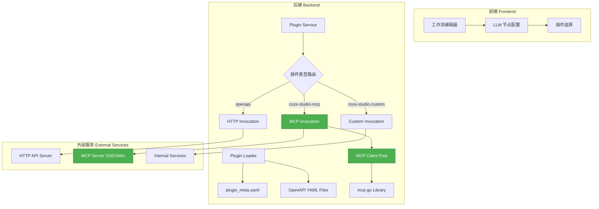
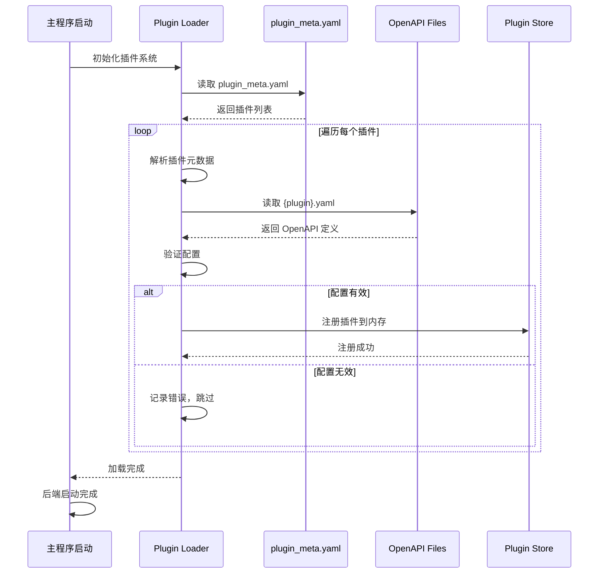
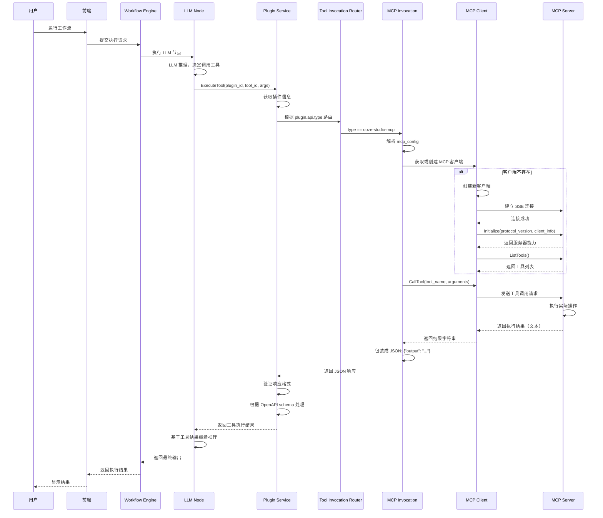
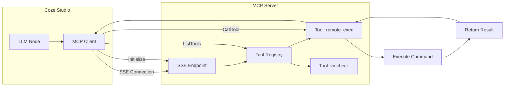
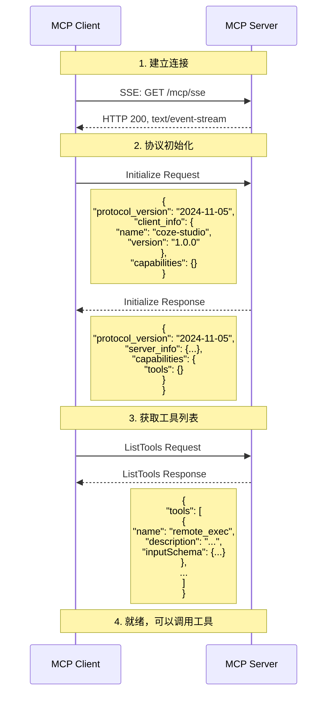
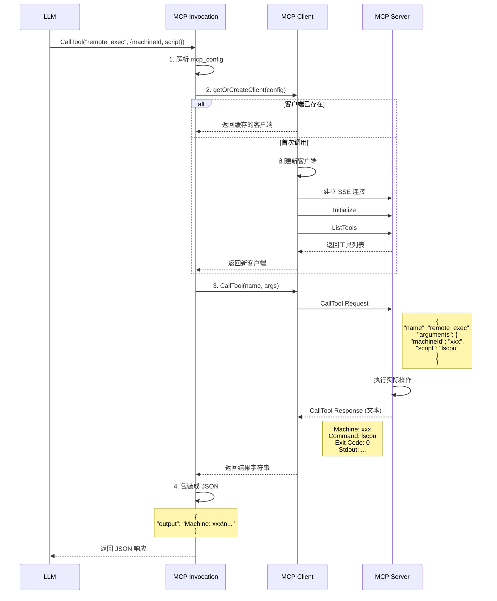
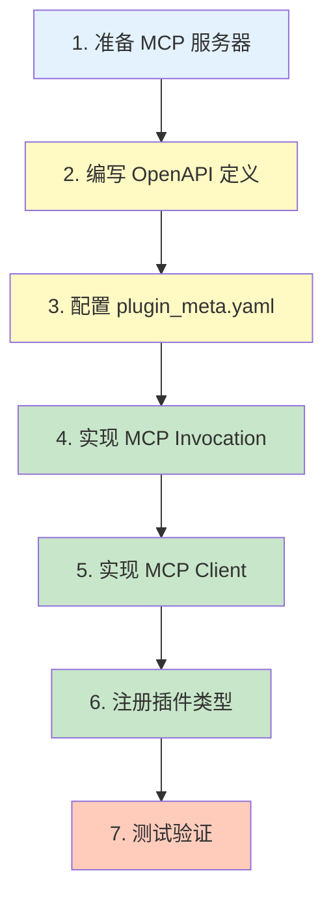

# 深入分析 Coze Studio 插件系统并开发自定义 MCP 插件

## 📋 目录

- [1. 插件系统架构概述](#1-插件系统架构概述)
- [2. 插件加载流程](#2-插件加载流程)
- [3. 插件执行流程](#3-插件执行流程)
- [4. MCP 插件原理](#4-mcp-插件原理)
- [5. 实战：开发 remote_exec MCP 插件](#5-实战开发-remote_exec-mcp-插件)
- [6. 调试与验证](#6-调试与验证)
- [7. 最佳实践](#7-最佳实践)

---

## 1. 插件系统架构概述

### 1.1 什么是插件系统？

Coze Studio 的插件系统允许 AI 模型通过 **Function Calling** 的方式调用外部工具和服务。插件本质上是对外部 API 的封装，使 LLM 能够：

- 🔍 获取实时数据（如搜索、天气、新闻）
- 🛠️ 执行操作（如发送邮件、创建文件、远程命令执行）
- 🔗 集成第三方服务（如数据库、云服务、MCP 服务器）

### 1.2 插件类型

Coze Studio 支持三种插件类型：

| 类型 | 常量 | 描述 | 使用场景 |
|------|------|------|----------|
| **OpenAPI Plugin** | `openapi` / `coze-studio-cloud` | 标准 HTTP RESTful API | 传统 Web API 集成 |
| **MCP Plugin** | `coze-studio-mcp` | Model Context Protocol | 连接 MCP 服务器、实时数据源 |
| **Custom Plugin** | `coze-studio-custom` | 自定义内部逻辑 | 内置功能、特殊处理 |

### 1.3 核心架构图



---

## 2. 插件加载流程

### 2.1 插件配置文件结构

插件配置由两部分组成：

```
backend/conf/plugin/pluginproduct/
├── plugin_meta.yaml          # 插件元数据清单（所有插件的索引）
├── sohu_hot_news.yaml         # OpenAPI 定义文件（HTTP 插件）
├── pairat_remote_exec.yaml    # OpenAPI 定义文件（MCP 插件）
└── ...
```

#### **plugin_meta.yaml** - 插件注册表

这是所有插件的注册中心，定义了插件的基本信息：

```yaml
plugins:
  - plugin_id: 101                           # 唯一插件 ID
    product_id: 7600000000000000101          # 产品 ID
    version: v1.0.0                          # 版本号
    openapi_doc_file: pairat_remote_exec.yaml # 关联的 OpenAPI 文件
    plugin_type: 1                           # 插件类型（1=标准插件）
    manifest:
      schema_version: v1
      name_for_model: pairat_remote_exec     # LLM 使用的名称
      name_for_human: Pairat Remote Exec     # 用户看到的名称
      description_for_model: 通过 MCP 协议在远程机器上执行命令
      description_for_human: 远程命令执行工具
      auth:
        type: none                           # 认证类型
      logo_url: official_plugin_icon/plugin_remote_exec.png
      api:
        type: coze-studio-mcp                # ⭐ 插件类型标识
        extensions:                          # ⭐ MCP 特有配置
          mcp_config:
            transport_type: sse              # 传输类型：sse 或 stdio
            sse_config:
              url: http://10.1.16.4:8000/mcp/sse
              headers:
                Content-Type: application/json
    tools:                                   # 插件提供的工具列表
      - tool_id: 101001
        deprecated: false
        method: post
        sub_url: /remote_exec
      - tool_id: 101002
        deprecated: false
        method: post
        sub_url: /vmcheck
```

#### **pairat_remote_exec.yaml** - OpenAPI 定义

定义工具的 API 接口规范（符合 OpenAPI 3.0.1）：

```yaml
openapi: 3.0.1
info:
  title: Pairat Remote Exec
  version: v1
  description: 通过 MCP 协议远程执行命令的工具

servers:
  - url: http://10.1.16.4:8000

paths:
  /remote_exec:
    post:
      operationId: remote_exec
      summary: 在远程机器上执行命令或脚本
      requestBody:
        required: true
        content:
          application/json:
            schema:
              type: object
              properties:
                machineId:
                  type: string
                  description: 要执行命令的机器 ID
                script:
                  type: string
                  description: 要执行的脚本或命令
              required:
                - machineId
                - script
      responses:
        "200":
          description: 命令执行成功
          content:
            application/json:
              schema:
                type: object
                properties:
                  output:
                    type: string
                    description: 命令输出结果
```

### 2.2 插件加载流程图



### 2.3 关键代码：插件加载

#### 文件：`backend/resource/conf/initconfsignal.go`

```go
func Init() error {
    // 1. 加载插件配置
    if err := plugin_conf.Init(); err != nil {
        return fmt.Errorf("init plugin conf failed: %w", err)
    }
    
    // 2. 初始化其他配置...
    return nil
}
```

#### 文件：`backend/resource/conf/plugin/init.go`

```go
func Init() error {
    // 读取 plugin_meta.yaml
    data, err := os.ReadFile("conf/plugin/pluginproduct/plugin_meta.yaml")
    if err != nil {
        return err
    }
    
    // 解析 YAML
    var config PluginConfig
    if err := yaml.Unmarshal(data, &config); err != nil {
        return err
    }
    
    // 加载每个插件
    for _, pluginMeta := range config.Plugins {
        // 读取 OpenAPI 文件
        openapiFile := fmt.Sprintf("conf/plugin/pluginproduct/%s", 
            pluginMeta.OpenAPIDocFile)
        openapiData, err := os.ReadFile(openapiFile)
        if err != nil {
            log.Errorf("Failed to load OpenAPI for plugin %d: %v", 
                pluginMeta.PluginID, err)
            continue
        }
        
        // 解析并验证
        if err := validatePlugin(pluginMeta, openapiData); err != nil {
            log.Errorf("Validation failed for plugin %d: %v", 
                pluginMeta.PluginID, err)
            continue
        }
        
        // 注册到内存
        RegisterPlugin(pluginMeta)
    }
    
    return nil
}
```

### 2.4 插件验证逻辑

#### 文件：`backend/crossdomain/plugin/model/plugin_manifest.go`

```go
// Validate 验证插件 manifest 配置
func (mf *PluginManifest) Validate() error {
    // 1. 检查必填字段
    if mf.NameForModel == "" {
        return errorx.New(errno.ErrPluginInvalidManifest,
            errorx.KVf(errno.PluginMsgKey, "name_for_model is required"))
    }
    
    // 2. 验证 API 类型
    validTypes := []consts.PluginType{
        consts.PluginTypeOfCloud,    // openapi
        consts.PluginTypeOfMCP,      // coze-studio-mcp
        consts.PluginTypeOfCustom,   // coze-studio-custom
    }
    
    if !contains(validTypes, mf.API.Type) {
        return errorx.New(errno.ErrPluginInvalidManifest,
            errorx.KVf(errno.PluginMsgKey, 
                "invalid api type '%s'", mf.API.Type))
    }
    
    // 3. MCP 插件需要 mcp_config
    if mf.API.Type == consts.PluginTypeOfMCP {
        if mf.API.Extensions == nil {
            return errorx.New(errno.ErrPluginInvalidManifest,
                errorx.KVf(errno.PluginMsgKey, 
                    "mcp plugin requires extensions.mcp_config"))
        }
        
        if _, ok := mf.API.Extensions["mcp_config"]; !ok {
            return errorx.New(errno.ErrPluginInvalidManifest,
                errorx.KVf(errno.PluginMsgKey, 
                    "mcp_config not found in extensions"))
        }
    }
    
    return nil
}
```

---

## 3. 插件执行流程

### 3.1 完整执行流程图



### 3.2 关键代码：插件执行

#### 文件：`backend/domain/plugin/service/exec_tool.go`

```go
// ExecuteTool 执行插件工具
func (s *pluginServiceImpl) ExecuteTool(
    ctx context.Context, 
    req *ExecuteToolRequest,
) (*ExecuteResponse, error) {
    
    // 1. 获取插件信息
    plugin, err := s.getPlugin(ctx, req.PluginID)
    if err != nil {
        return nil, fmt.Errorf("get plugin failed: %w", err)
    }
    
    // 2. 获取工具信息
    tool, err := s.getTool(ctx, plugin, req.ToolID)
    if err != nil {
        return nil, fmt.Errorf("get tool failed: %w", err)
    }
    
    // 3. 创建工具执行器
    executor := &toolExecutor{
        plugin:    plugin,
        tool:      tool,
        arguments: req.Arguments,
    }
    
    // 4. 执行工具
    return executor.execute(ctx, req.Arguments, req.AccessToken, req.AuthURL)
}

// execute 实际执行逻辑
func (t *toolExecutor) execute(
    ctx context.Context, 
    argumentsInJson, accessToken, authURL string,
) (*ExecuteResponse, error) {
    
    // 1. 解析参数
    var args map[string]any
    if err := json.Unmarshal([]byte(argumentsInJson), &args); err != nil {
        return nil, fmt.Errorf("parse arguments failed: %w", err)
    }
    
    // 2. 构建 InvocationArgs
    invocation := &tool.InvocationArgs{
        PluginManifest: t.plugin.Manifest,
        Tool:           t.tool,
        Header:         extractHeaders(args),
        Query:          extractQuery(args),
        Path:           extractPath(args),
        Body:           extractBody(args),
    }
    
    // 3. ⭐ 根据插件类型路由到不同的 Invocation 实现
    var requestStr, rawResp string
    var err error
    
    if t.plugin.Source != nil && 
       *t.plugin.Source == bot_common.PluginFrom_FromSaas {
        // SaaS 插件
        requestStr, rawResp, err = tool.NewSaasCallImpl().Do(ctx, invocation)
    } else {
        // 本地插件：根据类型路由
        requestStr, rawResp, err = newToolInvocation(t).Do(ctx, invocation)
    }
    
    if err != nil {
        return nil, fmt.Errorf("execute tool failed: %w", err)
    }
    
    // 4. 处理响应
    processedResp, err := t.processResponse(ctx, rawResp)
    if err != nil {
        return nil, fmt.Errorf("process response failed: %w", err)
    }
    
    return &ExecuteResponse{
        Request:  requestStr,
        Response: processedResp,
    }, nil
}

// newToolInvocation 创建对应类型的 Invocation
func newToolInvocation(t *toolExecutor) tool.Invocation {
    switch t.plugin.Manifest.API.Type {
    case consts.PluginTypeOfCloud:
        // HTTP 插件
        return tool.NewHttpCallImpl(t.conversationID)
    
    case consts.PluginTypeOfMCP:
        // ⭐ MCP 插件
        return tool.NewMcpCallImpl()
    
    case consts.PluginTypeOfCustom:
        // 自定义插件
        return tool.NewCustomCallImpl()
    
    default:
        // 默认使用 HTTP
        return tool.NewHttpCallImpl(t.conversationID)
    }
}
```

---

## 4. MCP 插件原理

### 4.1 什么是 MCP？

**MCP (Model Context Protocol)** 是一个开放标准，用于 AI 应用与外部数据源和工具的集成。

#### MCP 架构：



### 4.2 MCP 传输类型

| 传输类型 | 描述 | 使用场景 | 配置示例 |
|---------|------|---------|---------|
| **SSE (Server-Sent Events)** | 基于 HTTP 的单向流 | 远程 MCP 服务器 | `url: http://host:port/mcp/sse` |
| **Stdio** | 标准输入/输出 | 本地进程、CLI 工具 | `command: /path/to/mcp-server` |

### 4.3 MCP 初始化流程



### 4.4 MCP 工具调用流程



### 4.5 关键代码：MCP Invocation 实现

#### 文件：`backend/domain/plugin/service/tool/invocation_mcp.go`

```go
type mcpCallImpl struct {
    clients sync.Map // MCP 客户端池（缓存）
    mu      sync.RWMutex
}

func NewMcpCallImpl() Invocation {
    return &mcpCallImpl{
        clients: make(map[string]*mcp.Client),
    }
}

// Do 执行 MCP 工具调用
func (m *mcpCallImpl) Do(
    ctx context.Context, 
    args *InvocationArgs,
) (request string, resp string, err error) {
    
    logs.Infof("[MCP] Do() called: tool_id=%d, tool_name=%s", 
        args.Tool.ID, args.Tool.GetName())
    
    // 1. 解析 MCP 配置
    mcpConfig, err := m.parseMCPConfig(args)
    if err != nil {
        return "", "", fmt.Errorf("parse mcp config failed: %w", err)
    }
    
    // 2. 获取或创建 MCP 客户端
    client, err := m.getOrCreateClient(ctx, mcpConfig)
    if err != nil {
        return "", "", fmt.Errorf("get mcp client failed: %w", err)
    }
    
    // 3. 构建工具调用参数
    toolName := args.Tool.GetName()
    if toolName == "" {
        toolName = fmt.Sprintf("tool_%d", args.Tool.ID)
    }
    
    // 合并所有参数（header, query, path, body）
    arguments := make(map[string]any)
    for k, v := range args.Header {
        arguments[k] = v
    }
    for k, v := range args.Query {
        arguments[k] = v
    }
    for k, v := range args.Path {
        arguments[k] = v
    }
    for k, v := range args.Body {
        arguments[k] = v
    }
    
    // 4. 调用 MCP 工具
    resultStr, err := client.CallTool(ctx, toolName, arguments)
    if err != nil {
        requestJSON, _ := sonic.MarshalString(map[string]any{
            "tool":      toolName,
            "arguments": arguments,
        })
        return requestJSON, "", fmt.Errorf("call mcp tool failed: %w", err)
    }
    
    // 5. 序列化请求（用于日志）
    requestJSON, _ := sonic.MarshalString(map[string]any{
        "tool":      toolName,
        "arguments": arguments,
    })
    
    logs.Infof("[MCP] Tool call succeeded: tool=%s, result_len=%d", 
        toolName, len(resultStr))
    
    // 6. ⭐ 包装响应为 JSON 格式
    // Coze Studio 期望所有插件响应都是 JSON 对象
    // 而 MCP 工具返回的是文本，所以需要包装
    responseJSON, err := sonic.MarshalString(map[string]any{
        "output": resultStr,
    })
    if err != nil {
        return requestJSON, "", fmt.Errorf("marshal mcp response failed: %w", err)
    }
    
    return requestJSON, responseJSON, nil
}

// parseMCPConfig 从 manifest 中解析 MCP 配置
func (m *mcpCallImpl) parseMCPConfig(
    args *InvocationArgs,
) (*mcp.Config, error) {
    
    if args.PluginManifest == nil {
        return nil, fmt.Errorf("plugin manifest is nil")
    }
    
    // 从 manifest.api.extensions.mcp_config 获取配置
    if args.PluginManifest.API.Extensions == nil {
        return nil, fmt.Errorf("manifest.api.extensions is nil")
    }
    
    mcpConfigData, ok := args.PluginManifest.API.Extensions["mcp_config"]
    if !ok {
        return nil, fmt.Errorf("mcp_config not found in extensions")
    }
    
    // 转换为 JSON 并解析
    configJSON, err := json.Marshal(mcpConfigData)
    if err != nil {
        return nil, fmt.Errorf("marshal mcp_config failed: %w", err)
    }
    
    logs.Infof("[MCP] Parsing config: %s", string(configJSON))
    
    var config mcp.Config
    if err := json.Unmarshal(configJSON, &config); err != nil {
        return nil, fmt.Errorf("unmarshal mcp_config failed: %w", err)
    }
    
    logs.Infof("[MCP] Config parsed: transport=%s", config.TransportType)
    
    return &config, nil
}

// getOrCreateClient 获取或创建 MCP 客户端（带缓存）
func (m *mcpCallImpl) getOrCreateClient(
    ctx context.Context, 
    config *mcp.Config,
) (*mcp.Client, error) {
    
    configHash := m.hashConfig(config)
    
    // 尝试从缓存获取
    m.mu.RLock()
    if client, ok := m.clients[configHash]; ok {
        m.mu.RUnlock()
        return client, nil
    }
    m.mu.RUnlock()
    
    // 创建新客户端
    m.mu.Lock()
    defer m.mu.Unlock()
    
    // 双重检查
    if client, ok := m.clients[configHash]; ok {
        return client, nil
    }
    
    // 使用 mcp-go 库创建客户端
    client, err := mcp.NewClient(config)
    if err != nil {
        return nil, fmt.Errorf("create mcp client failed: %w", err)
    }
    
    // 初始化客户端
    if err := client.Initialize(ctx); err != nil {
        client.Close()
        return nil, fmt.Errorf("initialize mcp client failed: %w", err)
    }
    
    // 缓存客户端
    m.clients[configHash] = client
    
    return client, nil
}
```

### 4.6 关键代码：MCP Client 实现

#### 文件：`backend/pkg/mcp/client.go`

```go
// Client MCP 客户端封装
type Client struct {
    client    *client.Client         // mcp-go 的客户端
    transport transport.Interface    // 传输层
}

// NewClient 创建 MCP 客户端
func NewClient(config *Config) (*Client, error) {
    if config == nil {
        return nil, fmt.Errorf("config is nil")
    }
    
    switch config.TransportType {
    case TransportSSE:
        return newSSEClient(config.SSEConfig)
    case TransportStdio:
        return newStdioClient(config.StdioConfig)
    default:
        return nil, fmt.Errorf("unsupported transport type: %s", 
            config.TransportType)
    }
}

// newSSEClient 创建 SSE 客户端
func newSSEClient(config *SSEConfig) (*Client, error) {
    if config.URL == "" {
        return nil, fmt.Errorf("url is empty")
    }
    
    // 构建选项
    var options []transport.ClientOption
    if len(config.Headers) > 0 {
        options = append(options, client.WithHeaders(config.Headers))
    }
    
    // 使用 mcp-go 创建 SSE 客户端
    mcpClient, err := client.NewSSEMCPClient(config.URL, options...)
    if err != nil {
        return nil, fmt.Errorf("create sse client failed: %w", err)
    }
    
    // 获取传输层
    sseTransport := mcpClient.GetTransport()
    
    // ⭐ 关键：启动 SSE 连接
    if err := sseTransport.Start(context.Background()); err != nil {
        return nil, fmt.Errorf("start sse client failed: %w", err)
    }
    
    return &Client{
        client:    mcpClient,
        transport: sseTransport,
    }, nil
}

// Initialize 初始化 MCP 客户端
func (c *Client) Initialize(ctx context.Context) error {
    if c.client == nil {
        return fmt.Errorf("client is nil")
    }
    
    // 构建初始化请求
    initRequest := mcp.InitializeRequest{}
    initRequest.Params.ProtocolVersion = mcp.LATEST_PROTOCOL_VERSION
    initRequest.Params.ClientInfo = mcp.Implementation{
        Name:    "coze-studio",
        Version: "1.0.0",
    }
    initRequest.Params.Capabilities = mcp.ClientCapabilities{}
    
    // ⭐ 调用 Initialize
    _, err := c.client.Initialize(ctx, initRequest)
    if err != nil {
        return fmt.Errorf("initialize failed: %w", err)
    }
    
    // ⭐ 列出工具以验证连接
    result, err := c.client.ListTools(ctx, mcp.ListToolsRequest{})
    if err != nil {
        return fmt.Errorf("list tools failed: %w", err)
    }
    
    // 记录可用工具
    toolCount := len(result.Tools)
    if toolCount > 0 {
        var toolNames []string
        for _, tool := range result.Tools {
            toolNames = append(toolNames, tool.Name)
        }
        fmt.Printf("[MCP] Initialized. Available tools (%d): %v\n", 
            toolCount, toolNames)
    } else {
        fmt.Printf("[MCP] Initialized but no tools found\n")
    }
    
    return nil
}

// CallTool 调用 MCP 工具
func (c *Client) CallTool(
    ctx context.Context, 
    name string, 
    arguments map[string]any,
) (string, error) {
    
    if c.client == nil {
        return "", fmt.Errorf("client is nil")
    }
    
    // 构建工具调用请求
    req := mcp.CallToolRequest{}
    req.Params.Name = name
    req.Params.Arguments = arguments
    
    // 调用工具
    result, err := c.client.CallTool(ctx, req)
    if err != nil {
        return "", fmt.Errorf("call tool failed: %w", err)
    }
    
    // 解析结果
    if len(result.Content) == 0 {
        return "", nil
    }
    
    // 提取文本内容
    var output strings.Builder
    for _, content := range result.Content {
        if content.Type == "text" {
            if textContent, ok := content.Text.(string); ok {
                output.WriteString(textContent)
            }
        }
    }
    
    return output.String(), nil
}

// Close 关闭客户端
func (c *Client) Close() error {
    if c.transport != nil {
        return c.transport.Close()
    }
    return nil
}
```

---

## 5. 实战：开发 remote_exec MCP 插件

现在我们从零开始，一步一步开发一个完整的 MCP 插件。

### 5.1 需求分析

**目标**: 开发一个远程命令执行插件，能够：
- 连接到远程 MCP 服务器
- 在指定机器上执行命令
- 返回执行结果

**技术栈**:
- 后端：Coze Studio（Go）
- MCP 服务器：已存在（`http://10.1.16.4:8000/mcp/sse`）
- 传输协议：SSE (Server-Sent Events)

### 5.2 开发步骤



### 5.3 步骤 1：准备 MCP 服务器

假设你已经有一个运行中的 MCP 服务器：

```bash
# MCP 服务器地址
http://10.1.16.4:8000/mcp/sse

# 提供的工具
- remote_exec: 在远程机器上执行命令
- vmcheck: 检查机器硬件配置
```

你可以用 `curl` 测试连接：

```bash
curl -N -H "Accept: text/event-stream" \
  http://10.1.16.4:8000/mcp/sse
```

### 5.4 步骤 2：编写 OpenAPI 定义

创建文件：`backend/conf/plugin/pluginproduct/pairat_remote_exec.yaml`

```yaml
openapi: 3.0.1

info:
  title: Pairat Remote Exec
  version: v1
  description: 通过 MCP 协议远程执行命令的工具

servers:
  - url: http://10.1.16.4:8000

paths:
  /remote_exec:
    post:
      operationId: remote_exec
      summary: 在远程机器上执行命令或脚本
      description: 通过 MCP 协议连接到远程服务器并执行指定的命令或脚本
      
      requestBody:
        required: true
        content:
          application/json:
            schema:
              type: object
              properties:
                machineId:
                  type: string
                  description: 要执行命令的机器 ID
                  example: "e761e19901ecf7c999f50ddfb0f234e4"
                script:
                  type: string
                  description: 要执行的脚本或命令（必须来自白名单）
                  example: "lscpu | grep 'CPU(s)'"
              required:
                - machineId
                - script
      
      responses:
        "200":
          description: 命令执行成功
          content:
            application/json:
              schema:
                type: object
                properties:
                  output:
                    type: string
                    description: 命令输出结果
                    example: "Machine: xxx\\nCommand: lscpu\\nExit Code: 0\\nStdout: CPU(s): 32"
        default:
          description: 执行失败
          content:
            application/json:
              schema:
                type: object
                properties:
                  error:
                    type: string
                    description: 错误信息

  /vmcheck:
    post:
      operationId: vmcheck
      summary: 检查物理机硬件是否满足创建虚拟机的标准
      description: 检查物理机的硬件配置是否符合虚拟机创建要求
      
      requestBody:
        required: true
        content:
          application/json:
            schema:
              type: object
              properties:
                machine_ids:
                  type: string
                  description: 要检查的机器 ID 列表，用逗号分隔（如 'id1,id2,id3'）
                  example: "machine1,machine2"
              required:
                - machine_ids
      
      responses:
        "200":
          description: 检查完成
          content:
            application/json:
              schema:
                type: object
                properties:
                  output:
                    type: string
                    description: 检查结果
        default:
          description: 检查失败
          content:
            application/json:
              schema:
                type: object
                properties:
                  error:
                    type: string
                    description: 错误信息
```

**关键点**:
1. ✅ `servers.url` 必须是有效的 HTTP(S) URL（OpenAPI 3.0 标准要求）
2. ✅ 响应 schema 必须包含 `output` 字段（因为我们在 MCP Invocation 中包装了响应）
3. ✅ `operationId` 要与 MCP 工具名称一致

### 5.5 步骤 3：配置 plugin_meta.yaml

编辑文件：`backend/conf/plugin/pluginproduct/plugin_meta.yaml`

在 `plugins` 数组中添加：

```yaml
plugins:
  # ... 其他插件 ...
  
  - plugin_id: 101                              # 新插件 ID（必须唯一）
    product_id: 7600000000000000101             # 产品 ID
    deprecated: false
    version: v1.0.0
    openapi_doc_file: pairat_remote_exec.yaml   # ⭐ 关联的 OpenAPI 文件
    plugin_type: 1                              # 1 = 标准插件
    
    manifest:
      schema_version: v1
      name_for_model: pairat_remote_exec        # LLM 使用的名称
      name_for_human: Pairat Remote Exec        # 用户看到的名称
      
      description_for_model: 通过 MCP 协议在远程机器上执行命令或脚本，支持机器健康检查
      description_for_human: 远程命令执行工具，基于 MCP 协议实现安全的远程操作
      
      auth:
        type: none                              # 认证类型（无需认证）
      
      logo_url: official_plugin_icon/plugin_remote_exec.png
      
      api:
        type: coze-studio-mcp                   # ⭐⭐⭐ 关键：指定为 MCP 插件
        
        extensions:                             # ⭐⭐⭐ MCP 配置
          mcp_config:
            transport_type: sse                 # 传输类型：sse
            
            sse_config:
              url: http://10.1.16.4:8000/mcp/sse  # MCP 服务器 SSE 端点
              headers:
                Content-Type: application/json
    
    # 通用参数（可选）
    common_params:
      body: []
      header: []
      path: []
      query: []
    
    # 工具列表
    tools:
      - tool_id: 101001                         # 工具 ID（必须唯一）
        deprecated: false
        method: post
        sub_url: /remote_exec                   # 对应 OpenAPI 中的 path
      
      - tool_id: 101002
        deprecated: false
        method: post
        sub_url: /vmcheck
```

**配置说明**:

| 字段 | 说明 | 示例值 |
|------|------|--------|
| `plugin_id` | 插件唯一标识 | `101` |
| `api.type` | **关键**：插件类型 | `coze-studio-mcp` |
| `api.extensions.mcp_config` | **MCP 特有配置** | 见下表 |
| `tools[].sub_url` | 对应 OpenAPI 的 path | `/remote_exec` |

**mcp_config 配置项**:

| 字段 | 说明 | 可选值 |
|------|------|--------|
| `transport_type` | 传输类型 | `sse` 或 `stdio` |
| `sse_config.url` | SSE 端点 URL | `http://host:port/mcp/sse` |
| `sse_config.headers` | HTTP 请求头 | `{"Authorization": "Bearer ..."}` |
| `stdio_config.command` | 命令路径 | `/path/to/mcp-server` |
| `stdio_config.args` | 命令参数 | `["--port", "8080"]` |

### 5.6 步骤 4：实现 MCP Invocation（已完成）

文件：`backend/domain/plugin/service/tool/invocation_mcp.go`

这部分代码我们已经在前面实现了，核心逻辑：

1. **解析 MCP 配置** (`parseMCPConfig`)
2. **管理客户端池** (`getOrCreateClient`)
3. **调用 MCP 工具** (`CallTool`)
4. **包装响应为 JSON** (`{"output": "..."}`)

### 5.7 步骤 5：实现 MCP Client（已完成）

文件：`backend/pkg/mcp/client.go`

核心功能：

1. **创建 SSE 客户端** (`newSSEClient`)
   - 使用 `mcp-go` 库的 `NewSSEMCPClient`
   - 调用 `transport.Start()` 建立连接

2. **初始化客户端** (`Initialize`)
   - 发送 `Initialize` 请求
   - 调用 `ListTools` 获取工具列表

3. **调用工具** (`CallTool`)
   - 发送 `CallTool` 请求
   - 解析文本响应

### 5.8 步骤 6：注册插件类型

需要确保系统认可 `coze-studio-mcp` 类型。

#### 文件：`backend/crossdomain/plugin/model/plugin_manifest.go`

```go
// APIDesc API 描述
type APIDesc struct {
    Type       consts.PluginType      `json:"type" validate:"required"`
    Extensions map[string]interface{} `json:"extensions,omitempty"` // ⭐ 支持扩展配置
}

// Validate 验证 manifest
func (mf *PluginManifest) Validate() error {
    // ... 其他验证 ...
    
    // ⭐ 支持 MCP 类型
    if mf.API.Type != consts.PluginTypeOfCloud && 
       mf.API.Type != consts.PluginTypeOfCustom && 
       mf.API.Type != consts.PluginTypeOfMCP {  // ⭐ 添加 MCP 类型
        return errorx.New(errno.ErrPluginInvalidManifest,
            errorx.KVf(errno.PluginMsgKey, 
                "invalid api type '%s'", mf.API.Type))
    }
    
    return nil
}
```

#### 文件：`backend/pkg/consts/plugin.go`

```go
type PluginType string

const (
    PluginTypeOfCloud  PluginType = "openapi"
    PluginTypeOfCloud  PluginType = "coze-studio-cloud"
    PluginTypeOfMCP    PluginType = "coze-studio-mcp"      // ⭐ MCP 类型
    PluginTypeOfCustom PluginType = "coze-studio-custom"
)
```

---

## 6. 调试与验证

### 6.1 验证插件加载

**1. 启动后端**

```bash
cd coze-studio/backend
go run main.go
```

**2. 查看启动日志**

搜索插件加载日志：

```log
✅ 成功日志：
[Info] Loading plugin: id=101, name=pairat_remote_exec
[Info] Loaded 12 plugins successfully

❌ 失败日志：
[Error] Failed to load plugin 101: invalid api type 'coze-studio-mcp'
```

### 6.2 验证 MCP 连接

添加调试日志：

```go
// 在 client.go 的 Initialize 方法中
func (c *Client) Initialize(ctx context.Context) error {
    fmt.Printf("🔌 [MCP] Connecting to server...\n")
    
    _, err := c.client.Initialize(ctx, initRequest)
    if err != nil {
        fmt.Printf("❌ [MCP] Initialize failed: %v\n", err)
        return err
    }
    
    fmt.Printf("✅ [MCP] Initialize succeeded\n")
    
    result, err := c.client.ListTools(ctx, mcp.ListToolsRequest{})
    if err != nil {
        fmt.Printf("❌ [MCP] ListTools failed: %v\n", err)
        return err
    }
    
    fmt.Printf("✅ [MCP] Found %d tools: %v\n", 
        len(result.Tools), 
        extractToolNames(result.Tools))
    
    return nil
}
```

### 6.3 测试工具调用

**1. 在前端创建工作流**

```
[开始] --> [LLM] --> [结束]
```

**2. 配置 LLM 节点**

- 模型：Deepseek-V3
- 插件：选择 "Pairat Remote Exec"
- 提示词：
  ```
  帮我看下这台设备 e761e19901ecf7c999f50ddfb0f234e4 有多少 CPU？
  ```

**3. 运行并查看日志**

```log
✅ 成功流程：
[MCP] Do() called: tool_id=101001, tool_name=remote_exec
[MCP] Parsing config: {"transport_type":"sse","sse_config":{...}}
[MCP] Config parsed: transport=sse
[MCP] Creating new MCP client
[MCP] Connecting to server...
[MCP] Initialize succeeded
[MCP] Found 2 tools: [remote_exec, vmcheck]
[MCP] Tool call succeeded: tool=remote_exec, result_len=145
[MCP] Response wrapped: {"output":"Machine: xxx\\n..."}

❌ 失败示例：
[Error] get mcp client failed: initialize mcp client failed: initialize failed: client not initialized
→ 原因：未调用 transport.Start()

[Error] response is not object, raw response=Machine: xxx...
→ 原因：未将响应包装成 JSON
```

### 6.4 常见问题排查

#### 问题 1：插件加载失败

**错误**: `invalid api type 'coze-studio-mcp'`

**解决**:
1. 检查 `plugin_manifest.go` 的 `Validate` 方法是否包含 MCP 类型
2. 确认 `consts.PluginTypeOfMCP` 常量已定义

#### 问题 2：MCP 客户端初始化失败

**错误**: `client not initialized`

**解决**:
1. 确认调用了 `transport.Start()`
2. 确认 MCP 服务器可访问：
   ```bash
   curl -v http://10.1.16.4:8000/mcp/sse
   ```

#### 问题 3：响应格式错误

**错误**: `response is not object, raw response=...`

**解决**:
确保 `invocation_mcp.go` 中包装了响应：
```go
responseJSON, _ := sonic.MarshalString(map[string]any{
    "output": resultStr,
})
return requestJSON, responseJSON, nil
```

#### 问题 4：工具调用超时

**错误**: `context deadline exceeded`

**解决**:
1. 增加超时时间
2. 检查网络连接
3. 检查 MCP 服务器性能

---

## 7. 最佳实践

### 7.1 配置管理

#### ✅ 推荐做法

```yaml
# 使用环境变量
sse_config:
  url: ${MCP_SERVER_URL:http://localhost:8000/mcp/sse}
  headers:
    Authorization: Bearer ${MCP_API_KEY}

# 分环境配置
dev:
  url: http://localhost:8000/mcp/sse
prod:
  url: https://mcp.example.com/sse
```

#### ❌ 避免

```yaml
# 硬编码敏感信息
sse_config:
  url: http://10.1.16.4:8000/mcp/sse
  headers:
    Authorization: Bearer secret_token_12345
```

### 7.2 错误处理

#### ✅ 推荐做法

```go
client, err := m.getOrCreateClient(ctx, mcpConfig)
if err != nil {
    // 记录详细错误
    logs.Errorf("[MCP] Failed to get client: %v", err)
    
    // 返回用户友好的错误
    return "", "", fmt.Errorf(
        "unable to connect to MCP server, please check configuration")
}
```

#### ❌ 避免

```go
client, _ := m.getOrCreateClient(ctx, mcpConfig)
// 忽略错误
```

### 7.3 性能优化

#### 客户端池

```go
// ✅ 使用客户端池复用连接
type mcpCallImpl struct {
    clients map[string]*mcp.Client
    mu      sync.RWMutex
}

func (m *mcpCallImpl) getOrCreateClient(...) {
    // 先从缓存获取
    m.mu.RLock()
    if client, ok := m.clients[hash]; ok {
        m.mu.RUnlock()
        return client, nil
    }
    m.mu.RUnlock()
    
    // 创建新客户端
    m.mu.Lock()
    defer m.mu.Unlock()
    // ...
}
```

#### 超时控制

```go
// ✅ 设置合理的超时
ctx, cancel := context.WithTimeout(ctx, 30*time.Second)
defer cancel()

result, err := client.CallTool(ctx, toolName, args)
```

### 7.4 日志记录

```go
// ✅ 结构化日志
logs.Infof("[MCP] Tool call started: tool=%s, args=%+v", 
    toolName, arguments)

logs.Infof("[MCP] Tool call succeeded: tool=%s, duration=%v, result_len=%d", 
    toolName, time.Since(start), len(result))

logs.Errorf("[MCP] Tool call failed: tool=%s, error=%v", 
    toolName, err)
```

### 7.5 安全性

#### ✅ 推荐做法

```yaml
# 1. 使用 HTTPS
sse_config:
  url: https://mcp.example.com/sse

# 2. 配置认证
sse_config:
  headers:
    Authorization: Bearer ${MCP_TOKEN}

# 3. 限制工具权限
tools:
  - tool_id: 101001
    allowed_operations: ["read_only"]
```

#### ❌ 避免

```yaml
# 使用不安全的 HTTP
url: http://mcp.example.com/sse

# 无认证
headers: {}
```

### 7.6 测试

#### 单元测试

```go
func TestMCPInvocation(t *testing.T) {
    // 准备 mock MCP 服务器
    server := httptest.NewServer(http.HandlerFunc(func(w http.ResponseWriter, r *http.Request) {
        // 模拟 SSE 响应
        w.Header().Set("Content-Type", "text/event-stream")
        fmt.Fprintf(w, "data: {...}\n\n")
    }))
    defer server.Close()
    
    // 测试
    config := &mcp.Config{
        TransportType: mcp.TransportSSE,
        SSEConfig: &mcp.SSEConfig{
            URL: server.URL,
        },
    }
    
    client, err := mcp.NewClient(config)
    assert.NoError(t, err)
    
    err = client.Initialize(context.Background())
    assert.NoError(t, err)
}
```

#### 集成测试

```bash
# 1. 启动 MCP 服务器
./mcp-server --port 8000

# 2. 运行集成测试
go test -tags=integration ./test/integration/...

# 3. 验证结果
```

---

## 📚 附录

### A. 完整文件清单

开发一个 MCP 插件需要创建/修改以下文件：

| 文件路径 | 作用 | 是否必需 |
|---------|------|---------|
| `conf/plugin/pluginproduct/plugin_meta.yaml` | 插件注册 | ✅ |
| `conf/plugin/pluginproduct/{plugin}.yaml` | OpenAPI 定义 | ✅ |
| `pkg/mcp/client.go` | MCP 客户端封装 | ✅ |
| `domain/plugin/service/tool/invocation_mcp.go` | MCP 调用实现 | ✅ |
| `crossdomain/plugin/model/plugin_manifest.go` | 类型注册 | ✅ |
| `pkg/consts/plugin.go` | 常量定义 | ✅ |

### B. MCP 协议参考

- **官方文档**: https://modelcontextprotocol.io/
- **mcp-go 库**: https://github.com/mark3labs/mcp-go
- **协议版本**: `2024-11-05`

### C. 调试命令

```bash
# 测试 SSE 连接
curl -N -H "Accept: text/event-stream" \
  http://10.1.16.4:8000/mcp/sse

# 查看后端日志
tail -f backend/logs/app.log | grep MCP

# 检查插件加载
grep "Loading plugin" backend/logs/app.log

# 测试工具调用
curl -X POST http://localhost:8888/api/plugin/execute_tool \
  -H "Content-Type: application/json" \
  -d '{"plugin_id": 101, "tool_id": 101001, ...}'
```

### D. 性能指标

| 指标 | 目标值 | 测量方法 |
|------|--------|---------|
| 插件加载时间 | < 100ms | 启动日志 |
| MCP 初始化时间 | < 2s | 首次工具调用 |
| 工具调用延迟 | < 5s | API 响应时间 |
| 内存占用 | < 50MB/client | 监控工具 |

---

## 🎉 总结

通过本文，你已经学会了：

1. ✅ **理解插件系统架构** - 插件类型、加载流程、执行流程
2. ✅ **掌握 MCP 原理** - 协议、传输层、初始化、工具调用
3. ✅ **开发自定义 MCP 插件** - 从配置到实现的完整流程
4. ✅ **调试和优化** - 日志、错误处理、性能优化

**关键要点回顾**:

| 步骤 | 关键配置/代码 | 常见问题 |
|------|--------------|---------|
| **配置** | `api.type: coze-studio-mcp` | 类型验证失败 |
| **连接** | `transport.Start()` | 客户端未初始化 |
| **初始化** | `client.Initialize()` | 连接超时 |
| **调用** | `CallTool()` | 参数格式错误 |
| **响应** | `{"output": "..."}` | 响应非对象 |

现在，你可以开始开发自己的 MCP 插件了！🚀

---

**相关文档**:
- [MCP Plugin Quick Reference](./MCP_Plugin_Quick_Reference.md)
- [Plugin Development Guide](./MCP_Plugin_Development_Guide.md)
- [Debugging Guide](./Debug_Steps_For_Plugin_101.md)

**问题反馈**: 如有问题，请提交 Issue 或联系开发团队。

