# Coze Studio 源码分析（一）：后端架构及数据流分析

> **作者**: AI 架构分析专家  
> **版本**: v1.0  
> **更新时间**: 2025-11-06  
> **分析目标**: Coze Studio Backend 源码深度剖析

---

## 目录

- [1. 项目概述](#1-项目概述)
- [2. 整体架构设计](#2-整体架构设计)
- [3. 核心分层架构](#3-核心分层架构)
- [4. 关键技术栈](#4-关键技术栈)
- [5. 目录结构分析](#5-目录结构分析)
- [6. 核心模块详解](#6-核心模块详解)
- [7. 数据流分析：简单工作流示例](#7-数据流分析简单工作流示例)
- [8. 依赖注入与服务初始化](#8-依赖注入与服务初始化)
- [9. 设计模式与最佳实践](#9-设计模式与最佳实践)
- [10. 总结与展望](#10-总结与展望)

---

## 1. 项目概述

### 1.1 Coze Studio 简介

Coze Studio 是一个开源的 AI Agent 开发平台，提供从开发到部署的全流程支持。后端采用 **Golang** 开发，前端使用 **React + TypeScript**，整体架构基于**微服务**和**领域驱动设计（DDD）**原则构建。

**核心特性**：
- 🎯 提供 AI Agent 开发所需的核心技术：Prompt、RAG、Plugin、Workflow
- 🚀 低代码/无代码的可视化开发工具
- 🔧 完整的模型管理、知识库、插件系统
- 📊 强大的 Workflow 编排引擎
- 🌐 RESTful API 和 SDK 支持

### 1.2 技术选型理由

| 技术 | 选型理由 |
|------|---------|
| **Golang** | 高性能、并发友好、部署简单 |
| **Hertz** | CloudWeGo 高性能 HTTP 框架 |
| **Eino** | AI Workflow 运行时引擎 |
| **DDD** | 复杂业务逻辑的最佳实践 |
| **MySQL** | 主数据存储 |
| **Redis** | 缓存和 Checkpoint 存储 |
| **Elasticsearch** | 搜索和知识库检索 |

---

## 2. 整体架构设计

### 2.1 宏观架构图

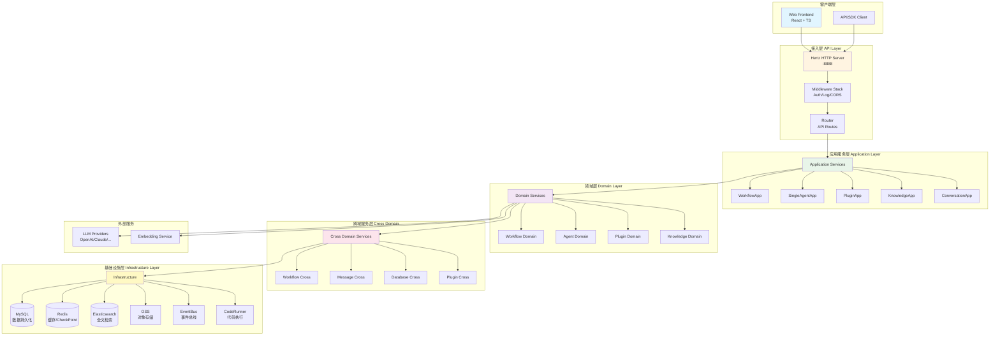

### 2.2 架构特点分析

#### 2.2.1 分层清晰，职责明确

Coze Studio 采用严格的**六层架构**：

1. **接入层（API Layer）**：负责 HTTP 请求处理、路由分发
2. **应用服务层（Application Layer）**：编排业务流程，协调多个领域服务
3. **领域层（Domain Layer）**：核心业务逻辑，封装领域模型
4. **跨域服务层（Cross Domain）**：跨领域的服务调用抽象
5. **基础设施层（Infrastructure）**：技术实现细节（数据库、缓存等）
6. **工具层（Pkg）**：通用工具和辅助函数

#### 2.2.2 DDD 实践

**领域驱动设计核心要素**：

- **实体（Entity）**：具有唯一标识的领域对象
- **值对象（Value Object）**：无标识的不可变对象
- **聚合根（Aggregate Root）**：管理一组相关对象的生命周期
- **领域服务（Domain Service）**：跨实体的业务逻辑
- **仓储（Repository）**：数据访问抽象层
- **应用服务（Application Service）**：用例协调者

#### 2.2.3 依赖倒置原则

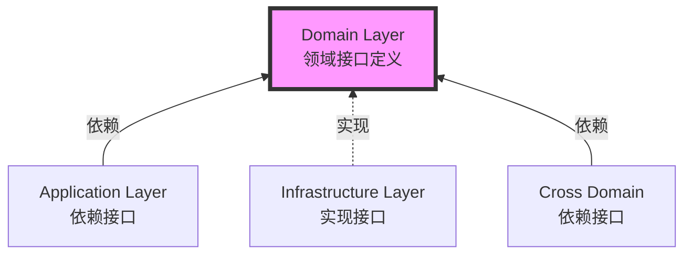

**优势**：
- ✅ 核心业务逻辑不依赖基础设施
- ✅ 易于测试（可 Mock）
- ✅ 灵活替换底层实现

---

## 3. 核心分层架构

### 3.1 各层详细职责

#### 3.1.1 API 层（`/backend/api`）

```
api/
├── handler/          # HTTP 请求处理器
│   └── coze/         # 具体业务 Handler
├── middleware/       # 中间件（认证、日志、CORS）
├── model/           # API 数据模型（DTO）
└── router/          # 路由注册
```

**核心职责**：
- 🔸 接收 HTTP 请求，解析参数
- 🔸 调用 Application Service
- 🔸 返回统一格式的响应
- 🔸 参数校验和错误处理

**关键代码示例**（`main.go`）：

```go
func main() {
    ctx := context.Background()
    
    // 1. 加载环境变量
    loadEnv()
    
    // 2. 初始化所有服务（依赖注入）
    application.Init(ctx)
    
    // 3. 启动 HTTP 服务器
    startHttpServer()
}

func startHttpServer() {
    s := server.Default(opts...)
    
    // 中间件链（顺序很重要！）
    s.Use(middleware.ContextCacheMW())      // 上下文缓存
    s.Use(middleware.RequestInspectorMW())  // 请求检查
    s.Use(middleware.SetHostMW())           // 设置主机信息
    s.Use(middleware.SetLogIDMW())          // 日志ID
    s.Use(corsHandler)                      // CORS
    s.Use(middleware.AccessLogMW())         // 访问日志
    s.Use(middleware.OpenapiAuthMW())       // OpenAPI 认证
    s.Use(middleware.SessionAuthMW())       // Session 认证
    s.Use(middleware.I18nMW())              // 国际化
    
    router.GeneratedRegister(s)
    s.Spin()
}
```

**中间件执行顺序**：

```mermaid
graph LR
    A[HTTP Request] --> B[ContextCache]
    B --> C[RequestInspector]
    C --> D[SetHost]
    D --> E[SetLogID]
    E --> F[CORS]
    F --> G[AccessLog]
    G --> H[OpenapiAuth]
    H --> I[SessionAuth]
    I --> J[I18n]
    J --> K[Handler]
    K --> L[Response]
    
    style A fill:#e3f2fd
    style K fill:#c8e6c9
    style L fill:#fff9c4
```

#### 3.1.2 应用服务层（`/backend/application`）

```
application/
├── application.go        # 服务初始化总入口
├── workflow/            # Workflow 应用服务
├── singleagent/         # Agent 应用服务
├── plugin/              # Plugin 应用服务
├── knowledge/           # Knowledge 应用服务
├── conversation/        # Conversation 应用服务
├── memory/              # Memory（Database/Variables）
└── ...
```

**核心职责**：
- 🔸 编排多个 Domain Service 完成业务用例
- 🔸 事务管理
- 🔸 权限检查
- 🔸 事件发布

**服务初始化三阶段**（`application.go`）：

```go
func Init(ctx context.Context) error {
    // 第一阶段：初始化基础设施
    infra, _ := appinfra.Init(ctx)
    
    // 第二阶段：初始化基础服务（只依赖 infra）
    basicServices, _ := initBasicServices(ctx, infra, eventbus)
    
    // 第三阶段：初始化主要服务（依赖基础服务）
    primaryServices, _ := initPrimaryServices(ctx, basicServices)
    
    // 第四阶段：初始化复杂服务（依赖主要服务）
    complexServices, _ := initComplexServices(ctx, primaryServices)
    
    // 第五阶段：注册跨域服务
    crossworkflow.SetDefaultSVC(workflowImpl.InitDomainService(...))
    crossknowledge.SetDefaultSVC(knowledgeImpl.InitDomainService(...))
    // ...
    
    return nil
}
```

**服务依赖关系图**：

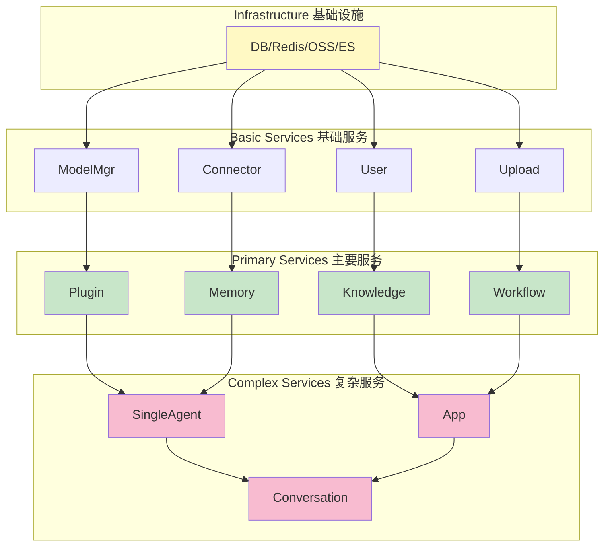

#### 3.1.3 领域层（`/backend/domain`）

```
domain/
├── workflow/              # Workflow 领域
│   ├── entity/           # 实体和值对象
│   ├── service/          # 领域服务实现
│   ├── internal/         # 内部实现细节
│   │   ├── compose/      # Workflow 编排
│   │   ├── nodes/        # 节点实现
│   │   ├── execute/      # 执行引擎
│   │   └── repo/         # 仓储实现
│   └── interface.go      # 领域接口定义
├── agent/                # Agent 领域
├── plugin/               # Plugin 领域
├── knowledge/            # Knowledge 领域
└── ...
```

**领域模型核心**：

**Entity 示例**（`domain/workflow/entity/workflow.go`）：

```go
// Workflow 实体（聚合根）
type Workflow struct {
    ID          int64
    SpaceID     int64
    AppID       *int64
    Name        string
    Description string
    Mode        WorkflowMode  // CHATFLOW | WORKFLOW
    Canvas      string        // JSON schema
    Version     string
    Status      Status
    CreatedAt   time.Time
    UpdatedAt   time.Time
}

// 业务方法
func (w *Workflow) GetBasic() *BasicInfo { ... }
func (w *Workflow) GetVersion() string { ... }
```

**Domain Service 接口**（`domain/workflow/interface.go`）：

```go
type Service interface {
    // 元数据管理
    Create(ctx context.Context, meta *vo.MetaCreate) (int64, error)
    Get(ctx context.Context, policy *vo.GetPolicy) (*entity.Workflow, error)
    Delete(ctx context.Context, policy *vo.DeletePolicy) ([]int64, error)
    UpdateMeta(ctx context.Context, id int64, metaUpdate *vo.MetaUpdate) error
    
    // 执行相关
    Executable  // 嵌入执行接口
    AsTool      // 作为工具使用
    
    // Workflow 特有逻辑
    Publish(ctx context.Context, policy *vo.PublishPolicy) error
    WorkflowSchemaCheck(ctx context.Context, wf *entity.Workflow, checks []workflow.CheckType) ([]*workflow.CheckResult, error)
    
    // 会话相关
    ChatFlowRole
    Conversation
}
```

#### 3.1.4 跨域服务层（`/backend/crossdomain`）

**设计目的**：
- 解决循环依赖问题
- 提供统一的跨领域调用接口
- 隔离不同领域的实现细节

```
crossdomain/
├── workflow/
│   ├── contract.go       # 接口定义
│   ├── impl/            # 接口实现（适配器）
│   └── model/           # 跨域数据模型
├── knowledge/
├── plugin/
└── ...
```

**使用模式**：

```go
// 在 Plugin Domain 中调用 Workflow
import crossworkflow "github.com/coze-dev/coze-studio/backend/crossdomain/workflow"

func (s *PluginService) UseInWorkflow(ctx context.Context, wfID int64) error {
    // 通过 crossdomain 接口调用
    wf, err := crossworkflow.GetDefaultSVC().GetWorkflow(ctx, wfID)
    if err != nil {
        return err
    }
    // ...
}
```

#### 3.1.5 基础设施层（`/backend/infra`）

```
infra/
├── orm/              # ORM 封装
├── rdb/              # 关系数据库
├── cache/            # Redis 缓存
├── es/               # Elasticsearch
├── storage/          # 对象存储（OSS）
├── eventbus/         # 事件总线
├── embedding/        # 向量嵌入
├── coderunner/       # 代码执行沙箱
├── checkpoint/       # 检查点存储
└── ...
```

---

## 4. 关键技术栈

### 4.1 核心框架

#### 4.1.1 Hertz - HTTP 框架

**选型理由**：
- 🚀 CloudWeGo 生态，性能优异
- 🔧 中间件机制完善
- 📦 代码生成支持（基于 IDL）

#### 4.1.2 Eino - AI Workflow 引擎

**核心概念**：
- **Runnable**: 可执行单元的抽象
- **Compose**: 组合模式，构建复杂 Workflow
- **Schema**: 数据流定义
- **Checkpoint**: 状态持久化，支持中断恢复

**使用示例**：

```go
import "github.com/cloudwego/eino/compose"

// 创建 Workflow
wf := compose.NewWorkflow[map[string]any, map[string]any](
    compose.WithGenLocalState(GenState()),
)

// 添加节点
wf.AddLambdaNode("llm_node", func(ctx context.Context, input map[string]any) (map[string]any, error) {
    // 调用 LLM
    return llmService.Chat(ctx, input)
})

// 编译运行
runner, _ := wf.Compile(ctx, compose.WithCheckPointStore(store))
output, _ := runner.Invoke(ctx, input)
```

### 4.2 数据存储

| 存储 | 用途 | 示例 |
|------|------|------|
| **MySQL** | 主数据存储 | Workflow 元数据、用户信息 |
| **Redis** | 缓存 + Checkpoint | 执行状态、临时数据 |
| **Elasticsearch** | 全文检索 | 资源搜索、知识库检索 |
| **OSS** | 对象存储 | 文件上传、图片、模型文件 |

---

## 5. 目录结构分析

### 5.1 完整目录树

```
backend/
│
├── main.go                    # 程序入口
│
├── api/                       # API 接入层
│   ├── handler/              # HTTP Handler
│   ├── middleware/           # 中间件
│   ├── model/                # API 数据模型
│   └── router/               # 路由注册
│
├── application/              # 应用服务层
│   ├── application.go        # 依赖注入总入口
│   ├── workflow/            # Workflow 应用服务
│   ├── singleagent/         # Agent 应用服务
│   ├── plugin/              # Plugin 应用服务
│   ├── knowledge/           # Knowledge 应用服务
│   ├── conversation/        # Conversation 应用服务
│   ├── memory/              # Memory 应用服务
│   └── ...
│
├── domain/                   # 领域层（核心业务逻辑）
│   ├── workflow/            # Workflow 领域
│   │   ├── entity/          # 实体
│   │   ├── service/         # 领域服务
│   │   ├── internal/        # 内部实现
│   │   └── interface.go     # 接口定义
│   ├── agent/
│   ├── plugin/
│   ├── knowledge/
│   └── ...
│
├── crossdomain/             # 跨域服务（防止循环依赖）
│   ├── workflow/
│   ├── knowledge/
│   ├── plugin/
│   └── ...
│
├── infra/                   # 基础设施层
│   ├── orm/
│   ├── rdb/
│   ├── cache/
│   ├── es/
│   ├── storage/
│   ├── eventbus/
│   ├── embedding/
│   └── coderunner/
│
├── bizpkg/                  # 业务工具包
│   ├── config/
│   ├── llm/
│   └── ...
│
├── pkg/                     # 通用工具库
│   ├── errorx/
│   ├── logs/
│   ├── lang/
│   └── ...
│
├── types/                   # 类型定义
│   ├── consts/
│   └── errno/
│
├── conf/                    # 配置文件
│   ├── model/              # 模型配置
│   ├── plugin/             # 插件配置
│   └── workflow/           # Workflow 配置
│
└── internal/               # 内部测试工具
    ├── mock/
    └── testutil/
```

### 5.2 目录职责矩阵

| 目录 | 职责 | 依赖方向 |
|------|------|---------|
| `api` | HTTP 请求处理 | → application |
| `application` | 业务流程编排 | → domain |
| `domain` | 核心业务逻辑 | → crossdomain |
| `crossdomain` | 跨域服务抽象 | → domain (interface) |
| `infra` | 技术实现细节 | ← domain (实现接口) |
| `pkg` | 通用工具 | 被所有层使用 |

---

## 6. 核心模块详解

### 6.1 Workflow 模块

Workflow 是 Coze Studio 的**核心引擎**，支持复杂的业务流程编排。

#### 6.1.1 Workflow 架构

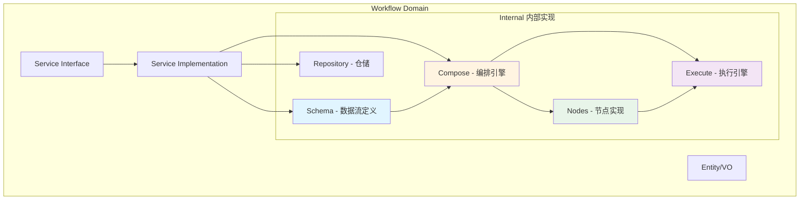

#### 6.1.2 核心组件

##### Schema（数据流定义）

**职责**：定义 Workflow 的结构和数据流

```go
// WorkflowSchema 定义 Workflow 的完整结构
type WorkflowSchema struct {
    Nodes       []*NodeSchema      // 所有节点
    Connections []*Connection      // 节点连接关系
    Hierarchy   map[NodeKey]NodeKey // 父子层级关系
}

// NodeSchema 定义单个节点
type NodeSchema struct {
    Key         NodeKey
    Type        entity.NodeType    // Entry/Exit/LLM/Plugin...
    InputTypes  map[string]*vo.TypeInfo
    OutputTypes map[string]*vo.TypeInfo
    Configs     interface{}        // 节点配置
}
```

##### Compose（编排引擎）

**职责**：将 Schema 编译成可执行的 Workflow

```go
// NewWorkflow 创建 Workflow 实例
func NewWorkflow(ctx context.Context, sc *schema.WorkflowSchema, opts ...WorkflowOption) (*Workflow, error) {
    wf := &Workflow{
        workflow:    compose.NewWorkflow[map[string]any, map[string]any](),
        hierarchy:   sc.Hierarchy,
        connections: sc.Connections,
        schema:      sc,
    }
    
    // 1. 添加所有节点
    for _, ns := range sc.Nodes {
        wf.AddNode(ctx, ns)
    }
    
    // 2. 编译成可执行的 Runner
    runner, _ := wf.Compile(ctx, compose.WithCheckPointStore(...))
    wf.Runner = runner
    
    return wf, nil
}
```

##### Nodes（节点实现）

**支持的节点类型**：

| 节点类型 | 功能 | 实现路径 |
|---------|------|---------|
| **Entry** | 工作流入口 | `nodes/entry` |
| **Exit** | 工作流出口 | `nodes/exit` |
| **LLM** | 大模型调用 | `nodes/llm` |
| **Plugin** | 插件调用 | `nodes/plugin` |
| **Code** | 代码执行 | `nodes/code` |
| **Knowledge** | 知识库检索 | `nodes/knowledge` |
| **Database** | 数据库操作 | `nodes/database` |
| **Selector** | 条件分支 | `nodes/selector` |
| **Loop** | 循环迭代 | `nodes/loop` |
| **HTTPRequester** | HTTP 请求 | `nodes/httprequester` |

**LLM 节点示例**（简化）：

```go
func buildLLMNode(ctx context.Context, ns *schema.NodeSchema) (*LLMNode, error) {
    config := ns.Configs.(*LLMConfig)
    
    // 1. 构建 Chat Model
    chatModel := modelbuilder.NewChatModel(config.Model)
    
    // 2. 构建 Prompt Template
    promptTpl := prompt.FromMessages(config.Messages...)
    
    // 3. 创建 LLM Chain
    chain := compose.NewChain[map[string]any, *schema.Message]()
    chain.AppendPrompt(promptTpl)
    chain.AppendChatModel(chatModel)
    
    return &LLMNode{
        chain: chain,
        config: config,
    }, nil
}
```

##### Execute（执行引擎）

**核心功能**：
- 🔸 执行上下文管理
- 🔸 事件发送（开始、结束、错误）
- 🔸 流式输出支持
- 🔸 中断和恢复

**事件类型**：

```go
const (
    WorkflowStart     EventType = "workflow_start"
    WorkflowSuccess   EventType = "workflow_success"
    WorkflowFailed    EventType = "workflow_failed"
    WorkflowInterrupt EventType = "workflow_interrupt"
    WorkflowCancel    EventType = "workflow_cancel"
    
    NodeStart    EventType = "node_start"
    NodeSuccess  EventType = "node_success"
    NodeFailed   EventType = "node_failed"
)
```

#### 6.1.3 Workflow 生命周期

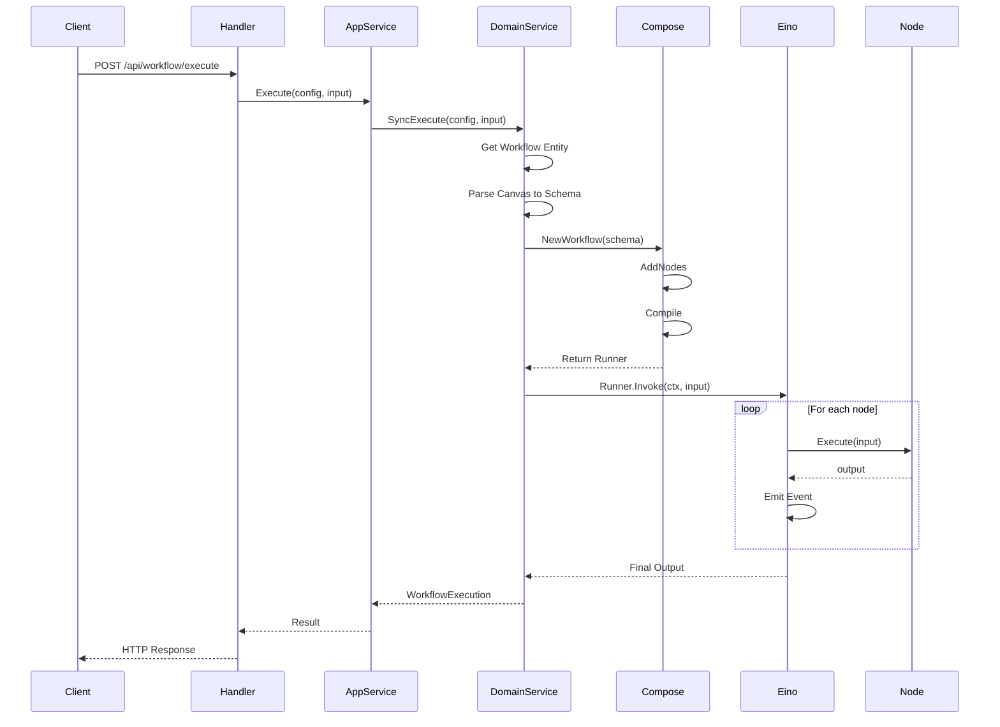

### 6.2 Plugin 模块

#### 6.2.1 Plugin 架构

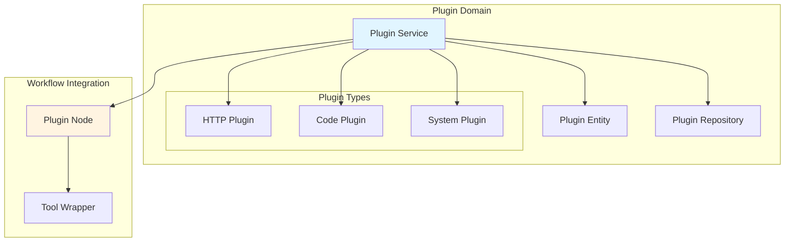

#### 6.2.2 Plugin 调用流程

```go
// Plugin 作为 Workflow Node 被调用
func (n *PluginNode) Execute(ctx context.Context, input map[string]any) (map[string]any, error) {
    // 1. 获取 Plugin 配置
    pluginID := n.config.PluginID
    methodName := n.config.MethodName
    
    // 2. 加载 Plugin
    plugin, _ := crossplugin.GetDefaultSVC().GetPlugin(ctx, pluginID)
    
    // 3. 准备参数
    params := n.prepareParams(input)
    
    // 4. 调用 Plugin
    result, _ := plugin.Invoke(ctx, methodName, params)
    
    return result, nil
}
```

### 6.3 Knowledge 模块

#### 6.3.1 RAG 流程

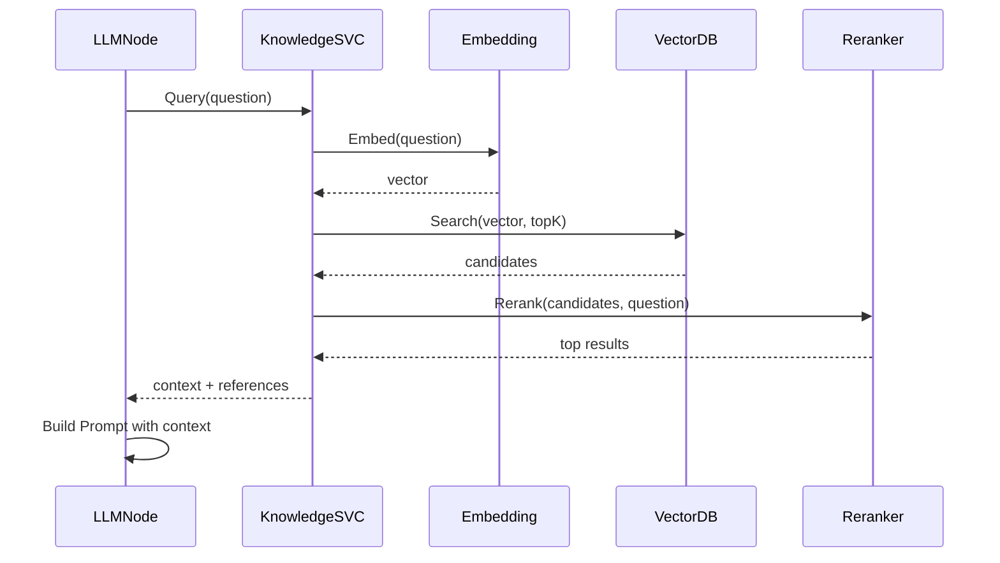

---

## 7. 数据流分析：简单工作流示例

### 7.1 场景描述

我们分析一个**最简单的 Workflow**：

```
[开始] → [大模型] → [结束]
```

**说明**：本节以 **OpenAPI 方式**执行 Workflow 为例进行分析。Coze Studio 提供两套 API：

| API 类型 | 路径前缀 | 用途 | 认证方式 |
|---------|---------|------|---------|
| **OpenAPI** | `/v1/` | 对外开放的 API，供第三方调用 | API Key（Personal Access Token） |
| **内部 API** | `/api/` | Web 前端使用的内部 API | Session 认证 |

本节重点分析 OpenAPI 的执行流程，因为它更完整地展示了认证、权限校验、版本控制等机制。

**Canvas JSON 结构**：

```json
{
  "nodes": [
    {
      "key": "entry",
      "type": "entry",
      "outputs": {"user_input": "string"}
    },
    {
      "key": "llm_1",
      "type": "llm",
      "config": {
        "model": "gpt-4",
        "prompt": "{{user_input}}"
      }
    },
    {
      "key": "exit",
      "type": "exit",
      "inputs": {"output": "string"}
    }
  ],
  "connections": [
    {"from": "entry.user_input", "to": "llm_1.input"},
    {"from": "llm_1.output", "to": "exit.output"}
  ]
}
```

### 7.2 完整数据流图

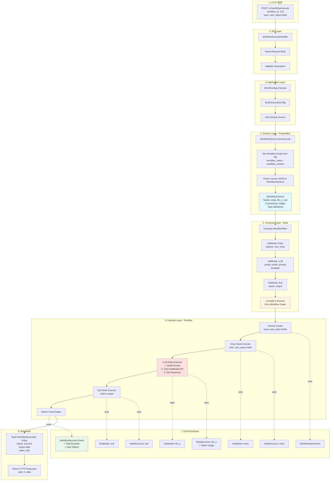

### 7.3 详细执行步骤

#### Step 1: HTTP 请求到达

```http
POST /v1/workflow/run HTTP/1.1
Content-Type: application/json
Authorization: Bearer <API_KEY>

{
  "workflow_id": "123",
  "parameters": "{\"user_input\": \"Hello, AI!\"}"
}
```

**说明**：
- OpenAPI 使用 `/v1/workflow/run` 路径（不是 `/v1/workflow/execute`）
- 需要 API Key 认证
- `parameters` 是 JSON 字符串格式

#### Step 2: API Handler 处理

```go
// backend/api/handler/coze/workflow_service.go
// OpenAPIRunFlow .
// @router /v1/workflow/run [POST]
func OpenAPIRunFlow(ctx context.Context, c *app.RequestContext) {
    var err error

    // 预处理请求体
    if err = preprocessWorkflowRequestBody(ctx, c); err != nil {
        invalidParamRequestResponse(c, err.Error())
        return
    }

    // 绑定和验证参数
    var req workflow.OpenAPIRunFlowRequest
    err = c.BindAndValidate(&req)
    if err != nil {
        invalidParamRequestResponse(c, err.Error())
        return
    }
    
    // 调用 Application Service
    resp, err := appworkflow.SVC.OpenAPIRun(ctx, &req)
    if err != nil {
        // 处理 Workflow 特定错误
        var se vo.WorkflowError
        if errors.As(err, &se) {
            resp = new(workflow.OpenAPIRunFlowResponse)
            resp.Code = int64(se.OpenAPICode())
            resp.Msg = ptr.Of(se.Msg())
            debugURL := se.DebugURL()
            if debugURL != "" {
                resp.DebugUrl = ptr.Of(debugURL)
            }
            c.JSON(consts.StatusOK, resp)
            return
        }

        internalServerErrorResponse(ctx, c, err)
        return
    }

    c.JSON(consts.StatusOK, resp)
}
```

**关键点**：
- 使用 `OpenAPIRunFlowRequest` 而不是简单的 ExecuteRequest
- 包含完整的错误处理逻辑
- 支持返回 debug URL

#### Step 3: Application Service 编排

```go
// backend/application/workflow/workflow.go
func (w *ApplicationService) OpenAPIRun(ctx context.Context, req *workflow.OpenAPIRunFlowRequest) (
    _ *workflow.OpenAPIRunFlowResponse, err error,
) {
    // 1. 获取 API 认证信息
    apiKeyInfo := ctxutil.GetApiAuthFromCtx(ctx)
    userID := apiKeyInfo.UserID

    // 2. 解析参数
    parameters := make(map[string]any)
    if req.Parameters != nil {
        err := sonic.UnmarshalString(*req.Parameters, &parameters)
        if err != nil {
            return nil, vo.WrapError(errno.ErrInvalidParameter, err)
        }
    }

    // 3. 获取 Workflow 元数据
    meta, err := GetWorkflowDomainSVC().Get(ctx, &vo.GetPolicy{
        ID:       mustParseInt64(req.GetWorkflowID()),
        MetaOnly: true,
    })
    if err != nil {
        return nil, err
    }

    // 4. 检查是否已发布
    if meta.LatestPublishedVersion == nil {
        return nil, vo.NewError(errno.ErrWorkflowNotPublished)
    }

    // 5. 权限检查
    if err = checkUserSpace(ctx, userID, meta.SpaceID); err != nil {
        return nil, err
    }

    // 6. 构建执行配置
    exeCfg := workflowModel.ExecuteConfig{
        ID:            meta.ID,
        From:          workflowModel.FromSpecificVersion,
        Version:       *meta.LatestPublishedVersion,
        Operator:      userID,
        Mode:          workflowModel.ExecuteModeRelease,
        ConnectorID:   apiKeyInfo.ConnectorID,
        ConnectorUID:  strconv.FormatInt(userID, 10),
        InputFailFast: true,
        BizType:       workflowModel.BizTypeWorkflow,
    }

    // 7. 判断同步/异步执行
    if req.GetIsAsync() {
        // 异步执行
        exeCfg.SyncPattern = workflowModel.SyncPatternAsync
        exeCfg.TaskType = workflowModel.TaskTypeBackground
        exeID, err := GetWorkflowDomainSVC().AsyncExecute(ctx, exeCfg, parameters)
        if err != nil {
            return nil, err
        }
        return &workflow.OpenAPIRunFlowResponse{
            ExecuteID: ptr.Of(strconv.FormatInt(exeID, 10)),
            DebugUrl:  ptr.Of(debugutil.GetWorkflowDebugURL(ctx, meta.ID, meta.SpaceID, exeID)),
        }, nil
    }
    
    // 8. 同步执行
    exeCfg.SyncPattern = workflowModel.SyncPatternSync
    exeCfg.TaskType = workflowModel.TaskTypeForeground
    wfExe, tPlan, err := GetWorkflowDomainSVC().SyncExecute(ctx, exeCfg, parameters)
    if err != nil {
        return nil, err
    }

    // 9. 构建返回结果
    return buildOpenAPIRunResponse(ctx, wfExe, tPlan, meta)
}
```

**关键流程**：
1. ✅ API 认证和用户识别
2. ✅ 参数解析（JSON 字符串 → map）
3. ✅ Workflow 元数据获取
4. ✅ 发布状态检查
5. ✅ 权限校验
6. ✅ 执行配置构建
7. ✅ 支持同步/异步模式
8. ✅ 调用 Domain Service 执行

#### Step 4: Domain Service 执行

```go
// backend/domain/workflow/service/executable_impl.go
func (i *impl) SyncExecute(ctx context.Context, config workflowModel.ExecuteConfig, input map[string]any) (*entity.WorkflowExecution, vo.TerminatePlan, error) {
    // 1. 获取 Workflow 实体
    wfEntity, _ := i.Get(ctx, &vo.GetPolicy{
        ID:    config.ID,
        QType: config.From,
    })
    
    // 2. 解析 Canvas 为 Schema
    canvas := &vo.Canvas{}
    sonic.UnmarshalString(wfEntity.Canvas, canvas)
    workflowSC, _ := adaptor.CanvasToWorkflowSchema(ctx, canvas)
    
    // 3. 创建 Workflow
    wf, _ := compose.NewWorkflow(ctx, workflowSC, 
        compose.WithIDAsName(wfEntity.ID))
    
    // 4. 准备执行上下文
    cancelCtx, executeID, opts, lastEventChan, _ := compose.NewWorkflowRunner(
        wfEntity.GetBasic(), 
        workflowSC, 
        config,
        compose.WithInput(inputStr),
    ).Prepare(ctx)
    
    // 5. 同步执行
    startTime := time.Now()
    out, err := wf.SyncRun(cancelCtx, input, opts...)
    
    // 6. 等待最后一个事件
    lastEvent := <-lastEventChan
    
    // 7. 构建返回结果
    return &entity.WorkflowExecution{
        ID:         executeID,
        WorkflowID: wfEntity.ID,
        Status:     entity.WorkflowSuccess,
        Output:     ptr.Of(outputStr),
        TokenInfo:  &entity.TokenUsage{
            InputTokens:  lastEvent.GetInputTokens(),
            OutputTokens: lastEvent.GetOutputTokens(),
        },
        Duration:   lastEvent.Duration,
    }, wf.TerminatePlan(), nil
}
```

#### Step 5: Compose Layer 构建

**真实代码流程（完全基于源码）**：

```go
// backend/domain/workflow/internal/compose/workflow.go (83-158行)
func NewWorkflow(ctx context.Context, sc *schema.WorkflowSchema, opts ...WorkflowOption) (*Workflow, error) {
    // 1. 初始化 WorkflowSchema
    sc.Init()
    
    // 2. 创建 Workflow 实例
    wf := &Workflow{
        workflow:    compose.NewWorkflow[map[string]any, map[string]any](
            compose.WithGenLocalState(GenState()),  // 状态生成器
        ),
        hierarchy:   sc.Hierarchy,
        connections: sc.Connections,
        schema:      sc,
    }
    
    // 3. 设置执行模式
    wf.streamRun = sc.RequireStreaming()        // 是否需要流式输出
    wf.requireCheckpoint = sc.RequireCheckpoint() // 是否需要 Checkpoint
    
    // 4. 处理选项参数
    wfOpts := &workflowOptions{}
    for _, opt := range opts {
        opt(wfOpts)
    }
    
    // 5. 检查节点数量限制
    if wfOpts.maxNodeCount > 0 {
        if sc.NodeCount() > int32(wfOpts.maxNodeCount) {
            return nil, fmt.Errorf("node count %d exceeds the limit: %d", 
                sc.NodeCount(), wfOpts.maxNodeCount)
        }
    }
    
    if wfOpts.parentRequireCheckpoint {
        wf.requireCheckpoint = true
    }
    
    // 6. 设置 input/output 类型定义
    wf.input = sc.GetNode(entity.EntryNodeKey).OutputTypes
    wf.output = sc.GetNode(entity.ExitNodeKey).InputTypes
    
    // 7. 【第一轮】添加复合节点（CompositeNodes）
    //    复合节点包含内部子工作流，需要先构建
    compositeNodes := sc.GetCompositeNodes()
    processedNodeKey := make(map[vo.NodeKey]struct{})
    
    for i := range compositeNodes {
        cNode := compositeNodes[i]
        if err := wf.AddCompositeNode(ctx, cNode); err != nil {
            return nil, err
        }
        
        // 标记已处理的节点（父节点和子节点）
        processedNodeKey[cNode.Parent.Key] = struct{}{}
        for _, child := range cNode.Children {
            processedNodeKey[child.Key] = struct{}{}
        }
    }
    
    // 8. 【第二轮】添加普通节点（Entry, LLM, Exit 等）
    //    跳过已经作为复合节点处理的节点
    for _, ns := range sc.Nodes {
        if _, ok := processedNodeKey[ns.Key]; !ok {
            if err := wf.AddNode(ctx, ns); err != nil {
                return nil, err
            }
        }
        
        // 保存 Exit 节点的终止计划
        if ns.Type == entity.NodeTypeExit {
            wf.terminatePlan = ns.Configs.(*exit.Config).TerminatePlan
        }
    }
    
    // 9. 编译成可执行的 Runner
    var compileOpts []compose.GraphCompileOption
    if wf.requireCheckpoint {
        compileOpts = append(compileOpts, 
            compose.WithCheckPointStore(workflow2.GetRepository()))
    }
    if wfOpts.idAsName {
        compileOpts = append(compileOpts, 
            compose.WithGraphName(strconv.FormatInt(wfOpts.wfID, 10)))
    }
    
    r, err := wf.Compile(ctx, compileOpts...)
    if err != nil {
        return nil, err
    }
    wf.Runner = r
    
    return wf, nil
}
```

**节点添加流程（AddNode）**：

```go
// backend/domain/workflow/internal/compose/workflow.go (216-280行)
func (w *Workflow) addNodeInternal(ctx context.Context, ns *schema.NodeSchema, 
    inner *innerWorkflowInfo) (map[vo.NodeKey][]*compose.FieldMapping, error) {
    
    key := ns.Key
    
    // 1. 解析节点依赖关系
    deps, err := w.resolveDependencies(key, ns.InputSources)
    if err != nil {
        return nil, err
    }
    
    // 2. 如果是复合节点，合并内部工作流的依赖
    if inner != nil {
        if err = deps.merge(inner.carryOvers); err != nil {
            return nil, err
        }
    }
    
    var innerWorkflow compose.Runnable[map[string]any, map[string]any]
    if inner != nil {
        innerWorkflow = inner.inner
    }
    
    // 3. 【核心】调用 node_builder.New() 创建节点实例
    ins, err := New(ctx, ns, innerWorkflow, w.schema, deps, w.requireCheckpoint)
    if err != nil {
        return nil, err
    }
    
    // 4. 准备节点选项
    var opts []compose.GraphAddNodeOpt
    opts = append(opts, compose.WithNodeName(string(ns.Key)))
    
    // 5. 添加前置处理器（preHandler）
    preHandler := statePreHandler(ns, w.streamRun)
    if preHandler != nil {
        opts = append(opts, preHandler)
    }
    
    // 6. 添加后置处理器（postHandler）
    postHandler := statePostHandler(ns, w.streamRun)
    if postHandler != nil {
        opts = append(opts, postHandler)
    }
    
    // 7. 将节点添加到 Workflow 图中
    var wNode *compose.WorkflowNode
    if ins.Lambda != nil {
        wNode = w.AddLambdaNode(string(key), ins.Lambda, opts...)
    } else {
        return nil, fmt.Errorf("node instance has no Lambda: %s", key)
    }
    
    // 8. 处理数组钻取（array drill down）
    if err = deps.arrayDrillDown(w.schema.GetAllNodes()); err != nil {
        return nil, err
    }
    
    // 9. 添加节点的输入连接（建立节点之间的数据流）
    for fromNodeKey := range deps.inputsFull {
        wNode.AddInput(string(fromNodeKey))
    }
    
    for fromNodeKey, fieldMappings := range deps.inputs {
        wNode.AddInput(string(fromNodeKey), fieldMappings...)
    }
    
    for fromNodeKey := range deps.inputsNoDirectDependencyFull {
        wNode.AddInputWithOptions(string(fromNodeKey), nil, 
            compose.WithNoDirectDependency())
    }
    
    for fromNodeKey, fieldMappings := range deps.inputsNoDirectDependency {
        wNode.AddInputWithOptions(string(fromNodeKey), fieldMappings, 
            compose.WithNoDirectDependency())
    }
    
    // ... 返回 carryOver 依赖
}
```

**节点实例化（node_builder.New）**：

```go
// backend/domain/workflow/internal/compose/node_builder.go (40-100行)
func New(ctx context.Context, s *schema.NodeSchema,
    inner compose.Runnable[map[string]any, map[string]any], // 内部工作流（复合节点用）
    sc *schema.WorkflowSchema,                               // 所属工作流 Schema
    deps *dependencyInfo,                                    // 依赖信息
    requireCheckpoint bool,
) (_ *Node, err error) {
    defer func() {
        if panicErr := recover(); panicErr != nil {
            err = safego.NewPanicErr(panicErr, debug.Stack())
        }
        
        if err != nil {
            err = vo.WrapIfNeeded(errno.ErrCreateNodeFail, err, 
                errorx.KV("node_name", s.Name), 
                errorx.KV("cause", err.Error()))
        }
    }()
    
    // 1. 获取完整的数据源信息（如果节点需要）
    var fullSources map[string]*schema.SourceInfo
    if m := entity.NodeMetaByNodeType(s.Type); m != nil && m.InputSourceAware {
        if fullSources, err = GetFullSources(s, sc, deps); err != nil {
            return nil, err
        }
        s.FullSources = fullSources
    }
    
    // 2. 【策略模式】检查 NodeSchema.Configs 是否实现了 NodeBuilder 接口
    nb, ok := s.Configs.(schema.NodeBuilder)
    if ok {
        // 2.1 准备构建选项
        opts := []schema.BuildOption{
            schema.WithWorkflowSchema(sc),
            schema.WithInnerWorkflow(inner),
        }
        
        // 2.2 调用具体节点的 Build() 方法
        //     例如: LLMConfig.Build(), PluginConfig.Build() 等
        n, err := nb.Build(ctx, s, opts...)
        if err != nil {
            return nil, err
        }
        
        // 2.3 将节点包装成 Lambda（Eino 统一接口）
        return toNode(s, n), nil
    }
    
    // 3. 特殊节点类型处理
    switch s.Type {
    case entity.NodeTypeLambda:
        // 直接使用预定义的 Lambda
        if s.Lambda == nil {
            return nil, fmt.Errorf("lambda is not defined for NodeTypeLambda")
        }
        return &Node{Lambda: s.Lambda}, nil
        
    case entity.NodeTypeSubWorkflow:
        // 构建子工作流
        subWorkflow, err := buildSubWorkflow(ctx, s, requireCheckpoint)
        if err != nil {
            return nil, err
        }
        return toNode(s, subWorkflow), nil
        
    default:
        panic(fmt.Sprintf("node schema's Configs does not implement NodeBuilder. type: %v", s.Type))
    }
}
```

**LLM 节点构建示例（Build 方法）**：

```go
// backend/domain/workflow/internal/nodes/llm/llm.go
// LLMConfig 实现了 schema.NodeBuilder 接口
func (c *LLMConfig) Build(ctx context.Context, ns *schema.NodeSchema, 
    opts ...schema.BuildOption) (schema.InvokableNode, error) {
    
    // 1. 构建 ChatModel
    chatModel, err := modelbuilder.NewChatModel(ctx, c.Model, c.ModelConfig)
    if err != nil {
        return nil, err
    }
    
    // 2. 构建 Prompt Template
    //    将配置中的 Messages 转换为可执行的模板
    //    例如: "{{user_input}}" -> 可替换的模板变量
    promptTpl := buildPromptTemplate(c.Messages)
    
    // 3. 创建 LLM Chain
    chain := compose.NewChain[map[string]any, *schema.Message]()
    chain.AppendPrompt(promptTpl)
    chain.AppendChatModel(chatModel)
    
    // 4. 返回 LLMNode（实现了 InvokableNode 接口）
    return &LLMNode{
        config:    c,
        chain:     chain,
        chatModel: chatModel,
    }, nil
}

// LLMNode 的 Invoke 方法（运行时执行）
func (n *LLMNode) Invoke(ctx context.Context, input map[string]any) (map[string]any, error) {
    // 1. 执行 Prompt -> ChatModel Chain
    //    input = {user_input: "Hello, AI!"}
    //    -> Prompt 渲染 -> ChatModel API 调用
    msg, err := n.chain.Invoke(ctx, input)
    if err != nil {
        return nil, err
    }
        
    // 2. 返回输出
    //    {output: "Hi there! How can I help you?"}
        return map[string]any{"output": msg.Content}, nil
}
```

**关键流程总结**：

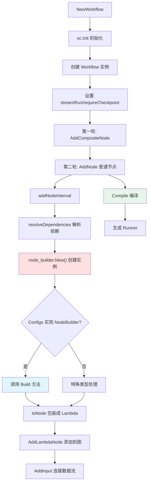

#### Step 6: Runtime 执行

```go
// Eino Framework 内部执行流程
func (r *Runner) Invoke(ctx context.Context, input map[string]any, opts ...Option) (map[string]any, error) {
    // 1. Emit WorkflowStart Event
    callbacks.OnStart(ctx, &callbacks.RunInfo{
        Name: "workflow_123",
        Type: "workflow",
    })
    
    state := map[string]any{}
    
    // 2. 按拓扑顺序执行节点
    for _, node := range r.sortedNodes {
        // 2.1 Entry Node
        if node.Key == "entry" {
            callbacks.OnStart(ctx, &callbacks.RunInfo{Name: "entry"})
            state["user_input"] = input["user_input"]  // "Hello, AI!"
            callbacks.OnEnd(ctx, &callbacks.RunInfo{Name: "entry"})
        }
        
        // 2.2 LLM Node
        if node.Key == "llm_1" {
            callbacks.OnStart(ctx, &callbacks.RunInfo{Name: "llm_1"})
            
            // 获取输入
            nodeInput := map[string]any{
                "user_input": state["user_input"],
            }
            
            // 执行 LLM Lambda
            nodeOutput, _ := node.Lambda(ctx, nodeInput)
            // nodeOutput = {output: "Hi there! How can I help you?"}
            
            state["llm_1_output"] = nodeOutput["output"]
            
            callbacks.OnEnd(ctx, &callbacks.RunInfo{
                Name: "llm_1",
                Extra: map[string]any{
                    "input_tokens": 10,
                    "output_tokens": 8,
                },
            })
        }
        
        // 2.3 Exit Node
        if node.Key == "exit" {
            callbacks.OnStart(ctx, &callbacks.RunInfo{Name: "exit"})
            output := map[string]any{
                "output": state["llm_1_output"],
            }
            callbacks.OnEnd(ctx, &callbacks.RunInfo{Name: "exit"})
            
            callbacks.OnEnd(ctx, &callbacks.RunInfo{
                Name: "workflow_123",
                Type: "workflow",
            })
            
            return output, nil
        }
    }
}
```

#### Step 7: 事件流

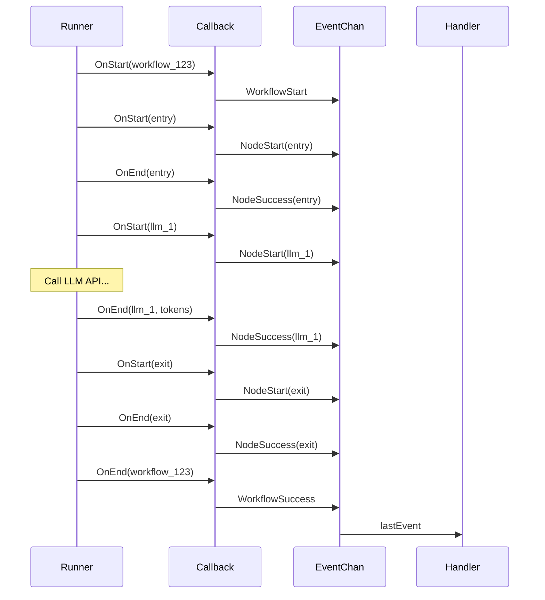

**事件处理代码**：

```go
// backend/domain/workflow/internal/execute/event_handle.go
func buildEventHandler(eventChan chan *Event) callbacks.Handler {
    return &EventHandler{
        onStart: func(ctx context.Context, info *callbacks.RunInfo) {
            if info.Type == "workflow" {
                eventChan <- &Event{Type: WorkflowStart}
            } else {
                eventChan <- &Event{Type: NodeStart, NodeKey: info.Name}
            }
        },
        onEnd: func(ctx context.Context, info *callbacks.RunInfo) {
            if info.Type == "workflow" {
                eventChan <- &Event{
                    Type:         WorkflowSuccess,
                    Duration:     info.Duration,
                    InputTokens:  extractTokens(info, "input"),
                    OutputTokens: extractTokens(info, "output"),
                }
            } else {
                eventChan <- &Event{
                    Type:    NodeSuccess,
                    NodeKey: info.Name,
                }
            }
        },
    }
}
```

#### Step 8: 返回结果

```json
{
  "code": 0,
  "msg": "success",
  "data": {
    "execution_id": "exec_xyz123",
    "workflow_id": 123,
    "status": "success",
    "output": {
      "output": "Hi there! How can I help you?"
    },
    "token_info": {
      "input_tokens": 10,
      "output_tokens": 8
    },
    "duration": 1250,
    "created_at": "2025-11-06T10:30:00Z"
  }
}
```

### 7.4 关键数据结构转换

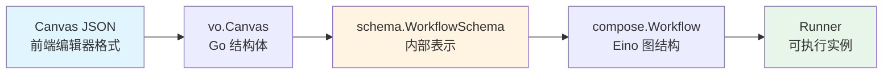

**各阶段数据示例**：

**1. Canvas JSON（存储在 DB）**：
```json
{
  "nodes": [
    {"key": "entry", "type": "entry", "x": 100, "y": 100, ...},
    {"key": "llm_1", "type": "llm", "config": {...}, "x": 300, "y": 100},
    {"key": "exit", "type": "exit", "x": 500, "y": 100}
  ],
  "connections": [...]
}
```

**2. WorkflowSchema（内存结构）**：
```go
schema.WorkflowSchema{
    Nodes: []*NodeSchema{
        {Key: "entry", Type: NodeTypeEntry, OutputTypes: {"user_input": TypeString}},
        {Key: "llm_1", Type: NodeTypeLLM, Configs: &LLMConfig{...}},
        {Key: "exit", Type: NodeTypeExit, InputTypes: {"output": TypeString}},
    },
    Connections: []*Connection{
        {From: "entry.user_input", To: "llm_1.input"},
        {From: "llm_1.output", To: "exit.output"},
    },
}
```

**3. Eino Workflow Graph（运行时）**：
```
Entry --> LLM Lambda --> Exit
  |         |              |
  v         v              v
state     state         output
```

---

### 7.5 进阶示例：包含插件节点的工作流

#### 7.5.1 场景描述

我们分析一个**包含插件调用的 Workflow**：

```
[开始] → [大模型] → [插件] → [结束]
```

**业务场景**：
1. 用户输入一个城市名称
2. LLM 生成查询天气的请求
3. Plugin 调用天气查询 API
4. 返回天气信息

**Canvas JSON 结构**：

```json
{
  "nodes": [
    {
      "key": "entry",
      "type": "entry",
      "outputs": {"user_input": "string"}
    },
    {
      "key": "llm_1",
      "type": "llm",
      "config": {
        "model": "gpt-4",
        "prompt": "用户想查询: {{user_input}}，请提取城市名称"
      }
    },
    {
      "key": "plugin_1",
      "type": "plugin",
      "config": {
        "pluginID": "12345",
        "toolID": "67890",
        "pluginVersion": "1.0.0"
      }
    },
    {
      "key": "exit",
      "type": "exit",
      "inputs": {"output": "string"}
    }
  ],
  "connections": [
    {"from": "entry.user_input", "to": "llm_1.input"},
    {"from": "llm_1.output", "to": "plugin_1.city"},
    {"from": "plugin_1.result", "to": "exit.output"}
  ]
}
```

#### 7.5.2 完整数据流图

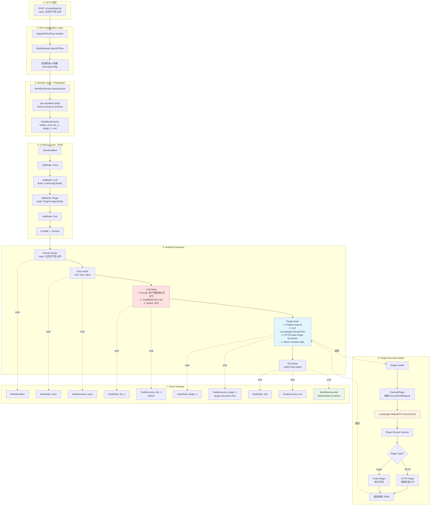

#### 7.5.3 详细代码执行流程

**Step 1: 插件节点构建（Compose Layer）**

```go
// backend/domain/workflow/internal/nodes/plugin/plugin.go (101-108行)
func (c *PluginConfig) Build(_ context.Context, _ *schema.NodeSchema, 
    _ ...schema.BuildOption) (any, error) {
    
    // 创建 Plugin 节点实例
    return &Plugin{
        pluginID:      c.PluginID,      // 12345
        toolID:        c.ToolID,         // 67890
        pluginVersion: c.PluginVersion,  // "1.0.0"
        pluginFrom:    c.PluginFrom,
    }, nil
}
```

**Step 2: Runtime 执行 - 节点顺序**

```go
// Eino Framework 按拓扑顺序执行节点
func (r *Runner) Invoke(ctx context.Context, input map[string]any) (map[string]any, error) {
    state := map[string]any{}
    
    // 1️⃣ Entry Node
    callbacks.OnStart(ctx, &callbacks.RunInfo{Name: "entry"})
    state["user_input"] = input["user_input"]  // "北京天气怎么样"
    callbacks.OnEnd(ctx, &callbacks.RunInfo{Name: "entry"})
    
    // 2️⃣ LLM Node
    callbacks.OnStart(ctx, &callbacks.RunInfo{Name: "llm_1"})
    llmInput := map[string]any{"user_input": state["user_input"]}
    llmOutput, _ := llmNode.Invoke(ctx, llmInput)
    // llmOutput = {output: "北京"}
    state["llm_1_output"] = llmOutput["output"]
    callbacks.OnEnd(ctx, &callbacks.RunInfo{
        Name: "llm_1",
        Extra: map[string]any{
            "input_tokens": 15,
            "output_tokens": 2,
        },
    })
    
    // 3️⃣ Plugin Node ⭐ 重点
    callbacks.OnStart(ctx, &callbacks.RunInfo{Name: "plugin_1"})
    pluginInput := map[string]any{
        "city": state["llm_1_output"],  // "北京"
    }
    pluginOutput, _ := pluginNode.Invoke(ctx, pluginInput)
    // pluginOutput = {result: "北京今天晴天，温度25°C"}
    state["plugin_1_result"] = pluginOutput["result"]
    callbacks.OnEnd(ctx, &callbacks.RunInfo{
        Name: "plugin_1",
        Extra: map[string]any{
            "plugin_exec_time": 450,  // ms
        },
    })
    
    // 4️⃣ Exit Node
    callbacks.OnStart(ctx, &callbacks.RunInfo{Name: "exit"})
    output := map[string]any{
        "output": state["plugin_1_result"],
    }
    callbacks.OnEnd(ctx, &callbacks.RunInfo{Name: "exit"})
    
    return output, nil
}
```

**Step 3: 插件节点执行细节**

```go
// backend/domain/workflow/internal/nodes/plugin/plugin.go (117-138行)
func (p *Plugin) Invoke(ctx context.Context, parameters map[string]any) (
    ret map[string]any, err error) {
    
    // 1. 获取执行配置
    var exeCfg workflowModel.ExecuteConfig
    if ctxExeCfg := execute.GetExeCtx(ctx); ctxExeCfg != nil {
        exeCfg = ctxExeCfg.ExeCfg
    }
    
    // 2. 调用插件执行引擎
    //    parameters = {city: "北京"}
    result, err := ExecutePlugin(ctx, parameters, &vo.PluginEntity{
        PluginID:      p.pluginID,      // 12345
        PluginVersion: ptr.Of(p.pluginVersion), // "1.0.0"
        PluginFrom:    p.pluginFrom,
    }, p.toolID, exeCfg)
    
    if err != nil {
        // 处理中断错误（如 OAuth 授权）
        if extra, ok := compose.IsInterruptRerunError(err); ok {
            interruptData := extra.(*entity.InterruptEvent).InterruptData
            return nil, vo.NewError(errno.ErrAuthorizationRequired, 
                errorx.KV("extra", interruptData))
        }
        return nil, err
    }
    
    // 3. 返回结果
    //    result = {result: "北京今天晴天，温度25°C"}
    return result, nil
}
```

**Step 4: 插件执行核心逻辑**

```go
// backend/domain/workflow/internal/nodes/plugin/exec.go (38-111行)
func ExecutePlugin(ctx context.Context, input map[string]any, 
    pe *vo.PluginEntity, toolID int64, cfg workflowModel.ExecuteConfig) (
    map[string]any, error) {
    
    // 1. 序列化输入参数
    //    input = {city: "北京"}
    //    -> args = "{\"city\":\"北京\"}"
    args, err := sonic.MarshalString(input)
    if err != nil {
        return nil, vo.WrapError(errno.ErrSerializationDeserializationFail, err)
    }
    
    // 2. 确定用户 ID
    var uID string
    if cfg.AgentID != nil {
        uID = cfg.ConnectorUID
    } else {
        uID = conv.Int64ToStr(cfg.Operator)
    }
    
    // 3. 构建插件执行请求
    req := &model.ExecuteToolRequest{
        UserID:          uID,
        PluginID:        pe.PluginID,        // 12345
        ToolID:          toolID,              // 67890
        ExecScene:       consts.ExecSceneOfWorkflow,
        ArgumentsInJson: args,                // "{\"city\":\"北京\"}"
        ExecDraftTool:   pe.PluginVersion == nil || *pe.PluginVersion == "0",
        PluginFrom:      pe.PluginFrom,
    }
    
    // 4. 设置执行选项
    execOpts := []model.ExecuteToolOpt{
        model.WithInvalidRespProcessStrategy(
            consts.InvalidResponseProcessStrategyOfReturnDefault),
    }
    
    if pe.PluginVersion != nil {
        execOpts = append(execOpts, model.WithToolVersion(*pe.PluginVersion))
    }
    
    // 5. 【跨域调用】通过 crossplugin 执行插件
    //    这里会根据插件类型（HTTP/Code/System）执行不同的逻辑
    r, err := crossplugin.DefaultSVC().ExecuteTool(ctx, req, execOpts...)
    if err != nil {
        // 处理中断事件（如需要 OAuth）
        if extra, ok := compose.IsInterruptRerunError(err); ok {
            pluginTIE, ok := extra.(*model.ToolInterruptEvent)
            if !ok {
                return nil, vo.WrapError(errno.ErrPluginAPIErr, 
                    fmt.Errorf("expects ToolInterruptEvent, got %T", extra))
            }
            
            // 将插件中断转换为工作流中断事件
            var eventType workflow3.EventType
            switch pluginTIE.Event {
            case consts.InterruptEventTypeOfToolNeedOAuth:
                eventType = workflow3.EventType_WorkflowOauthPlugin
            default:
                return nil, vo.WrapError(errno.ErrPluginAPIErr,
                    fmt.Errorf("unsupported interrupt event type: %s", 
                        pluginTIE.Event))
            }
            
            // 创建中断事件
            id, _ := workflow.GetRepository().GenID(ctx)
            ie := &entity2.InterruptEvent{
                ID:            id,
                InterruptData: pluginTIE.ToolNeedOAuth.Message,
                EventType:     eventType,
            }
            
            // 返回授权错误
            return nil, vo.NewError(errno.ErrAuthorizationRequired, 
                errorx.KV("extra", ie.InterruptData))
        }
        return nil, err
    }
    
    // 6. 解析返回结果
    //    r.TrimmedResp = "{\"result\":\"北京今天晴天，温度25°C\"}"
    var output map[string]any
    err = sonic.UnmarshalString(r.TrimmedResp, &output)
    if err != nil {
        return nil, vo.WrapError(errno.ErrSerializationDeserializationFail, err)
    }
    
    // 7. 返回
    //    output = {result: "北京今天晴天，温度25°C"}
    return output, nil
}
```

#### 7.5.4 插件类型与执行流程

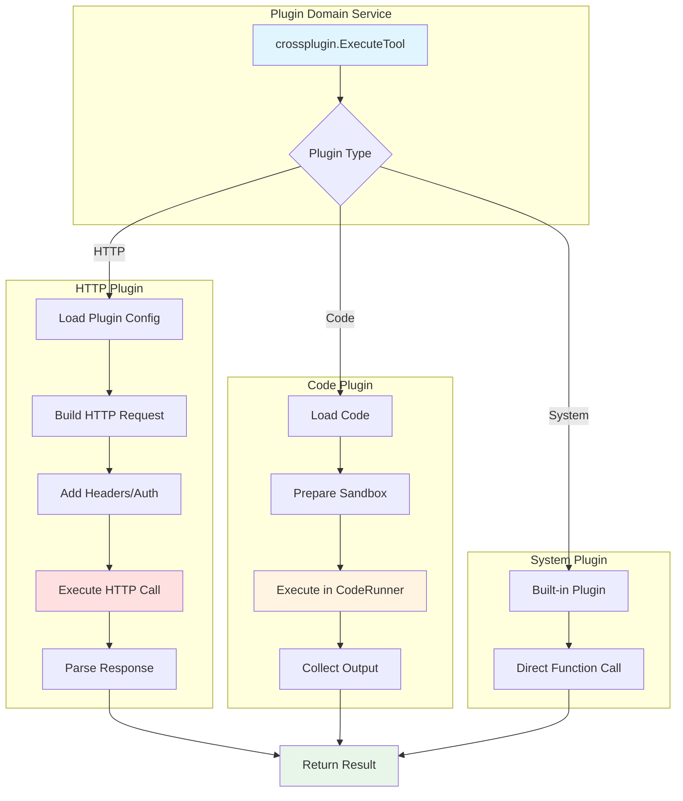

#### 7.5.5 数据流时序图

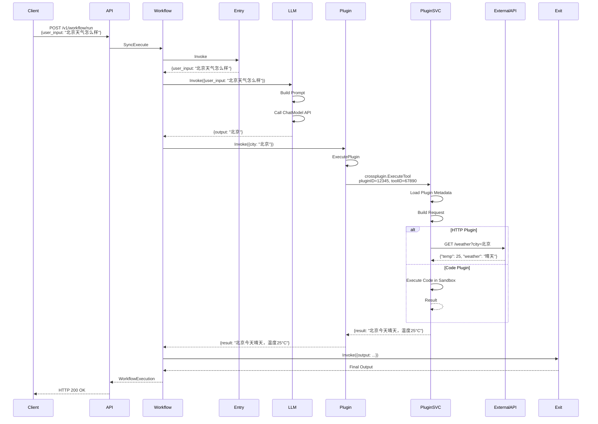

#### 7.5.6 关键数据转换

```
1. 用户输入 → Entry 节点
   Input:  {user_input: "北京天气怎么样"}
   Output: {user_input: "北京天气怎么样"}

2. Entry → LLM 节点
   Input:  {user_input: "北京天气怎么样"}
   Prompt: "用户想查询: 北京天气怎么样，请提取城市名称"
   Output: {output: "北京"}

3. LLM → Plugin 节点
   Input:  {city: "北京"}
   Plugin: Weather API Plugin
   Request: GET /weather?city=北京
   Response: {"temp": 25, "weather": "晴天"}
   Output: {result: "北京今天晴天，温度25°C"}

4. Plugin → Exit 节点
   Input:  {output: "北京今天晴天，温度25°C"}
   Output: {output: "北京今天晴天，温度25°C"}

5. 最终返回给用户
   {
     "code": 0,
     "data": {
       "output": "北京今天晴天，温度25°C",
       "token_info": {
         "input_tokens": 15,
         "output_tokens": 2
       },
       "duration": 1850
     }
   }
```

#### 7.5.7 错误处理：Plugin OAuth 中断

当插件需要 OAuth 授权时的流程：

```go
// 插件执行过程中遇到需要授权的情况
func ExecutePlugin(...) (map[string]any, error) {
    r, err := crossplugin.DefaultSVC().ExecuteTool(ctx, req, execOpts...)
    
    if err != nil {
        // 检测是否是中断错误
        if extra, ok := compose.IsInterruptRerunError(err); ok {
            pluginTIE := extra.(*model.ToolInterruptEvent)
            
            if pluginTIE.Event == consts.InterruptEventTypeOfToolNeedOAuth {
                // 创建工作流中断事件
                ie := &entity.InterruptEvent{
                    ID:            genID(),
                    EventType:     workflow.EventType_WorkflowOauthPlugin,
                    InterruptData: pluginTIE.ToolNeedOAuth.Message,
                    // 包含 OAuth URL、回调信息等
                }
                
                // 返回 401 错误，前端引导用户进行 OAuth
                return nil, vo.NewError(errno.ErrAuthorizationRequired, 
                    errorx.KV("extra", ie.InterruptData))
            }
        }
    }
}
```

**中断恢复流程**：

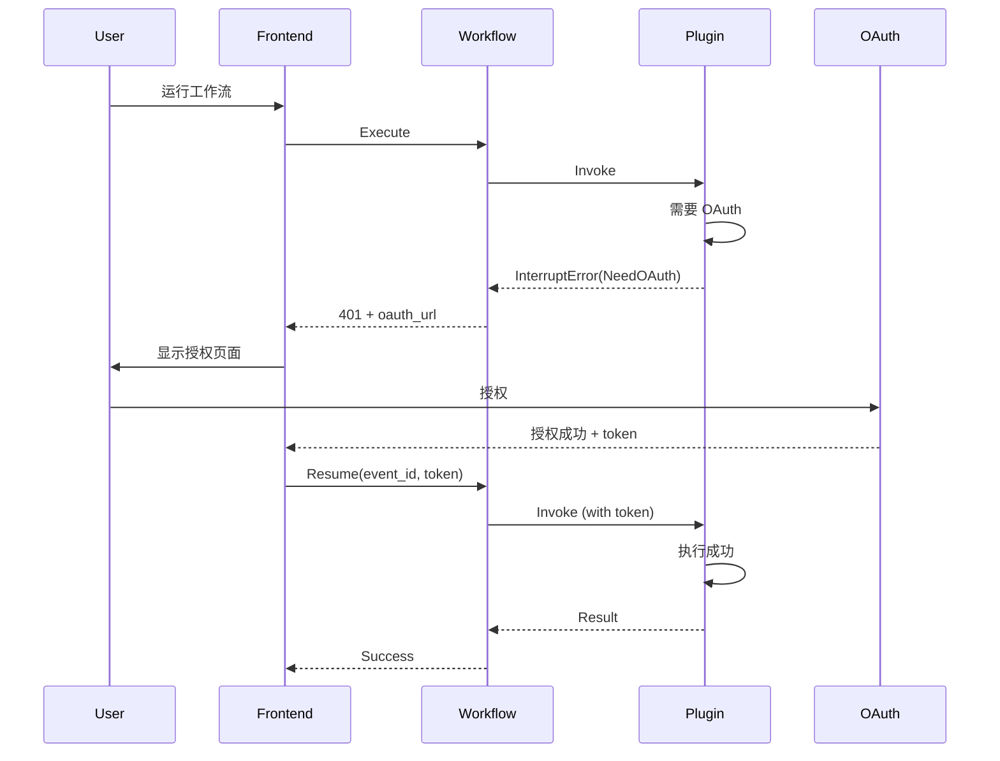

#### 7.5.8 性能考量

**插件执行的性能影响**：

| 因素 | 影响 | 优化建议 |
|-----|------|---------|
| **HTTP 调用延迟** | 外部 API 可能较慢（500ms+） | 1. 设置合理超时<br/>2. 实现重试机制<br/>3. 考虑异步执行 |
| **代码执行时间** | Sandbox 启动开销 | 1. 复用 Sandbox<br/>2. 限制执行时间<br/>3. 资源隔离 |
| **数据序列化** | JSON 编解码开销 | 1. 使用高效 JSON 库（sonic）<br/>2. 避免大数据传输 |
| **OAuth 中断** | 需要用户交互 | 1. Token 缓存<br/>2. 提前预授权 |

---

## 8. 依赖注入与服务初始化

### 8.1 初始化流程

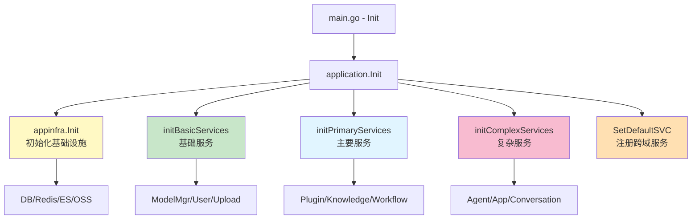

### 8.2 依赖关系代码分析

```go
// backend/application/application.go

// 第一阶段：基础设施
func initBasicServices(ctx context.Context, infra *appinfra.AppDependencies, e *eventbusImpl) (*basicServices, error) {
    return &basicServices{
        infra:        infra,  // DB, Redis, OSS, ES...
        eventbus:     e,
        modelMgrSVC:  modelmgr.InitService(infra.OSS),
        connectorSVC: connector.InitService(infra.OSS),
        userSVC:      user.InitService(ctx, infra.DB, infra.OSS, infra.IDGenSVC),
        uploadSVC:    upload.InitService(&upload.UploadComponents{...}),
    }, nil
}

// 第二阶段：主要服务（依赖基础服务）
func initPrimaryServices(ctx context.Context, basicServices *basicServices) (*primaryServices, error) {
    pluginSVC, _ := plugin.InitService(ctx, basicServices.toPluginServiceComponents())
    
    memorySVC := memory.InitService(basicServices.toMemoryServiceComponents())
    
    knowledgeSVC, _ := knowledge.InitService(ctx,
        basicServices.toKnowledgeServiceComponents(memorySVC),
        basicServices.eventbus.resourceEventBus)
    
    workflowSVC, _ := workflow.InitService(ctx,
        basicServices.toWorkflowServiceComponents(pluginSVC, memorySVC, knowledgeSVC))
    
    return &primaryServices{
        basicServices: basicServices,
        pluginSVC:     pluginSVC,
        memorySVC:     memorySVC,
        knowledgeSVC:  knowledgeSVC,
        workflowSVC:   workflowSVC,
    }, nil
}

// 第三阶段：复杂服务（依赖主要服务）
func initComplexServices(ctx context.Context, p *primaryServices) (*complexServices, error) {
    singleAgentSVC, _ := singleagent.InitService(p.toSingleAgentServiceComponents())
    
    appSVC, _ := app.InitService(p.toAPPServiceComponents())
    
    conversationSVC := conversation.InitService(p.toConversationComponents(singleAgentSVC))
    
    return &complexServices{
        primaryServices: p,
        singleAgentSVC:  singleAgentSVC,
        appSVC:          appSVC,
        conversationSVC: conversationSVC,
    }, nil
}

// 第四阶段：注册跨域服务（全局单例）
func Init(ctx context.Context) error {
    // ... 前面的初始化 ...
    
    crossworkflow.SetDefaultSVC(workflowImpl.InitDomainService(primaryServices.workflowSVC.DomainSVC))
    crossknowledge.SetDefaultSVC(knowledgeImpl.InitDomainService(primaryServices.knowledgeSVC.DomainSVC))
    crossplugin.SetDefaultSVC(pluginImpl.InitDomainService(primaryServices.pluginSVC.DomainSVC, infra.OSS))
    // ...
    
    return nil
}
```

### 8.3 依赖组装模式

**ServiceComponents 模式**：

```go
// 定义组件结构
type WorkflowServiceComponents struct {
    IDGen              idgen.IDGenerator
    DB                 *gorm.DB
    Cache              cache.Cache
    Tos                storage.Storage
    PluginDomainSVC    plugin.Service
    KnowledgeDomainSVC knowledge.Service
    DatabaseDomainSVC  database.Service
    // ...
}

// 在 basicServices 中组装
func (b *basicServices) toWorkflowServiceComponents(...) *WorkflowServiceComponents {
    return &WorkflowServiceComponents{
        IDGen:              b.infra.IDGenSVC,
        DB:                 b.infra.DB,
        Cache:              b.infra.CacheCli,
        Tos:                b.infra.OSS,
        PluginDomainSVC:    pluginSVC.DomainSVC,
        KnowledgeDomainSVC: knowledgeSVC.DomainSVC,
        DatabaseDomainSVC:  memorySVC.DatabaseDomainSVC,
    }
}
```

**优势**：
- ✅ 依赖关系清晰
- ✅ 易于测试（可注入 Mock）
- ✅ 避免循环依赖

---

## 9. 设计模式与最佳实践

### 9.1 核心设计模式

#### 9.1.1 仓储模式（Repository Pattern）

**定义**：
```go
// 接口定义在 Domain 层
type Repository interface {
    CreateMeta(ctx context.Context, meta *vo.Meta) (int64, error)
    GetEntity(ctx context.Context, policy *vo.GetPolicy) (*entity.Workflow, error)
    Delete(ctx context.Context, id int64) error
}

// 实现在 Domain Internal 层
type repositoryImpl struct {
    db    *gorm.DB
    cache cache.Cache
}

func (r *repositoryImpl) GetEntity(ctx context.Context, policy *vo.GetPolicy) (*entity.Workflow, error) {
    // 1. 尝试从缓存获取
    cacheKey := fmt.Sprintf("workflow:%d:%s", policy.ID, policy.QType)
    if cached, ok := r.cache.Get(cacheKey); ok {
        return cached.(*entity.Workflow), nil
    }
    
    // 2. 从数据库查询
    wf := &entity.Workflow{}
    r.db.Where("id = ?", policy.ID).First(wf)
    
    // 3. 写入缓存
    r.cache.Set(cacheKey, wf, 10*time.Minute)
    
    return wf, nil
}
```

#### 9.1.2 策略模式（Strategy Pattern）

**Workflow 节点执行策略**：

```go
// 节点执行策略接口
type NodeExecutor interface {
    Execute(ctx context.Context, input map[string]any) (map[string]any, error)
}

// LLM 节点执行器
type LLMExecutor struct {
    config *LLMConfig
    model  ChatModel
}

func (e *LLMExecutor) Execute(ctx context.Context, input map[string]any) (map[string]any, error) {
    return e.model.Chat(ctx, input)
}

// Plugin 节点执行器
type PluginExecutor struct {
    config *PluginConfig
    plugin *Plugin
}

func (e *PluginExecutor) Execute(ctx context.Context, input map[string]any) (map[string]any, error) {
    return e.plugin.Invoke(ctx, input)
}
```

#### 9.1.3 建造者模式（Builder Pattern）

**Model Builder**：

```go
type ChatModelBuilder struct {
    provider string
    model    string
    apiKey   string
    options  map[string]any
}

func NewChatModelBuilder() *ChatModelBuilder {
    return &ChatModelBuilder{options: make(map[string]any)}
}

func (b *ChatModelBuilder) Provider(provider string) *ChatModelBuilder {
    b.provider = provider
    return b
}

func (b *ChatModelBuilder) Model(model string) *ChatModelBuilder {
    b.model = model
    return b
}

func (b *ChatModelBuilder) Build() (ChatModel, error) {
    switch b.provider {
    case "openai":
        return NewOpenAIChatModel(b.model, b.apiKey, b.options)
    case "claude":
        return NewClaudeChatModel(b.model, b.apiKey, b.options)
    default:
        return nil, fmt.Errorf("unsupported provider: %s", b.provider)
    }
}
```

#### 9.1.4 观察者模式（Observer Pattern）

**EventBus 实现**：

```go
// 事件总线
type EventBus interface {
    Publish(ctx context.Context, event Event) error
    Subscribe(eventType EventType, handler EventHandler) error
}

// 资源事件
type ResourceEvent struct {
    Type       EventType   // CREATE/UPDATE/DELETE
    ResourceID int64
    ResourceType string
}

// 订阅者
knowledge.InitService(...).Subscribe(ResourceEventDeleted, func(e ResourceEvent) {
    if e.ResourceType == "workflow" {
        // 清理知识库中的 Workflow 引用
        knowledge.CleanupWorkflowReference(e.ResourceID)
    }
})
```

### 9.2 最佳实践

#### 9.2.1 错误处理

**统一错误包装**：

```go
// backend/pkg/errorx/errorx.go
type Error struct {
    Code    int32
    Message string
    Detail  map[string]any
}

// Workflow 领域错误
var (
    ErrWorkflowNotFound      = errorx.New(404001, "workflow not found")
    ErrWorkflowExecuteFail   = errorx.New(500001, "workflow execute failed")
    ErrInvalidWorkflowSchema = errorx.New(400001, "invalid workflow schema")
)

// 使用示例
func (s *Service) Get(ctx context.Context, id int64) (*entity.Workflow, error) {
    wf, err := s.repo.GetEntity(ctx, id)
    if err != nil {
        return nil, ErrWorkflowNotFound.WithDetail("id", id).WithCause(err)
    }
    return wf, nil
}
```

#### 9.2.2 日志规范

```go
// 使用结构化日志
logs.CtxInfof(ctx, "workflow execute start, workflow_id=%d, execute_id=%s", wfID, executeID)

logs.CtxWarnf(ctx, "node execute slow, node_key=%s, duration=%dms", nodeKey, duration)

logs.CtxErrorf(ctx, "workflow execute failed, workflow_id=%d, error=%v", wfID, err)
```

#### 9.2.3 Context 管理

```go
// 使用 Context 传递请求级别数据
type contextKey string

const (
    userIDKey   contextKey = "user_id"
    spaceIDKey  contextKey = "space_id"
)

// 设置
ctx = context.WithValue(ctx, userIDKey, userID)

// 获取
userID := ctx.Value(userIDKey).(int64)
```

#### 9.2.4 并发安全

```go
// 使用 safego 包装 goroutine
import "github.com/coze-dev/coze-studio/backend/pkg/safego"

safego.Go(ctx, func() {
    // 自动 recover panic
    doSomething()
})
```

---

## 10. 总结与展望

### 10.1 架构优势

| 优势 | 说明 |
|------|------|
| **清晰分层** | 六层架构，职责明确，易于理解和维护 |
| **DDD 实践** | 领域模型清晰，业务逻辑内聚 |
| **依赖倒置** | 核心逻辑不依赖基础设施，易于测试 |
| **跨域解耦** | CrossDomain 层解决循环依赖 |
| **高性能** | Hertz + Golang，支持高并发 |
| **可扩展** | 插件化设计，易于添加新功能 |

### 10.2 核心技术亮点

1. **Eino Workflow 引擎集成**
   - 灵活的节点编排
   - Checkpoint 支持中断恢复
   - 流式输出

2. **完整的 RAG 实现**
   - 向量检索
   - Reranker 优化
   - 多知识库融合

3. **强大的插件系统**
   - HTTP/Code/System 多种类型
   - 统一的 Tool 接口
   - 动态加载

4. **事件驱动架构**
   - 实时事件流
   - 解耦的事件订阅
   - 支持 SSE

### 10.3 可优化点

1. **性能优化**
   - 增加更多缓存层
   - 数据库查询优化
   - 异步处理优化

2. **可观测性**
   - 增加分布式追踪（Tracing）
   - Metrics 收集
   - 更详细的日志

3. **测试覆盖**
   - 增加单元测试
   - 集成测试
   - 性能测试

### 10.4 学习建议

对于想要深入学习 Coze Studio 源码的开发者：

1. **从 Workflow 开始**：Workflow 是核心，理解它就理解了整体架构
2. **理解 DDD 概念**：Entity、VO、Repository、Domain Service
3. **熟悉 Eino 框架**：AI Workflow 的运行时基础
4. **阅读单元测试**：测试代码是最好的使用示例
5. **调试跟踪**：设置断点，完整走一遍 Workflow 执行流程

---

## 附录

### A. 关键文件索引

| 文件路径 | 说明 |
|---------|------|
| `backend/main.go` | 程序入口，HTTP 服务器启动 |
| `backend/api/handler/coze/workflow_service.go` | Workflow HTTP Handler (OpenAPIRunFlow等) |
| `backend/api/router/register.go` | 路由注册 |
| `backend/application/application.go` | 服务初始化，依赖注入 |
| `backend/application/workflow/workflow.go` | Workflow 应用服务 (OpenAPIRun等) |
| `backend/domain/workflow/interface.go` | Workflow 领域接口定义 |
| `backend/domain/workflow/service/executable_impl.go` | Workflow 执行实现 (SyncExecute/AsyncExecute) |
| `backend/domain/workflow/internal/compose/workflow.go` | Workflow 编排引擎，基于 Eino |
| `backend/domain/workflow/internal/nodes/llm/llm.go` | LLM 节点实现 |
| `backend/domain/workflow/internal/execute/event_handle.go` | 事件处理 |
| `backend/crossdomain/workflow/contract.go` | 跨域服务接口 |

### B. 环境变量配置

```bash
# 数据库
DB_HOST=localhost
DB_PORT=3306
DB_USER=root
DB_PASSWORD=password
DB_NAME=coze_studio

# Redis
REDIS_ADDR=localhost:6379
REDIS_PASSWORD=

# 服务配置
LISTEN_ADDR=:8888
LOG_LEVEL=info

# OSS
OSS_ENDPOINT=
OSS_ACCESS_KEY=
OSS_SECRET_KEY=
```

### C. 常用命令

```bash
# 启动服务
make web

# 构建
make build

# 运行测试
go test ./backend/domain/workflow/... -v

# 代码生成（Mock）
go generate ./backend/domain/...
```

---

**END OF DOCUMENT**

> 本文档基于 Coze Studio 源码深度分析编写，旨在帮助开发者快速理解后端架构和核心实现。
> 如有疑问或发现错误，欢迎提 Issue 或 PR。

