# Coze Studio 源码分析（二）：插件架构深度分析

## 目录

- [Coze Studio 源码分析（二）：插件架构深度分析](#coze-studio-源码分析二插件架构深度分析)
  - [目录](#目录)
  - [1. 插件架构概述](#1-插件架构概述)
    - [1.1 插件系统定位](#11-插件系统定位)
    - [1.2 核心概念](#12-核心概念)
      - [Plugin（插件）](#plugin插件)
      - [Tool（工具/API）](#tool工具api)
      - [Manifest（清单）](#manifest清单)
    - [1.3 架构分层设计](#13-架构分层设计)
  - [2. 插件类型体系](#2-插件类型体系)
    - [2.1 插件类型定义](#21-插件类型定义)
    - [2.2 插件类型对比](#22-插件类型对比)
      - [OpenAPI Plugin（HTTP 插件）](#openapi-pluginhttp-插件)
      - [MCP Plugin（MCP 插件）](#mcp-pluginmcp-插件)
      - [Custom Plugin（自定义插件）](#custom-plugin自定义插件)
  - [3. 后端插件加载流程](#3-后端插件加载流程)
    - [3.1 初始化流程](#31-初始化流程)
      - [1. 应用层初始化](#1-应用层初始化)
      - [2. 插件服务初始化](#2-插件服务初始化)
      - [3. 配置初始化](#3-配置初始化)
    - [3.2 插件产品元数据加载](#32-插件产品元数据加载)
    - [3.3 OpenAPI 文档解析](#33-openapi-文档解析)
    - [3.4 插件注册与缓存](#34-插件注册与缓存)
  - [4. 插件执行流程](#4-插件执行流程)
    - [4.1 执行场景](#41-执行场景)
    - [4.2 统一执行入口与完整执行流程](#42-统一执行入口与完整执行流程)
      - [4.2.1 执行场景示例](#421-执行场景示例)
      - [4.2.2 完整执行流程详解](#422-完整执行流程详解)
      - [4.2.3 核心代码流程](#423-核心代码流程)
      - [4.2.4 执行流程图总结](#424-执行流程图总结)
      - [4.2.5 关键差异对比](#425-关键差异对比)
      - [4.2.6 执行上下文传递](#426-执行上下文传递)
      - [ExecuteTool 主流程](#executetool-主流程)
      - [buildToolExecutor 详细实现](#buildtoolexecutor-详细实现)
      - [getWorkflowPluginInfo 示例（Workflow 场景）](#getworkflowplugininfo-示例workflow-场景)
    - [4.3 HTTP 插件执行流程](#43-http-插件执行流程)
      - [HTTP 执行器主流程](#http-执行器主流程)
      - [buildHTTPRequest 详细实现](#buildhttprequest-详细实现)
      - [buildHTTPRequestURL 详细实现](#buildhttprequesturl-详细实现)
      - [buildRequestBody 详细实现](#buildrequestbody-详细实现)
      - [buildHTTPRequestHeader 详细实现](#buildhttprequestheader-详细实现)
      - [NewInvocationArgs 参数构建流程](#newinvocationargs-参数构建流程)
      - [groupedKeysByLocation 参数分组](#groupedkeysbylocation-参数分组)
      - [groupedRequestArgs 参数分组](#groupedrequestargs-参数分组)
      - [setCommonParams 公共参数注入](#setcommonparams-公共参数注入)
      - [setDefaultValues 默认值注入](#setdefaultvalues-默认值注入)
      - [getDefaultValue 变量引用支持](#getdefaultvalue-变量引用支持)
    - [4.4 MCP 插件执行流程](#44-mcp-插件执行流程)
    - [4.5 Custom 插件执行流程](#45-custom-插件执行流程)
  - [5. 前端访问插件](#5-前端访问插件)
    - [5.1 API 接口层](#51-api-接口层)
    - [5.2 插件开发界面](#52-插件开发界面)
      - [前端 API 调用流程](#前端-api-调用流程)
      - [后端 Handler 处理流程](#后端-handler-处理流程)
      - [工具调试执行流程](#工具调试执行流程)
    - [5.3 Workflow 中的插件节点](#53-workflow-中的插件节点)
      - [ExecutePlugin 详细实现](#executeplugin-详细实现)
      - [toolExecutor.execute 详细实现](#toolexecutorexecute-详细实现)
      - [newToolInvocation 工厂方法](#newtoolinvocation-工厂方法)
  - [6. 插件认证与授权](#6-插件认证与授权)
    - [6.1 认证类型](#61-认证类型)
    - [6.2 OAuth 流程](#62-oauth-流程)
  - [7. 插件与 Workflow 集成](#7-插件与-workflow-集成)
    - [7.1 插件节点配置](#71-插件节点配置)
    - [7.2 执行上下文传递](#72-执行上下文传递)
      - [processResponse 响应处理详细实现](#processresponse-响应处理详细实现)
      - [processWithInvalidRespProcessStrategyOfReturnDefault 示例](#processwithinvalidrespprocessstrategyofreturndefault-示例)
  - [8. 总结](#8-总结)
    - [8.1 架构特点](#81-架构特点)
    - [8.2 关键设计模式](#82-关键设计模式)
    - [8.3 扩展点](#83-扩展点)
    - [8.4 性能优化](#84-性能优化)
    - [8.5 最佳实践](#85-最佳实践)
  - [附录](#附录)
    - [A. 关键文件清单](#a-关键文件清单)
    - [B. 相关文档](#b-相关文档)

---

## 1. 插件架构概述

### 1.1 插件系统定位

Coze Studio 的插件系统是连接 AI 模型与外部服务的桥梁，允许 AI 通过 **Function Calling** 的方式调用外部工具和服务。插件系统本质上是对外部 API 的标准化封装，使 LLM 能够：

- 🔍 **获取实时数据**：搜索、天气、新闻等
- 🛠️ **执行操作**：发送邮件、创建文件、远程命令执行等
- 🔗 **集成第三方服务**：数据库、云服务、MCP 服务器等

### 1.2 核心概念

#### Plugin（插件）
- **定义**：一个插件代表一个外部服务或功能集合
- **组成**：包含多个 Tool（工具/API）
- **元数据**：包含名称、描述、图标、认证信息等

#### Tool（工具/API）
- **定义**：插件中的一个具体功能接口
- **描述**：基于 OpenAPI 3.0 规范定义
- **参数**：支持 Header、Path、Query、Body 等多种参数位置

#### Manifest（清单）
- **定义**：插件的配置清单，描述插件的元信息和 API 配置
- **内容**：包含插件类型、认证方式、公共参数等

### 1.3 架构分层设计

Coze Studio 插件系统采用分层架构设计，遵循 DDD（领域驱动设计）原则：

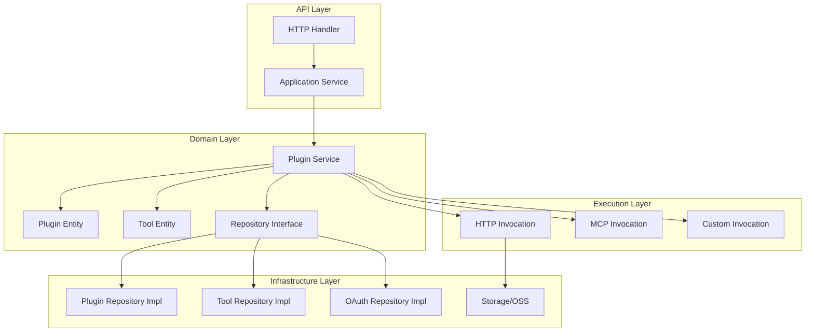

**关键目录结构**：

```
backend/
├── api/                    # API 层
│   └── handler/            # HTTP 处理器
├── application/            # 应用层
│   └── plugin/            # 插件应用服务
├── domain/                 # 领域层
│   └── plugin/
│       ├── entity/         # 实体定义
│       ├── service/        # 领域服务
│       │   └── tool/       # 工具执行实现
│       ├── repository/     # 仓储接口
│       └── conf/           # 配置加载
└── crossdomain/            # 跨域层
    └── plugin/             # 插件跨域接口
```

---

## 2. 插件类型体系

### 2.1 插件类型定义

Coze Studio 支持三种插件类型，定义在 `backend/crossdomain/plugin/consts/consts.go`：

```go
type PluginType string

const (
    PluginTypeOfCloud  PluginType = "openapi"              // HTTP/RESTful API
    PluginTypeOfMCP    PluginType = "coze-studio-mcp"      // Model Context Protocol
    PluginTypeOfCustom  PluginType = "coze-studio-custom"  // 自定义内部逻辑
)
```

### 2.2 插件类型对比

| 类型 | 常量值 | 描述 | 使用场景 | 执行方式 |
|------|--------|------|----------|----------|
| **OpenAPI Plugin** | `openapi` | 标准 HTTP RESTful API | 传统 Web API 集成 | HTTP 请求 |
| **MCP Plugin** | `coze-studio-mcp` | Model Context Protocol | 连接 MCP 服务器、实时数据源 | MCP 协议调用 |
| **Custom Plugin** | `coze-studio-custom` | 自定义内部逻辑 | 内置功能、特殊处理 | 注册的自定义处理器 |

#### OpenAPI Plugin（HTTP 插件）

- **特点**：基于 OpenAPI 3.0 规范
- **执行**：通过 HTTP 客户端发送 RESTful 请求
- **认证**：支持 OAuth、API Key、Service Token 等
- **适用**：大多数第三方 Web API

#### MCP Plugin（MCP 插件）

- **特点**：基于 Model Context Protocol
- **执行**：通过 MCP 客户端调用工具
- **配置**：在 Manifest 的 `api.extensions.mcp_config` 中配置
- **适用**：需要实时连接、流式数据的场景

#### Custom Plugin（自定义插件）

- **特点**：内部自定义逻辑
- **执行**：通过注册的自定义处理器
- **注册**：使用 `tool.RegisterCustomTool()` 注册
- **适用**：系统内置功能、特殊业务逻辑

---

## 3. 后端插件加载流程

### 3.1 初始化流程

插件系统的初始化在应用启动时进行，流程如下：

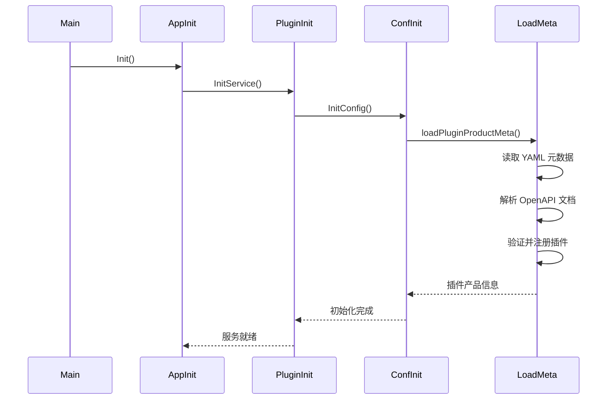

**关键代码路径**：

1. **应用初始化**：`backend/application/application.go::Init()`
2. **插件服务初始化**：`backend/application/plugin/init.go::InitService()`
3. **配置初始化**：`backend/domain/plugin/conf/config.go::InitConfig()`
4. **元数据加载**：`backend/domain/plugin/conf/load_plugin.go::loadPluginProductMeta()`

**核心代码详解**：

#### 1. 应用层初始化

```go
// backend/application/application.go
func Init(ctx context.Context) (err error) {
    // ... 其他初始化 ...
    
    // 初始化主服务（包含插件服务）
    primaryServices, err := initPrimaryServices(ctx, basicServices)
    if err != nil {
        return fmt.Errorf("Init - initPrimaryServices failed, err: %v", err)
    }
    
    // ...
}

func initPrimaryServices(ctx context.Context, basicServices *basicServices) (*primaryServices, error) {
    // 初始化插件服务
    pluginSVC, err := plugin.InitService(ctx, basicServices.toPluginServiceComponents())
    if err != nil {
        return nil, err
    }
    
    // ...
    return &primaryServices{
        pluginSVC: pluginSVC,
        // ...
    }, nil
}
```

#### 2. 插件服务初始化

```go
// backend/application/plugin/init.go
func InitService(ctx context.Context, components *ServiceComponents) (*PluginApplicationService, error) {
    // 1. 初始化插件配置（加载产品元数据）
    err := conf.InitConfig(ctx)
    if err != nil {
        return nil, err
    }
    
    // 2. 创建仓储实现
    toolRepo := repository.NewToolRepo(&repository.ToolRepoComponents{
        IDGen: components.IDGen,
        DB:    components.DB,
    })
    
    pluginRepo := repository.NewPluginRepo(&repository.PluginRepoComponents{
        IDGen: components.IDGen,
        DB:    components.DB,
    })
    
    oauthRepo := repository.NewOAuthRepo(&repository.OAuthRepoComponents{
        IDGen: components.IDGen,
        DB:    components.DB,
    })
    
    // 3. 创建领域服务
    pluginSVC := service.NewService(&service.Components{
        IDGen:      components.IDGen,
        DB:         components.DB,
        OSS:        components.OSS,
        PluginRepo: pluginRepo,
        ToolRepo:   toolRepo,
        OAuthRepo:  oauthRepo,
    })
    
    // 4. 检查产品插件 ID 是否与数据库中的草稿插件冲突
    err = checkIDExist(ctx, pluginSVC)
    if err != nil {
        return nil, err
    }
    
    // 5. 组装应用服务
    PluginApplicationSVC.DomainSVC = pluginSVC
    PluginApplicationSVC.eventbus = components.EventBus
    PluginApplicationSVC.oss = components.OSS
    PluginApplicationSVC.userSVC = components.UserSVC
    PluginApplicationSVC.pluginRepo = pluginRepo
    PluginApplicationSVC.toolRepo = toolRepo
    
    return PluginApplicationSVC, nil
}

// 检查产品插件 ID 是否已存在于数据库中
func checkIDExist(ctx context.Context, pluginService service.PluginService) error {
    // 获取所有产品插件
    pluginProducts := conf.GetAllPluginProducts()
    
    pluginIDs := make([]int64, 0, len(pluginProducts))
    var toolIDs []int64
    for _, p := range pluginProducts {
        pluginIDs = append(pluginIDs, p.Info.ID)
        toolIDs = append(toolIDs, p.ToolIDs...)
    }
    
    // 检查插件 ID 是否冲突
    pluginInfos, err := pluginService.MGetDraftPlugins(ctx, pluginIDs)
    if err != nil {
        return err
    }
    if len(pluginInfos) > 0 {
        // 发现冲突，返回错误
        conflictsIDs := make([]int64, 0, len(pluginInfos))
        for _, p := range pluginInfos {
            conflictsIDs = append(conflictsIDs, p.ID)
        }
        return errorx.New(errno.ErrPluginIDExist, ...)
    }
    
    // 检查工具 ID 是否冲突
    tools, err := pluginService.MGetDraftTools(ctx, toolIDs)
    if err != nil {
        return err
    }
    if len(tools) > 0 {
        // 发现冲突，返回错误
        conflictsIDs := make([]int64, 0, len(tools))
        for _, t := range tools {
            conflictsIDs = append(conflictsIDs, t.ID)
        }
        return errorx.New(errno.ErrToolIDExist, ...)
    }
    
    return nil
}
```

#### 3. 配置初始化

```go
// backend/domain/plugin/conf/config.go
func InitConfig(ctx context.Context) (err error) {
    // 1. 获取当前工作目录
    cwd, err := os.Getwd()
    if err != nil {
        logs.Warnf("[InitConfig] Failed to get current working directory: %v", err)
        cwd = os.Getenv("PWD")
    }
    
    // 2. 构建插件配置路径
    basePath := path.Join(cwd, "resources", "conf", "plugin")
    logs.CtxInfof(ctx, "basePath=%s", basePath)
    
    // 3. 加载插件产品元数据
    err = loadPluginProductMeta(ctx, basePath)
    if err != nil {
        return err
    }
    
    // 4. 加载 OAuth Schema
    err = loadOAuthSchema(ctx, basePath)
    if err != nil {
        return err
    }
    
    return nil
}
```

### 3.2 插件产品元数据加载

插件产品元数据存储在 `backend/conf/plugin/pluginproduct/` 目录下，采用 YAML 格式：

**元数据结构**：

```yaml
plugin_id: 1001                    # 插件 ID
deprecated: false                   # 是否已废弃
version: "1.0.0"                    # 版本号（需符合 semver）
plugin_type: PLUGIN                 # 插件类型
openapi_doc_file: "weather.yaml"    # OpenAPI 文档文件名
manifest:                           # 插件清单
  api:
    type: "openapi"                 # API 类型
    url: "https://api.example.com"  # 服务器 URL
  name_for_human: "天气插件"        # 显示名称
tools:                              # 工具列表
  - tool_id: 2001                   # 工具 ID
    deprecated: false               # 是否已废弃
    method: "GET"                   # HTTP 方法
    sub_url: "/weather"             # 子路径
```

**加载流程**：

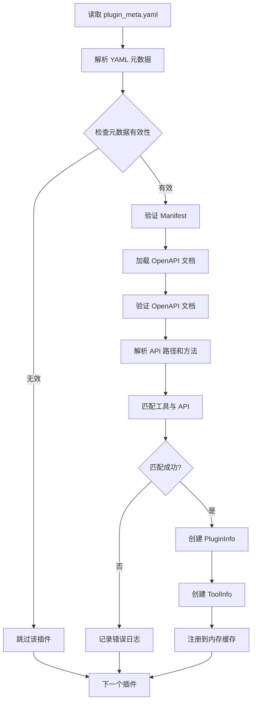

**关键代码**：`backend/domain/plugin/conf/load_plugin.go`

```go
func loadPluginProductMeta(ctx context.Context, basePath string) (err error) {
    // 1. 读取元数据文件
    metaFile := path.Join(root, "plugin_meta.yaml")
    file, err := os.ReadFile(metaFile)
    
    // 2. 解析 YAML
    var pluginsMeta []*pluginProductMeta
    err = yaml.Unmarshal(file, &pluginsMeta)
    
    // 3. 遍历每个插件元数据
    for _, m := range pluginsMeta {
        // 4. 检查元数据有效性
        if !checkPluginMetaInfo(ctx, m) {
            continue
        }
        
        // 5. 验证 Manifest
        err = m.Manifest.Validate(true)
        
        // 6. 加载 OpenAPI 文档
        docPath := path.Join(root, m.OpenapiDocFile)
        loader := openapi3.NewLoader()
        _doc, err := loader.LoadFromFile(docPath)
        
        // 7. 验证 OpenAPI 文档
        err = doc.Validate(ctx)
        
        // 8. 创建 PluginInfo
        pi := &PluginInfo{
            Info: &model.PluginInfo{
                ID:         m.PluginID,
                PluginType: m.PluginType,
                Version:    ptr.Of(m.Version),
                ServerURL:  ptr.Of(doc.Servers[0].URL),
                Manifest:   m.Manifest,
                OpenapiDoc: doc,
            },
            ToolIDs: make([]int64, 0, len(m.Tools)),
        }
        
        // 9. 解析 API 路径和方法
        apis := make(map[dto.UniqueToolAPI]*model.Openapi3Operation)
        for subURL, pathItem := range doc.Paths {
            for method, op := range pathItem.Operations() {
                api := dto.UniqueToolAPI{
                    SubURL: subURL,
                    Method: strings.ToUpper(method),
                }
                apis[api] = model.NewOpenapi3Operation(op)
            }
        }
        
        // 10. 匹配工具与 API
        for _, t := range m.Tools {
            api := dto.UniqueToolAPI{
                SubURL: t.SubURL,
                Method: strings.ToUpper(t.Method),
            }
            op, ok := apis[api]
            if !ok {
                continue
            }
            
            // 11. 创建 ToolInfo
            toolProducts[t.ToolID] = &ToolInfo{
                Info: &entity.ToolInfo{
                    ID:        t.ToolID,
                    PluginID:  m.PluginID,
                    Method:    ptr.Of(t.Method),
                    SubURL:    ptr.Of(t.SubURL),
                    Operation: op,
                },
            }
            
            pi.ToolIDs = append(pi.ToolIDs, t.ToolID)
        }
        
        // 12. 注册到内存缓存
        pluginProducts[m.PluginID] = pi
    }
    
    return nil
}
```

### 3.3 OpenAPI 文档解析

OpenAPI 文档解析使用 `github.com/getkin/kin-openapi` 库：

**解析步骤**：

1. **加载文档**：从文件系统读取 YAML/JSON 格式的 OpenAPI 文档
2. **解析结构**：解析为 `openapi3.T` 结构体
3. **验证规范**：验证文档是否符合 OpenAPI 3.0 规范
4. **提取操作**：提取每个路径的操作（GET、POST 等）
5. **构建 Schema**：构建参数和响应的 Schema 定义

**关键数据结构**：

```go
type PluginInfo struct {
    Info    *model.PluginInfo      // 插件基本信息
    ToolIDs []int64                // 工具 ID 列表
}

type ToolInfo struct {
    Info *entity.ToolInfo          // 工具信息
}

type ToolInfo struct {
    ID              int64
    PluginID        int64
    Version         *string
    Method          *string         // HTTP 方法
    SubURL          *string         // 子路径
    Operation       *model.Openapi3Operation  // OpenAPI 操作定义
    ActivatedStatus *int32
    DebugStatus     *int32
}
```

### 3.4 插件注册与缓存

插件加载完成后，会注册到内存缓存中：

**缓存结构**：

```go
var (
    pluginProducts map[int64]*PluginInfo  // 插件 ID -> PluginInfo
    toolProducts   map[int64]*ToolInfo    // 工具 ID -> ToolInfo
)
```

**访问接口**：

```go
// 获取插件产品信息
func GetPluginProduct(pluginID int64) (*PluginInfo, bool)

// 批量获取插件产品信息
func MGetPluginProducts(pluginIDs []int64) []*PluginInfo

// 获取工具产品信息
func GetToolProduct(toolID int64) (*ToolInfo, bool)

// 批量获取工具产品信息
func MGetToolProducts(toolIDs []int64) []*ToolInfo
```

**特点**：

- ✅ **线程安全**：使用深拷贝返回，避免并发修改
- ✅ **快速访问**：O(1) 时间复杂度
- ✅ **启动时加载**：应用启动时一次性加载，运行时只读

---

## 4. 插件执行流程

### 4.1 执行场景

插件可以在多种场景下执行，定义在 `backend/crossdomain/plugin/consts/consts.go`：

```go
type ExecuteScene string

const (
    ExecSceneOfOnlineAgent ExecuteScene = "online_agent"   // 在线 Agent
    ExecSceneOfDraftAgent ExecuteScene = "draft_agent"    // 草稿 Agent
    ExecSceneOfWorkflow    ExecuteScene = "workflow"      // Workflow
    ExecSceneOfToolDebug   ExecuteScene = "tool_debug"     // 工具调试
)
```

### 4.2 统一执行入口与完整执行流程

所有插件执行都通过 `PluginService.ExecuteTool()` 方法。本节将通过一个完整的 Workflow 示例来详细说明插件执行的端到端流程。

#### 4.2.1 执行场景示例

**Workflow 结构**：
```
开始节点 -> LLM节点（配置新闻插件） -> 新闻插件节点 -> 结束节点
```

**执行流程**：
1. **Workflow 启动**：用户触发 Workflow 执行
2. **LLM 节点执行**：LLM 通过 Function Calling 调用新闻插件
3. **新闻插件节点执行**：直接执行新闻插件获取数据
4. **结果传递**：插件结果传递给后续节点

#### 4.2.2 完整执行流程详解

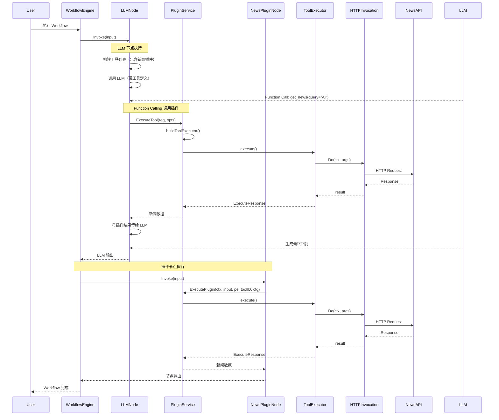

#### 4.2.3 核心代码流程

**阶段一：Workflow 启动与 LLM 节点执行**

```go
// backend/domain/workflow/service/service_impl.go
func (s *workflowServiceImpl) SyncExecute(ctx context.Context, config *workflowModel.ExecuteConfig, 
    input map[string]any) (*workflowModel.WorkflowExecution, error) {
    
    // 1. 获取 Workflow 实体
    workflowEntity, err := s.GetWorkflowEntity(ctx, config)
    
    // 2. 解析 Canvas 为 Schema
    schema, err := adaptor.ToSchema(ctx, workflowEntity.Canvas)
    
    // 3. 编译 Workflow
    runner, err := compose.NewWorkflow(schema)
    
    // 4. 执行 Workflow（触发节点执行）
    output, err := runner.Invoke(ctx, input)
    
    return &workflowModel.WorkflowExecution{
        Output: output,
    }, nil
}
```

**阶段二：LLM 节点执行（Function Calling）**

```go
// backend/domain/workflow/internal/nodes/llm/llm.go
func (l *LLM) Invoke(ctx context.Context, in map[string]any, opts ...nodes.NodeOption) (out map[string]any, err error) {
    // 1. 准备执行选项
    composeOpts, resumingEvent, err := l.prepare(ctx, in, opts...)
    
    // 2. 构建工具列表（包含新闻插件）
    tools := []tool.InvokableTool{}
    if l.c.FCParam != nil && l.c.FCParam.PluginFCParam != nil {
        // 2.1 构建插件工具请求
        pluginToolsInvokableReq := make(map[int64]*wrapPlugin.ToolsInvokableRequest)
        for _, p := range l.c.FCParam.PluginFCParam.PluginList {
            pid, _ := strconv.ParseInt(p.PluginID, 10, 64)
            toolID, _ := strconv.ParseInt(p.ApiId, 10, 64)
            
            // 2.2 创建插件工具请求
            if req, ok := pluginToolsInvokableReq[pid]; ok {
                req.ToolsInvokableInfo[toolID] = &wrapPlugin.ToolsInvokableInfo{
                    ToolID: toolID,
                    RequestAPIParametersConfig:  p.FCSetting.RequestParameters,
                    ResponseAPIParametersConfig: p.FCSetting.ResponseParameters,
                }
            } else {
                pluginToolsInvokableReq[pid] = &wrapPlugin.ToolsInvokableRequest{
                    PluginEntity: vo.PluginEntity{
                        PluginID:      pid,
                        PluginVersion: ptr.Of(p.PluginVersion),
                        PluginFrom:    p.PluginFrom,
                    },
                    ToolsInvokableInfo: map[int64]*wrapPlugin.ToolsInvokableInfo{
                        toolID: {
                            ToolID: toolID,
                            RequestAPIParametersConfig:  p.FCSetting.RequestParameters,
                            ResponseAPIParametersConfig: p.FCSetting.ResponseParameters,
                        },
                    },
                }
            }
        }
        
        // 2.3 获取插件工具列表
        for pid, req := range pluginToolsInvokableReq {
            pluginTools, err := wrapPlugin.GetPluginToolsInvokable(ctx, pid, req)
            if err != nil {
                return nil, err
            }
            
            // 2.4 转换为 eino Tool 接口
            for _, pt := range pluginTools {
                tools = append(tools, newInvokableTool(pt))
            }
        }
    }
    
    // 3. 配置工具回调处理器
    if len(tools) > 0 {
        toolCallbackHandler := &callbacks2.ToolCallbackHandler{
            OnStart: func(ctx context.Context, info *callbacks.RunInfo, input *tool.CallbackInput) context.Context {
                // 发送 Tool Start 事件（用于实时流式输出）
                toolCallID := compose.GetToolCallID(ctx)
                logs.Infof("Tool Start: ID=%s, tool=%s, arguments=%s", 
                    toolCallID, info.Name, input.ArgumentsInJSON)
                
                // 发送 SSE 事件给前端
                if llmRef != nil && llmRef.realtimeWriter != nil {
                    dataMsg := &entity.DataMessage{
                        Type:      entity.FunctionCall,
                        Role:      schema.Assistant,
                        NodeType:  entity.NodeTypeLLM,
                        FunctionCall: &entity.FunctionCallInfo{
                            FunctionInfo: entity.FunctionInfo{
                                Name: info.Name,
                                Type: entity.PluginTool,
                            },
                            CallID:    toolCallID,
                            Arguments: parseArguments(input.ArgumentsInJSON),
                        },
                    }
                    llmRef.realtimeWriter.Send(&entity.Message{DataMessage: dataMsg}, nil)
                }
                
                return ctx
            },
            OnEnd: func(ctx context.Context, info *callbacks.RunInfo, output *tool.CallbackOutput) context.Context {
                // 发送 Tool End 事件
                logs.Infof("Tool End: ID=%s, tool=%s, output=%s", 
                    compose.GetToolCallID(ctx), info.Name, output.OutputInJSON)
                
                // 发送 SSE 事件给前端
                if llmRef != nil && llmRef.realtimeWriter != nil {
                    dataMsg := &entity.DataMessage{
                        Type:      entity.FunctionResult,
                        Role:      schema.Tool,
                        NodeType:  entity.NodeTypeLLM,
                        FunctionCall: &entity.FunctionCallInfo{
                            CallID: compose.GetToolCallID(ctx),
                            Result: output.OutputInJSON,
                        },
                    }
                    llmRef.realtimeWriter.Send(&entity.Message{DataMessage: dataMsg}, nil)
                }
                
                return ctx
            },
        }
        composeOpts = append(composeOpts, compose.WithCallbacks(toolCallbackHandler))
    }
    
    // 4. 调用 LLM（带工具）
    out, err = l.r.Invoke(ctx, in, composeOpts...)
    
    return out, nil
}
```

**阶段三：插件工具执行（Function Calling 场景）**

```go
// backend/domain/workflow/internal/nodes/llm/plugin.go
func (p pluginInvokableTool) InvokableRun(ctx context.Context, argumentsInJSON string, opts ...tool.Option) (string, error) {
    // 1. 获取执行配置
    execCfg := execute.GetExecuteConfig(opts...)
    
    // 2. 调用插件服务
    return p.pluginInvokableTool.PluginInvoke(ctx, argumentsInJSON, execCfg)
}

// backend/crossdomain/plugin/model/plugin.go
func (p *InvokableTool) PluginInvoke(ctx context.Context, argumentsInJSON string, 
    execCfg workflowModel.ExecuteConfig) (string, error) {
    
    // 1. 构建执行请求
    var uID string
    if execCfg.AgentID != nil {
        uID = execCfg.ConnectorUID
    } else {
        uID = conv.Int64ToStr(execCfg.Operator)
    }
    
    req := &model.ExecuteToolRequest{
        UserID:          uID,
        PluginID:        p.PluginEntity.PluginID,
        ToolID:          p.ToolID,
        ExecScene:       consts.ExecSceneOfWorkflow,  // Function Calling 场景也是 Workflow
        ArgumentsInJson: argumentsInJSON,
        ExecDraftTool:   p.PluginEntity.PluginVersion == nil || *p.PluginEntity.PluginVersion == "0",
        PluginFrom:      p.PluginEntity.PluginFrom,
    }
    
    // 2. 执行工具
    resp, err := crossplugin.DefaultSVC().ExecuteTool(ctx, req,
        model.WithInvalidRespProcessStrategy(consts.InvalidResponseProcessStrategyOfReturnDefault),
    )
    if err != nil {
        return "", err
    }
    
    // 3. 返回裁剪后的响应（JSON 字符串）
    return resp.TrimmedResp, nil
}
```

**阶段四：插件节点执行（直接调用场景）**

```go
// backend/domain/workflow/internal/nodes/plugin/plugin.go
func (p *Plugin) Invoke(ctx context.Context, parameters map[string]any) (ret map[string]any, err error) {
    // 1. 获取执行配置
    var exeCfg workflowModel.ExecuteConfig
    if ctxExeCfg := execute.GetExeCtx(ctx); ctxExeCfg != nil {
        exeCfg = ctxExeCfg.ExeCfg
    }
    
    // 2. 执行插件
    result, err := ExecutePlugin(ctx, parameters, &vo.PluginEntity{
        PluginID:      p.pluginID,
        PluginVersion: ptr.Of(p.pluginVersion),
        PluginFrom:    p.pluginFrom,
    }, p.toolID, exeCfg)
    
    if err != nil {
        // 3. 处理中断错误（OAuth 授权）
        if extra, ok := compose.IsInterruptRerunError(err); ok {
            interruptData := extra.(*entity.InterruptEvent).InterruptData
            return nil, vo.NewError(errno.ErrAuthorizationRequired, errorx.KV("extra", interruptData))
        }
        return nil, err
    }
    
    return result, nil
}

// backend/domain/workflow/internal/nodes/plugin/exec.go
func ExecutePlugin(ctx context.Context, input map[string]any, pe *vo.PluginEntity,
    toolID int64, cfg workflowModel.ExecuteConfig) (map[string]any, error) {
    
    // 1. 序列化输入参数
    args, err := sonic.MarshalString(input)
    if err != nil {
        return nil, vo.WrapError(errno.ErrSerializationDeserializationFail, err)
    }
    
    // 2. 确定用户 ID
    var uID string
    if cfg.AgentID != nil {
        uID = cfg.ConnectorUID
    } else {
        uID = conv.Int64ToStr(cfg.Operator)
    }
    
    // 3. 构建执行请求
    req := &model.ExecuteToolRequest{
        UserID:          uID,
        PluginID:        pe.PluginID,
        ToolID:          toolID,
        ExecScene:       consts.ExecSceneOfWorkflow,
        ArgumentsInJson: args,
        ExecDraftTool:   pe.PluginVersion == nil || *pe.PluginVersion == "0",
        PluginFrom:      pe.PluginFrom,
    }
    
    // 4. 执行工具
    r, err := crossplugin.DefaultSVC().ExecuteTool(ctx, req,
        model.WithInvalidRespProcessStrategy(consts.InvalidResponseProcessStrategyOfReturnDefault),
    )
    
    // 5. 处理错误
    if err != nil {
        if extra, ok := compose.IsInterruptRerunError(err); ok {
            // OAuth 授权中断
            pluginTIE, ok := extra.(*model.ToolInterruptEvent)
            if !ok {
                return nil, vo.WrapError(errno.ErrPluginAPIErr, fmt.Errorf("expects ToolInterruptEvent"))
            }
            
            // 创建中断事件
            id, err := workflow.GetRepository().GenID(ctx)
            ie := &entity2.InterruptEvent{
                ID:            id,
                InterruptData: pluginTIE.ToolNeedOAuth.Message,
                EventType:     workflow3.EventType_WorkflowOauthPlugin,
            }
            
            // 返回授权错误
            return nil, vo.NewError(errno.ErrAuthorizationRequired, errorx.KV("extra", ie.InterruptData))
        }
        return nil, err
    }
    
    // 6. 解析响应
    var output map[string]any
    err = sonic.UnmarshalString(r.TrimmedResp, &output)
    if err != nil {
        return nil, vo.WrapError(errno.ErrSerializationDeserializationFail, err)
    }
    
    return output, nil
}
```

**阶段五：统一执行入口（PluginService.ExecuteTool）**

```go
// backend/domain/plugin/service/exec_tool.go
func (p *pluginServiceImpl) ExecuteTool(ctx context.Context, req *model.ExecuteToolRequest, opts ...model.ExecuteToolOpt) (resp *model.ExecuteToolResponse, err error) {
    // 1. 解析执行选项
    opt := &model.ExecuteToolOption{}
    for _, fn := range opts {
        fn(opt)
    }
    
    // 2. 构建工具执行器
    executor, err := p.buildToolExecutor(ctx, req, opt)
    if err != nil {
        return nil, errorx.Wrapf(err, "buildToolExecutor failed")
    }
    
    // 3. 获取认证信息
    authInfo := executor.plugin.GetAuthInfo()
    accessToken, authURL, err := p.acquireAccessTokenIfNeed(ctx, req, authInfo, executor.tool.Operation)
    if err != nil {
        return nil, errorx.Wrapf(err, "acquireAccessToken failed")
    }
    
    // 4. 执行工具
    result, err := executor.execute(ctx, req.ArgumentsInJson, accessToken, authURL)
    if err != nil {
        return nil, errorx.Wrapf(err, "execute tool failed")
    }
    
    // 5. 返回结果
    resp = &model.ExecuteToolResponse{
        Tool:        executor.tool,
        Request:     result.Request,
        RawResp:     result.RawResp,
        TrimmedResp: result.TrimmedResp,
    }
    
    return resp, nil
}
```

#### 4.2.4 执行流程图总结

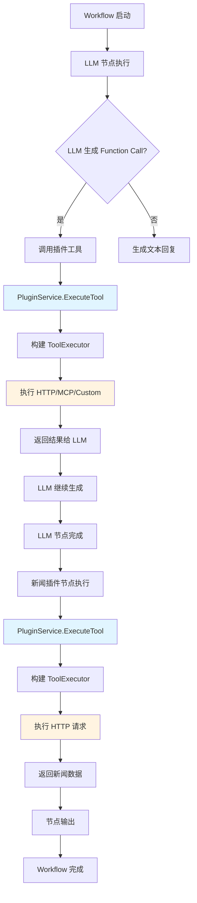

#### 4.2.5 关键差异对比

| 特性 | Function Calling（LLM 节点） | 直接调用（插件节点） |
|------|------------------------------|---------------------|
| **触发方式** | LLM 自动决定是否调用 | Workflow 流程中显式调用 |
| **参数来源** | LLM 根据上下文生成 | 节点输入参数 |
| **执行时机** | LLM 推理过程中 | Workflow 节点执行时 |
| **结果处理** | 返回给 LLM 继续推理 | 作为节点输出传递 |
| **适用场景** | 智能决策、动态调用 | 确定性流程、数据获取 |

#### 4.2.6 执行上下文传递

无论是 Function Calling 还是直接调用，都会传递 Workflow 的执行上下文：

```go
// 执行配置包含的信息
type ExecuteConfig struct {
    AgentID      *int64   // Agent ID（如果来自 Agent）
    Operator     int64     // 操作者 ID
    ConnectorUID string    // 连接器用户 ID（多租户）
    ProjectID    int64     // 项目 ID
    ProjectType  int8      // 项目类型（Agent/Workflow）
    ProjectVersion *string  // 项目版本
}

// 上下文传递路径
Workflow Engine 
  -> Node Runner 
    -> Node Invoke 
      -> PluginService.ExecuteTool 
        -> ToolExecutor.execute
          -> InvocationArgs (包含 ProjectInfo)
            -> HTTP Invocation (添加 Header: X-AIPlugin-Bot-ID)
```

**关键代码**：`backend/domain/plugin/service/tool/invocation_http.go`

```go
func (h *httpCallImpl) buildHTTPRequestHeader(ctx context.Context, args *InvocationArgs) (http.Header, error) {
    header := http.Header{}
    
    // ... 添加用户 Header ...
    
    // 添加项目信息 Header
    if args.ProjectInfo != nil {
        header.Set("X-AIPlugin-Bot-ID", conv.Int64ToStr(args.ProjectInfo.ProjectID))
    }
    
    // 添加会话 ID Header
    if h.ConversationID > 0 {
        header.Set("X-AIPlugin-Conversation-ID", conv.Int64ToStr(h.ConversationID))
    }
    
    return header, nil
}
```

**关键代码**：`backend/domain/plugin/service/exec_tool.go`

#### ExecuteTool 主流程

```go
func (p *pluginServiceImpl) ExecuteTool(ctx context.Context, req *model.ExecuteToolRequest, opts ...model.ExecuteToolOpt) (resp *model.ExecuteToolResponse, err error) {
    // 1. 解析执行选项
    opt := &model.ExecuteToolOption{}
    for _, fn := range opts {
        fn(opt)
    }
    
    // 2. 构建工具执行器（根据执行场景获取插件和工具信息）
    executor, err := p.buildToolExecutor(ctx, req, opt)
    if err != nil {
        return nil, errorx.Wrapf(err, "buildToolExecutor failed")
    }
    
    // 3. 获取认证信息（如果需要 OAuth，会尝试获取 Access Token）
    authInfo := executor.plugin.GetAuthInfo()
    accessToken, authURL, err := p.acquireAccessTokenIfNeed(ctx, req, authInfo, executor.tool.Operation)
    if err != nil {
        return nil, errorx.Wrapf(err, "acquireAccessToken failed")
    }
    
    // 4. 执行工具（调用具体的 Invocation 实现）
    result, err := executor.execute(ctx, req.ArgumentsInJson, accessToken, authURL)
    if err != nil {
        return nil, errorx.Wrapf(err, "execute tool failed")
    }
    
    // 5. 工具调试场景下，更新工具的调试状态
    if req.ExecScene == consts.ExecSceneOfToolDebug {
        err = p.toolRepo.UpdateDraftTool(ctx, &entity.ToolInfo{
            ID:          req.ToolID,
            DebugStatus: ptr.Of(common.APIDebugStatus_DebugPassed),
        })
        if err != nil {
            logs.CtxErrorf(ctx, "UpdateDraftTool failed, tooID=%d, err=%v", req.ToolID, err)
        }
    }
    
    // 6. 自动生成响应 Schema（可选）
    var respSchema openapi3.Responses
    if opt.AutoGenRespSchema {
        respSchema, err = p.genToolResponseSchema(ctx, result.RawResp)
        if err != nil {
            return nil, errorx.Wrapf(err, "genToolResponseSchema failed")
        }
    }
    
    // 7. 构建并返回响应
    resp = &model.ExecuteToolResponse{
        Tool:        executor.tool,      // 工具信息
        Request:     result.Request,     // 请求字符串（用于日志）
        RawResp:     result.RawResp,     // 原始响应
        TrimmedResp: result.TrimmedResp, // 裁剪后的响应（根据 Schema）
        RespSchema:  respSchema,        // 响应 Schema
    }
    
    return resp, nil
}
```

#### buildToolExecutor 详细实现

```go
func (p *pluginServiceImpl) buildToolExecutor(ctx context.Context, req *model.ExecuteToolRequest, opt *model.ExecuteToolOption) (impl *toolExecutor, err error) {
    // 1. 验证用户 ID
    if req.UserID == "" {
        return nil, errorx.New(errno.ErrPluginExecuteToolFailed, errorx.KV(errno.PluginMsgKey, "userID is required"))
    }
    
    var (
        pl *entity.PluginInfo  // 插件信息
        tl *entity.ToolInfo    // 工具信息
    )
    
    // 2. 根据执行场景获取插件和工具信息
    switch req.ExecScene {
    case consts.ExecSceneOfOnlineAgent:
        // 在线 Agent：从版本表获取工具配置
        pl, tl, err = p.getOnlineAgentPluginInfo(ctx, req, opt)
    case consts.ExecSceneOfDraftAgent:
        // 草稿 Agent：从草稿表获取工具配置，并合并 Agent 的自定义配置
        pl, tl, err = p.getDraftAgentPluginInfo(ctx, req, opt)
    case consts.ExecSceneOfToolDebug:
        // 工具调试：从草稿表获取
        pl, tl, err = p.getToolDebugPluginInfo(ctx, req, opt)
    case consts.ExecSceneOfWorkflow:
        // Workflow：根据 ExecDraftTool 标志决定从草稿表还是在线表获取
        pl, tl, err = p.getWorkflowPluginInfo(ctx, req, opt)
    default:
        return nil, fmt.Errorf("invalid execute scene '%s'", req.ExecScene)
    }
    if err != nil {
        return nil, err
    }
    
    // 3. 构建工具执行器
    impl = &toolExecutor{
        execScene:                  req.ExecScene,                    // 执行场景
        userID:                     req.UserID,                      // 用户 ID
        conversationID:             opt.ConversationID,              // 会话 ID（用于 HTTP Header）
        plugin:                     pl,                               // 插件信息
        tool:                       tl,                               // 工具信息
        projectInfo:                opt.ProjectInfo,                 // 项目信息（用于变量引用）
        invalidRespProcessStrategy: opt.InvalidRespProcessStrategy,  // 响应处理策略
        oss:                        p.oss,                            // OSS 存储（用于文件 URI 转换）
    }
    
    // 4. 如果提供了自定义 Operation，使用自定义的（用于 Agent 自定义配置）
    if opt.Operation != nil {
        impl.tool.Operation = opt.Operation
    }
    
    return impl, nil
}
```

#### getWorkflowPluginInfo 示例（Workflow 场景）

```go
func (p *pluginServiceImpl) getWorkflowPluginInfo(ctx context.Context, req *model.ExecuteToolRequest,
    execOpt *model.ExecuteToolOption) (pl *entity.PluginInfo, tl *entity.ToolInfo, err error) {
    
    // 1. 检查是否来自 SaaS
    if req.PluginFrom != nil && *req.PluginFrom == bot_common.PluginFrom_FromSaas {
        // 从 SaaS 获取插件和工具信息
        tools, plugin, err := p.toolRepo.BatchGetSaasPluginToolsInfo(ctx, []int64{req.PluginID})
        // ... 查找对应的工具
        return pl, tl, nil
    }
    
    // 2. 检查是否执行草稿工具
    if req.ExecDraftTool {
        // 从草稿表获取
        pl, exist, err := p.pluginRepo.GetDraftPlugin(ctx, req.PluginID)
        tl, exist, err := p.toolRepo.GetDraftTool(ctx, req.ToolID)
        return pl, tl, nil
    }
    
    // 3. 从在线表获取（支持版本）
    if execOpt.ToolVersion == "" {
        // 获取最新版本
        pl, exist, err := p.pluginRepo.GetOnlinePlugin(ctx, req.PluginID)
        tl, exist, err := p.toolRepo.GetOnlineTool(ctx, req.ToolID)
    } else {
        // 获取指定版本
        pl, exist, err := p.pluginRepo.GetVersionPlugin(ctx, model.VersionPlugin{
            PluginID: req.PluginID,
            Version:  execOpt.ToolVersion,
        })
        tl, exist, err := p.toolRepo.GetVersionTool(ctx, model.VersionTool{
            ToolID:  req.ToolID,
            Version: execOpt.ToolVersion,
        })
    }
    
    return pl, tl, nil
}
```

### 4.3 HTTP 插件执行流程

HTTP 插件通过 `tool.NewHttpCallImpl()` 执行：

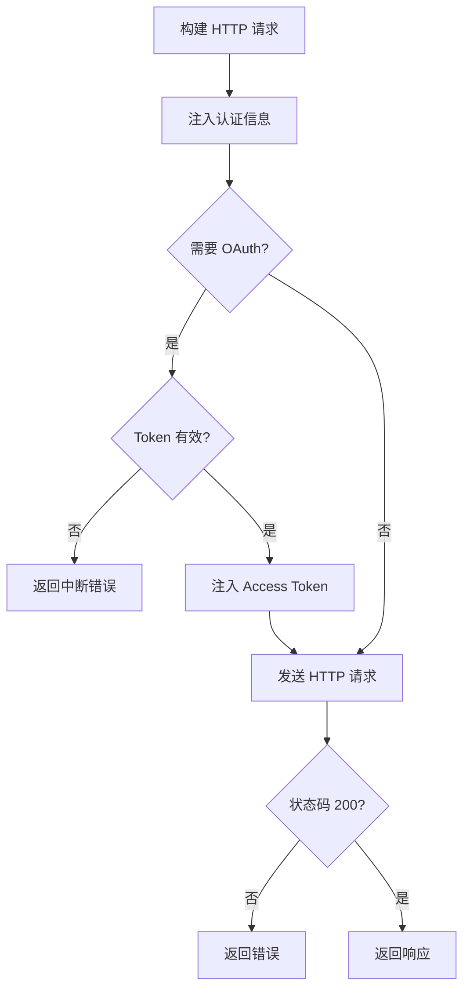

**关键代码**：`backend/domain/plugin/service/tool/invocation_http.go`

#### HTTP 执行器主流程

```go
func (h *httpCallImpl) Do(ctx context.Context, args *InvocationArgs) (request string, resp string, err error) {
    // 1. 构建 HTTP 请求（URL、Header、Body）
    httpReq, err := h.buildHTTPRequest(ctx, args)
    if err != nil {
        return "", "", err
    }
    
    // 2. 注入认证信息（OAuth、Service Token 等）
    errMsg, err := h.injectAuthInfo(ctx, httpReq, args)
    if err != nil {
        return "", "", err
    }
    
    // 3. 如果返回错误消息，说明需要 OAuth 授权
    if errMsg != "" {
        // 创建中断事件，通知调用方需要用户授权
        event := &model.ToolInterruptEvent{
            Event: pluginConsts.InterruptEventTypeOfToolNeedOAuth,
            ToolNeedOAuth: &model.ToolNeedOAuthInterruptEvent{
                Message: errMsg,  // 包含授权 URL 的错误消息
            },
        }
        // 返回中断错误，Workflow 引擎会暂停执行并等待授权
        return "", "", compose.NewInterruptAndRerunErr(event)
    }
    
    // 4. 读取请求体（用于序列化）
    var reqBodyBytes []byte
    if httpReq.GetBody != nil {
        reqBody, err := httpReq.GetBody()
        if err != nil {
            return "", "", err
        }
        defer reqBody.Close()
        reqBodyBytes, err = io.ReadAll(reqBody)
        if err != nil {
            return "", "", err
        }
    }
    
    // 5. 序列化请求（用于日志和返回给调用方）
    requestStr, err := genRequestString(httpReq, reqBodyBytes)
    if err != nil {
        return "", "", err
    }
    
    // 6. 使用 resty 发送 HTTP 请求
    restyReq := defaultHttpCli.NewRequest()
    restyReq.Header = httpReq.Header
    restyReq.Method = httpReq.Method
    restyReq.URL = httpReq.URL.String()
    if reqBodyBytes != nil {
        restyReq.SetBody(reqBodyBytes)
    }
    restyReq.SetContext(ctx)
    
    logs.CtxDebugf(ctx, "[execute] url=%s, header=%s, method=%s, body=%s",
        restyReq.URL, restyReq.Header, restyReq.Method, restyReq.Body)
    
    httpResp, err := restyReq.Send()
    if err != nil {
        return "", "", errorx.New(errno.ErrPluginExecuteToolFailed, 
            errorx.KVf(errno.PluginMsgKey, "http request failed, err=%s", err))
    }
    
    logs.CtxDebugf(ctx, "[execute] status=%s, response=%s", httpResp.Status(), httpResp.String())
    
    // 7. 检查 HTTP 状态码
    if httpResp.StatusCode() != http.StatusOK {
        return "", "", errorx.New(errno.ErrPluginExecuteToolFailed,
            errorx.KVf(errno.PluginMsgKey, "http request failed, status=%s\nresp=%s", 
                httpResp.Status(), httpResp.String()))
    }
    
    // 8. 返回请求字符串和响应字符串
    return requestStr, httpResp.String(), nil
}
```

#### buildHTTPRequest 详细实现

```go
func (h *httpCallImpl) buildHTTPRequest(ctx context.Context, args *InvocationArgs) (httpReq *http.Request, err error) {
    tool := args.Tool
    
    // 1. 构建完整 URL：ServerURL + SubURL
    rawURL := args.ServerURL + tool.GetSubURL()
    
    // 2. 构建请求 URL（替换路径参数，添加查询参数）
    reqURL, err := h.buildHTTPRequestURL(ctx, rawURL, args)
    if err != nil {
        return nil, err
    }
    
    // 3. 构建请求体（根据 Content-Type 编码）
    bodyBytes, contentType, err := h.buildRequestBody(ctx, tool.Operation, args.Body)
    if err != nil {
        return nil, err
    }
    
    // 4. 创建 HTTP 请求
    httpReq, err = http.NewRequestWithContext(ctx, tool.GetMethod(), reqURL.String(), bytes.NewBuffer(bodyBytes))
    if err != nil {
        return nil, err
    }
    
    // 5. 构建请求 Header
    httpReq.Header, err = h.buildHTTPRequestHeader(ctx, args)
    if err != nil {
        return nil, err
    }
    
    // 6. 设置 Content-Type
    if len(bodyBytes) > 0 {
        httpReq.Header.Set("Content-Type", contentType)
    }
    
    return httpReq, nil
}
```

#### buildHTTPRequestURL 详细实现

```go
func (h *httpCallImpl) buildHTTPRequestURL(ctx context.Context, rawURL string, args *InvocationArgs) (reqURL *url.URL, err error) {
    // 1. 替换路径参数：/api/users/{userId} -> /api/users/123
    if len(args.Path) > 0 {
        for k, v := range args.Path {
            // 获取路径参数的 Schema（用于类型转换）
            p := args.groupedKeySchema.PathKeys[k]
            // 编码参数值（处理类型转换）
            vStr, eErr := encoder.EncodeParameter(p, v)
            if eErr != nil {
                return nil, eErr
            }
            // 替换 URL 中的占位符
            rawURL = strings.ReplaceAll(rawURL, "{"+k+"}", vStr)
        }
    }
    
    // 2. 构建查询参数
    query := url.Values{}
    if len(args.Query) > 0 {
        for k, val := range args.Query {
            switch v := val.(type) {
            case []any:
                // 数组类型：添加多个同名参数
                for _, _v := range v {
                    query.Add(k, encoder.MustString(_v))
                }
            default:
                // 单个值：添加单个参数
                query.Add(k, encoder.MustString(v))
            }
        }
    }
    
    // 3. 编码查询字符串
    encodeQuery := query.Encode()
    
    // 4. 解析 URL
    reqURL, err = url.Parse(rawURL)
    if err != nil {
        return nil, err
    }
    
    // 5. 合并查询参数（如果 URL 中已有查询参数）
    if len(reqURL.RawQuery) > 0 && len(encodeQuery) > 0 {
        reqURL.RawQuery += "&" + encodeQuery
    } else if len(encodeQuery) > 0 {
        reqURL.RawQuery = encodeQuery
    }
    
    return reqURL, nil
}
```

#### buildRequestBody 详细实现

```go
func (h *httpCallImpl) buildRequestBody(ctx context.Context, op *model.Openapi3Operation, bodyArgs map[string]any) (body []byte, contentType string, err error) {
    // 1. 获取请求体的 Content-Type 和 Schema
    contentType, bodySchema := op.GetReqBodySchema()
    
    // 2. 如果有请求体 Schema，处理每个参数
    if bodySchema != nil && len(bodySchema.Value.Properties) > 0 {
        for paramName, prop := range bodySchema.Value.Properties {
            value, ok := bodyArgs[paramName]
            if !ok {
                continue
            }
            
            // 3. 尝试修正值的类型（根据 Schema 定义）
            _value, eErr := encoder.TryCorrectValueType(paramName, prop, value)
            if eErr != nil {
                return nil, "", eErr
            }
            
            bodyArgs[paramName] = _value
        }
        
        // 4. 根据 Content-Type 编码请求体
        body, err = encoder.EncodeBodyWithContentType(contentType, bodyArgs)
        if err != nil {
            return nil, "", fmt.Errorf("[buildRequestBody] EncodeBodyWithContentType failed, err=%v", err)
        }
    }
    
    return body, contentType, nil
}
```

#### buildHTTPRequestHeader 详细实现

```go
func (h *httpCallImpl) buildHTTPRequestHeader(ctx context.Context, args *InvocationArgs) (http.Header, error) {
    header := http.Header{}
    
    // 1. 添加用户提供的 Header 参数
    if len(args.Header) > 0 {
        for k, v := range args.Header {
            switch vv := v.(type) {
            case []any:
                // 数组类型：添加多个同名 Header
                for _, _v := range vv {
                    header.Add(k, encoder.MustString(_v))
                }
            default:
                // 单个值：添加单个 Header
                header.Add(k, encoder.MustString(vv))
            }
        }
    }
    
    // 2. 添加系统追踪 Header
    logId, _ := ctx.Value(consts.CtxLogIDKey).(string)
    header.Set("X-Tt-Logid", logId)
    
    // 3. 添加用户标识 Header
    header.Set("X-Aiplugin-Connector-Identifier", args.UserID)
    
    // 4. 添加项目信息 Header（如果存在）
    if args.ProjectInfo != nil {
        header.Set("X-AIPlugin-Bot-ID", conv.Int64ToStr(args.ProjectInfo.ProjectID))
    }
    
    // 5. 添加会话 ID Header（如果存在）
    if h.ConversationID > 0 {
        header.Set("X-AIPlugin-Conversation-ID", conv.Int64ToStr(h.ConversationID))
    }
    
    return header, nil
}
```

#### NewInvocationArgs 参数构建流程

在调用 HTTP 执行器之前，需要先构建 `InvocationArgs`，这个过程包含参数分组、公共参数注入、默认值处理等：

```go
// backend/domain/plugin/service/tool/invocation_args.go
func NewInvocationArgs(ctx context.Context, builder *InvocationArgsBuilder) (*InvocationArgs, error) {
    // 1. 将 JSON 字符串解析为 map[string]any
    requestArgs, err := json2Map(builder.ArgsInJson)
    if err != nil {
        return nil, err
    }
    
    if builder.AuthInfo == nil {
        return nil, fmt.Errorf("auth info is nil")
    }
    
    // 2. 创建 InvocationArgs 结构
    args := &InvocationArgs{
        UserID:         builder.UserID,
        ProjectInfo:    builder.ProjectInfo,
        Tool:           builder.Tool,
        AuthInfo:       builder.AuthInfo,
        PluginManifest: builder.PluginManifest,
        ServerURL:      builder.ServerURL,
    }
    
    // 3. 按位置分组 Schema（Header、Path、Query、Body 等）
    // groupedKeySchema 包含所有参数的 Schema 定义
    args.groupedKeySchema = groupedKeysByLocation(ctx, args.Tool.Operation)
    
    // 4. 按位置分组请求参数（根据 Schema 定义）
    args.groupedRequestArgs(ctx, requestArgs)
    
    // 5. 注入公共参数（Manifest 中定义的公共参数）
    args.setCommonParams(ctx, args.PluginManifest.CommonParams)
    
    // 6. 设置默认值（如果参数未提供且 Schema 中有默认值）
    err = args.setDefaultValues(ctx, builder.ProjectInfo, builder.UserID)
    if err != nil {
        return nil, err
    }
    
    return args, nil
}
```

#### groupedKeysByLocation 参数分组

```go
func groupedKeysByLocation(ctx context.Context, apiSchema *model.Openapi3Operation) groupedKeys {
    // 初始化各个位置的参数映射
    headerArgs := map[string]*openapi3.Parameter{}
    pathArgs := map[string]*openapi3.Parameter{}
    queryArgs := map[string]*openapi3.Parameter{}
    cookieArgs := map[string]*openapi3.Parameter{}
    bodyArgs := map[string]*openapi3.Schema{}
    fileKey := map[string]bool{}  // 标记文件类型参数
    
    // 1. 处理路径参数（Parameters）
    paramRefs := apiSchema.Parameters
    for _, paramRef := range paramRefs {
        valueSchema := paramRef.Value
        
        // 检查是否为文件类型
        if isFileSchema(valueSchema.Schema.Value) {
            fileKey[valueSchema.Name] = true
        }
        
        // 根据参数位置分组
        switch valueSchema.In {
        case openapi3.ParameterInQuery:
            queryArgs[valueSchema.Name] = valueSchema
        case openapi3.ParameterInHeader:
            headerArgs[valueSchema.Name] = valueSchema
        case openapi3.ParameterInPath:
            pathArgs[valueSchema.Name] = valueSchema
        case openapi3.ParameterInCookie:
            cookieArgs[valueSchema.Name] = valueSchema
        default:
            logs.CtxWarnf(ctx, "[groupedKeysByLocation] unsupported parameter location '%s' in api schema, name=%s", 
                valueSchema.In, valueSchema.Name)
            continue
        }
    }
    
    // 2. 处理请求体参数（RequestBody）
    _, bodySchema := apiSchema.GetReqBodySchema()
    if bodySchema != nil && bodySchema.Value != nil {
        for paramName, paramSchema := range bodySchema.Value.Properties {
            // 检查是否为文件类型
            if isFileSchema(paramSchema.Value) {
                fileKey[paramName] = true
            }
            bodyArgs[paramName] = paramSchema.Value
        }
    }
    
    return groupedKeys{
        HeaderKeys: headerArgs,
        PathKeys:   pathArgs,
        QueryKeys:  queryArgs,
        CookieKeys: cookieArgs,
        BodyKeys:   bodyArgs,
        FileKeys:   fileKey,
    }
}
```

#### groupedRequestArgs 参数分组

```go
func (i *InvocationArgs) groupedRequestArgs(ctx context.Context, args map[string]any) {
    groupedKeySchema := i.groupedKeySchema
    
    // 初始化各个位置的参数值映射
    headerArgs := map[string]any{}
    pathArgs := map[string]any{}
    queryArgs := map[string]any{}
    cookieArgs := map[string]any{}
    bodyArgs := map[string]any{}
    
    // 遍历用户提供的参数，根据 Schema 定义的位置分组
    for k, v := range args {
        if _, ok := groupedKeySchema.HeaderKeys[k]; ok {
            headerArgs[k] = v
        } else if _, ok := groupedKeySchema.PathKeys[k]; ok {
            pathArgs[k] = v
        } else if _, ok := groupedKeySchema.QueryKeys[k]; ok {
            queryArgs[k] = v
        } else if _, ok := groupedKeySchema.CookieKeys[k]; ok {
            cookieArgs[k] = v
        } else if _, ok := groupedKeySchema.BodyKeys[k]; ok {
            bodyArgs[k] = v
        } else {
            // 未定义的参数，记录警告
            logs.CtxWarnf(ctx, "[groupedRequestArgs] unsupported parameter key '%s' in api schema", k)
        }
    }
    
    // 赋值到 InvocationArgs
    i.Header = headerArgs
    i.Path = pathArgs
    i.Query = queryArgs
    i.Cookie = cookieArgs
    i.Body = bodyArgs
}
```

#### setCommonParams 公共参数注入

```go
func (i *InvocationArgs) setCommonParams(ctx context.Context, commonParams map[consts.HTTPParamLocation][]*api.CommonParamSchema) {
    // 遍历每个位置的公共参数
    for location, params := range commonParams {
        for _, param := range params {
            if param.Name == "" {
                continue
            }
            
            // 根据位置选择对应的参数映射
            var dic map[string]any
            switch location {
            case consts.ParamInHeader:
                dic = i.Header
            case consts.ParamInPath:
                dic = i.Path
            case consts.ParamInQuery:
                dic = i.Query
            case consts.ParamInBody:
                dic = i.Body
            default:
                logs.CtxWarnf(ctx, "unsupported common parameter location '%s' in api schema, name=%s", 
                    location, param.Name)
            }
            
            // 如果用户未提供该参数，使用公共参数的默认值
            _, ok := dic[param.Name]
            if !ok {
                dic[param.Name] = param.Value
            }
        }
    }
}
```

#### setDefaultValues 默认值注入

```go
func (i *InvocationArgs) setDefaultValues(ctx context.Context, projectInfo *model.ProjectInfo, userID string) (err error) {
    groupedKeysSchema := i.groupedKeySchema
    
    // 为每个位置的参数设置默认值
    i.Header, err = setParameterDefaultValues(ctx, i.Header, groupedKeysSchema.HeaderKeys, projectInfo, userID)
    if err != nil {
        return err
    }
    
    i.Path, err = setParameterDefaultValues(ctx, i.Path, groupedKeysSchema.PathKeys, projectInfo, userID)
    if err != nil {
        return err
    }
    
    i.Query, err = setParameterDefaultValues(ctx, i.Query, groupedKeysSchema.QueryKeys, projectInfo, userID)
    if err != nil {
        return err
    }
    
    i.Cookie, err = setParameterDefaultValues(ctx, i.Cookie, groupedKeysSchema.CookieKeys, projectInfo, userID)
    if err != nil {
        return err
    }
    
    // 处理请求体的默认值
    _, bodySchema := i.Tool.Operation.GetReqBodySchema()
    i.Body, err = setBodyDefaultValues(ctx, i.Body, bodySchema.Value, projectInfo, userID)
    if err != nil {
        return err
    }
    
    return nil
}
```

#### getDefaultValue 变量引用支持

```go
func getDefaultValue(ctx context.Context, schema *openapi3.Schema, info *model.ProjectInfo, userID string) (any, error) {
    // 1. 检查是否有变量引用扩展（x-variable-ref）
    vn, exist := schema.Extensions[consts.APISchemaExtendVariableRef]
    if !exist {
        // 没有变量引用，直接返回 Schema 的默认值
        return schema.Default, nil
    }
    
    // 2. 解析变量引用关键字
    keyword, ok := vn.(string)
    if !ok {
        logs.CtxErrorf(ctx, "invalid variable_ref type '%T'", vn)
        return nil, nil
    }
    
    if info == nil {
        return nil, fmt.Errorf("project info is nil")
    }
    
    // 3. 构建变量元数据
    meta := &variables.UserVariableMeta{
        BizType:      project_memory.VariableConnector(info.ProjectType),  // 业务类型（Agent/Workflow）
        BizID:        strconv.FormatInt(info.ProjectID, 10),              // 项目 ID
        Version:      ptr.FromOrDefault(info.ProjectVersion, ""),         // 版本
        ConnectorUID: userID,                                              // 用户 ID
        ConnectorID:  info.ConnectorID,                                    // 连接器 ID
    }
    
    // 4. 从变量服务获取变量值
    vals, err := crossvariables.DefaultSVC().GetVariableInstance(ctx, meta, []string{keyword})
    if err != nil {
        return nil, err
    }
    
    if len(vals) == 0 {
        return nil, nil
    }
    
    // 5. 返回变量的值
    return vals[0].Value, nil
}
```

**请求构建细节总结**：

1. **URL 构建**：替换路径参数 `{param}`，添加查询参数
2. **请求体构建**：根据 Content-Type 编码（JSON、Form 等）
3. **Header 构建**：添加认证 Header、追踪 Header（X-Tt-Logid）等
4. **认证注入**：
   - **Service Token**：注入到 Header 或 Query
   - **OAuth Token**：注入 `Authorization: Bearer {token}`
   - **Coze SaaS API**：注入 Coze API Key

### 4.4 MCP 插件执行流程

MCP 插件通过 `tool.NewMcpCallImpl()` 执行：

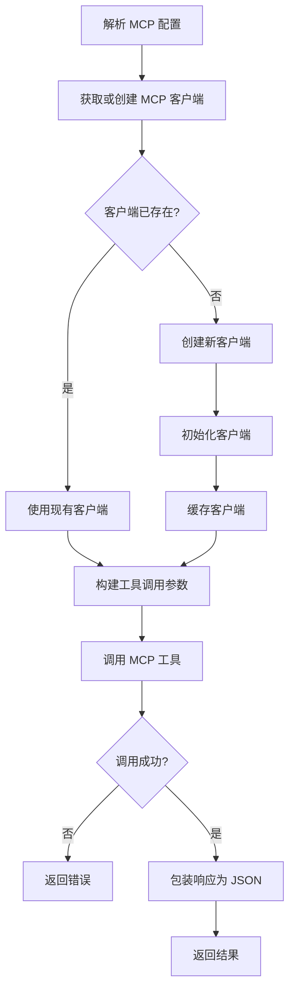

**关键代码**：`backend/domain/plugin/service/tool/invocation_mcp.go`

```go
func (m *mcpCallImpl) Do(ctx context.Context, args *InvocationArgs) (request string, resp string, err error) {
    // 1. 解析 MCP 配置
    mcpConfig, err := m.parseMCPConfig(args)
    
    // 2. 获取或创建 MCP 客户端
    client, err := m.getOrCreateClient(ctx, mcpConfig)
    
    // 3. 构建工具调用参数
    toolName := args.Tool.GetName()
    arguments := make(map[string]any)
    // 合并 Header、Query、Path、Body 参数
    for k, v := range args.Header { arguments[k] = v }
    for k, v := range args.Query { arguments[k] = v }
    for k, v := range args.Path { arguments[k] = v }
    for k, v := range args.Body { arguments[k] = v }
    
    // 4. 调用 MCP 工具
    resultStr, err := client.CallTool(ctx, toolName, arguments)
    
    // 5. 序列化请求
    requestJSON, _ := sonic.MarshalString(map[string]any{
        "tool":      toolName,
        "arguments": arguments,
    })
    
    // 6. 包装响应为 JSON
    responseJSON, err := sonic.MarshalString(map[string]any{
        "output": resultStr,
    })
    
    return requestJSON, responseJSON, nil
}
```

**MCP 客户端管理**：

- **客户端缓存**：使用配置哈希作为 key 缓存客户端
- **连接复用**：相同配置的插件共享客户端连接
- **线程安全**：使用 `sync.RWMutex` 保护客户端映射

```go
type mcpCallImpl struct {
    clients map[string]*mcp.Client  // key: config hash
    mu      sync.RWMutex
}

func (m *mcpCallImpl) getOrCreateClient(ctx context.Context, config *mcp.Config) (*mcp.Client, error) {
    configHash := m.hashConfig(config)
    
    // 尝试从缓存获取
    m.mu.RLock()
    if client, ok := m.clients[configHash]; ok {
        m.mu.RUnlock()
        return client, nil
    }
    m.mu.RUnlock()
    
    // 创建新客户端
    m.mu.Lock()
    defer m.mu.Unlock()
    
    // Double check
    if client, ok := m.clients[configHash]; ok {
        return client, nil
    }
    
    // 创建并初始化客户端
    client, err := mcp.NewClient(config)
    if err != nil {
        return nil, err
    }
    
    if err := client.Initialize(ctx); err != nil {
        client.Close()
        return nil, err
    }
    
    // 缓存客户端
    m.clients[configHash] = client
    
    return client, nil
}
```

### 4.5 Custom 插件执行流程

Custom 插件通过 `tool.NewCustomCallImpl()` 执行：

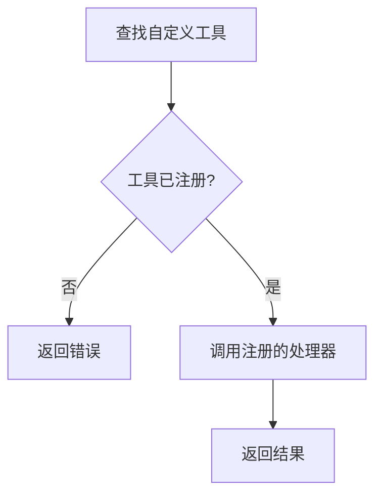

**关键代码**：`backend/domain/plugin/service/tool/invocation_custom_call.go`

```go
var customToolMap = make(map[string]Invocation)

func RegisterCustomTool(toolID string, t Invocation) error {
    if _, ok := customToolMap[toolID]; ok {
        return fmt.Errorf("custom tool path %s already registered", toolID)
    }
    customToolMap[toolID] = t
    return nil
}

func (c *customCallImpl) Do(ctx context.Context, args *InvocationArgs) (request string, resp string, err error) {
    toolID := fmt.Sprintf("%d", args.Tool.ID)
    if t, ok := customToolMap[toolID]; ok {
        return t.Do(ctx, args)
    }
    return "", "", fmt.Errorf("custom tool not found")
}
```

**使用场景**：

- 系统内置功能
- 特殊业务逻辑处理
- 需要与内部服务深度集成的场景

---

## 5. 前端访问插件

### 5.1 API 接口层

前端通过 HTTP API 访问插件功能，主要接口定义在 `backend/api/handler/coze/plugin_develop_service.go`：

**主要接口**：

| 接口 | 方法 | 功能 |
|------|------|------|
| `/api/plugin/develop/get_plugin_apis` | POST | 获取插件 API 列表 |
| `/api/plugin/develop/execute_tool` | POST | 执行工具（调试） |
| `/api/plugin/develop/create_draft_plugin` | POST | 创建草稿插件 |
| `/api/plugin/develop/update_draft_plugin` | POST | 更新草稿插件 |
| `/api/plugin/develop/publish_plugin` | POST | 发布插件 |

**请求流程**：

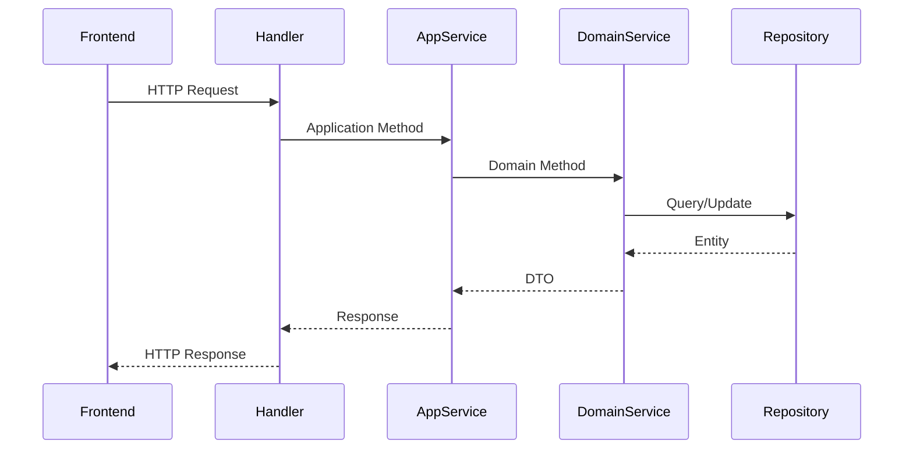

### 5.2 插件开发界面

前端插件开发界面位于 `frontend/packages/agent-ide/bot-plugin/`：

**主要组件**：

1. **插件列表页**：`entry/src/pages/plugin-id/index.tsx`
2. **工具详情页**：`entry/src/components/plugin-tool-detail/index.tsx`
3. **插件编辑**：支持表单编辑和代码编辑两种模式

**数据流**：

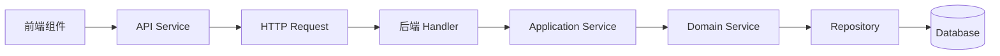

**关键代码示例**：

#### 前端 API 调用流程

```typescript
// frontend/packages/agent-ide/bot-plugin/entry/src/pages/plugin-id/index.tsx

// 1. 使用 useRequest Hook 调用 API
const { data, loading } = useRequest(
  () => PluginDevelopApi.GetPluginAPIs(params),
  {
    refreshDeps: [params],  // 依赖项变化时自动刷新
    onError: error => {
      // 错误上报
      capture(new CustomError(REPORT_EVENTS.PluginGetApis, `get Plugin Detail Error: ${error.message}`));
    },
  },
);

// 2. API Service 层（封装 HTTP 请求）
// frontend/packages/agent-ide/plugin-shared/src/service/fetch-plugin.ts
export const PluginDevelopApi = {
  GetPluginAPIs: async (params: GetPluginAPIsParams) => {
    return request<GetPluginAPIsResponse>({
      url: '/api/plugin/develop/get_plugin_apis',
      method: 'POST',
      data: params,
    });
  },
  
  ExecuteTool: async (params: ExecuteToolParams) => {
    return request<ExecuteToolResponse>({
      url: '/api/plugin/develop/execute_tool',
      method: 'POST',
      data: params,
    });
  },
};
```

#### 后端 Handler 处理流程

```go
// backend/api/handler/coze/plugin_develop_service.go

// 1. HTTP Handler 接收请求
func (h *Handler) GetPluginAPIs(ctx context.Context, req *pluginAPI.GetPluginAPIsRequest) (resp *pluginAPI.GetPluginAPIsResponse, err error) {
    // 2. 调用应用服务
    return plugin.PluginApplicationSVC.GetPluginAPIs(ctx, req)
}

// 3. Application Service 处理业务逻辑
func (p *PluginApplicationService) GetPluginAPIs(ctx context.Context, req *pluginAPI.GetPluginAPIsRequest) (resp *pluginAPI.GetPluginAPIsResponse, err error) {
    // 3.1 验证权限
    plugin, err := p.validateDraftPluginAccess(ctx, req.PluginID)
    if err != nil {
        return nil, err
    }
    
    // 3.2 调用领域服务获取插件信息
    plugins, err := p.DomainSVC.MGetDraftPlugins(ctx, []int64{req.PluginID})
    if err != nil {
        return nil, err
    }
    
    // 3.3 获取工具列表
    tools, err := p.DomainSVC.MGetDraftTools(ctx, req.APIIDs)
    if err != nil {
        return nil, err
    }
    
    // 3.4 转换为 API 响应格式
    apiInfos := make([]*pluginAPI.PluginAPIInfo, 0, len(tools))
    for _, tool := range tools {
        apiInfo := convertToolToAPIInfo(tool)
        apiInfos = append(apiInfos, apiInfo)
    }
    
    // 3.5 返回响应
    return &pluginAPI.GetPluginAPIsResponse{
        ApiInfo: apiInfos,
    }, nil
}
```

#### 工具调试执行流程

```typescript
// frontend/packages/agent-ide/bot-plugin/entry/src/components/plugin-tool-detail/index.tsx

// 1. 执行工具调试
const handleExecuteTool = async () => {
  try {
    setExecuting(true);
    
    // 2. 构建请求参数
    const params = {
      plugin_id: pluginID,
      api_id: toolID,
      arguments_in_json: JSON.stringify(requestParams),
      exec_scene: 'tool_debug',
    };
    
    // 3. 调用 API
    const response = await PluginDevelopApi.ExecuteTool(params);
    
    // 4. 更新响应数据
    setResponseData({
      request: response.request,
      raw_resp: response.raw_resp,
      trimmed_resp: response.trimmed_resp,
    });
    
  } catch (error) {
    // 5. 错误处理
    if (error.code === 'ERR_AUTHORIZATION_REQUIRED') {
      // OAuth 授权错误：显示授权链接
      showAuthModal(error.extra.auth_url);
    } else {
      // 其他错误：显示错误消息
      message.error(error.message);
    }
  } finally {
    setExecuting(false);
  }
};
```

```go
// backend/application/plugin/plugin.go

// 后端执行工具调试
func (p *PluginApplicationService) ExecuteTool(ctx context.Context, req *pluginAPI.ExecuteToolRequest) (resp *pluginAPI.ExecuteToolResponse, err error) {
    // 1. 构建执行请求
    executeReq := &model.ExecuteToolRequest{
        UserID:          ctxutil.GetUIDFromCtx(ctx).String(),
        PluginID:        req.PluginID,
        ToolID:          req.APIID,
        ExecScene:       consts.ExecSceneOfToolDebug,
        ArgumentsInJson: req.ArgumentsInJson,
        ExecDraftTool:   true,  // 调试场景总是使用草稿工具
    }
    
    // 2. 调用领域服务执行
    result, err := p.DomainSVC.ExecuteTool(ctx, executeReq,
        model.WithAutoGenRespSchema(true),  // 自动生成响应 Schema
    )
    if err != nil {
        return nil, err
    }
    
    // 3. 转换为 API 响应
    return &pluginAPI.ExecuteToolResponse{
        Request:     result.Request,
        RawResp:     result.RawResp,
        TrimmedResp: result.TrimmedResp,
        RespSchema:  result.RespSchema,
    }, nil
}
```

### 5.3 Workflow 中的插件节点

在 Workflow 中，插件作为节点使用：

**节点类型**：`NodeTypePlugin`（在 `backend/domain/workflow/entity/node_meta.go` 中定义）

**节点配置**：

```go
type Config struct {
    PluginID      int64
    ToolID        int64
    PluginVersion string
    PluginFrom    *bot_common.PluginFrom
}
```

**执行流程**：

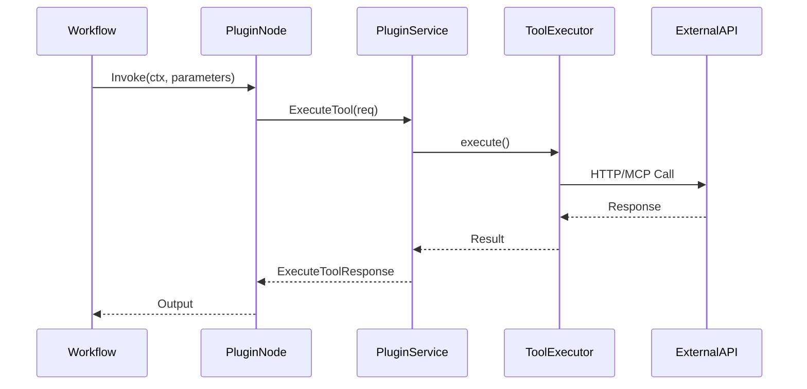

**关键代码**：`backend/domain/workflow/internal/nodes/plugin/exec.go`

#### ExecutePlugin 详细实现

```go
func ExecutePlugin(ctx context.Context, input map[string]any, pe *vo.PluginEntity,
    toolID int64, cfg workflowModel.ExecuteConfig) (map[string]any, error) {
    
    // 1. 序列化输入参数为 JSON 字符串
    // input 是 Workflow 节点输入参数的 map，需要转换为 JSON 字符串
    args, err := sonic.MarshalString(input)
    if err != nil {
        return nil, vo.WrapError(errno.ErrSerializationDeserializationFail, err)
    }
    
    // 2. 确定用户 ID（根据执行场景）
    var uID string
    if cfg.AgentID != nil {
        // Agent 场景：使用连接器用户 ID（支持多租户）
        uID = cfg.ConnectorUID
    } else {
        // Workflow 场景：使用操作者 ID
        uID = conv.Int64ToStr(cfg.Operator)
    }
    
    // 3. 构建执行请求
    req := &model.ExecuteToolRequest{
        UserID:          uID,                                    // 用户 ID
        PluginID:        pe.PluginID,                           // 插件 ID
        ToolID:          toolID,                                 // 工具 ID
        ExecScene:       consts.ExecSceneOfWorkflow,             // 执行场景
        ArgumentsInJson: args,                                   // JSON 格式的参数
        ExecDraftTool:   pe.PluginVersion == nil || *pe.PluginVersion == "0",  // 是否执行草稿工具
        PluginFrom:      pe.PluginFrom,                          // 插件来源（项目/SaaS）
    }
    
    // 4. 构建执行选项
    execOpts := []model.ExecuteToolOpt{
        // 设置响应处理策略：返回默认值（Workflow 场景）
        model.WithInvalidRespProcessStrategy(consts.InvalidResponseProcessStrategyOfReturnDefault),
    }
    
    // 5. 如果指定了版本，添加版本选项
    if pe.PluginVersion != nil {
        execOpts = append(execOpts, model.WithToolVersion(*pe.PluginVersion))
    }
    
    // 6. 执行工具
    r, err := crossplugin.DefaultSVC().ExecuteTool(ctx, req, execOpts...)
    if err != nil {
        // 7. 处理中断错误（OAuth 授权场景）
        if extra, ok := compose.IsInterruptRerunError(err); ok {
            // 提取中断事件数据
            interruptData := extra.(*entity.InterruptEvent).InterruptData
            // 返回授权错误，前端会显示授权链接
            return nil, vo.NewError(errno.ErrAuthorizationRequired, errorx.KV("extra", interruptData))
        }
        return nil, err
    }
    
    // 8. 解析响应为 map
    var result map[string]any
    err = sonic.UnmarshalString(r.TrimmedResp, &result)
    if err != nil {
        return nil, vo.WrapError(errno.ErrSerializationDeserializationFail, err)
    }
    
    // 9. 返回结果（作为 Workflow 节点的输出）
    return result, nil
}
```

#### toolExecutor.execute 详细实现

```go
// backend/domain/plugin/service/exec_tool.go
func (t *toolExecutor) execute(ctx context.Context, argumentsInJson, accessToken, authURL string) (resp *ExecuteResponse, err error) {
    // 1. 验证参数
    if argumentsInJson == "" {
        return nil, errorx.New(errno.ErrPluginExecuteToolFailed,
            errorx.KV(errno.PluginMsgKey, "argumentsInJson is required"))
    }
    
    // 2. 构建 InvocationArgs（参数分组、公共参数、默认值等）
    invocation, err := tool.NewInvocationArgs(ctx, &tool.InvocationArgsBuilder{
        ArgsInJson:     argumentsInJson,              // JSON 格式的参数
        ProjectInfo:    t.projectInfo,               // 项目信息（用于变量引用）
        UserID:         t.userID,                     // 用户 ID
        Plugin:         t.plugin,                     // 插件信息
        Tool:           t.tool,                      // 工具信息
        PluginManifest: t.plugin.Manifest,           // 插件清单
        ServerURL:      t.plugin.GetServerURL(),     // 服务器 URL
        AuthInfo: &tool.AuthInfo{
            OAuth: &tool.OAuthInfo{
                AccessToken: accessToken,            // OAuth Access Token
                AuthURL:     authURL,                // OAuth 授权 URL（如果需要授权）
            },
            MetaInfo: t.plugin.GetAuthInfo(),        // 认证元信息
        },
    })
    if err != nil {
        return nil, err
    }
    
    // 3. 文件 URI 转 URL（非调试场景）
    // 调试场景下，文件 URI 保持原样，便于调试
    if t.execScene != consts.ExecSceneOfToolDebug {
        // 将 OSS URI 转换为可访问的 URL
        err = invocation.AssembleFileURIToURL(ctx, t.oss)
        if err != nil {
            return nil, err
        }
    }
    
    // 4. 根据插件来源选择执行器
    var requestStr, rawResp string
    if t.plugin.Source != nil && *t.plugin.Source == bot_common.PluginFrom_FromSaas {
        // SaaS 插件：使用 SaaS 调用实现
        requestStr, rawResp, err = tool.NewSaasCallImpl().Do(ctx, invocation)
    } else {
        // 普通插件：根据插件类型选择执行器
        requestStr, rawResp, err = newToolInvocation(t).Do(ctx, invocation)
    }
    
    if err != nil {
        return nil, err
    }
    
    // 5. 处理空响应
    const defaultResp = "{}"
    if rawResp == "" {
        return &ExecuteResponse{
            Request:     requestStr,
            TrimmedResp: defaultResp,
            RawResp:     defaultResp,
        }, nil
    }
    
    // 6. 处理响应（根据 Schema 裁剪）
    trimmedResp, err := t.processResponse(ctx, rawResp)
    if err != nil {
        return nil, err
    }
    if trimmedResp == "" {
        trimmedResp = defaultResp
    }
    
    // 7. 返回结果
    return &ExecuteResponse{
        Request:     requestStr,     // 请求字符串（用于日志）
        TrimmedResp: trimmedResp,    // 裁剪后的响应
        RawResp:     rawResp,        // 原始响应
    }, nil
}
```

#### newToolInvocation 工厂方法

```go
func newToolInvocation(t *toolExecutor) tool.Invocation {
    // 根据插件类型选择对应的执行器
    switch t.plugin.Manifest.API.Type {
    case consts.PluginTypeOfCloud:
        // HTTP 插件：使用 HTTP 调用实现
        return tool.NewHttpCallImpl(t.conversationID)
    case consts.PluginTypeOfMCP:
        // MCP 插件：使用 MCP 调用实现
        return tool.NewMcpCallImpl()
    case consts.PluginTypeOfCustom:
        // 自定义插件：使用自定义调用实现
        return tool.NewCustomCallImpl()
    default:
        // 默认使用 HTTP 调用
        return tool.NewHttpCallImpl(t.conversationID)
    }
}
```

---

## 6. 插件认证与授权

### 6.1 认证类型

插件支持多种认证方式，定义在 `backend/crossdomain/plugin/consts/consts.go`：

```go
type AuthzType string

const (
    AuthzTypeOfNone    AuthzType = "none"           // 无认证
    AuthzTypeOfService AuthzType = "service_http"   // Service Token
    AuthzTypeOfOAuth   AuthzType = "oauth"          // OAuth 2.0
    AuthTypeOfSaasInstalled AuthzType = "saas_installed"  // SaaS 安装认证
)

type AuthzSubType string

const (
    AuthzSubTypeOfServiceAPIToken        AuthzSubType = "token/api_key"
    AuthzSubTypeOfOAuthAuthorizationCode AuthzSubType = "authorization_code"
    AuthzSubTypeOfOAuthClientCredentials AuthzSubType = "client_credentials"
)
```

### 6.2 OAuth 流程

OAuth 认证流程支持授权码模式（Authorization Code）：

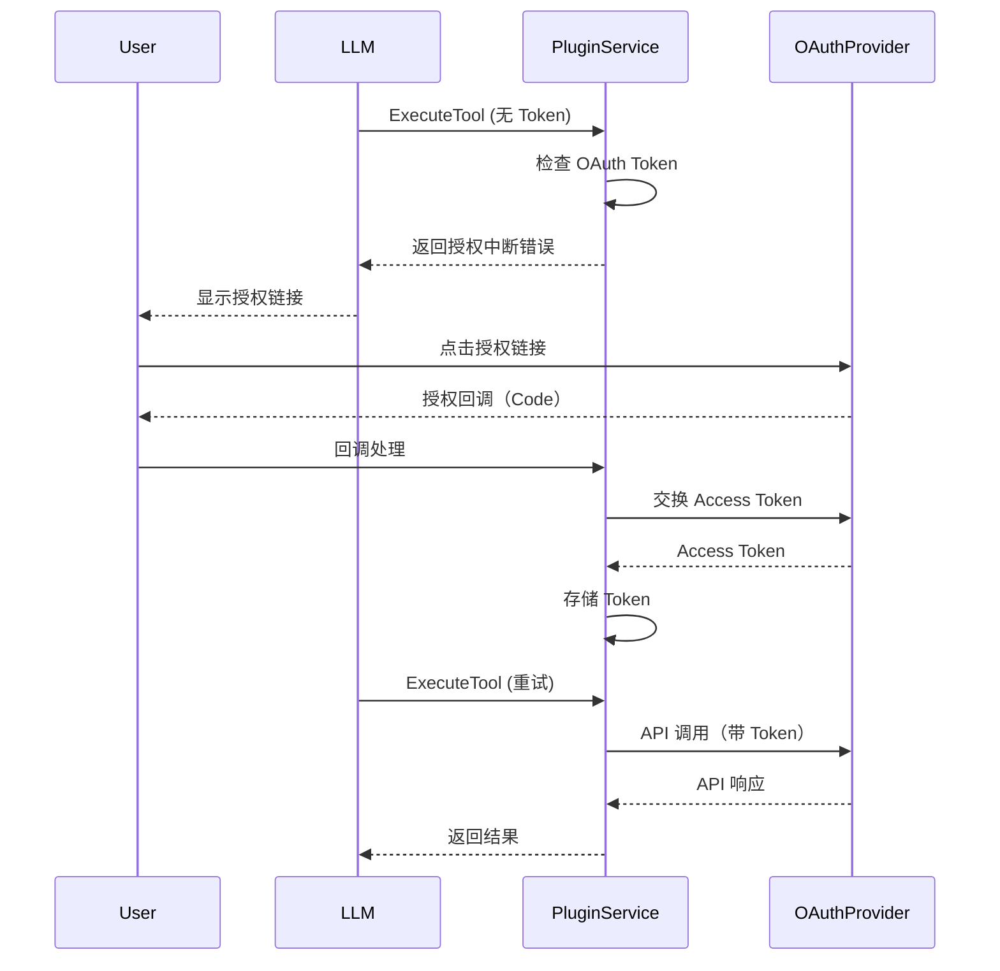

**关键代码**：`backend/domain/plugin/service/exec_tool.go`

```go
func (p *pluginServiceImpl) acquireAccessTokenIfNeed(ctx context.Context, req *model.ExecuteToolRequest, authInfo *model.AuthV2,
    schema *model.Openapi3Operation) (accessToken string, authURL string, err error) {
    
    // 1. 检查是否需要认证
    if authInfo.Type == consts.AuthzTypeOfNone {
        return "", "", nil
    }
    
    // 2. 检查认证模式
    authMode := consts.ToolAuthModeOfRequired
    if tmp, ok := schema.Extensions[consts.APISchemaExtendAuthMode].(string); ok {
        authMode = consts.ToolAuthMode(tmp)
    }
    
    if authMode == consts.ToolAuthModeOfDisabled {
        return "", "", nil
    }
    
    // 3. OAuth 授权码模式
    if authInfo.SubType == consts.AuthzSubTypeOfOAuthAuthorizationCode {
        authorizationCode := &dto.AuthorizationCodeInfo{
            Meta: &dto.AuthorizationCodeMeta{
                UserID:   req.UserID,
                PluginID: req.PluginID,
                IsDraft:  req.ExecScene == consts.ExecSceneOfToolDebug,
            },
            Config: authInfo.AuthOfOAuthAuthorizationCode,
        }
        
        // 4. 获取 Access Token
        accessToken, err = p.GetAccessToken(ctx, &dto.OAuthInfo{
            OAuthMode:         authInfo.SubType,
            AuthorizationCode: authorizationCode,
        })
        
        // 5. 生成授权 URL（如果 Token 不存在）
        authURL, err = genAuthURL(ctx, authorizationCode)
    }
    
    return accessToken, authURL, nil
}
```

**OAuth Token 注入**：`backend/domain/plugin/service/tool/invocation_http.go`

```go
func (h *httpCallImpl) injectOAuthAccessToken(ctx context.Context, httpReq *http.Request, args *InvocationArgs) (errMsg string, err error) {
    authMode := pluginConsts.ToolAuthModeOfRequired
    if tmp, ok := args.Tool.Operation.Extensions[pluginConsts.APISchemaExtendAuthMode].(string); ok {
        authMode = pluginConsts.ToolAuthMode(tmp)
    }
    
    if authMode == pluginConsts.ToolAuthModeOfDisabled {
        return "", nil
    }
    
    if args.AuthInfo.OAuth == nil {
        return "", fmt.Errorf("auth of oauth is nil")
    }
    
    accessToken := args.AuthInfo.OAuth.AccessToken
    
    // 如果 Token 为空且认证模式为 Required，返回授权错误
    if authInfo.SubType == pluginConsts.AuthzSubTypeOfOAuthAuthorizationCode &&
        accessToken == "" && authMode != pluginConsts.ToolAuthModeOfSupported {
        errMsg = authCodeInvalidTokenErrMsg[i18n.GetLocale(ctx)]
        errMsg = fmt.Sprintf(errMsg, args.PluginManifest.NameForHuman, args.AuthInfo.OAuth.AuthURL)
        return errMsg, nil
    }
    
    // 注入 Token
    if accessToken != "" {
        httpReq.Header.Set("Authorization", fmt.Sprintf("Bearer %s", accessToken))
    }
    
    return "", nil
}
```

---

## 7. 插件与 Workflow 集成

### 7.1 插件节点配置

在 Workflow Canvas 中，插件节点配置包含：

```json
{
  "pluginID": 1001,
  "toolID": 2001,
  "pluginVersion": "1.0.0",
  "pluginFrom": "project"
}
```

**节点适配**：`backend/domain/workflow/internal/nodes/plugin/plugin.go`

```go
func (c *Config) Adapt(ctx context.Context, n *vo.Node, opts ...nodes.AdaptOption) (*schema.NodeSchema, error) {
    // 1. 从节点输入中提取插件配置
    apiParams := slices.ToMap(inputs.APIParams, func(e *vo.Param) (string, *vo.Param) {
        return e.Name, e
    })
    
    // 2. 提取 PluginID
    ps, ok := apiParams["pluginID"]
    pID, err := strconv.ParseInt(ps.Input.Value.Content.(string), 10, 64)
    c.PluginID = pID
    
    // 3. 提取 ToolID
    ps, ok = apiParams["apiID"]
    tID, err := strconv.ParseInt(ps.Input.Value.Content.(string), 10, 64)
    c.ToolID = tID
    
    // 4. 提取 PluginVersion
    ps, ok = apiParams["pluginVersion"]
    version := ps.Input.Value.Content.(string)
    c.PluginVersion = version
    
    // 5. 设置输入输出 Schema
    if err := convert.SetInputsForNodeSchema(n, ns); err != nil {
        return nil, err
    }
    
    if err := convert.SetOutputTypesForNodeSchema(n, ns); err != nil {
        return nil, err
    }
    
    return ns, nil
}
```

### 7.2 执行上下文传递

插件执行时，会传递 Workflow 的执行上下文：

**上下文信息**：

```go
type ExecuteConfig struct {
    AgentID      *int64  // Agent ID（如果来自 Agent）
    Operator     int64    // 操作者 ID
    ConnectorUID string   // 连接器用户 ID
    ProjectID    int64    // 项目 ID
    ProjectType  int8     // 项目类型
    ProjectVersion *string // 项目版本
}
```

**上下文传递**：

```go
func ExecutePlugin(ctx context.Context, input map[string]any, pe *vo.PluginEntity,
    toolID int64, cfg workflowModel.ExecuteConfig) (map[string]any, error) {
    
    // 从执行配置中提取用户 ID
    var uID string
    if cfg.AgentID != nil {
        uID = cfg.ConnectorUID  // Agent 场景使用连接器用户 ID
    } else {
        uID = conv.Int64ToStr(cfg.Operator)  // Workflow 场景使用操作者 ID
    }
    
    // 构建执行请求
    req := &model.ExecuteToolRequest{
        UserID:          uID,
        PluginID:        pe.PluginID,
        ToolID:          toolID,
        ExecScene:       consts.ExecSceneOfWorkflow,
        ArgumentsInJson: args,
        ExecDraftTool:   pe.PluginVersion == nil || *pe.PluginVersion == "0",
        PluginFrom:      pe.PluginFrom,
    }
    
    // 执行选项
    execOpts := []model.ExecuteToolOpt{
        model.WithInvalidRespProcessStrategy(consts.InvalidResponseProcessStrategyOfReturnDefault),
    }
    
    if pe.PluginVersion != nil {
        execOpts = append(execOpts, model.WithToolVersion(*pe.PluginVersion))
    }
    
    // 执行工具
    r, err := crossplugin.DefaultSVC().ExecuteTool(ctx, req, execOpts...)
    
    // ...
}
```

#### processResponse 响应处理详细实现

```go
// backend/domain/plugin/service/exec_tool.go
func (t *toolExecutor) processResponse(ctx context.Context, rawResp string) (trimmedResp string, err error) {
    // 1. 检查是否有响应 Schema 定义
    responses := t.tool.Operation.Responses
    if len(responses) == 0 {
        // 没有 Schema，直接返回原始响应
        return rawResp, nil
    }
    
    // 2. 获取 200 状态码的响应定义
    resp, ok := responses[strconv.Itoa(http.StatusOK)]
    if !ok {
        return "", fmt.Errorf("the '%d' status code is not defined in responses", http.StatusOK)
    }
    
    // 3. 获取 JSON 媒体类型的 Schema
    mType, ok := resp.Value.Content[consts.MediaTypeJson]
    if !ok {
        return "", fmt.Errorf("the '%s' media type is not defined in response", consts.MediaTypeJson)
    }
    
    // 4. 解析响应为 map
    decoder := sonic.ConfigDefault.NewDecoder(bytes.NewBufferString(rawResp))
    decoder.UseNumber()  // 使用 Number 类型避免精度丢失
    respMap := map[string]any{}
    err = decoder.Decode(&respMap)
    if err != nil {
        return "", errorx.New(errno.ErrPluginExecuteToolFailed,
            errorx.KVf(errno.PluginMsgKey, "response is not object, raw response=%s", rawResp))
    }
    
    // 5. 检查 Schema 是否有属性定义
    schemaVal := mType.Schema.Value
    if len(schemaVal.Properties) == 0 {
        // 没有属性定义，直接返回原始响应
        return rawResp, nil
    }
    
    // 6. 根据响应处理策略处理响应
    // 注意：当前实现中，为了兼容 Function Calling 场景，直接返回原始响应
    // TODO: 修复 Schema 不完整时的处理逻辑
    return rawResp, nil
    
    // 原有的处理逻辑（已注释，待修复）
    /*
    var trimmedRespMap map[string]any
    switch t.invalidRespProcessStrategy {
    case consts.InvalidResponseProcessStrategyOfReturnRaw:
        // 策略1：返回原始值（删除未定义的字段）
        trimmedRespMap, err = t.processWithInvalidRespProcessStrategyOfReturnRaw(ctx, respMap, schemaVal)
    case consts.InvalidResponseProcessStrategyOfReturnDefault:
        // 策略2：返回默认值（类型不匹配时使用默认值）
        trimmedRespMap, err = t.processWithInvalidRespProcessStrategyOfReturnDefault(ctx, respMap, schemaVal)
    case consts.InvalidResponseProcessStrategyOfReturnErr:
        // 策略3：返回错误（类型不匹配时报错）
        trimmedRespMap, err = t.processWithInvalidRespProcessStrategyOfReturnErr(ctx, respMap, schemaVal)
    }
    
    // 7. 序列化处理后的响应
    trimmedResp, err = sonic.MarshalString(trimmedRespMap)
    return trimmedResp, nil
    */
}
```

#### processWithInvalidRespProcessStrategyOfReturnDefault 示例

```go
func (t *toolExecutor) processWithInvalidRespProcessStrategyOfReturnDefault(_ context.Context, paramVals map[string]any, paramSchema *openapi3.Schema) (map[string]any, error) {
    // 递归处理函数
    var processor func(paramVal any, schemaVal *openapi3.Schema) (any, error)
    processor = func(paramVal any, schemaVal *openapi3.Schema) (any, error) {
        switch schemaVal.Type {
        case openapi3.TypeObject:
            // 对象类型：递归处理每个属性
            paramValMap, ok := paramVal.(map[string]any)
            if !ok {
                return nil, nil  // 类型不匹配，返回 nil
            }
            
            newParamValMap := map[string]any{}
            for paramName, _paramVal := range paramValMap {
                _paramSchema, ok := schemaVal.Properties[paramName]
                if !ok || t.disabledParam(_paramSchema.Value) {
                    continue  // 跳过未定义的字段或被禁用的字段
                }
                
                newParamVal, err := processor(_paramVal, _paramSchema.Value)
                if err != nil {
                    return nil, err
                }
                if newParamVal != nil {
                    newParamValMap[paramName] = newParamVal
                }
            }
            return newParamValMap, nil
            
        case openapi3.TypeArray:
            // 数组类型：处理每个元素
            paramValSlice, ok := paramVal.([]any)
            if !ok {
                return nil, nil
            }
            
            newParamValSlice := []any{}
            for _, _paramVal := range paramValSlice {
                newParamVal, err := processor(_paramVal, schemaVal.Items.Value)
                if err != nil {
                    return nil, err
                }
                if newParamVal != nil {
                    newParamValSlice = append(newParamValSlice, newParamVal)
                }
            }
            return newParamValSlice, nil
            
        case openapi3.TypeString:
            // 字符串类型：类型检查
            paramValStr, ok := paramVal.(string)
            if !ok {
                return "", nil  // 类型不匹配，返回默认值（空字符串）
            }
            return paramValStr, nil
            
        case openapi3.TypeInteger:
            // 整数类型：类型检查和转换
            paramValNum, ok := paramVal.(json.Number)
            if !ok {
                return int64(0), nil  // 类型不匹配，返回默认值（0）
            }
            paramValInt, err := paramValNum.Int64()
            if err != nil {
                return int64(0), nil
            }
            return paramValInt, nil
            
        // ... 其他类型类似处理
        }
    }
    
    // 处理顶层对象
    newParamVals := make(map[string]any, len(paramVals))
    for paramName, _paramVal := range paramVals {
        _paramSchema, ok := paramSchema.Properties[paramName]
        if !ok || t.disabledParam(_paramSchema.Value) {
            continue
        }
        
        newParamVal, err := processor(_paramVal, _paramSchema.Value)
        if err != nil {
            return nil, err
        }
        
        newParamVals[paramName] = newParamVal
    }
    
    return newParamVals, nil
}
```

**默认值注入**：

插件支持从项目变量中注入默认值，通过 `x-variable-ref` 扩展：

```go
func getDefaultValue(ctx context.Context, schema *openapi3.Schema, info *model.ProjectInfo, userID string) (any, error) {
    // 1. 检查是否有变量引用扩展
    vn, exist := schema.Extensions[consts.APISchemaExtendVariableRef]
    if !exist {
        // 没有变量引用，直接返回 Schema 的默认值
        return schema.Default, nil
    }
    
    // 2. 解析变量引用关键字
    keyword, ok := vn.(string)
    if !ok {
        logs.CtxErrorf(ctx, "invalid variable_ref type '%T'", vn)
        return nil, nil
    }
    
    if info == nil {
        return nil, fmt.Errorf("project info is nil")
    }
    
    // 3. 构建变量元数据
    meta := &variables.UserVariableMeta{
        BizType:      project_memory.VariableConnector(info.ProjectType),  // 业务类型
        BizID:        strconv.FormatInt(info.ProjectID, 10),              // 项目 ID
        Version:      ptr.FromOrDefault(info.ProjectVersion, ""),         // 版本
        ConnectorUID: userID,                                              // 用户 ID
        ConnectorID:  info.ConnectorID,                                    // 连接器 ID
    }
    
    // 4. 从变量服务获取变量值
    vals, err := crossvariables.DefaultSVC().GetVariableInstance(ctx, meta, []string{keyword})
    if err != nil {
        return nil, err
    }
    
    if len(vals) == 0 {
        return nil, nil
    }
    
    // 5. 返回变量的值
    return vals[0].Value, nil
}
```

---

## 8. 总结

### 8.1 架构特点

1. **分层清晰**：API 层、应用层、领域层、基础设施层职责明确
2. **类型丰富**：支持 HTTP、MCP、Custom 三种插件类型
3. **执行统一**：所有插件通过统一的执行入口，便于扩展和维护
4. **认证完善**：支持多种认证方式，特别是 OAuth 流程完整
5. **集成友好**：与 Workflow、Agent 深度集成，支持上下文传递

### 8.2 关键设计模式

1. **策略模式**：不同插件类型使用不同的 Invocation 实现
2. **工厂模式**：`newToolInvocation()` 根据插件类型创建对应的执行器
3. **仓储模式**：通过 Repository 接口抽象数据访问
4. **适配器模式**：Workflow 节点适配插件配置

### 8.3 扩展点

1. **新增插件类型**：实现 `tool.Invocation` 接口，在 `newToolInvocation()` 中添加类型判断
2. **自定义工具**：使用 `tool.RegisterCustomTool()` 注册自定义处理器
3. **认证扩展**：在 `injectAuthInfo()` 中添加新的认证类型处理

### 8.4 性能优化

1. **客户端缓存**：MCP 客户端按配置哈希缓存，复用连接
2. **内存缓存**：插件产品信息启动时加载到内存，运行时只读
3. **深拷贝返回**：避免并发修改问题

### 8.5 最佳实践

1. **插件开发**：遵循 OpenAPI 3.0 规范，提供完整的 Schema 定义
2. **错误处理**：使用统一的错误码和错误信息格式
3. **日志记录**：关键步骤记录日志，便于问题排查
4. **测试覆盖**：为不同插件类型和执行场景编写测试用例

---

## 附录

### A. 关键文件清单

| 文件路径 | 说明 |
|---------|------|
| `backend/domain/plugin/service/service.go` | 插件服务接口定义 |
| `backend/domain/plugin/service/service_impl.go` | 插件服务实现 |
| `backend/domain/plugin/service/exec_tool.go` | 工具执行核心逻辑 |
| `backend/domain/plugin/service/tool/invocation.go` | 执行器接口 |
| `backend/domain/plugin/service/tool/invocation_http.go` | HTTP 执行器 |
| `backend/domain/plugin/service/tool/invocation_mcp.go` | MCP 执行器 |
| `backend/domain/plugin/service/tool/invocation_custom_call.go` | Custom 执行器 |
| `backend/domain/plugin/conf/load_plugin.go` | 插件加载逻辑 |
| `backend/domain/workflow/internal/nodes/plugin/exec.go` | Workflow 插件节点执行 |
| `backend/crossdomain/plugin/consts/consts.go` | 插件常量定义 |

### B. 相关文档

- [Coze Studio 后端架构分析](./coze-studio-backend-architecture-analysis.md)
- [MCP 插件开发指南](./MCP_Plugin_Development_Guide.md)
- [插件节点 vs Function Calling 对比](./插件节点_vs_Function_Calling对比.md)

---

**文档版本**：v1.0  
**最后更新**：2025-01-XX  
**作者**：Coze Studio 开发团队

