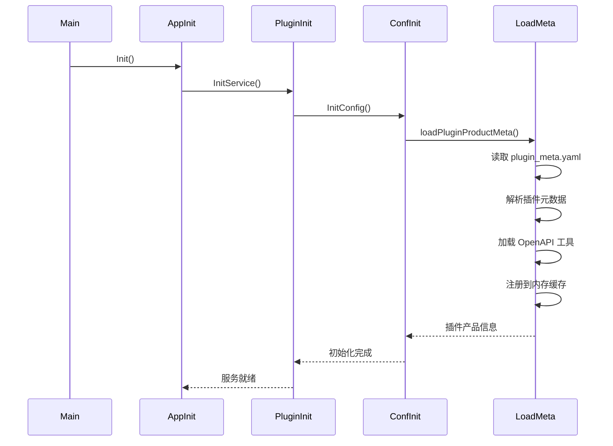
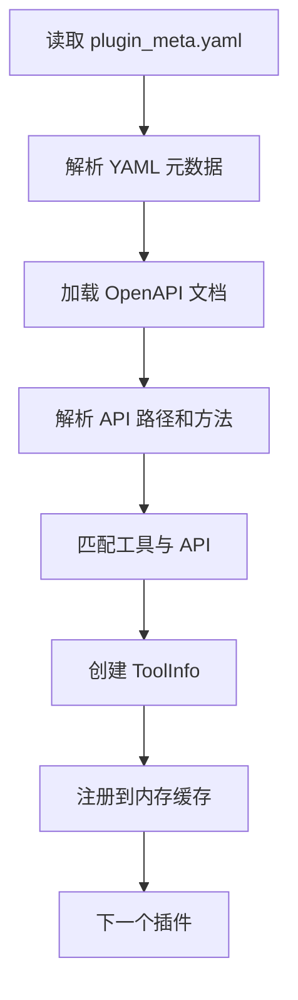

# Coze Studio 二次开发（一）支持静态配置  MCP 

## 背景

`Coze Studio` 是一个开源的 AI 低代码工作流开发平台，它提供了完整的插件系统来扩展 AI 模型的能力。该插件系统允许开发者通过标准化的方式集成外部服务，使 AI 模型能够调用各种工具和服务。

从之前的源码分析[`Coze Studio`源码分析(二)后端插件架构深度剖析与二次开发实战准备](https://mp.weixin.qq.com/s/q-nSAEaXOMuVHgOxKGrhpA)中得知，`Coze Studio` 目前仅支持 HTTP 和自定义插件。如果想要支持 MCP Server 配置，就无法继续。因此，我萌生了基于 `Coze Studio` 开发支持 MCP Server 配置的功能的想法，以使 `Coze Studio` 更加完善。


### 为什么选择  `Coze Studio`？

在 AI 低代码开发领域，目前调研了 Dify 、n8n 、`Coze Studio` 等具有代表性的成熟解决方案。选择 `Coze Studio` 主要的原因是内部基于 Go 语言开发，对我个人来说可是天然的友好啊，我不用再去学习其它语言，当然还有以下几个因素考虑：

1. **语言偏好**：Go 语言的简洁性、并发模型和编译型特性，使得系统具备更好的性能和可维护性

2. **架构清晰**：`Coze Studio` 采用 DDD（领域驱动设计）架构，代码结构清晰，易于扩展

3. **开源可控**：完全开源，可以根据业务需求进行深度定制

4. **插件系统完善**：已有的插件架构为扩展新协议提供了良好的基础

5. **Dify/n8n**: 都是 TypeScript 开发语言为主，不符合我当前技术选型

   

## 插件加载执行流程（简要回顾）

在深入 MCP 支持实现之前，我们先简要回顾一下 `Coze Studio` 的插件加载流程。

### 初始化流程



**核心代码路径**：

1. **应用初始化**：`backend/application/application.go::Init()`
2. **插件服务初始化**：`backend/application/plugin/init.go::InitService()`
3. **配置初始化**：`backend/domain/plugin/conf/config.go::InitConfig()`
4. **元数据加载**：`backend/domain/plugin/conf/load_plugin.go::loadPluginProductMeta()`

### 插件元数据加载流程



**关键代码**：`backend/domain/plugin/conf/load_plugin.go`

函数核心流程如下：

```go
func loadPluginProductMeta(ctx context.Context, basePath string) (err error) {
    // 1. 读取并解析 plugin_meta.yaml
    file, err := os.ReadFile(metaFile)
    var pluginsMeta []*pluginProductMeta
    yaml.Unmarshal(file, &pluginsMeta)
    
    // 2. 初始化内存缓存
    pluginProducts = make(map[int64]*PluginInfo, len(pluginsMeta))
    toolProducts = map[int64]*ToolInfo{}
    
    // 3. 遍历每个插件元数据
    for _, m := range pluginsMeta {
        // 3.1 检查元数据有效性并验证 Manifest
        if !checkPluginMetaInfo(ctx, m) { continue }
        m.Manifest.Validate(true)
        
        // 3.2 加载 OpenAPI 文档（原始逻辑）
        docPath := path.Join(root, m.OpenapiDocFile)
        _doc, _ := loader.LoadFromFile(docPath)
        doc := ptr.Of(model.Openapi3T(*_doc))
        
        // 3.3 解析 OpenAPI 文档中的所有 API
        apis := make(map[dto.UniqueToolAPI]*model.Openapi3Operation)
        for subURL, pathItem := range doc.Paths {
            for method, op := range pathItem.Operations() {
                api := dto.UniqueToolAPI{SubURL: subURL, Method: method}
                apis[api] = model.NewOpenapi3Operation(op)
            }
        }
        
        // 3.4 匹配工具与 API，创建 ToolInfo
        for _, t := range m.Tools {
            api := dto.UniqueToolAPI{SubURL: t.SubURL, Method: t.Method}
            op, ok := apis[api]
            if ok {
                toolProducts[t.ToolID] = &ToolInfo{Info: &entity.ToolInfo{...}}
            }
        }
        
        // 3.5 注册到内存缓存
        pluginProducts[m.PluginID] = pi
    }
}
```

从代码流程可以看出，当前的实现假设所有插件都是 OpenAPI 类型，通过读取 YAML 配置文件和 OpenAPI 文档来加载工具。要支持 MCP 插件，最直接的做法是在插件元数据中增加类型标识，根据类型走不同的加载路径。

这个思路是可行的。MCP 插件和 OpenAPI 插件的主要区别在于：OpenAPI 插件的工具定义在配置文件中，而 MCP 插件的工具需要从 MCP 服务器动态获取。我们可以在 `loadPluginProductMeta` 函数中增加类型判断，对 MCP 插件走另一套加载逻辑。

## 实现要点

### 插件类型识别

首先需要在遍历插件时判断类型。查看 `pluginProductMeta` 结构，发现 `Manifest.API.Type` 字段已经可以用来区分插件类型。在验证完 Manifest 之后，添加类型判断：

```go
isMCPPlugin := m.Manifest.API.Type == consts.PluginTypeOfMCP
```

这样就能在后续处理中区分两种插件类型。

### MCP 配置提取

MCP 插件的配置信息存放在 `manifest.API.Extensions["mcp_config"]` 中，需要将其解析为 `mcp.Config` 结构。这里封装一个解析函数：

```go
mcpConfig, err := parseMCPConfigFromManifest(m.Manifest)
if err != nil {
    logs.CtxErrorf(ctx, "[MCP] Failed to parse MCP config: %v", err)
    continue
}
```

`parseMCPConfigFromManifest` 函数负责从 Manifest 的 Extensions 字段中提取配置，并进行 JSON 序列化/反序列化转换。这样设计的好处是配置信息仍然保留在 Manifest 中，不需要修改现有的元数据结构。

### OpenAPI 文档兼容处理

虽然 MCP 插件不需要真实的 OpenAPI 文档，但系统其他部分可能依赖 `PluginInfo.OpenapiDoc` 字段。为了保持兼容性，需要为 MCP 插件创建一个最小化的 OpenAPI 文档：

```go
doc := createMinimalOpenAPIDocForMCP(m.Manifest)
```

这个最小化文档只需要包含基本信息（title、description、version）和一个占位的 server URL，不需要定义实际的路径和操作。

### 工具动态加载

MCP 插件的工具不是从配置文件读取，而是通过连接 MCP 服务器动态获取。这里引入一个 `mcpToolLoader` 来封装加载逻辑：

```go
loader := &mcpToolLoader{}
mcpTools, err := loader.LoadMCPTools(ctx, m.PluginID, m.Version, mcpConfig)
if err != nil {
    logs.CtxErrorf(ctx, "[MCP] Failed to load tools: %v", err)
    delete(pluginProducts, m.PluginID)
    continue
}

for _, toolInfo := range mcpTools {
    pi.ToolIDs = append(pi.ToolIDs, toolInfo.Info.ID)
    toolProducts[toolInfo.Info.ID] = toolInfo
}
```

`LoadMCPTools` 方法内部会创建 MCP 客户端、初始化连接、调用 `ListTools` 获取工具列表，然后将 MCP Tool 转换为系统内部的 `ToolInfo` 格式。转换过程需要处理 JSON Schema 到 OpenAPI Operation 的映射，这部分逻辑相对复杂，后面会详细说明。

### 代码分支重构

最后，将原来的单一处理逻辑改为条件分支：

```go
if isMCPPlugin {
    // MCP 插件处理逻辑
    // ... 上述 MCP 相关代码
} else {
    // 保留原有的 OpenAPI 插件处理逻辑
    // ... 原有的 OpenAPI 加载代码
}
```

这样既不影响现有功能，又能支持新的插件类型。整个修改的核心思路是：在保持原有架构不变的前提下，通过类型判断和分支处理，为 MCP 插件提供独立的加载路径。

## 技术方案（静态加载 MCP Server）

基于对插件加载流程的理解，我们设计了以下技术方案来支持 MCP 静态配置：

1. **封装 MCP 核心客户端**：在 `backend/pkg/mcp/client.go` 中封装 MCP 协议通信
2. **集成到插件加载流程**：在 `load_plugin.go` 中识别 MCP 插件并加载工具
3. **实现 MCP 工具执行器**：在 `invocation_mcp.go` 中实现工具调用逻辑

### 1. 封装 MCP 核心客户端

首先，我们需要封装一个 MCP 客户端来与 MCP 服务器通信。MCP 协议支持两种传输方式：

- **stdio**：标准输入输出，适用于本地进程通信
- **SSE**：Server-Sent Events，适用于 HTTP 长连接

#### 1.1 配置结构定义

```go
// backend/pkg/mcp/client.go

// TransportType 定义传输类型
type TransportType string

const (
    TransportTypeStdio TransportType = "stdio"
    TransportTypeSSE   TransportType = "sse"
)

// Config MCP 客户端配置
type Config struct {
    ServerName    string        `json:"server_name"`
    TransportType TransportType `json:"transport_type"`
    StdioConfig   *StdioConfig  `json:"stdio_config,omitempty"`
    SSEConfig     *SSEConfig    `json:"sse_config,omitempty"`
}

// StdioConfig stdio 传输配置
type StdioConfig struct {
    Command    []string          `json:"command"`
    Env        map[string]string `json:"env,omitempty"`
    WorkingDir string            `json:"working_dir,omitempty"`
}

// SSEConfig SSE 传输配置
type SSEConfig struct {
    URL     string            `json:"url"`
    APIKey  string            `json:"api_key,omitempty"`
    Headers map[string]string `json:"headers,omitempty"`
}
```

#### 1.2 客户端封装

```go
// Client 封装 MCP 客户端
type Client struct {
    client    *client.Client
    transport transport.Interface
}

// NewClient 根据配置创建 MCP 客户端
func NewClient(config *Config) (*Client, error) {
    switch config.TransportType {
    case TransportTypeStdio:
        return newStdioClient(config.StdioConfig)
    case TransportTypeSSE:
        return newSSEClient(config.SSEConfig)
    default:
        return nil, fmt.Errorf("unsupported transport type: %s", config.TransportType)
    }
}

// Initialize 初始化 MCP 客户端连接
func (c *Client) Initialize(ctx context.Context) error {
    initRequest := mcp.InitializeRequest{}
    initRequest.Params.ProtocolVersion = mcp.LATEST_PROTOCOL_VERSION
    initRequest.Params.ClientInfo = mcp.Implementation{
        Name:    "`Coze Studio`",
        Version: "1.0.0",
    }
    
    _, err := c.client.Initialize(ctx, initRequest)
    if err != nil {
        return fmt.Errorf("initialize failed: %w", err)
    }
    
    // 验证连接：列出可用工具
    result, err := c.client.ListTools(ctx, mcp.ListToolsRequest{})
    if err != nil {
        return fmt.Errorf("list tools failed: %w", err)
    }
    
    logs.Infof("[MCP] Successfully initialized. Available tools (%d)", len(result.Tools))
    return nil
}

// CallTool 调用 MCP 工具
func (c *Client) CallTool(ctx context.Context, name string, arguments map[string]any) (string, error) {
    result, err := c.client.CallTool(ctx, mcp.CallToolRequest{
        Params: mcp.CallToolParams{
            Name:      name,
            Arguments: arguments,
        },
    })
    if err != nil {
        return "", fmt.Errorf("call tool failed: %w", err)
    }
    
    return convertToolResultToString(result), nil
}

// ListTools 列出所有可用工具
func (c *Client) ListTools(ctx context.Context) ([]mcp.Tool, error) {
    result, err := c.client.ListTools(ctx, mcp.ListToolsRequest{})
    if err != nil {
        return nil, err
    }
    return result.Tools, nil
}
```

**关键设计点**：

1. **传输抽象**：通过 `TransportType` 枚举支持多种传输方式
2. **配置分离**：不同传输方式的配置独立定义，避免耦合
3. **连接验证**：初始化时通过 `ListTools` 验证连接有效性
4. **结果转换**：将 MCP 工具结果统一转换为字符串格式

### 2. 在插件加载流程中集成 MCP

在 `load_plugin.go` 中，我们需要识别 MCP 插件，解析配置，连接 MCP 服务器，并将工具添加到缓存中。

#### 2.1 MCP 插件识别

```go
// backend/domain/plugin/conf/load_plugin.go

func loadPluginProductMeta(ctx context.Context, basePath string) (err error) {
    // ... 读取和解析 YAML ...
    
    for _, m := range pluginsMeta {
        // 检查是否是 MCP 插件
        isMCPPlugin := m.Manifest.API.Type == consts.PluginTypeOfMCP
        
        if isMCPPlugin {
            // MCP 插件处理
            logs.CtxInfof(ctx, "[MCP] Loading MCP plugin: plugin_id=%d", m.PluginID)
            
            // 1. 解析 MCP 配置
            mcpConfig, err := parseMCPConfigFromManifest(m.Manifest)
            if err != nil {
                logs.CtxErrorf(ctx, "[MCP] Failed to parse MCP config: %v", err)
                continue
            }
            
            // 2. 创建最小化 OpenAPI 文档（MCP 插件不需要真实的 OpenAPI）
            doc := createMinimalOpenAPIDocForMCP(m.Manifest)
            
            // 3. 创建 PluginInfo
            pi := &PluginInfo{
                Info: &model.PluginInfo{
                    ID:         m.PluginID,
                    PluginType: m.PluginType,
                    Version:    ptr.Of(m.Version),
                    Manifest:   m.Manifest,
                    OpenapiDoc: doc,
                },
                ToolIDs: make([]int64, 0),
            }
            
            pluginProducts[m.PluginID] = pi
            
            // 4. 从 MCP 服务器加载工具
            loader := &mcpToolLoader{}
            mcpTools, err := loader.LoadMCPTools(ctx, m.PluginID, m.Version, mcpConfig)
            if err != nil {
                logs.CtxErrorf(ctx, "[MCP] Failed to load tools: %v", err)
                delete(pluginProducts, m.PluginID)
                continue
            }
            
            // 5. 将工具添加到缓存
            for _, toolInfo := range mcpTools {
                pi.ToolIDs = append(pi.ToolIDs, toolInfo.Info.ID)
                toolProducts[toolInfo.Info.ID] = toolInfo
            }
        } else {
            // OpenAPI 插件处理（原有逻辑）
        }
    }
}
```

#### 2.2 MCP 配置解析

```go
// parseMCPConfigFromManifest 从 Manifest 中解析 MCP 配置
func parseMCPConfigFromManifest(manifest *model.PluginManifest) (*mcp.Config, error) {
    if manifest.API.Extensions == nil {
        return nil, fmt.Errorf("manifest.api.extensions is nil")
    }
    
    mcpConfigData, ok := manifest.API.Extensions["mcp_config"]
    if !ok {
        return nil, fmt.Errorf("mcp_config not found in manifest.api.extensions")
    }
    
    // 转换为 JSON 并解析
    configJSON, err := json.Marshal(mcpConfigData)
    if err != nil {
        return nil, fmt.Errorf("marshal mcp_config failed: %w", err)
    }
    
    var config mcp.Config
    if err := json.Unmarshal(configJSON, &config); err != nil {
        return nil, fmt.Errorf("unmarshal mcp_config failed: %w", err)
    }
    
    return &config, nil
}
```

#### 2.3 MCP 工具加载器

`mcp_tool_loader.go` 负责从 MCP 服务器加载工具并转换为 `ToolInfo`：

```go
// backend/domain/plugin/conf/mcp_tool_loader.go

type mcpToolLoader struct{}

// LoadMCPTools 从 MCP 服务器加载工具
func (l *mcpToolLoader) LoadMCPTools(
    ctx context.Context,
    pluginID int64,
    pluginVersion string,
    mcpConfig *mcp.Config,
) ([]*ToolInfo, error) {
    // 1. 创建 MCP 客户端
    client, err := mcp.NewClient(mcpConfig)
    if err != nil {
        return nil, fmt.Errorf("create mcp client failed: %w", err)
    }
    defer client.Close()
    
    // 2. 初始化客户端
    if err := client.Initialize(ctx); err != nil {
        return nil, fmt.Errorf("initialize mcp client failed: %w", err)
    }
    
    // 3. 列出所有工具
    mcpTools, err := client.ListTools(ctx)
    if err != nil {
        return nil, fmt.Errorf("list mcp tools failed: %w", err)
    }
    
    // 4. 转换为 ToolInfo
    toolInfos := make([]*ToolInfo, 0, len(mcpTools))
    for idx, mcpTool := range mcpTools {
        toolInfo, err := l.convertMCPToolToToolInfo(ctx, pluginID, pluginVersion, mcpTool, idx)
        if err != nil {
            logs.CtxErrorf(ctx, "[MCP] Failed to convert tool '%s': %v", mcpTool.Name, err)
            continue
        }
        toolInfos = append(toolInfos, toolInfo)
    }
    
    return toolInfos, nil
}
```

#### 2.4 MCP Tool 到 ToolInfo 转换

MCP Tool 需要转换为 `Coze Studio` 的 `ToolInfo` 格式，关键是将 MCP 的 JSON Schema 转换为 OpenAPI Operation：

```go
// convertMCPToolToToolInfo 将 MCP Tool 转换为 ToolInfo
func (l *mcpToolLoader) convertMCPToolToToolInfo(
    ctx context.Context,
    pluginID int64,
    pluginVersion string,
    mcpTool mcpgo.Tool,
    toolIndex int,
) (*ToolInfo, error) {
    // 1. 生成工具 ID（plugin_id * 1000 + index）
    toolID := pluginID*1000 + int64(toolIndex+1)
    
    // 2. 将 MCP Input Schema 转换为 OpenAPI Operation
    operation, err := l.convertMCPToolToOpenAPIOperation(mcpTool)
    if err != nil {
        return nil, fmt.Errorf("convert to openapi operation failed: %w", err)
    }
    
    // 3. 验证 Operation
    if err := operation.Validate(ctx); err != nil {
        return nil, fmt.Errorf("validate operation failed: %w", err)
    }
    
    // 4. 创建 ToolInfo
    toolInfo := &ToolInfo{
        Info: &entity.ToolInfo{
            ID:              toolID,
            PluginID:        pluginID,
            Version:         ptr.Of(pluginVersion),
            Method:          ptr.Of("POST"),  // MCP 工具默认使用 POST
            SubURL:          ptr.Of(fmt.Sprintf("/mcp/%s", mcpTool.Name)),
            Operation:       operation,
            ActivatedStatus: ptr.Of(consts.ActivateTool),
            DebugStatus:     ptr.Of(common.APIDebugStatus_DebugPassed),
        },
    }
    
    return toolInfo, nil
}
```

**Schema 转换流程**：


转换过程需要处理：

- JSON Schema 类型映射（string, integer, number, boolean, array, object）
- 嵌套对象和数组的处理
- 必需字段的识别
- 参数描述的保留

### 3. 插件执行调用 MCP

当用户调用 MCP 工具时，需要路由到 MCP 执行器。执行器负责：

1. 解析 MCP 配置
2. 获取或创建 MCP 客户端（支持连接复用）
3. 调用 MCP 工具
4. 格式化响应

#### 3.1 MCP 执行器实现

```go
// backend/domain/plugin/service/tool/invocation_mcp.go

type mcpCallImpl struct {
    clients map[string]*mcp.Client // key: config hash
    mu      sync.RWMutex
}

func NewMcpCallImpl() Invocation {
    return &mcpCallImpl{
        clients: make(map[string]*mcp.Client),
    }
}

func (m *mcpCallImpl) Do(ctx context.Context, args *InvocationArgs) (request string, resp string, err error) {
    // 1. 解析 MCP 配置
    mcpConfig, err := m.parseMCPConfig(args)
    if err != nil {
        return "", "", fmt.Errorf("parse mcp config failed: %w", err)
    }
    
    // 2. 获取或创建 MCP 客户端（支持连接复用）
    client, err := m.getOrCreateClient(ctx, mcpConfig)
    if err != nil {
        return "", "", fmt.Errorf("get mcp client failed: %w", err)
    }
    
    // 3. 构建工具调用参数
    toolName := args.Tool.GetName()
    arguments := make(map[string]any)
    
    // 合并所有参数（Header, Query, Path, Body）
    for k, v := range args.Header {
        arguments[k] = v
    }
    for k, v := range args.Query {
        arguments[k] = v
    }
    for k, v := range args.Path {
        arguments[k] = v
    }
    for k, v := range args.Body {
        arguments[k] = v
    }
    
    // 4. 调用 MCP 工具
    resultStr, err := client.CallTool(ctx, toolName, arguments)
    if err != nil {
        requestJSON, _ := sonic.MarshalString(map[string]any{
            "tool":      toolName,
            "arguments": arguments,
        })
        return requestJSON, "", fmt.Errorf("call mcp tool failed: %w", err)
    }
    
    // 5. 序列化请求和响应
    requestJSON, _ := sonic.MarshalString(map[string]any{
        "tool":      toolName,
        "arguments": arguments,
    })
    
    // MCP 工具返回文本，需要包装为 JSON
    responseJSON, err := sonic.MarshalString(map[string]any{
        "output": resultStr,
    })
    if err != nil {
        return requestJSON, "", fmt.Errorf("marshal mcp response failed: %w", err)
    }
    
    return requestJSON, responseJSON, nil
}
```

#### 3.2 客户端连接复用

为了提升性能，我们实现了客户端连接复用机制：

```go
// getOrCreateClient 获取或创建 MCP 客户端（支持连接复用）
func (m *mcpCallImpl) getOrCreateClient(ctx context.Context, config *mcp.Config) (*mcp.Client, error) {
    // 1. 计算配置哈希作为缓存 key
    configHash := m.hashConfig(config)
    
    // 2. 尝试从缓存获取
    m.mu.RLock()
    if client, ok := m.clients[configHash]; ok {
        m.mu.RUnlock()
        return client, nil
    }
    m.mu.RUnlock()
    
    // 3. 创建新客户端（双重检查）
    m.mu.Lock()
    defer m.mu.Unlock()
    
    if client, ok := m.clients[configHash]; ok {
        return client, nil
    }
    
    // 4. 创建并初始化客户端
    client, err := mcp.NewClient(config)
    if err != nil {
        return nil, fmt.Errorf("create mcp client failed: %w", err)
    }
    
    if err := client.Initialize(ctx); err != nil {
        client.Close()
        return nil, fmt.Errorf("initialize mcp client failed: %w", err)
    }
    
    // 5. 缓存客户端
    m.clients[configHash] = client
    
    return client, nil
}

// hashConfig 生成配置哈希
func (m *mcpCallImpl) hashConfig(config *mcp.Config) string {
    data, _ := json.Marshal(config)
    hash := sha256.Sum256(data)
    return hex.EncodeToString(hash[:])
}
```

**设计要点**：

1. **连接复用**：相同配置的 MCP 服务器共享一个客户端连接
2. **线程安全**：使用 `sync.RWMutex` 保证并发安全
3. **双重检查**：避免重复创建客户端
4. **配置哈希**：使用 SHA256 哈希作为缓存 key

#### 3.3 执行路由

在 `exec_tool.go` 中，根据插件类型路由到对应的执行器：

```go
// backend/domain/plugin/service/exec_tool.go

func newToolInvocation(t *toolExecutor) tool.Invocation {
    switch t.plugin.Manifest.API.Type {
    case consts.PluginTypeOfCloud:
        // HTTP 插件
        return tool.NewHttpCallImpl(t.conversationID)
    
    case consts.PluginTypeOfMCP:
        // MCP 插件
        return tool.NewMcpCallImpl()
    
    case consts.PluginTypeOfCustom:
        // 自定义插件
        return tool.NewCustomCallImpl()
    
    default:
        return tool.NewHttpCallImpl(t.conversationID)
    }
}
```

### 4. YAML 配置格式

在 `plugin_meta.yaml` 中，MCP 插件的配置格式如下：

```yaml
- plugin_id: 101
  product_id: 7600000000000000101
  deprecated: false
  version: v1.0.0
  openapi_doc_file:   # MCP 插件可以忽略此字段
  plugin_type: 1
  manifest:
    schema_version: v1
    name_for_model: 远程执行命令MCP
    name_for_human: 远程执行命令MCP
    description_for_model: 通过 MCP 协议在远程机器上执行命令或脚本
    description_for_human: 远程命令执行工具，基于 MCP 协议实现安全的远程操作
    auth:
      type: none
    logo_url: official_plugin_icon/plugin_remote_exec.png
    api:
      type: `Coze Studio`-mcp  # 标识为 MCP 插件
      extensions:
        mcp_config:  # MCP 配置
          transport_type: sse  # 或 stdio
          sse_config:
            url: http://10.x.x.x:8000/mcp/sse
            headers:
              Content-Type: application/json
    common_params:
      body: []
      header: []
      path: []
      query: []
  tools: []  # MCP 插件的工具从服务器动态加载，这里可以为空
```

**配置说明**：

1. **`api.type`**：必须设置为 ``Coze Studio`-mcp`
2. **`api.extensions.mcp_config`**：MCP 服务器配置
   - `transport_type`：传输类型（`stdio` 或 `sse`）
   - `sse_config`：SSE 传输配置（包含 URL 和 Headers）
   - `stdio_config`：stdio 传输配置（包含命令、环境变量等）
3. **`tools`**：可以为空，工具会从 MCP 服务器动态加载

## 验证成果

### 1. 先在配置文件中进行配置 mcpserver


### 2. 重启服务，探索插件


可以看到，前端的探索已经出现了我们刚刚配置的远程执行命令的插件

###  3. 验证结果

为了验证结果，我们编写一个工作流


可以看到，我们成功的配置了 mcpservers ，并且 `Coze Studio` 在工作流中也正常的调用了 mcp 远程执行命令的插件。


## 如何使用: 

下载代码，并初始化后端 & 容器 & db 环境

```shell
git clone https://github.com/yangkun19921001/`Coze Studio`-plus
cd `Coze Studio`-plus
./start_vs_debug.sh
```

运行后端服务

```json
        {
            "name": "`Coze Studio` Backend (Debug)",
            "type": "go",
            "request": "launch",
            "mode": "debug",
            "program": "${workspaceFolder}/`Coze Studio`/backend/main.go",
            "cwd": "${workspaceFolder}/`Coze Studio`/backend",
            "console": "integratedTerminal",
            "env": {
                "APP_ENV": "debug",
                "LOG_LEVEL": "debug"
            },
            "args": [],
            "showLog": false
        }
```


## 总结

本文介绍了在 `Coze Studio` 中实现 MCP 静态配置支持的方法。核心思路是在保持原有架构不变的前提下，通过插件类型判断和分支处理，为 MCP 插件提供独立的加载路径。实现包括 MCP 客户端封装、配置解析、工具动态加载、Schema 转换以及执行器集成等关键环节。

通过静态配置方式，开发者可以在 `plugin_meta.yaml` 中配置 MCP 服务器信息，系统启动时自动加载并注册工具。这种方式适合固定的、预定义的 MCP 服务器场景。

**下一步**

目前实现的静态配置方式需要修改配置文件并重启服务才能生效。在实际使用中，我们更希望能像 Cursor 那样，通过 UI 界面动态添加、删除和管理 MCP 服务器，无需重启服务。下一篇将介绍如何实现 MCP 服务器的动态配置功能，包括：

- 通过 API 动态添加/删除 MCP 服务器
- 实时连接测试和工具列表刷新
- 配置持久化存储
- UI 界面集成

这将进一步提升系统的灵活性和用户体验。