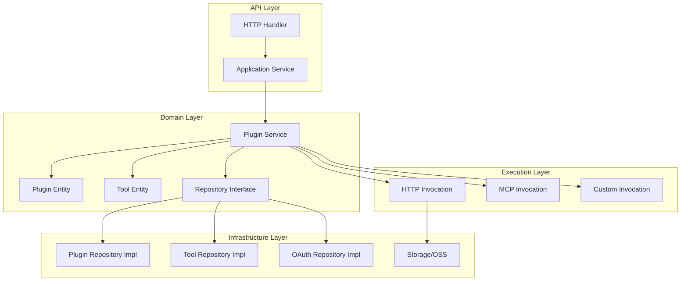
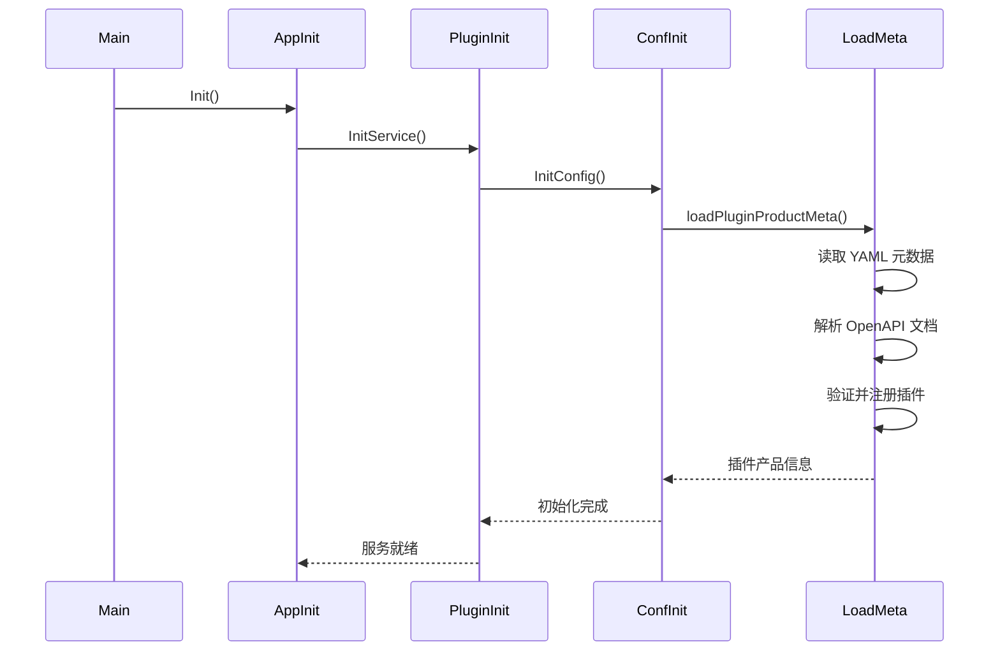
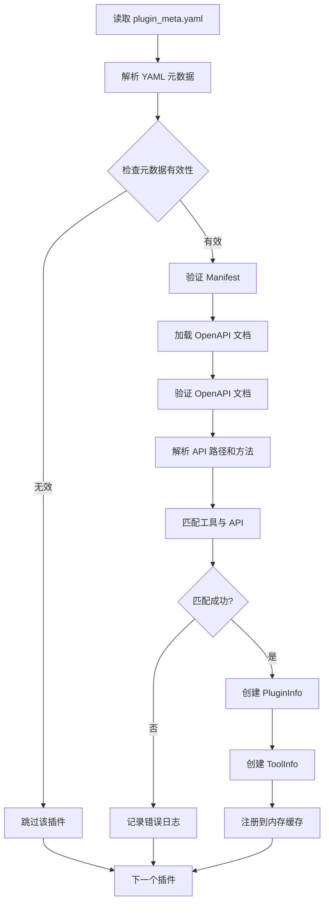
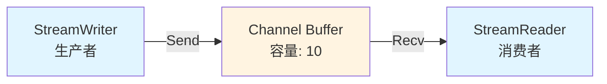
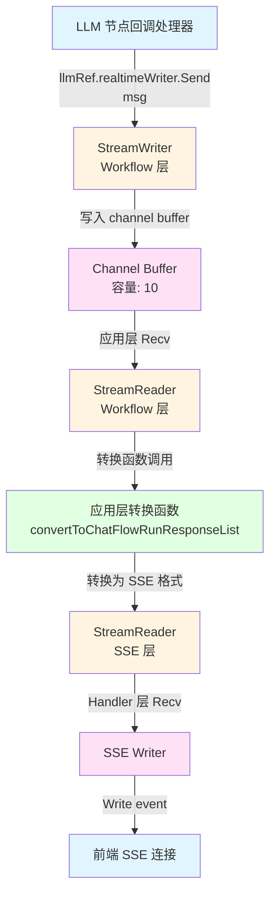
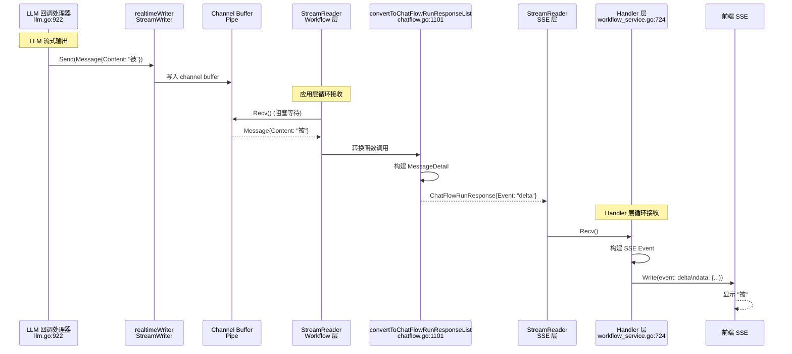
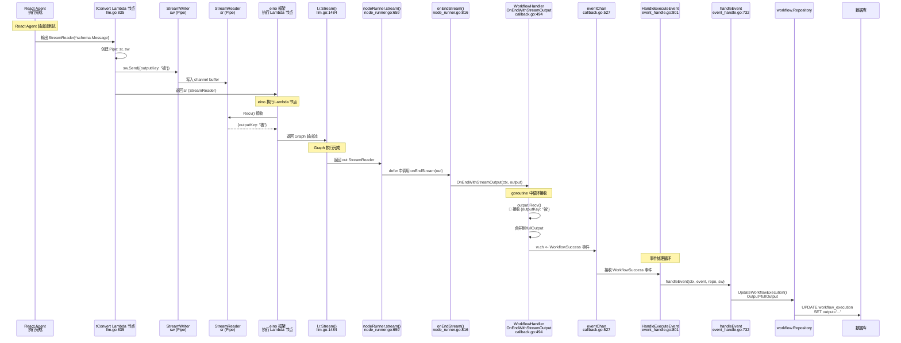
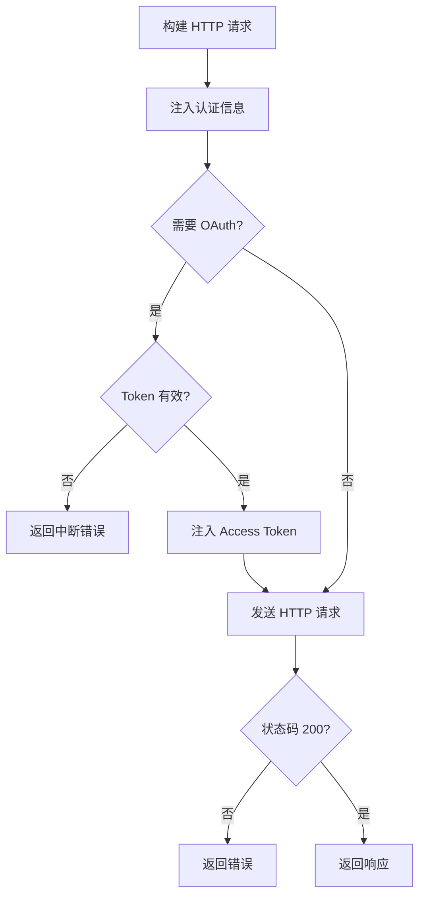

## 介绍

Coze Studio 的插件系统是连接 AI 模型与外部服务的桥梁，允许 AI 通过 **Function Calling** 的方式调用外部工具和服务。插件系统本质上是对外部 API 的标准化封装，使 LLM 能够：

- 🔍 **获取实时数据**：搜索、天气、新闻等
- 🛠️ **执行操作**：发送邮件、创建文件、远程命令执行等
- 🔗 **集成第三方服务**：数据库、云服务、MCP 服务器等


> 大家可以看到标题是插件分析和二次开发，对没错，想要二开插件就必须要知道整个 `coze` 插件的运转和执行流程，相当于为后续开发 MCP 插件奠定基础


下面我们就一起来看下 coze-studio 整个插件系统的设计和 LLM 如何建立起关系的，我们就围绕这两点然后一步一步跟着源码深入进去

> 注意：插件部分本小节只会对 Coze 是如何结合 HTTP 插件进行工作的做为抛砖引玉，MCP 和自定义需要自行去分析，当然 coze 官方还未对 mcp 进行实现，下一篇我们会对插件进行二次开发，将支持在前端配置 mcpservers ，感兴趣的可以先部署尝试
>
> 
>
> Github: https://github.com/yangkun19921001/coze-studio-plus
>
> 如果觉得体验不错的，可以给一个小心心❤️

### 核心概念

目前插件是由以下几点构成


#### Plugin（插件）

- **定义**：一个插件代表一个外部服务或功能集合
- **组成**：包含多个 Tool（工具/API）
- **元数据**：包含名称、描述、图标、认证信息等

#### Tool（工具/API）

- **定义**：插件中的一个具体功能接口
- **描述**：基于 OpenAPI 3.0 规范定义
- **参数**：支持 Header、Path、Query、Body 等多种参数位置

#### Manifest（清单）

- **定义**：插件的配置清单，描述插件的元信息和 API 配置
- **内容**：包含插件类型、认证方式、公共参数等


### 架构分层设计

Coze Studio 插件系统保持与整个系统架构一样，还是采用分层架构设计，遵循 DDD（领域驱动设计）原则：



**关键目录结构**：

```
backend/
├── api/                    # API 层
│   └── handler/            # HTTP 处理器
├── application/            # 应用层
│   └── plugin/            # 插件应用服务
├── domain/                 # 领域层
│   └── plugin/
│       ├── entity/         # 实体定义
│       ├── service/        # 领域服务
│       │   └── tool/       # 工具执行实现
│       ├── repository/     # 仓储接口
│       └── conf/           # 配置加载
└── crossdomain/            # 跨域层
    └── plugin/             # 插件跨域接口
```

---


## 插件类型体系

目前 coze 还不支持 mcp ,但是下一篇将介绍如何基于 coze-studio 支持 mcp server 配置，所以本节主要介绍一个 HTTP 插件为主，因为原理都大同小异

### 插件类型定义

Coze Studio 支持三种插件类型，定义在 `backend/crossdomain/plugin/consts/consts.go`：


### 插件类型对比

| 类型               | 常量值               | 描述                   | 使用场景                    | 执行方式           |
| ------------------ | -------------------- | ---------------------- | --------------------------- | ------------------ |
| **OpenAPI Plugin** | `openapi`            | 标准 HTTP RESTful API  | 传统 Web API 集成           | HTTP 请求          |
| **MCP Plugin**     | `coze-studio-mcp`    | Model Context Protocol | 连接 MCP 服务器、实时数据源 | MCP 协议调用       |
| **Custom Plugin**  | `coze-studio-custom` | 自定义内部逻辑         | 内置功能、特殊处理          | 注册的自定义处理器 |

#### OpenAPI Plugin（HTTP 插件）

- **特点**：基于 OpenAPI 3.0 规范
- **执行**：通过 HTTP 客户端发送 RESTful 请求
- **认证**：支持 OAuth、API Key、Service Token 等
- **适用**：大多数第三方 Web API

#### MCP Plugin（MCP 插件）

- **特点**：基于 Model Context Protocol
- **执行**：通过 MCP 客户端调用工具
- **配置**：在 Manifest 的 `api.extensions.mcp_config` 中配置
- **适用**：需要实时连接、流式数据的场景

#### Custom Plugin（自定义插件）

- **特点**：内部自定义逻辑
- **执行**：通过注册的自定义处理器
- **注册**：使用 `tool.RegisterCustomTool()` 注册
- **适用**：系统内置功能、特殊业务逻辑


## 后端插件加载流程

### 初始化流程

插件系统的初始化在应用启动时进行，流程如下：



**关键代码路径**：


1. **应用初始化**：`backend/application/application.go::Init()`
2. **插件服务初始化**：`backend/application/plugin/init.go::InitService()`
3. **配置初始化**：`backend/domain/plugin/conf/config.go::InitConfig()`
4. **元数据加载**：`backend/domain/plugin/conf/load_plugin.go::loadPluginProductMeta()`

**核心代码详解**：

#### 1. 应用层初始化

```go
// backend/application/application.go
func Init(ctx context.Context) (err error) {
    // ... 其他初始化 ...
    
    // 初始化主服务（包含插件服务）
    primaryServices, err := initPrimaryServices(ctx, basicServices)
    if err != nil {
        return fmt.Errorf("Init - initPrimaryServices failed, err: %v", err)
    }
    
    // ...
}

func initPrimaryServices(ctx context.Context, basicServices *basicServices) (*primaryServices, error) {
    // 初始化插件服务
    pluginSVC, err := plugin.InitService(ctx, basicServices.toPluginServiceComponents())
    if err != nil {
        return nil, err
    }
    
    // ...
    return &primaryServices{
        pluginSVC: pluginSVC,
        // ...
    }, nil
}
```

#### 2. 插件服务初始化

```go
// backend/application/plugin/init.go
func InitService(ctx context.Context, components *ServiceComponents) (*PluginApplicationService, error) {
    // 1. 初始化插件配置（加载产品元数据）
    err := conf.InitConfig(ctx)
    if err != nil {
        return nil, err
    }
    
    // 2. 创建仓储实现
    toolRepo := repository.NewToolRepo(&repository.ToolRepoComponents{
        IDGen: components.IDGen,
        DB:    components.DB,
    })
    
    pluginRepo := repository.NewPluginRepo(&repository.PluginRepoComponents{
        IDGen: components.IDGen,
        DB:    components.DB,
    })
    
    oauthRepo := repository.NewOAuthRepo(&repository.OAuthRepoComponents{
        IDGen: components.IDGen,
        DB:    components.DB,
    })
    
    // 3. 创建领域服务
    pluginSVC := service.NewService(&service.Components{
        IDGen:      components.IDGen,
        DB:         components.DB,
        OSS:        components.OSS,
        PluginRepo: pluginRepo,
        ToolRepo:   toolRepo,
        OAuthRepo:  oauthRepo,
    })
    
    // 4. 检查产品插件 ID 是否与数据库中的草稿插件冲突
    err = checkIDExist(ctx, pluginSVC)
    if err != nil {
        return nil, err
    }
    
    // 5. 组装应用服务
    PluginApplicationSVC.DomainSVC = pluginSVC
    PluginApplicationSVC.eventbus = components.EventBus
    PluginApplicationSVC.oss = components.OSS
    PluginApplicationSVC.userSVC = components.UserSVC
    PluginApplicationSVC.pluginRepo = pluginRepo
    PluginApplicationSVC.toolRepo = toolRepo
    
    return PluginApplicationSVC, nil
}

// 检查产品插件 ID 是否已存在于数据库中
func checkIDExist(ctx context.Context, pluginService service.PluginService) error {
    // 获取所有产品插件
    pluginProducts := conf.GetAllPluginProducts()
    
    pluginIDs := make([]int64, 0, len(pluginProducts))
    var toolIDs []int64
    for _, p := range pluginProducts {
        pluginIDs = append(pluginIDs, p.Info.ID)
        toolIDs = append(toolIDs, p.ToolIDs...)
    }
    
    // 检查插件 ID 是否冲突
    pluginInfos, err := pluginService.MGetDraftPlugins(ctx, pluginIDs)
    if err != nil {
        return err
    }
    if len(pluginInfos) > 0 {
        // 发现冲突，返回错误
        conflictsIDs := make([]int64, 0, len(pluginInfos))
        for _, p := range pluginInfos {
            conflictsIDs = append(conflictsIDs, p.ID)
        }
        return errorx.New(errno.ErrPluginIDExist, ...)
    }
    
    // 检查工具 ID 是否冲突
    tools, err := pluginService.MGetDraftTools(ctx, toolIDs)
    if err != nil {
        return err
    }
    if len(tools) > 0 {
        // 发现冲突，返回错误
        conflictsIDs := make([]int64, 0, len(tools))
        for _, t := range tools {
            conflictsIDs = append(conflictsIDs, t.ID)
        }
        return errorx.New(errno.ErrToolIDExist, ...)
    }
    
    return nil
}
```

#### 3. 配置初始化

```go
// backend/domain/plugin/conf/config.go
func InitConfig(ctx context.Context) (err error) {
    // 1. 获取当前工作目录
    cwd, err := os.Getwd()
    if err != nil {
        logs.Warnf("[InitConfig] Failed to get current working directory: %v", err)
        cwd = os.Getenv("PWD")
    }
    
    // 2. 构建插件配置路径
    basePath := path.Join(cwd, "resources", "conf", "plugin")
    logs.CtxInfof(ctx, "basePath=%s", basePath)
    
    // 3. 加载插件产品元数据
    err = loadPluginProductMeta(ctx, basePath)
    if err != nil {
        return err
    }
    
    // 4. 加载 OAuth Schema
    err = loadOAuthSchema(ctx, basePath)
    if err != nil {
        return err
    }
    
    return nil
}
```

### 3.2 插件产品元数据加载

插件产品元数据存储在 `backend/conf/plugin/pluginproduct/` 目录下，采用 YAML 格式：

**元数据结构**：

```yaml
plugin_id: 1001                    # 插件 ID
deprecated: false                   # 是否已废弃
version: "1.0.0"                    # 版本号（需符合 semver）
plugin_type: PLUGIN                 # 插件类型
openapi_doc_file: "weather.yaml"    # OpenAPI 文档文件名
manifest:                           # 插件清单
  api:
    type: "openapi"                 # API 类型
    url: "https://api.example.com"  # 服务器 URL
  name_for_human: "天气插件"        # 显示名称
tools:                              # 工具列表
  - tool_id: 2001                   # 工具 ID
    deprecated: false               # 是否已废弃
    method: "GET"                   # HTTP 方法
    sub_url: "/weather"             # 子路径
```

**加载流程**：



**关键代码**：`backend/domain/plugin/conf/load_plugin.go`

```go
func loadPluginProductMeta(ctx context.Context, basePath string) (err error) {
    // 1. 读取元数据文件
    metaFile := path.Join(root, "plugin_meta.yaml")
    file, err := os.ReadFile(metaFile)
    
    // 2. 解析 YAML
    var pluginsMeta []*pluginProductMeta
    err = yaml.Unmarshal(file, &pluginsMeta)
    
    // 3. 遍历每个插件元数据
    for _, m := range pluginsMeta {
        // 4. 检查元数据有效性
        if !checkPluginMetaInfo(ctx, m) {
            continue
        }
        
        // 5. 验证 Manifest
        err = m.Manifest.Validate(true)
        
        // 6. 加载 OpenAPI 文档
        docPath := path.Join(root, m.OpenapiDocFile)
        loader := openapi3.NewLoader()
        _doc, err := loader.LoadFromFile(docPath)
        
        // 7. 验证 OpenAPI 文档
        err = doc.Validate(ctx)
        
        // 8. 创建 PluginInfo
        pi := &PluginInfo{
            Info: &model.PluginInfo{
                ID:         m.PluginID,
                PluginType: m.PluginType,
                Version:    ptr.Of(m.Version),
                ServerURL:  ptr.Of(doc.Servers[0].URL),
                Manifest:   m.Manifest,
                OpenapiDoc: doc,
            },
            ToolIDs: make([]int64, 0, len(m.Tools)),
        }
        
        // 9. 解析 API 路径和方法
        apis := make(map[dto.UniqueToolAPI]*model.Openapi3Operation)
        for subURL, pathItem := range doc.Paths {
            for method, op := range pathItem.Operations() {
                api := dto.UniqueToolAPI{
                    SubURL: subURL,
                    Method: strings.ToUpper(method),
                }
                apis[api] = model.NewOpenapi3Operation(op)
            }
        }
        
        // 10. 匹配工具与 API
        for _, t := range m.Tools {
            api := dto.UniqueToolAPI{
                SubURL: t.SubURL,
                Method: strings.ToUpper(t.Method),
            }
            op, ok := apis[api]
            if !ok {
                continue
            }
            
            // 11. 创建 ToolInfo
            toolProducts[t.ToolID] = &ToolInfo{
                Info: &entity.ToolInfo{
                    ID:        t.ToolID,
                    PluginID:  m.PluginID,
                    Method:    ptr.Of(t.Method),
                    SubURL:    ptr.Of(t.SubURL),
                    Operation: op,
                },
            }
            
            pi.ToolIDs = append(pi.ToolIDs, t.ToolID)
        }
        
        // 12. 注册到内存缓存
        pluginProducts[m.PluginID] = pi
    }
    
    return nil
}
```

### 3.3 OpenAPI 文档解析

OpenAPI 文档解析使用 `github.com/getkin/kin-openapi` 库：

**解析步骤**：

1. **加载文档**：从文件系统读取 YAML/JSON 格式的 OpenAPI 文档
2. **解析结构**：解析为 `openapi3.T` 结构体
3. **验证规范**：验证文档是否符合 OpenAPI 3.0 规范
4. **提取操作**：提取每个路径的操作（GET、POST 等）
5. **构建 Schema**：构建参数和响应的 Schema 定义

**关键数据结构**：

```go
type PluginInfo struct {
    Info    *model.PluginInfo      // 插件基本信息
    ToolIDs []int64                // 工具 ID 列表
}

type ToolInfo struct {
    Info *entity.ToolInfo          // 工具信息
}

type ToolInfo struct {
    ID              int64
    PluginID        int64
    Version         *string
    Method          *string         // HTTP 方法
    SubURL          *string         // 子路径
    Operation       *model.Openapi3Operation  // OpenAPI 操作定义
    ActivatedStatus *int32
    DebugStatus     *int32
}
```

### 3.4 插件注册与缓存

插件加载完成后，会注册到内存缓存中：

**缓存结构**：

```go
var (
    pluginProducts map[int64]*PluginInfo  // 插件 ID -> PluginInfo
    toolProducts   map[int64]*ToolInfo    // 工具 ID -> ToolInfo
)
```

**访问接口**：

```go
// 获取插件产品信息
func GetPluginProduct(pluginID int64) (*PluginInfo, bool)

// 批量获取插件产品信息
func MGetPluginProducts(pluginIDs []int64) []*PluginInfo

// 获取工具产品信息
func GetToolProduct(toolID int64) (*ToolInfo, bool)

// 批量获取工具产品信息
func MGetToolProducts(toolIDs []int64) []*ToolInfo
```

**特点**：

- ✅ **线程安全**：使用深拷贝返回，避免并发修改
- ✅ **快速访问**：O(1) 时间复杂度
- ✅ **启动时加载**：应用启动时一次性加载，运行时只读


可以看到，当前 coze-studio 是在服务启动时，会加载 `coze-studio/backend/resources/conf/plugin/pluginproduct/plugin_meta.yaml` 这个文件，内部会解析后缓存到内存中。


## 插件执行流程

### 4.1 执行场景

插件可以在多种场景下执行，定义在 `backend/crossdomain/plugin/consts/consts.go`：

```go
type ExecuteScene string

const (
    ExecSceneOfOnlineAgent ExecuteScene = "online_agent"   // 在线 Agent
    ExecSceneOfDraftAgent ExecuteScene = "draft_agent"    // 草稿 Agent
    ExecSceneOfWorkflow    ExecuteScene = "workflow"      // Workflow
    ExecSceneOfToolDebug   ExecuteScene = "tool_debug"     // 工具调试
)
```

### 4.2 StreamWriter/StreamReader 工作原理

理解执行流程前，先看 coze-studio 的流式输出机制：**StreamWriter/StreamReader**。

#### 4.2.1 Pipe 机制

`StreamWriter` 和 `StreamReader` 通过 `schema.Pipe()` 创建，形成生产者-消费者通道：

```go
sr, sw := schema.Pipe[*entity.Message](10)  // 缓冲区大小为 10
```

工作方式：



特性：

1. **线程安全**：内部使用 channel，支持并发读写
2. **缓冲机制**：缓冲区满时 `Send` 阻塞，空时 `Recv` 阻塞
3. **流式传输**：逐条消息传输，无需等待完整结果
4. **错误传播**：`Send(msg, err)` 可传递错误，`Recv()` 返回该错误

实现（`github.com/cloudwego/eino/schema/stream.go`）：

```go
func Pipe[T any](cap int) (*StreamReader[T], *StreamWriter[T]) {
    stm := newStream[T](cap)
    return stm.asReader(), &StreamWriter[T]{stm: stm}
}

func (sw *StreamWriter[T]) Send(chunk T, err error) (closed bool) {
    return sw.stm.send(chunk, err)
}

func (sr *StreamReader[T]) Recv() (T, error) {
    return sr.stm.recv()
}
```

#### 4.2.2 消息流转路径

Workflow 流式执行中的消息流转：



说明：

- `llmRef.realtimeWriter` 是 Workflow 层创建的 `StreamWriter`，绑定在执行上下文
- 消息通过 Pipe 的 channel buffer 传递，实现异步非阻塞传输
- 应用层通过 `StreamReader.Recv()` 循环接收消息，转换为 SSE 事件格式

### 4.3 两种消息流处理机制

LLM 节点在执行过程中会产生两种不同类型的消息流，它们有不同的发送路径、接收方式和处理目的：

1. **实时流处理**：用于前端实时显示，通过 `realtimeWriter.Send()` 发送，经过 `convertToChatFlowRunResponseList` 转换为 SSE 事件推送给前端
2. **节点输出流处理**：用于节点间数据流转和数据库存储，通过 `tConvert` 中的 `sw.Send()` 发送，经过 `WorkflowHandler.OnEndWithStreamOutput` 处理并保存到数据库

下面分别详细分析这两种消息流的完整处理流程。

### 4.3.1 实时流处理（前端实时显示）

实时流处理用于将 LLM 节点的增量输出实时推送给前端，实现打字机效果。消息通过 `realtimeWriter.Send()` 发送，经过应用层转换后通过 SSE 推送给前端。

#### 4.3.1.1 消息发送：LLM 回调处理器

代码位置：`backend/domain/workflow/internal/nodes/llm/llm.go:906-923`

LLM 节点在构建时创建工具回调处理器，在 LLM 流式输出时通过 `realtimeWriter.Send()` 发送消息：

```go
toolCallbackHandler = callbacks2.NewHandlerHelper().
	ChatModel(&callbacks2.ModelCallbackHandler{
		OnEndWithStreamOutput: func(ctx context.Context, info *callbacks.RunInfo, 
			output *schema.StreamReader[*model.CallbackOutput]) context.Context {
			
			safego.Go(ctx, func() {
				exeCtx := execute.GetExeCtx(ctx)
				for {
					frame, err := output.Recv()
					if errors.Is(err, io.EOF) {
						break
					}
					if frame.Message.Content != "" {
						// 🚀 实时发送消息到 Workflow StreamContainer
						if llmRef != nil && llmRef.realtimeWriter != nil && exeCtx != nil {
							dataMsg := &entity.DataMessage{
								Type:      entity.Answer,
								Content:   frame.Message.Content,
								Role:      schema.Assistant,
								NodeType:  entity.NodeTypeLLM,
								ExecuteID: exeCtx.RootExecuteID,
								NodeID:    string(exeCtx.NodeKey),
								NodeTitle: exeCtx.NodeName,
							}
							msg := &entity.Message{
								DataMessage: dataMsg,
							}
							llmRef.realtimeWriter.Send(msg, nil)
						}
					}
				}
			})
			return ctx
		},
	})
```

**说明**：
- `llmRef.realtimeWriter` 是在 `LLM.Stream()` 执行时从执行上下文获取的 `StreamWriter`
- 消息格式为 `entity.Message{DataMessage: &entity.DataMessage{Type: Answer, Content: "被"}}`
- 在独立的 goroutine 中发送，不会阻塞 LLM 执行

#### 4.3.1.2 StreamWriter 创建和绑定

代码位置：`backend/domain/workflow/service/executable_impl.go:986`

Workflow 引擎在执行时创建 StreamWriter/StreamReader Pipe：

```go
sr, sw := schema.Pipe[*entity.Message](10)
```

代码位置：`backend/domain/workflow/internal/compose/workflow_run.go:307`

StreamWriter 通过 `compose.WithStreamWriter(sw)` 传入 WorkflowRunner，并绑定到执行上下文：

```go
cancelCtx, executeID, opts, _, err := compose.NewWorkflowRunner(
	wfEntity.GetBasic(), workflowSC, config,
	compose.WithStreamWriter(sw),
).Prepare(ctx)
```

代码位置：`backend/domain/workflow/internal/nodes/llm/llm.go:1465`

LLM 节点在执行时从执行上下文获取 StreamWriter：

```go
exeCtx := execute.GetExeCtx(ctx)
if exeCtx != nil && exeCtx.RootCtx.StreamWriter != nil {
	l.realtimeWriter = exeCtx.RootCtx.StreamWriter
}
```

#### 4.3.1.3 消息接收：应用层转换

代码位置：`backend/application/workflow/chatflow.go:651`

应用层通过 `StreamReaderWithConvert` 将 `StreamReader[*entity.Message]` 转换为 `StreamReader[[]*ChatFlowRunResponse]`：

```go
sr, err := GetWorkflowDomainSVC().StreamExecute(ctx, exeCfg, parameters)
return schema.StreamReaderWithConvert(sr, w.convertToChatFlowRunResponseList(ctx, convertToChatFlowInfo{
	bizID:            bizID,
	conversationID:   conversationID,
	roundID:          roundID,
	workflowID:       workflowID,
	sectionID:        sectionID,
	unbinding:        unbinding,
	userMessage:      userSchemaMessage,
	suggestReplyInfo: req.GetSuggestReplyInfo(),
})), nil
```

代码位置：`backend/application/workflow/chatflow.go:1101-1120`

转换函数 `convertToChatFlowRunResponseList` 将 `entity.Message` 转换为 SSE 事件格式：

```go
func (w *ApplicationService) convertToChatFlowRunResponseList(ctx context.Context, info convertToChatFlowInfo) 
	func(msg *entity.Message) (responses []*workflow.ChatFlowRunResponse, err error) {
	
	return func(msg *entity.Message) (responses []*workflow.ChatFlowRunResponse, err error) {
		// 处理数据消息（LLM 增量输出）
		if msg.DataMessage != nil && msg.Type == entity.Answer {
			deltaData, _ := sonic.MarshalString(&vo.MessageDetail{
				ID:             strconv.FormatInt(messageDetailID, 10),
				ChatID:         strconv.FormatInt(roundID, 10),
				ConversationID: strconv.FormatInt(conversationID, 10),
				SectionID:      strconv.FormatInt(sectionID, 10),
				BotID:          strconv.FormatInt(bizID, 10),
				Role:           string(dataMessage.Role),
				Type:           string(dataMessage.Type),
				ContentType:    string(message.ContentTypeText),
				Content:        msg.Content,  // "被"
				Extra:          extra,
			})
			
			if !msg.Last {
				return []*workflow.ChatFlowRunResponse{
					{Event: string(vo.ChatFlowMessageDelta), Data: deltaData},
				}, nil
			}
		}
		
		return nil, schema.ErrNoValue
	}
}
```

**说明**：
- `StreamReaderWithConvert` 在每次 `Recv()` 时调用转换函数
- 增量消息（`msg.Last == false`）返回 `ChatFlowMessageDelta` 事件
- `schema.ErrNoValue` 表示跳过该消息

#### 4.3.1.4 SSE 推送：Handler 层

代码位置：`backend/api/handler/coze/workflow_service.go:1091`

HTTP Handler 接收请求并创建 SSE Writer：

```go
func OpenAPIChatFlowRun(ctx context.Context, c *app.RequestContext) {
    var req workflow.ChatFlowRunRequest
    err = c.BindAndValidate(&req)
    
    w := sse.NewWriter(c)
    c.SetContentType("text/event-stream; charset=utf-8")
    c.Response.Header.Set("Cache-Control", "no-cache")
    c.Response.Header.Set("Connection", "keep-alive")
    
    sr, err := appworkflow.SVC.OpenAPIChatFlowRun(ctx, &req)
    sendChatFlowStreamRunSSE(ctx, w, sr)
}
```

代码位置：`backend/api/handler/coze/workflow_service.go:724`

Handler 层循环接收消息并发送 SSE 事件：

```go
func sendChatFlowStreamRunSSE(ctx context.Context, w *sse.Writer, 
    sr *schema.StreamReader[[]*workflow.ChatFlowRunResponse]) {
    defer func() {
		_ = w.Close()
		sr.Close()
    }()
    
    seq := int64(1)
    for {
        respList, err := sr.Recv()
            if errors.Is(err, io.EOF) {
			break
		}
		
        for _, resp := range respList {
            event := &sse.Event{
                ID:   strconv.FormatInt(seq, 10),
				Type: resp.Event,
				Data: []byte(resp.Data),
            }
            w.Write(event)
            seq++
        }
    }
}
```

#### 4.3.1.5 实时流处理完整流程



**关键代码位置总结**：

| 步骤 | 代码位置 | 关键操作 |
|------|---------|---------|
| **发送** | `llm.go:922` | `llmRef.realtimeWriter.Send(msg, nil)` |
| **Pipe 创建** | `executable_impl.go:986` | `sr, sw := schema.Pipe[*entity.Message](10)` |
| **绑定到上下文** | `workflow_run.go:307` | `compose.WithStreamWriter(sw)` |
| **获取 StreamWriter** | `llm.go:1465` | `l.realtimeWriter = exeCtx.RootCtx.StreamWriter` |
| **应用层接收** | `chatflow.go:651` | `StreamReaderWithConvert(sr, convertToChatFlowRunResponseList)` |
| **消息转换** | `chatflow.go:1101` | `convertToChatFlowRunResponseList()` 转换函数 |
| **SSE 推送** | `workflow_service.go:724` | `sendChatFlowStreamRunSSE()` 循环发送 |

### 4.3.2 节点输出流处理（节点间数据流转和数据库存储）

节点输出流处理用于将 LLM 节点的完整输出作为 Graph 的返回值，用于节点间数据流转，并最终保存到数据库。消息通过 `tConvert` 中的 `sw.Send()` 发送，经过 `WorkflowHandler.OnEndWithStreamOutput` 处理并保存到数据库。

#### 4.3.2.1 tConvert 函数：节点输出转换

代码位置：`backend/domain/workflow/internal/nodes/llm/llm.go:794-841`

`tConvert` 是一个 Lambda 节点转换函数，将 React Agent 的输出流转换为 Graph 的输出流：

```go
tConvert := func(_ context.Context, s *schema.StreamReader[*schema.Message], _ ...struct{}) 
	(*schema.StreamReader[map[string]any], error) {
	
	// 1. 创建 Pipe：sr 是接收端，sw 是发送端
	sr, sw := schema.Pipe[map[string]any](0)
	
	safego.Go(ctx, func() {
		reasoningDone := false
		defer func() {
			if llmRef != nil && llmRef.realtimeWriter != nil {
				llmRef.realtimeWriter = nil
				logs.Infof("🧹 [tConvert] Cleared realtimeWriter reference as React Agent completed")
			}
		}()
		
		for {
			msg, err := s.Recv()  // 从 React Agent 的输出流接收
			if err != nil {
				if err == io.EOF {
					sw.Send(map[string]any{outputKey: nodes.KeyIsFinished}, nil)
					sw.Close()
					return
				}
				sw.Send(nil, err)
				sw.Close()
				return
			}
			
			if len(msg.Content) > 0 {
				// 2. 🔑 发送消息到 Pipe（节点输出流）
				sw.Send(map[string]any{outputKey: msg.Content}, nil)
			}
		}
	})
	
	// 3. 返回 StreamReader（接收端）
	return sr, nil
}
```

**说明**：
- `tConvert` 被包装成 Lambda 节点 `outputConvertNodeKey`，添加到 Graph 中
- Graph 结构：`llmNodeKey`（React Agent）→ `outputConvertNodeKey`（tConvert）→ `END`
- `sw.Send()` 发送的数据格式：`map[string]any{outputKey: msg.Content}`

#### 4.3.2.2 eino 框架执行 Lambda 节点

**代码路径**：`eino/compose/lambda_node.go`（eino 框架内部）

当 eino 框架执行 `outputConvertNodeKey` Lambda 节点时：

1. 调用 `tConvert(ctx, s)`，传入 React Agent 的输出流 `s`
2. `tConvert` 返回 `sr`（StreamReader）
3. eino 框架从 `sr.Recv()` 接收数据，作为该节点的输出
4. 这个输出成为 Graph 的输出流

#### 4.3.2.3 Graph 输出流返回

代码位置：`backend/domain/workflow/internal/nodes/llm/llm.go:1484`

`LLM.Stream()` 执行 Graph，返回输出流：

```go
out, err = l.r.Stream(ctx, in, composeOpts...)
// out 是 StreamReader[map[string]any]，包含 tConvert 通过 sw.Send() 发送的所有数据
```

**说明**：
- `l.r` 是编译后的 Graph Runner
- `l.r.Stream()` 执行整个 Graph，返回最终的输出流
- 这个输出流包含 `tConvert` 通过 `sw.Send()` 发送的所有消息

#### 4.3.2.4 nodeRunner 处理输出流

代码位置：`backend/domain/workflow/internal/compose/node_runner.go:368-415`

节点执行包装器在 defer 中调用 `onEndStream`：

```go
func (nc *nodeRunConfig[O]) stream() func(ctx context.Context, input map[string]any, opts ...O) 
	(output *schema.StreamReader[map[string]any], err error) {
	
	return func(ctx context.Context, input map[string]any, opts ...O) (output *schema.StreamReader[map[string]any], err error) {
		ctx, runner := newNodeRunner(ctx, nc)
		
		defer func() {
			if err == nil {
				output, err = runner.onEndStream(ctx, output)
			}
		}()
		
		// ... 初始化、预处理 ...
		return runner.stream(ctx, input, opts...)
	}
}
```

代码位置：`backend/domain/workflow/internal/compose/node_runner.go:795-818`

`onEndStream` 调用回调处理器的 `OnEndWithStreamOutput`：

```go
func (r *nodeRunner[O]) onEndStream(ctx context.Context, output *schema.StreamReader[map[string]any]) 
	(*schema.StreamReader[map[string]any], error) {

	// 🔑 调用回调处理器的 OnEndWithStreamOutput
	_, newOutput := callbacks.OnEndWithStreamOutput(ctx, output)
	return newOutput, nil
}
```

**说明**：
- `output` 就是 `LLM.Stream()` 返回的 `out` StreamReader
- `callbacks.OnEndWithStreamOutput()` 会调用注册的回调处理器
- 对于 Workflow 层，会调用 `WorkflowHandler.OnEndWithStreamOutput()`

#### 4.3.2.5 WorkflowHandler 接收并处理

代码位置：`backend/domain/workflow/internal/execute/callback.go:481-531`

`WorkflowHandler.OnEndWithStreamOutput()` 接收 Graph 的输出流，合并数据并发送事件：

```go
func (w *WorkflowHandler) OnEndWithStreamOutput(ctx context.Context, info *callbacks.RunInfo,
	output *schema.StreamReader[callbacks.CallbackOutput]) context.Context {
	
	if info.Component != compose.ComponentOfWorkflow || (info.Name != strconv.FormatInt(w.getRootWorkflowID(), 10) &&
		info.Name != strconv.FormatInt(w.getSubWorkflowID(), 10)) {
		output.Close()
		return ctx
	}
	
	safego.Go(ctx, func() {
		defer output.Close()
		fullOutput := make(map[string]any)
		
		// 🔑 循环接收 Graph 的输出流
		for {
			chunk, e := output.Recv()  // 这里接收的就是 tConvert 通过 sw.Send() 发送的数据
			if e != nil {
				if e == io.EOF {
					break
				}
				logs.Errorf("workflow OnEndWithStreamOutput failed to receive stream output: %v", e)
				_ = w.OnError(ctx, info, e)
				return
			}
			fullOutput, e = nodes.ConcatTwoMaps(fullOutput, chunk.(map[string]any))
			if e != nil {
				logs.Errorf("failed to concat two maps: %v", e)
				return
			}
		}
		
		// 发送 WorkflowSuccess 事件（包含完整输出）
		c := GetExeCtx(ctx)
		e := &Event{
			Type:     WorkflowSuccess,
			Context:  c,
			Duration: time.Since(time.UnixMilli(c.StartTime)),
			Output:   fullOutput,  // 包含所有节点输出的完整数据
		}
		
		if c.TokenCollector != nil {
			usage := c.TokenCollector.wait()
			e.Token = &TokenInfo{
				InputToken:  int64(usage.PromptTokens),
				OutputToken: int64(usage.CompletionTokens),
				TotalToken:  int64(usage.TotalTokens),
			}
		}
		w.ch <- e  // 发送到 eventChan
	})
	
	return ctx
}
```

**说明**：
- `output.Recv()` 接收的就是 `tConvert` 通过 `sw.Send()` 发送的数据
- 数据格式：`map[string]any{outputKey: msg.Content}`
- 最终这些数据会被合并到 `fullOutput` 中，作为 Workflow 的完整输出
- 发送 `WorkflowSuccess` 事件到 `eventChan`

#### 4.3.2.6 HandleExecuteEvent 接收事件

代码位置：`backend/domain/workflow/internal/compose/workflow_run.go:136, 307`

创建 `eventChan` 并启动 goroutine 监听事件：

```go
eventChan := make(chan *execute.Event)

safego.Go(ctx, func() {
	lastEventChan <- execute.HandleExecuteEvent(ctx, executeID, eventChan, cancelFn, timeoutFn,
		repo, sw, config)
	close(lastEventChan)
})
```

代码位置：`backend/domain/workflow/internal/execute/event_handle.go:702-820`

`HandleExecuteEvent` 循环接收事件并处理：

```go
func HandleExecuteEvent(ctx context.Context,
	wfExeID int64,
	eventChan <-chan *Event,  // 🔑 从 eventChan 接收事件
	cancelFn context.CancelFunc,
	timeoutFn context.CancelFunc,
	repo workflow.Repository,  // 🔑 数据库操作接口
	sw *schema.StreamWriter[*entity.Message],
	exeCfg workflowModel.ExecuteConfig,
) (event *Event) {
	
	handler := func(event *Event) *Event {
		// 🔑 调用 handleEvent 处理事件
		signal, err := handleEvent(ctx, event, repo, sw)
	// ...
	}
	
	// 🔑 循环接收事件
	for {
		select {
		case event = <-eventChan:  // ← 从 eventChan 接收
			if terminalE := handler(event); terminalE != nil {
				return terminalE
			}
		}
	}
}
```

#### 4.3.2.7 handleEvent 处理事件并保存数据库

代码位置：`backend/domain/workflow/internal/execute/event_handle.go:99-559`

`handleEvent` 根据事件类型执行不同的处理逻辑，主要包括数据库操作：

```go
func handleEvent(ctx context.Context, event *Event, repo workflow.Repository,
	sw *schema.StreamWriter[*entity.Message],
) (signal terminateSignal, err error) {
	
	switch event.Type {
	case WorkflowStart:
		// 🔑 创建 Workflow 执行记录
		wfExec := &entity.WorkflowExecution{
			ID:                  exeID,
			WorkflowID:          wb.ID,
			Status:              entity.WorkflowRunning,
			Input:               ptr.Of(mustMarshalToString(event.Input)),
		// ...
		}
		if err = repo.CreateWorkflowExecution(ctx, wfExec); err != nil {
			return noTerminate, fmt.Errorf("failed to create workflow execution: %v", err)
		}
		
	case WorkflowSuccess:
		// 🔑 更新 Workflow 执行状态为成功
		wfExec := &entity.WorkflowExecution{
			ID:       exeID,
			Duration: event.Duration,
			Status:   entity.WorkflowSuccess,
			Output:   ptr.Of(mustMarshalToString(event.Output)),  // 🔑 包含完整输出（包含 sw.Send() 的数据）
			TokenInfo: &entity.TokenUsage{
				InputTokens:  event.GetInputTokens(),
				OutputTokens: event.GetOutputTokens(),
			},
		}
		var (
			updatedRows   int64
			currentStatus entity.WorkflowExecuteStatus
		)
		if updatedRows, currentStatus, err = repo.UpdateWorkflowExecution(ctx, wfExec, 
			[]entity.WorkflowExecuteStatus{entity.WorkflowRunning}); err != nil {
			return noTerminate, fmt.Errorf("failed to save workflow execution when successful: %v", err)
		}
		
	case NodeStart:
		// 🔑 创建节点执行记录
		nodeExec := &entity.NodeExecution{
			ID:       event.NodeExecuteID,
			Status:   entity.NodeRunning,
			// ...
		}
		if err = repo.CreateNodeExecution(ctx, nodeExec); err != nil {
			return noTerminate, fmt.Errorf("failed to create node execution: %v", err)
		}
		
	case NodeEnd, NodeEndStreaming:
		// 🔑 更新节点执行状态
		nodeExec := &entity.NodeExecution{
			ID:       event.NodeExecuteID,
			Status:   entity.NodeSuccess,
			Duration: event.Duration,
			Output:   ptr.Of(mustMarshalToString(event.Output)),  // 🔑 节点输出
			TokenInfo: &entity.TokenUsage{
				InputTokens:  event.GetInputTokens(),
				OutputTokens: event.GetOutputTokens(),
			},
		}
		if err = repo.UpdateNodeExecution(ctx, nodeExec); err != nil {
			return noTerminate, fmt.Errorf("failed to save node execution: %v", err)
		}
		
	case WorkflowFailed:
		// 🔑 更新 Workflow 执行状态为失败
		wfExec := &entity.WorkflowExecution{
			ID:       exeID,
			Status:   entity.WorkflowFailed,
			ErrorInfo: ptr.Of(event.Err.Error()),
		}
		if updatedRows, currentStatus, err = repo.UpdateWorkflowExecution(ctx, wfExec, 
			[]entity.WorkflowExecuteStatus{entity.WorkflowRunning}); err != nil {
			return noTerminate, fmt.Errorf("failed to save workflow execution when failed: %v", err)
		}
	}
	
	return noTerminate, nil
}
```

**说明**：
- `WorkflowSuccess` 事件会调用 `repo.UpdateWorkflowExecution()`，将 `event.Output`（包含 `sw.Send()` 发送的数据）保存到数据库的 `output` 字段
- `NodeEnd` 事件会调用 `repo.UpdateNodeExecution()`，将节点输出保存到数据库

#### 4.3.2.8 节点输出流处理完整流程



**关键代码位置总结**：

| 步骤 | 代码位置 | 关键操作 |
|------|---------|---------|
| **发送** | `llm.go:835` | `sw.Send(map[string]any{outputKey: msg.Content}, nil)` |
| **Pipe 创建** | `llm.go:795` | `sr, sw := schema.Pipe[map[string]any](0)` |
| **eino 接收** | `eino/compose/lambda_node.go` | eino 框架从 `sr.Recv()` 接收 |
| **Graph 返回** | `llm.go:1484` | `out, err = l.r.Stream(ctx, in, composeOpts...)` |
| **节点执行** | `node_runner.go:659` | `streamOutput, streamErr = r.s(ctx, input, opts...)` |
| **输出处理** | `node_runner.go:816` | `callbacks.OnEndWithStreamOutput(ctx, output)` |
| **回调接收** | `callback.go:494` | `chunk, e := output.Recv()` |
| **事件发送** | `callback.go:527` | `w.ch <- &Event{Type: WorkflowSuccess}` |
| **事件处理** | `event_handle.go:732` | `handleEvent(ctx, event, repo, sw)` |
| **数据库保存** | `event_handle.go:186` | `repo.UpdateWorkflowExecution()` |

### 4.3.3 两种消息流的对比

| 特性 | 实时流处理 | 节点输出流处理 |
|------|----------|--------------|
| **发送位置** | `llm.go:922` (工具回调处理器) | `llm.go:835` (tConvert Lambda 节点) |
| **发送方法** | `llmRef.realtimeWriter.Send()` | `sw.Send()` (tConvert 内部 Pipe) |
| **数据类型** | `entity.Message{DataMessage: ...}` | `map[string]any{outputKey: "被"}` |
| **用途** | 前端实时显示（打字机效果） | 节点间数据流转和数据库存储 |
| **接收位置** | `chatflow.go:1101` (convertToChatFlowRunResponseList) | `callback.go:494` (WorkflowHandler.OnEndWithStreamOutput) |
| **处理方式** | 转换为 SSE 事件格式，推送给前端 | 合并到 fullOutput，发送 WorkflowSuccess 事件 |
| **最终用途** | SSE 实时推送给前端 | 保存到数据库的 `output` 字段 |
| **是否到达 convertToChatFlowRunResponseList** | ✅ 是 | ❌ 否 |


### 4.4 HTTP 插件执行流程

这里只对 HTTP 插件做详细分析，MCP 和自定义的原理类似，感兴趣的可以翻阅源码。

#### 4.4.1 HTTP 执行器主流程


自定义、MCP、HTTP 都实现 `Invocation` 接口，如需实现其它插件，可参考其中一个实现。

HTTP 插件通过 `tool.NewHttpCallImpl()` 执行：



代码位置：`backend/domain/plugin/service/tool/invocation_http.go`

#### 4.4.2 HTTP 执行器 Do 方法实现

```go
func (h *httpCallImpl) Do(ctx context.Context, args *InvocationArgs) (request string, resp string, err error) {
    // 1. 构建 HTTP 请求（URL、Header、Body）
    httpReq, err := h.buildHTTPRequest(ctx, args)
    if err != nil {
        return "", "", err
    }
    
    // 2. 注入认证信息（OAuth、Service Token 等）
    errMsg, err := h.injectAuthInfo(ctx, httpReq, args)
    if err != nil {
        return "", "", err
    }
    
    // 3. 如果返回错误消息，说明需要 OAuth 授权
    if errMsg != "" {
        // 创建中断事件，通知调用方需要用户授权
        event := &model.ToolInterruptEvent{
            Event: pluginConsts.InterruptEventTypeOfToolNeedOAuth,
            ToolNeedOAuth: &model.ToolNeedOAuthInterruptEvent{
                Message: errMsg,  // 包含授权 URL 的错误消息
            },
        }
        // 返回中断错误，Workflow 引擎会暂停执行并等待授权
        return "", "", compose.NewInterruptAndRerunErr(event)
    }
    
    // 4. 读取请求体（用于序列化）
    var reqBodyBytes []byte
    if httpReq.GetBody != nil {
        reqBody, err := httpReq.GetBody()
        if err != nil {
            return "", "", err
        }
        defer reqBody.Close()
        reqBodyBytes, err = io.ReadAll(reqBody)
        if err != nil {
            return "", "", err
        }
    }
    
    // 5. 序列化请求（用于日志和返回给调用方）
    requestStr, err := genRequestString(httpReq, reqBodyBytes)
    if err != nil {
        return "", "", err
    }
    
    // 6. 使用 resty 发送 HTTP 请求
    restyReq := defaultHttpCli.NewRequest()
    restyReq.Header = httpReq.Header
    restyReq.Method = httpReq.Method
    restyReq.URL = httpReq.URL.String()
    if reqBodyBytes != nil {
        restyReq.SetBody(reqBodyBytes)
    }
    restyReq.SetContext(ctx)
    
    logs.CtxDebugf(ctx, "[execute] url=%s, header=%s, method=%s, body=%s",
        restyReq.URL, restyReq.Header, restyReq.Method, restyReq.Body)
    
    httpResp, err := restyReq.Send()
    if err != nil {
        return "", "", errorx.New(errno.ErrPluginExecuteToolFailed, 
            errorx.KVf(errno.PluginMsgKey, "http request failed, err=%s", err))
    }
    
    logs.CtxDebugf(ctx, "[execute] status=%s, response=%s", httpResp.Status(), httpResp.String())
    
    // 7. 检查 HTTP 状态码
    if httpResp.StatusCode() != http.StatusOK {
        return "", "", errorx.New(errno.ErrPluginExecuteToolFailed,
            errorx.KVf(errno.PluginMsgKey, "http request failed, status=%s\nresp=%s", 
                httpResp.Status(), httpResp.String()))
    }
    
    // 8. 返回请求字符串和响应字符串
    return requestStr, httpResp.String(), nil
}
```

HTTP 插件核心流程都在上面的 Do 函数中，感兴趣的可以直接看 `coze-studio/backend/domain/plugin/service/tool/invocation_http.go` 源码。


#### 4.4.1 HTTP 执行器主流程


自定义、MCP、HTTP 都实现 `Invocation` 接口，如需实现其它插件，可参考其中一个实现。

HTTP 插件通过 `tool.NewHttpCallImpl()` 执行：


代码位置：`backend/domain/plugin/service/tool/invocation_http.go`

#### 4.4.2 HTTP 执行器 Do 方法实现

```go
func (h *httpCallImpl) Do(ctx context.Context, args *InvocationArgs) (request string, resp string, err error) {
    // 1. 构建 HTTP 请求（URL、Header、Body）
    httpReq, err := h.buildHTTPRequest(ctx, args)
    if err != nil {
        return "", "", err
    }
    
    // 2. 注入认证信息（OAuth、Service Token 等）
    errMsg, err := h.injectAuthInfo(ctx, httpReq, args)
    if err != nil {
        return "", "", err
    }
    
    // 3. 如果返回错误消息，说明需要 OAuth 授权
    if errMsg != "" {
        // 创建中断事件，通知调用方需要用户授权
        event := &model.ToolInterruptEvent{
            Event: pluginConsts.InterruptEventTypeOfToolNeedOAuth,
            ToolNeedOAuth: &model.ToolNeedOAuthInterruptEvent{
                Message: errMsg,  // 包含授权 URL 的错误消息
            },
        }
        // 返回中断错误，Workflow 引擎会暂停执行并等待授权
        return "", "", compose.NewInterruptAndRerunErr(event)
    }
    
    // 4. 读取请求体（用于序列化）
    var reqBodyBytes []byte
    if httpReq.GetBody != nil {
        reqBody, err := httpReq.GetBody()
        if err != nil {
            return "", "", err
        }
        defer reqBody.Close()
        reqBodyBytes, err = io.ReadAll(reqBody)
        if err != nil {
            return "", "", err
        }
    }
    
    // 5. 序列化请求（用于日志和返回给调用方）
    requestStr, err := genRequestString(httpReq, reqBodyBytes)
    if err != nil {
        return "", "", err
    }
    
    // 6. 使用 resty 发送 HTTP 请求
    restyReq := defaultHttpCli.NewRequest()
    restyReq.Header = httpReq.Header
    restyReq.Method = httpReq.Method
    restyReq.URL = httpReq.URL.String()
    if reqBodyBytes != nil {
        restyReq.SetBody(reqBodyBytes)
    }
    restyReq.SetContext(ctx)
    
    logs.CtxDebugf(ctx, "[execute] url=%s, header=%s, method=%s, body=%s",
        restyReq.URL, restyReq.Header, restyReq.Method, restyReq.Body)
    
    httpResp, err := restyReq.Send()
    if err != nil {
        return "", "", errorx.New(errno.ErrPluginExecuteToolFailed, 
            errorx.KVf(errno.PluginMsgKey, "http request failed, err=%s", err))
    }
    
    logs.CtxDebugf(ctx, "[execute] status=%s, response=%s", httpResp.Status(), httpResp.String())
    
    // 7. 检查 HTTP 状态码
    if httpResp.StatusCode() != http.StatusOK {
        return "", "", errorx.New(errno.ErrPluginExecuteToolFailed,
            errorx.KVf(errno.PluginMsgKey, "http request failed, status=%s\nresp=%s", 
                httpResp.Status(), httpResp.String()))
    }
    
    // 8. 返回请求字符串和响应字符串
    return requestStr, httpResp.String(), nil
}
```

HTTP 插件核心流程都在上面的 Do 函数中，感兴趣的可以直接看 `coze-studio/backend/domain/plugin/service/tool/invocation_http.go` 源码。

## 5. 总结

本文详细分析了 coze-studio 后端插件的加载流程和执行流程，重点阐述了两种消息流处理机制：实时流处理（用于前端实时显示）和节点输出流处理（用于节点间数据流转和数据库存储），为后续二次开发奠定了基础。

