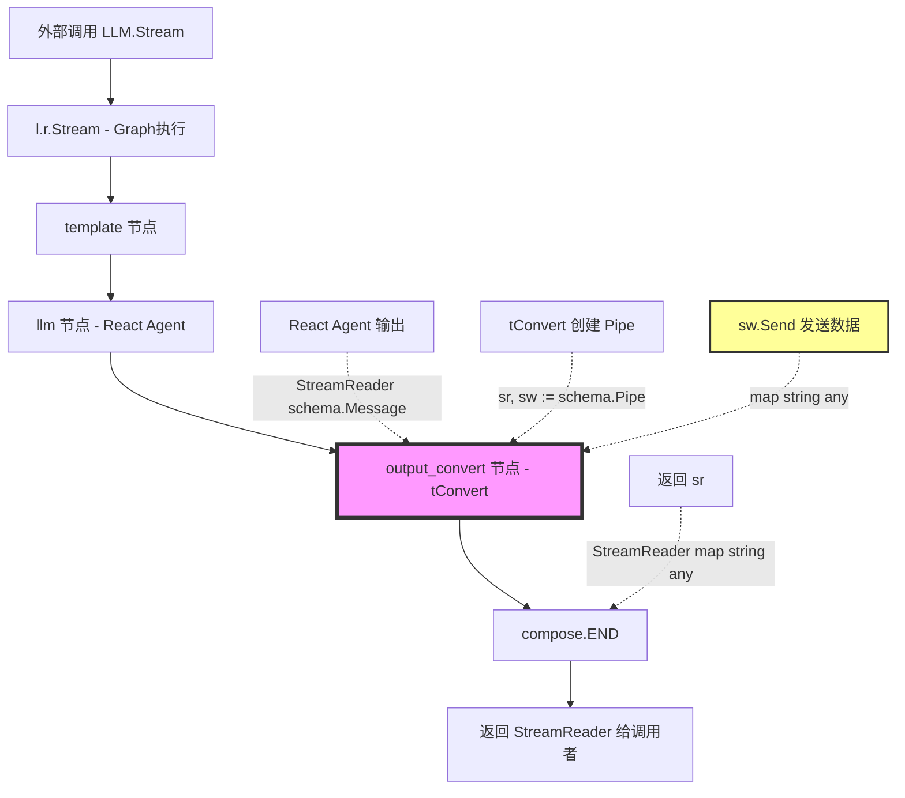

# LLM Node `tConvert` 数据流深度分析

## 🎯 核心问题

**`tConvert` 函数中的 `sw.Send()` 发送的数据最终去了哪里？**

## 📊 完整数据流程图



## 🔍 源码深度分析

### 1. Graph 构建阶段（Build 方法）

#### 节点定义（L738-751）

```go
// L738: 创建 React Agent
reactAgent, err := react.NewAgent(ctx, &reactConfig)
if err != nil {
    return nil, err
}

// L743-745: 将 React Agent 添加为 Graph 节点
agentNode, opts := reactAgent.ExportGraph()
opts = append(opts, compose.WithNodeName(reactGraphName))
_ = g.AddGraphNode(llmNodeKey, agentNode, opts...)  // 节点名: "llm"
```

#### 边的连接（L754, L847-848）

```go
// L754: template -> llm
_ = g.AddEdge(templateNodeKey, llmNodeKey)

// L847: llm -> output_convert
_ = g.AddEdge(llmNodeKey, outputConvertNodeKey)

// L848: output_convert -> END
_ = g.AddEdge(outputConvertNodeKey, compose.END)
```

**Graph 结构**：
```
template → llm (React Agent) → output_convert (tConvert) → END
```

### 2. tConvert 函数详解（L790-837）

#### 函数签名

```go
tConvert := func(
    _ context.Context, 
    s *schema.StreamReader[*schema.Message],  // 输入：React Agent 的输出流
    _ ...struct{},
) (*schema.StreamReader[map[string]any], error) {  // 输出：转换后的流
```

**关键点**：
- **输入类型**：`StreamReader[*schema.Message]` - React Agent 的原始输出
- **输出类型**：`StreamReader[map[string]any]` - 转换为 Graph 可用的 map 格式
- **作用**：流式数据格式转换器

#### Pipe 创建（L791）

```go
sr, sw := schema.Pipe[map[string]any](0)
```

**`schema.Pipe` 的作用**：
- 创建一对 **StreamReader** (`sr`) 和 **StreamWriter** (`sw`)
- `sw.Send()` 写入的数据 → `sr.Recv()` 可以读取
- 类似 Go 的 `io.Pipe()`，但用于流式数据传输

**数据流向**：
```
sw.Send(data)  ──→  [内部缓冲区]  ──→  sr.Recv() 返回 data
     ↑                                        ↓
   写入端                                   读取端
  (goroutine)                          (Graph 下游节点)
```

#### 核心转换逻辑（L793-833）

```go
safego.Go(ctx, func() {
    reasoningDone := false
    defer func() {
        if llmRef != nil && llmRef.realtimeWriter != nil {
            llmRef.realtimeWriter = nil  // 清理引用
        }
    }()
    
    for {
        // 📥 从 React Agent 的输出流读取
        msg, err := s.Recv()
        if err != nil {
            if err == io.EOF {
                // ✅ 流结束标记
                sw.Send(map[string]any{
                    outputKey: nodes.KeyIsFinished,  // "output": "__IS_FINISHED__"
                }, nil)
                sw.Close()
                return
            }
            
            // ❌ 错误处理
            sw.Send(nil, err)
            sw.Close()
            return
        }

        // 🧠 处理 Reasoning 内容（如果有）
        if hasReasoning {
            reasoning := getReasoningContent(msg)
            if len(reasoning) > 0 {
                sw.Send(map[string]any{
                    ReasoningOutputKey: reasoning,  // "reasoning": "思考内容..."
                }, nil)
            }
        }

        // 📤 处理正常内容
        if len(msg.Content) > 0 {
            if !reasoningDone && hasReasoning {
                reasoningDone = true
                // Reasoning 结束标记
                sw.Send(map[string]any{
                    ReasoningOutputKey: nodes.KeyIsFinished,
                }, nil)
            }
            
            // 🎯 关键：发送实际内容
            sw.Send(map[string]any{
                outputKey: msg.Content,  // "output": "实际回答内容..."
            }, nil)
        }
    }
})

// 📤 返回读取端给下游
return sr, nil
```

**转换过程**：

| React Agent 输出 | tConvert 处理 | 发送到 sw |
|-----------------|---------------|----------|
| `Message{Content: "你好"}` | 提取 Content | `{"output": "你好"}` |
| `Message{ReasoningContent: "思考中..."}` | 提取 Reasoning | `{"reasoning": "思考中..."}` |
| `EOF` | 流结束 | `{"output": "__IS_FINISHED__"}` + `sw.Close()` |
| `Error` | 错误传递 | `sw.Send(nil, err)` + `sw.Close()` |

### 3. 节点包装（L839-844）

```go
// L839: 将 tConvert 包装成 Lambda 节点
convertNode, err := compose.AnyLambda(
    iConvert,  // Invoke 模式的转换函数
    nil,       // 
    nil,       // 
    tConvert   // Stream 模式的转换函数 ← 我们关注的这个！
)
if err != nil {
    return nil, err
}

// L844: 添加到 Graph
_ = g.AddLambdaNode(outputConvertNodeKey, convertNode)  // 节点名: "output_convert"
```

**`compose.AnyLambda` 的作用**：
- 创建一个可以同时支持 **Invoke** 和 **Stream** 模式的节点
- 当 Graph 以 Stream 模式运行时，会调用 `tConvert`
- `tConvert` 返回的 `sr`（StreamReader）成为该节点的输出

### 4. Graph 编译（L858）

```go
r, err := g.Compile(ctx, compileOpts...)
if err != nil {
    return nil, err
}
```

**编译结果**：
- `r` 是一个 `compose.Runnable`，包含整个 Graph 的执行逻辑
- 存储在 `LLM.r` 字段中（L1196）

### 5. LLM.Stream 执行（L1449-1478）

```go
func (l *LLM) Stream(ctx context.Context, in map[string]any, opts ...nodes.NodeOption) (
    out *schema.StreamReader[map[string]any], 
    err error,
) {
    composeOpts, resumingEvent, err := l.prepare(ctx, in, opts...)
    if err != nil {
        return nil, err
    }

    // 获取 StreamWriter（用于实时回调）
    exeCtx := execute.GetExeCtx(ctx)
    if exeCtx != nil && exeCtx.RootCtx.StreamWriter != nil {
        l.realtimeWriter = exeCtx.RootCtx.StreamWriter
        logs.Infof("✅ [LLM Stream] Found StreamWriter in execute context")
    }

    // 添加 Tool 回调
    if l.toolCallbackHandler != nil {
        composeOpts = append(composeOpts, compose.WithCallbacks(l.toolCallbackHandler))
    }

    // 🚀 执行 Graph（关键！）
    out, err = l.r.Stream(ctx, in, composeOpts...)
    if err != nil {
        // ... 错误处理
    }

    // 返回的 out 就是 Graph 最终输出（来自 tConvert 的 sr）
    return out, nil
}
```

## 📤 sw.Send 数据的最终去向

### 完整路径追踪

```
1️⃣ React Agent 执行
   ↓ 输出 StreamReader[*schema.Message]
   
2️⃣ tConvert 接收（作为 output_convert 节点）
   ↓ 在 goroutine 中处理
   ↓ s.Recv() 读取 Message
   ↓ 提取 Content/Reasoning
   ↓ 格式化为 map[string]any
   
3️⃣ sw.Send(map[string]any{...}, nil)  ← 🎯 关键调用
   ↓ 写入 Pipe 的内部缓冲区
   
4️⃣ sr.Recv() 在下游被调用
   ↓ compose.END 节点收集
   ↓ Graph 的最终输出
   
5️⃣ 返回给 LLM.Stream 的调用者
   ↓ out *schema.StreamReader[map[string]any]
   
6️⃣ 上层代码（如 Workflow 执行器）
   ↓ 通过 out.Recv() 逐块读取
   ↓ 每次 Recv() 得到一个 map[string]any
   
7️⃣ 最终到达 SSE 输出
   ↓ 转换为前端可见的消息
```

### 数据格式示例

**React Agent 输出**：
```go
*schema.Message{
    Content: "这是诊断结果...",
    ReasoningContent: "",
    ToolCalls: []...,
}
```

**经过 tConvert 后（sw.Send 发送）**：
```go
map[string]any{
    "output": "这是诊断结果...",
}
```

**上层代码接收**：
```go
// Workflow 执行器中
for {
    chunk, err := out.Recv()  // chunk 就是上面的 map[string]any
    if err == io.EOF {
        break
    }
    
    // chunk = map[string]any{"output": "这是诊断结果..."}
    content := chunk["output"].(string)
    
    // 发送到前端 SSE
    sendSSE(content)
}
```

## 🔧 关键技术点

### 1. schema.Pipe 的原理

```go
// 定义（简化版）
func Pipe[T any](bufferSize int) (*StreamReader[T], *StreamWriter[T]) {
    ch := make(chan *streamItem[T], bufferSize)
    
    writer := &StreamWriter[T]{ch: ch}
    reader := &StreamReader[T]{ch: ch}
    
    return reader, writer
}

type streamItem[T any] struct {
    data T
    err  error
}

// 写入
func (sw *StreamWriter[T]) Send(data T, err error) {
    sw.ch <- &streamItem[T]{data: data, err: err}
}

// 读取
func (sr *StreamReader[T]) Recv() (T, error) {
    item := <-sr.ch
    return item.data, item.err
}
```

**本质**：基于 Go channel 的生产者-消费者模式

### 2. 为什么需要 tConvert？

**原因**：类型转换和格式统一

| 方面 | React Agent 输出 | Graph 期望输入 |
|-----|-----------------|---------------|
| **类型** | `StreamReader[*schema.Message]` | `StreamReader[map[string]any]` |
| **结构** | `Message{Content, ToolCalls, ...}` | `map{"output": content}` |
| **用途** | LLM 原始输出 | Graph 节点间传递 |

**如果没有 tConvert**：
- Graph 无法连接 React Agent 和后续节点
- 类型不匹配导致编译错误
- 无法提取所需字段（如只取 Content）

### 3. 并发处理

```go
safego.Go(ctx, func() {
    // 在单独的 goroutine 中处理
    for {
        msg, err := s.Recv()  // 阻塞读取
        // ...
        sw.Send(data, nil)    // 非阻塞写入（如果 buffer 未满）
    }
})

// 立即返回 sr，不等待 goroutine 完成
return sr, nil
```

**优势**：
- ✅ 不阻塞 Graph 执行
- ✅ 实现真正的流式处理
- ✅ 下游可以立即开始 Recv() 读取

## 🎯 实际使用场景

### 场景：用户提问 → AI 回答

```
1. 用户: "帮忙看下这台设备是什么系统 63c2b7afa7b72bb4884295040c02334a"
   ↓
   
2. Workflow 调用 LLM.Stream()
   ↓
   
3. Graph 执行：template → llm (React Agent)
   ↓ React Agent 开始推理
   
4. React Agent 输出（流式）:
   Message{Content: "正在"}
   Message{Content: "检查"}
   Message{Content: "设备"}
   Message{ToolCalls: [remote_exec]}
   ... (工具执行)
   Message{Content: "诊断"}
   Message{Content: "结果"}
   ↓
   
5. tConvert 接收并转换（实时）:
   sw.Send({"output": "正在"})
   sw.Send({"output": "检查"})
   sw.Send({"output": "设备"})
   // ToolCalls 不通过 sw.Send，由 Callback 处理
   sw.Send({"output": "诊断"})
   sw.Send({"output": "结果"})
   sw.Send({"output": "__IS_FINISHED__"})
   sw.Close()
   ↓
   
6. Graph END 节点收集
   ↓ 最终输出流
   
7. Workflow 读取:
   out.Recv() → {"output": "正在"}
   out.Recv() → {"output": "检查"}
   out.Recv() → {"output": "设备"}
   out.Recv() → {"output": "诊断"}
   out.Recv() → {"output": "结果"}
   out.Recv() → {"output": "__IS_FINISHED__"}
   out.Recv() → EOF
   ↓
   
8. SSE 发送到前端:
   event: message_chunk
   data: {"content": "正在检查设备诊断结果..."}
```

## 📝 总结

### sw.Send 的数据去向

| 层级 | 组件 | 作用 |
|-----|------|------|
| **L831** | `sw.Send(...)` | 写入 Pipe 的内部 channel |
| **L836** | `return sr, nil` | 返回 Pipe 的读取端 |
| **L844** | `AddLambdaNode` | 作为 output_convert 节点的输出 |
| **L848** | `→ compose.END` | Graph 的最终输出节点 |
| **L1478** | `out, err = l.r.Stream(...)` | LLM.Stream 返回给调用者 |
| **外部** | `out.Recv()` | 上层 Workflow 逐块读取 |
| **最终** | SSE 流 | 发送到前端用户 |

### 关键理解

1. **`sw.Send` 不是发送到网络或文件**，而是写入内存中的 Pipe（channel）
2. **`sr` 和 `sw` 是配对的**，写入 `sw` 的数据可以从 `sr` 读取
3. **tConvert 的作用是类型转换**：`Message` → `map[string]any`
4. **实现流式处理**：goroutine 异步转换，不阻塞 Graph 执行
5. **最终数据流向**：Graph END → LLM.Stream → Workflow → SSE → 前端

### 与实时回调的区别

| 方面 | tConvert (sw.Send) | realtimeWriter |
|-----|-------------------|----------------|
| **用途** | Graph 节点间传递 | 实时 SSE 输出 |
| **数据流向** | → compose.END → 返回值 | → StreamContainer → SSE |
| **调用时机** | tConvert goroutine | Callback 函数 |
| **生命周期** | 随 Graph 执行结束 | 随 Workflow 执行结束 |
| **是否必需** | ✅ 必需（Graph 输出） | ⚠️ 可选（实时体验优化） |

---

**文档作者**: AI Assistant  
**创建时间**: 2025-11-13  
**相关文件**: `coze-studio/backend/domain/workflow/internal/nodes/llm/llm.go` (L790-837)

