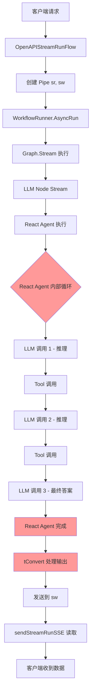
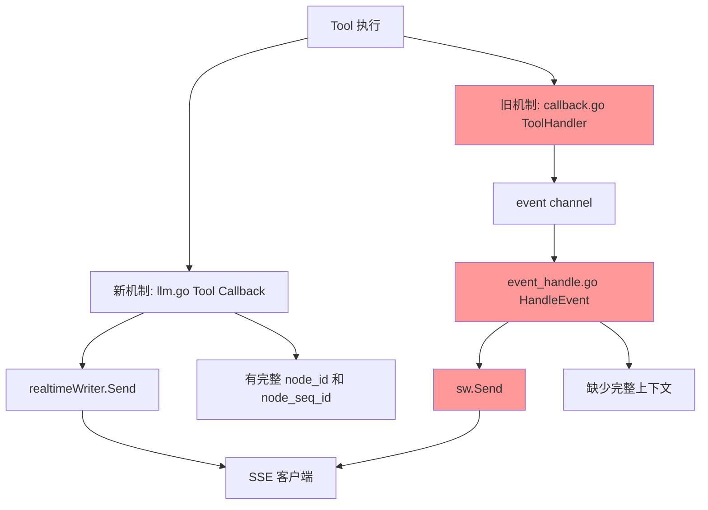
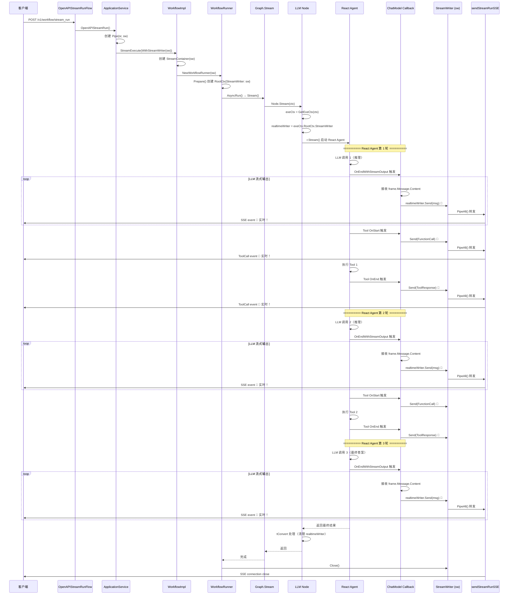

# SSE LLM 实时流式输出解决方案

## 📋 目录

- [问题背景](#问题背景)
- [原始架构分析](#原始架构分析)
- [问题根因](#问题根因)
- [解决方案设计](#解决方案设计)
- [完整数据流](#完整数据流)
- [核心代码修改](#核心代码修改)
- [关键技术点](#关键技术点)
- [测试验证](#测试验证)

---

## 问题背景

### 用户需求
在 `coze-studio` 工作流执行中，当 LLM 节点（特别是 React Agent）执行时：
- **期望**：用户在客户端看到 LLM 的实时输出（打字机效果）
- **实际**：只有在 LLM 节点完全执行完成后，才能收到完整的输出
- **影响**：用户体验差，看起来像是系统卡住了

### 技术背景
- 使用 SSE (Server-Sent Events) 进行流式响应
- 使用 Eino 框架的 React Agent 进行工具调用
- 工作流采用 Graph 节点流转模式

---

## 原始架构分析

### 1. SSE 流式响应入口

API 入口位于 `backend/api/handler/coze/workflow_service.go`:

```go
// @router /v1/workflow/stream_run [POST]
func OpenAPIStreamRunFlow(ctx context.Context, c *app.RequestContext) {
    // 设置 SSE 响应头
    w := resp.NewSSEWriter(c)
    
    // 调用应用层获取 StreamReader
    sr, err := appworkflow.SVC.OpenAPIStreamRun(ctx, req)
    
    // 发送 SSE 事件到客户端
    sendStreamRunSSE(ctx, w, sr)
}
```

### 2. 应用层流式执行

`backend/application/workflow/workflow.go`:

```go
func (w *ApplicationService) OpenAPIStreamRun(...) (*schema.StreamReader[*OpenAPIStreamRunFlowResponse], error) {
    // 创建 Pipe 用于流式输出
    sr, sw := schema.Pipe[*entity.Message](10)
    
    // 传递给领域层执行
    executeResult, err := GetWorkflowDomainSVC().StreamExecute(ctx, wb, exeCfg, 
        compose.WithStreamWriter(sw))
    
    // 转换 entity.Message 为 OpenAPIStreamRunFlowResponse
    return schema.StreamReaderWithConvert(sr, convertStreamRunEvent)
}
```

### 3. 领域层工作流执行

`backend/domain/workflow/service/executable_impl.go`:

```go
func (w *workflowImpl) StreamExecute(...) (*schema.StreamReader[*entity.Message], error) {
    // 创建 Pipe
    sr, sw := schema.Pipe[*entity.Message](10)
    
    // 创建 StreamContainer 管理子流
    container := execute.NewStreamContainer(sw)
    
    // 创建 WorkflowRunner
    wf := compose.NewWorkflowRunner(wb, sc, exeCfg, compose.WithStreamWriter(sw))
    
    // 异步执行工作流
    wf.AsyncRun(ctx)
    
    return sr, nil
}
```

### 4. Graph 节点流转

`backend/domain/workflow/internal/compose/workflow.go`:

```go
func (w *Workflow) AsyncRun(ctx context.Context) {
    if w.streamRun {
        // 流式模式：调用 Graph.Stream()
        out, err := w.Runner.Stream(ctx, in)
        
        // 将输出发送到 StreamWriter
        for {
            msg, err := out.Recv()
            sw.Send(msg, err)
        }
    }
}
```

### 5. LLM 节点执行（问题所在）

`backend/domain/workflow/internal/nodes/llm/llm.go`:

```go
func (l *LLM) Stream(ctx context.Context, in map[string]any, opts ...nodes.NodeOption) {
    // 执行 React Agent
    out, err := l.r.Stream(ctx, in, composeOpts...)
    
    // ⚠️ 问题：这里直接返回了 React Agent 的输出流
    // React Agent 内部的 LLM 调用和工具执行是黑盒
    // 只有等整个 Agent 完成后，tConvert 才会被调用
    return out, nil
}
```

---

## 问题根因

### 核心问题
**LLM 节点的流式输出被 Graph 节点流转机制阻塞**

### 详细分析



**问题点**：
1. **LLM 调用 1、2、3** 的实时输出被 React Agent 内部缓存
2. 只有在 **React Agent 完成** 后，才会调用 **tConvert**
3. **tConvert** 才会将数据发送到 `sw`
4. 客户端才能收到数据

**延迟时间**：如果 React Agent 需要执行 3 轮工具调用，每轮 5 秒，则：
- 客户端需要等待：`5s * 3 = 15秒` 后才能看到第一个字！

---

## 衍生问题：事件重复发送

### 问题表现
在实现实时流式输出后，发现客户端收到了**重复的 Tool 事件**：

```
event: ToolCall
data: {"node_id":"129476","node_seq_id":"152","call_id":"call_xxx","name":"remote_exec"}

event: ToolCall  // ❌ 重复！
data: {"node_id":"","node_seq_id":"0","call_id":"call_xxx","name":"remote_exec"}
```

### 根本原因

系统中存在**两套独立的 Tool 事件处理机制**：



**两套机制的对比**：

| 机制 | 路径 | 优点 | 缺点 |
|------|------|------|------|
| 新机制 | `llm.go` Tool Callback → `realtimeWriter.Send()` | ✅ 实时发送<br>✅ 有完整上下文（node_id、node_seq_id）<br>✅ 代码清晰 | - |
| 旧机制 | `callback.go` ToolHandler → event channel → `event_handle.go` → `sw.Send()` | ✅ 支持 checkpoint<br>✅ 支持日志记录 | ❌ 延迟发送<br>❌ 缺少完整上下文<br>❌ 导致重复 |

### 解决方案

**策略**：保留新机制的发送，禁用旧机制的发送，但保留旧机制的其他功能（cache、checkpoint）

修改 `event_handle.go`：

```go
case FunctionCall:
    cacheFunctionCall(ctx, event)  // ✅ 保留 cache
    // ❌ 注释掉重复发送
    // if sw == nil {
    //     return noTerminate, nil
    // }
    // sw.Send(&entity.Message{...}, nil)
    
case ToolResponse:
    cacheToolResponse(ctx, event)  // ✅ 保留 cache
    // ❌ 注释掉重复发送
    // if sw == nil {
    //     return noTerminate, nil
    // }
    // sw.Send(&entity.Message{...}, nil)
```

**效果**：
- ✅ 每个 Tool 事件只发送一次
- ✅ 有完整的上下文信息
- ✅ cache 和 checkpoint 功能不受影响

---

## 解决方案设计

### 设计思路

**关键洞察**：绕过 Graph 节点流转，直接将 LLM 的实时输出发送到 Workflow 的全局 StreamWriter。

### 方案选择

我们尝试了两个方案：

#### ❌ 方案 1：通过 toolWorkflowContainer 传递
- **思路**：利用现有的 `WithToolWorkflowStreamContainer` 选项
- **问题**：该选项只在嵌套 Workflow Tool 调用时才会被设置
- **结果**：对于普通的 LLM 节点执行，`toolWorkflowContainer` 为空

#### ✅ 方案 2：通过 execute.Context 传递
- **思路**：将 StreamWriter 存储在 `execute.Context.RootCtx` 中
- **优势**：所有节点都能通过 `execute.GetExeCtx(ctx)` 访问
- **结果**：完美解决，适用于所有场景

---

## 完整数据流

### 修改后的架构



### 关键数据流对比

#### 🔴 修改前（有延迟）

```
客户端请求 → OpenAPIStreamRun → StreamExecute → Graph.Stream → LLM Node → React Agent
    ↓ (等待 15 秒)
React Agent 完成 → tConvert → StreamWriter → sendStreamRunSSE → 客户端收到数据
```

#### 🟢 修改后（实时）

```
客户端请求 → OpenAPIStreamRun → StreamExecute → Graph.Stream → LLM Node → React Agent
    ↓ (同时并行)
LLM 调用 → ChatModel Callback 触发 → 直接写入 StreamWriter → sendStreamRunSSE → 客户端实时收到
    ↓ (继续)
Tool Start → Tool Callback 触发 → 直接写入 StreamWriter → sendStreamRunSSE → 客户端实时收到 (FunctionCall)
    ↓
Tool 执行
    ↓ (同时并行)
Tool End → Tool Callback 触发 → 直接写入 StreamWriter → sendStreamRunSSE → 客户端实时收到 (ToolResponse)
    ↓ (继续)
LLM 调用 → ChatModel Callback 触发 → 直接写入 StreamWriter → sendStreamRunSSE → 客户端实时收到
```

---

## 核心代码修改

### 1. execute.Context 添加 StreamWriter 字段

**文件**：`backend/domain/workflow/internal/execute/context.go`

```go
// 添加 import
import (
    "github.com/cloudwego/eino/schema"
)

// 修改 RootCtx 结构体
type RootCtx struct {
    RootWorkflowBasic *entity.WorkflowBasic
    RootExecuteID     int64
    ResumeEvent       *entity.InterruptEvent
    ExeCfg            workflowModel.ExecuteConfig
    StreamWriter      *schema.StreamWriter[*entity.Message]  // ✨ 新增
}

// 在 PrepareRootExeCtx 中传递
func PrepareRootExeCtx(ctx context.Context, h *WorkflowHandler) (context.Context, error) {
    rootExeCtx := &Context{
        RootCtx: RootCtx{
            RootWorkflowBasic: h.rootWorkflowBasic,
            RootExecuteID:     h.rootExecuteID,
            ResumeEvent:       h.resumeEvent,
            ExeCfg:            h.exeCfg,
            StreamWriter:      h.streamWriter,  // ✨ 传递 StreamWriter
        },
        // ...
    }
    return context.WithValue(ctx, contextKey{}, rootExeCtx), nil
}
```

**修改原因**：
- 将 StreamWriter 存储在 RootCtx 中，使其对所有节点全局可访问
- 通过 Context 传递，符合 Go 的最佳实践

---

### 2. WorkflowHandler 存储 StreamWriter

**文件**：`backend/domain/workflow/internal/execute/callback.go`

```go
type WorkflowHandler struct {
    ch                 chan<- *Event
    rootWorkflowBasic  *entity.WorkflowBasic
    rootExecuteID      int64
    subWorkflowBasic   *entity.WorkflowBasic
    nodeCount          int32
    requireCheckpoint  bool
    resumeEvent        *entity.InterruptEvent
    exeCfg             workflowModel.ExecuteConfig
    rootTokenCollector *TokenCollector
    streamWriter       *schema.StreamWriter[*entity.Message]  // ✨ 新增
}

// 修改构造函数签名
func NewRootWorkflowHandler(
    wb *entity.WorkflowBasic, 
    executeID int64, 
    requireCheckpoint bool,
    ch chan<- *Event, 
    resumedEvent *entity.InterruptEvent, 
    exeCfg workflowModel.ExecuteConfig, 
    nodeCount int32,
    streamWriter *schema.StreamWriter[*entity.Message],  // ✨ 新参数
) callbacks.Handler {
    return &WorkflowHandler{
        ch:                ch,
        rootWorkflowBasic: wb,
        rootExecuteID:     executeID,
        requireCheckpoint: requireCheckpoint,
        resumeEvent:       resumedEvent,
        exeCfg:            exeCfg,
        nodeCount:         nodeCount,
        streamWriter:      streamWriter,  // ✨ 存储
    }
}
```

**修改原因**：
- WorkflowHandler 是创建 RootCtx 的入口
- 需要接收并存储 StreamWriter，然后传递给 RootCtx

---

### 3. 在 designateOptions 中传递 StreamWriter

**文件**：`backend/domain/workflow/internal/compose/designate_option.go`

```go
func (r *WorkflowRunner) designateOptions(ctx context.Context) ([]einoCompose.Option, error) {
    var (
        wb           = r.basic
        exeCfg       = r.config
        executeID    = r.executeID
        workflowSC   = r.schema
        eventChan    = r.eventChan
        resumedEvent = r.interruptEvent
        container    = r.container
        streamWriter = r.sw  // ✨ 从 WorkflowRunner 获取
    )

    rootHandler := execute.NewRootWorkflowHandler(
        wb,
        executeID,
        workflowSC.RequireCheckpoint(),
        eventChan,
        resumedEvent,
        exeCfg,
        workflowSC.NodeCount(),
        streamWriter)  // ✨ 传递给 WorkflowHandler

    opts := []einoCompose.Option{einoCompose.WithCallbacks(rootHandler)}
    // ...
}
```

**修改原因**：
- 连接 WorkflowRunner 和 WorkflowHandler
- 确保 StreamWriter 从顶层正确传递下来

---

### 4. LLM Node 从 Context 获取 StreamWriter

**文件**：`backend/domain/workflow/internal/nodes/llm/llm.go`

#### 4.1 添加 realtimeWriter 字段

```go
type LLM struct {
    r                   compose.Runnable[map[string]any, map[string]any]
    outputFormat        Format
    requireCheckpoint   bool
    fullSources         map[string]*schema2.SourceInfo
    chatHistorySetting  *vo.ChatHistorySetting
    nodeKey             vo.NodeKey
    outputKey           string
    toolCallbackHandler callbacks.Handler
    toolEventChan       chan map[string]any
    realtimeWriter      *schema.StreamWriter[*entity.Message]  // ✨ 新增
}
```

#### 4.2 在 Stream() 中获取并设置

```go
func (l *LLM) Stream(ctx context.Context, in map[string]any, opts ...nodes.NodeOption) (out *schema.StreamReader[map[string]any], err error) {
    composeOpts, resumingEvent, err := l.prepare(ctx, in, opts...)
    if err != nil {
        return nil, err
    }

    // ✨ 获取 execute context
    exeCtx := execute.GetExeCtx(ctx)
    
    // ✨ 从 Context 中获取 StreamWriter
    if exeCtx != nil && exeCtx.RootCtx.StreamWriter != nil {
        l.realtimeWriter = exeCtx.RootCtx.StreamWriter
        logs.Infof("✅ [LLM Stream] Found StreamWriter in execute context, will send messages directly")
        
        defer func() {
            if err != nil && l.realtimeWriter != nil {
                l.realtimeWriter = nil
            }
        }()
    } else {
        logs.Warnf("⚠️ [LLM Stream] No StreamWriter found in execute context")
    }

    // 添加 callback
    if l.toolCallbackHandler != nil {
        composeOpts = append(composeOpts, compose.WithCallbacks(l.toolCallbackHandler))
    }

    out, err = l.r.Stream(ctx, in, composeOpts...)
    if err != nil {
        err = l.handleInterrupt(ctx, err, resumingEvent)
        return nil, err
    }

    return out, nil
}
```

**修改原因**：
- 从全局 Context 中获取 StreamWriter
- 不依赖特定的节点选项，适用于所有场景

---

### 5. 在 Callback 中实时发送消息

**文件**：`backend/domain/workflow/internal/nodes/llm/llm.go`

#### 5.1 ChatModel Callback - 实时发送 LLM 输出

```go
func (c *Config) Build(ctx context.Context, ns *schema2.NodeSchema, _ ...schema2.BuildOption) (any, error) {
    // ...
    var (
        llmRef *LLM  // ✨ 用于在 callback 闭包中访问
    )
    
    // 创建 callback
    if len(tools) > 0 {
        toolCallbackHandler = callbacks2.NewHandlerHelper().
            ChatModel(&callbacks2.ModelCallbackHandler{
                OnStart: func(ctx context.Context, info *callbacks.RunInfo, input *model.CallbackInput) context.Context {
                    logs.Infof("ChatModel Start: node=%s", info.Name)
                    return ctx
                },
                OnEndWithStreamOutput: func(ctx context.Context, info *callbacks.RunInfo, output *schema.StreamReader[*model.CallbackOutput]) context.Context {
                    logs.Infof("ChatModel Stream: node=%s", info.Name)

                    go func() {
                        defer output.Close()
                        
                        // ✨ 获取 execute context（用于获取节点信息）
                        exeCtx := execute.GetExeCtx(ctx)

                        for {
                            frame, err := output.Recv()
                            if errors.Is(err, io.EOF) {
                                break
                            }
                            if err != nil {
                                logs.Errorf("ChatModel Stream Error: %v", err)
                                return
                            }

                            if frame.Message.Content != "" {
                                logs.Infof("ChatModel Stream Message: %s", frame.Message.Content)
                                
                                // 🚀 实时发送到 StreamWriter
                                if llmRef != nil && llmRef.realtimeWriter != nil && exeCtx != nil {
                                    dataMsg := &entity.DataMessage{
                                        Type:      entity.Answer,
                                        Content:   frame.Message.Content,
                                        Role:      schema.Assistant,
                                        NodeType:  entity.NodeTypeLLM,  // ⚠️ 必须设置！
                                        ExecuteID: exeCtx.RootExecuteID,
                                        NodeID:    string(exeCtx.NodeKey),
                                        NodeTitle: exeCtx.NodeName,
                                    }
                                    
                                    msg := &entity.Message{
                                        DataMessage: dataMsg,
                                    }
                                    
                                    llmRef.realtimeWriter.Send(msg, nil)
                                    logs.Infof("✅ [REALTIME] Sent: nodeID=%s, content=%s", 
                                        dataMsg.NodeID, frame.Message.Content)
                                }
                            }
                        }
                    }()

                    return ctx
                },
            }).
            // ✨ 继续添加 Tool callback
            Tool(&callbacks2.ToolCallbackHandler{
                // 见 5.2 节
            }).
            Handler()
    }
    
    // 创建 LLM 实例
    llm := &LLM{
        r:                   r,
        outputFormat:        format,
        requireCheckpoint:   requireCheckpoint,
        fullSources:         ns.FullSources,
        chatHistorySetting:  c.ChatHistorySetting,
        nodeKey:             ns.Key,
        outputKey:           outputKey,
        toolCallbackHandler: toolCallbackHandler,
    }
    
    // ✨ 设置引用，使 callback 能访问
    llmRef = llm

    return llm, nil
}
```

**修改原因**：
- 在 Callback 中捕获每个 LLM 输出片段
- 立即发送到 StreamWriter，绕过 Graph 流转
- **关键**：必须设置 `NodeType` 字段，否则会导致 nil pointer panic

---

#### 5.2 Tool Callback - 实时发送工具调用事件

```go
Tool(&callbacks2.ToolCallbackHandler{
    OnStart: func(ctx context.Context, info *callbacks.RunInfo, input *tool.CallbackInput) context.Context {
        toolCallID := compose.GetToolCallID(ctx)
        logs.Infof("Tool Start: ID:%s, tool=%s arguments=%s", toolCallID, info.Name, input.ArgumentsInJSON)

        // 🚀 实时发送 Tool Start 事件
        if llmRef != nil && llmRef.realtimeWriter != nil {
            exeCtx := execute.GetExeCtx(ctx)
            if exeCtx != nil {
                // 解析 arguments
                var args map[string]any
                if err := sonic.UnmarshalString(input.ArgumentsInJSON, &args); err != nil {
                    logs.Warnf("Failed to unmarshal tool arguments: %v", err)
                    args = map[string]any{"raw": input.ArgumentsInJSON}
                }

                dataMsg := &entity.DataMessage{
                    Type:      entity.FunctionCall,
                    Role:      schema.Assistant,
                    NodeType:  entity.NodeTypeLLM,
                    ExecuteID: exeCtx.RootExecuteID,
                    NodeID:    string(exeCtx.NodeKey),
                    NodeTitle: exeCtx.NodeName,
                    FunctionCall: &entity.FunctionCallInfo{
                        FunctionInfo: entity.FunctionInfo{
                            Name: info.Name,
                            Type: entity.PluginTool,
                        },
                        CallID:    toolCallID,
                        Arguments: args,
                    },
                }

                msg := &entity.Message{
                    DataMessage: dataMsg,
                }

                llmRef.realtimeWriter.Send(msg, nil)
                logs.Infof("✅ [REALTIME Tool] Sent tool start: tool=%s", info.Name)
            }
        }

        return ctx
    },
    OnEnd: func(ctx context.Context, info *callbacks.RunInfo, output *tool.CallbackOutput) context.Context {
        toolCallID := compose.GetToolCallID(ctx)
        result := output.Response
        logs.Infof("Tool End: ID:%s, tool=%s result_len=%d", toolCallID, info.Name, len(result))

        // 🚀 实时发送 Tool End 事件
        if llmRef != nil && llmRef.realtimeWriter != nil {
            exeCtx := execute.GetExeCtx(ctx)
            if exeCtx != nil {
                dataMsg := &entity.DataMessage{
                    Type:      entity.ToolResponse,
                    Role:      schema.Tool,
                    NodeType:  entity.NodeTypeLLM,
                    ExecuteID: exeCtx.RootExecuteID,
                    NodeID:    string(exeCtx.NodeKey),
                    NodeTitle: exeCtx.NodeName,
                    ToolResponse: &entity.ToolResponseInfo{
                        FunctionInfo: entity.FunctionInfo{
                            Name: info.Name,
                            Type: entity.PluginTool,
                        },
                        CallID:   toolCallID,
                        Response: result,
                    },
                }

                msg := &entity.Message{
                    DataMessage: dataMsg,
                }

                llmRef.realtimeWriter.Send(msg, nil)
                logs.Infof("✅ [REALTIME Tool] Sent tool end: tool=%s", info.Name)
            }
        }

        return ctx
    },
    OnError: func(ctx context.Context, info *callbacks.RunInfo, err error) context.Context {
        toolCallID := compose.GetToolCallID(ctx)
        logs.Errorf("Tool Error: ID:%s, tool=%s error=%v", toolCallID, info.Name, err)

        // 🚀 实时发送 Tool Error 事件（作为 ToolResponse）
        if llmRef != nil && llmRef.realtimeWriter != nil {
            exeCtx := execute.GetExeCtx(ctx)
            if exeCtx != nil {
                errorMsg := fmt.Sprintf("Tool execution failed: %v", err)

                dataMsg := &entity.DataMessage{
                    Type:      entity.ToolResponse,
                    Role:      schema.Tool,
                    NodeType:  entity.NodeTypeLLM,
                    ExecuteID: exeCtx.RootExecuteID,
                    NodeID:    string(exeCtx.NodeKey),
                    NodeTitle: exeCtx.NodeName,
                    ToolResponse: &entity.ToolResponseInfo{
                        FunctionInfo: entity.FunctionInfo{
                            Name: info.Name,
                            Type: entity.PluginTool,
                        },
                        CallID:   toolCallID,
                        Response: errorMsg,
                    },
                }

                msg := &entity.Message{
                    DataMessage: dataMsg,
                }

                llmRef.realtimeWriter.Send(msg, nil)
                logs.Infof("✅ [REALTIME Tool] Sent tool error: tool=%s", info.Name)
            }
        }

        return ctx
    },
})
```

**修改原因**：
- 在 Tool 执行的每个阶段（Start、End、Error）实时发送事件
- 客户端可以看到工具调用的完整过程
- 提升透明度和用户体验

---

### 6. 在 tConvert 中清理引用

**文件**：`backend/domain/workflow/internal/nodes/llm/llm.go`

```go
tConvert := func(_ context.Context, s *schema.StreamReader[*schema.Message], _ ...struct{}) (*schema.StreamReader[map[string]any], error) {
    sr, sw := schema.Pipe[map[string]any](0)

    safego.Go(ctx, func() {
        // ✨ 清理 realtimeWriter 引用（不关闭，因为它属于 workflow）
        if llmRef != nil && llmRef.realtimeWriter != nil {
            llmRef.realtimeWriter = nil
            logs.Infof("🧹 [tConvert] Cleared realtimeWriter reference")
        }
        
        // ... 继续处理 React Agent 的输出
    })

    return sr, nil
}
```

**修改原因**：
- React Agent 完成后，不再需要 realtimeWriter
- **注意**：只清理引用，不关闭 Writer（它属于 workflow 生命周期）

---

### 7. 避免重复发送 Tool 事件

**文件**：`backend/domain/workflow/internal/execute/event_handle.go`

**问题背景**：
系统中存在**两套 Tool 事件处理机制**：
1. **新机制**（`llm.go` 中的 Tool callback）：直接通过 `realtimeWriter` 实时发送
2. **旧机制**（`callback.go` + `event_handle.go`）：通过 event channel 发送

这导致每个 Tool 事件被发送了两次到客户端！

**解决方案**：在 `event_handle.go` 中跳过 Tool 事件的重复发送

```go
func (t *WorkflowHandler) HandleEvent(ctx context.Context, sw *schema.StreamWriter[*entity.Message], event *Event) (terminate bool, err error) {
    // ... 其他事件处理 ...
    
    case FunctionCall:
        cacheFunctionCall(ctx, event)
        // ✨ 注释掉重复发送逻辑
        // Note: FunctionCall events are now sent in real-time via llm.go Tool callbacks
        // Skip sending here to avoid duplication
        // if sw == nil {
        //     return noTerminate, nil
        // }
        // sw.Send(&entity.Message{
        //     DataMessage: &entity.DataMessage{
        //         ExecuteID:    event.RootExecuteID,
        //         Role:         schema.Assistant,
        //         Type:         entity.FunctionCall,
        //         FunctionCall: event.functionCall.FunctionCallInfo,
        //     },
        // }, nil)
        
    case ToolResponse:
        cacheToolResponse(ctx, event)
        // ✨ 注释掉重复发送逻辑
        // Note: ToolResponse events are now sent in real-time via llm.go Tool callbacks
        // Skip sending here to avoid duplication
        // if sw == nil {
        //     return noTerminate, nil
        // }
        // sw.Send(&entity.Message{
        //     DataMessage: &entity.DataMessage{
        //         ExecuteID:    event.RootExecuteID,
        //         Role:         schema.Tool,
        //         Type:         entity.ToolResponse,
        //         Last:         true,
        //         ToolResponse: event.toolResponse,
        //     },
        // }, nil)
        
    // ... 其他事件处理 ...
}
```

**修改原因**：
- ✅ **保留 cache 功能**：`cacheFunctionCall` 和 `cacheToolResponse` 仍然被调用（用于 checkpoint 和日志）
- ❌ **移除重复发送**：避免通过 `sw.Send()` 再次发送已经由 callback 发送的事件
- 🎯 **关键区别**：
  - 新机制发送的事件：有完整的 `node_id`, `node_seq_id` 等上下文信息
  - 旧机制发送的事件：缺少完整上下文，`node_id` 为空

**效果**：
- 修改前：客户端收到每个 Tool 事件两次（一次有 node_id，一次没有）
- 修改后：客户端只收到一次（有完整的 node_id 和上下文）

---

## 关键技术点

### 1. StreamWriter 的生命周期管理

```
创建：OpenAPIStreamRun 创建 Pipe(sr, sw)
  ↓
传递：通过 Context 传递到所有节点
  ↓
使用：LLM Callback 直接写入
  ↓
关闭：WorkflowRunner 完成后统一关闭
```

**重要**：LLM 节点只使用 StreamWriter，不负责关闭它。

---

### 2. entity.Message 必须完整

在 Callback 中创建 `entity.Message` 时，**必须设置所有必需字段**：

```go
dataMsg := &entity.DataMessage{
    Type:      entity.Answer,
    Content:   frame.Message.Content,
    Role:      schema.Assistant,
    NodeType:  entity.NodeTypeLLM,  // ⚠️ 必须！否则会 panic
    ExecuteID: exeCtx.RootExecuteID,
    NodeID:    string(exeCtx.NodeKey),
    NodeTitle: exeCtx.NodeName,
}
```

**常见错误**：忘记设置 `NodeType`，导致 `convertStreamRunEvent` 中：
```go
entity.NodeMetaByNodeType(msg.NodeType).GetDisplayKey()  // panic: nil pointer
```

---

### 3. Callback 中的 Context 传递

在 `OnEndWithStreamOutput` 中，我们在 goroutine 中需要访问 `execute.Context`：

```go
OnEndWithStreamOutput: func(ctx context.Context, info *callbacks.RunInfo, output *schema.StreamReader[*model.CallbackOutput]) context.Context {
    go func() {
        // ⚠️ 必须在 goroutine 外部获取，然后传入
        exeCtx := execute.GetExeCtx(ctx)
        
        for {
            frame, err := output.Recv()
            // 使用 exeCtx
        }
    }()
    return ctx
}
```

**原因**：goroutine 内部的 Context 可能已经失效。

---

### 4. 并发安全

`StreamWriter.Send()` 是并发安全的（内部有锁），所以可以在 Callback goroutine 中直接调用：

```go
llmRef.realtimeWriter.Send(msg, nil)  // 并发安全
```

---

### 5. 不破坏原有流程

**重要设计原则**：
- React Agent 的正常输出流仍然保留
- `tConvert` 仍然会处理其他数据
- 实时流只是**额外增加**的输出路径

这样可以保证：
- 向后兼容
- 不影响其他节点
- 便于回滚

---

### 6. 避免事件重复发送

**问题**：系统中存在两套事件处理机制，会导致事件重复发送

**识别重复的方法**：
- 观察客户端收到的 SSE 事件，同一个 `call_id` 的 Tool 事件出现了两次
- 第一次有完整的 `node_id` 和 `node_seq_id`
- 第二次这些字段为空或重新计数

**解决方案**：
1. **保留新机制**：`llm.go` 的 callback 实时发送（有完整上下文）
2. **禁用旧机制**：`event_handle.go` 中注释掉 `FunctionCall` 和 `ToolResponse` 的 `sw.Send()` 调用
3. **保留 cache**：仍然调用 `cacheFunctionCall` 和 `cacheToolResponse`（用于 checkpoint 和日志）

**注意**：
- 不要删除 event 处理代码，只注释掉 `sw.Send()` 部分
- 保留注释说明为什么跳过发送
- 确保 cache 功能不受影响

---

## 测试验证

### 1. 启动服务

```bash
cd /Users/devyk/Data/code/AI/coze-studio/backend
go run main.go
```

### 2. 发送测试请求

```bash
curl -N --location --request POST "http://localhost:8888/v1/workflow/stream_run" \
  -H "Authorization: Bearer YOUR_TOKEN" \
  -H "Content-Type: application/json" \
  -d '{
    "workflow_id": "7569925483370905600",
    "parameters": {
      "input": "帮我看下这台设备 55fc63b4e88da07c191b1642f86fe05d CPU多少核"
    }
  }'
```

### 3. 验证日志输出

期望看到以下日志序列：

```
✅ [LLM Stream] Found StreamWriter in execute context, will send messages directly
NewHandlerHelper ChatModel Start: node=agent_model
NewHandlerHelper ChatModel Stream: node=agent_model
NewHandlerHelper ChatModel Stream Message: 根据
✅ [REALTIME] Sent: nodeID=129476, content=根据
NewHandlerHelper ChatModel Stream Message: 您
✅ [REALTIME] Sent: nodeID=129476, content=您
NewHandlerHelper ChatModel Stream Message: 的
✅ [REALTIME] Sent: nodeID=129476, content=的
...
NewHandlerHelper Tool Start: ID:call_xxx, tool=remote_exec arguments={"machineId":"xxx","script":"uname -a"}
✅ [REALTIME Tool] Sent tool start: tool=remote_exec
NewHandlerHelper Tool End: ID:call_xxx, tool=remote_exec result_len=219
✅ [REALTIME Tool] Sent tool end: tool=remote_exec
...
NewHandlerHelper ChatModel Stream Message: 该
✅ [REALTIME] Sent: nodeID=129476, content=该
NewHandlerHelper ChatModel Stream Message: 设备
✅ [REALTIME] Sent: nodeID=129476, content=设备
...
🧹 [tConvert] Cleared realtimeWriter reference
```

**关键日志点**：
- ✅ `[REALTIME] Sent`: 每个 LLM 输出片段都实时发送
- ✅ `[REALTIME Tool] Sent tool start/end`: Tool 事件实时发送
- ✅ `[tConvert] Cleared`: 清理 realtimeWriter 引用

### 4. 验证客户端输出

客户端应该看到：

```
event: Message
data: {"event":"message","node_title":"ops-agent","content":"根据","node_seq_id":"0","node_id":"129476"}

event: Message
data: {"event":"message","node_title":"ops-agent","content":"您","node_seq_id":"1","node_id":"129476"}

event: Message
data: {"event":"message","node_title":"ops-agent","content":"的","node_seq_id":"2","node_id":"129476"}
...

event: ToolCall
data: {"event":"tool_call","content_type":"tool_start","node_seq_id":"37","node_id":"129476","tool_info":{"name":"remote_exec","call_id":"call_xxx","arguments":{"machineId":"xxx","script":"uname -a"}}}

event: ToolCall
data: {"event":"tool_call","content_type":"tool_end","node_seq_id":"38","node_id":"129476","tool_info":{"name":"remote_exec","call_id":"call_xxx","response":"..."}}
...
```

**关键验证点**：
- ✅ 每个字符/词立即输出（打字机效果）
- ✅ Tool 事件实时输出（FunctionCall + ToolResponse）
- ✅ 每个事件只出现一次（不重复）
- ✅ 所有事件都有完整的 `node_id` 和 `node_seq_id`
- ✅ 不等待整个 React Agent 完成
- ✅ SSE 连接不会断开

---

## 性能影响

### 优势
1. **用户体验提升**：从等待 15 秒到实时看到输出
2. **感知性能提升**：即使总时间相同，用户感觉更快
3. **可中断性**：用户可以更早判断是否需要停止

### 开销
1. **内存**：每个字符都创建一个 `entity.Message`（可优化为批量发送）
2. **网络**：SSE 事件数量增加（但每个事件很小）
3. **并发**：Callback goroutine 增加（但数量可控）

### 优化建议
如果性能有问题，可以考虑：
1. **批量发送**：累积 N 个字符后再发送
2. **采样发送**：每隔 100ms 发送一次
3. **字符限制**：单个消息超过 M 字节才发送

---

## 常见问题

### Q1: 为什么不直接修改 Graph 的流式机制？

**A**: 
1. Graph 是 Eino 框架的核心，修改风险大
2. Graph 的节点流转是设计模式，不应该被破坏
3. 通过 Callback + StreamWriter 更灵活，不影响其他节点

### Q2: 如果有多个 LLM 节点，会不会冲突？

**A**: 不会。
- 每个 LLM 节点有自己的 `llmRef`
- 但共享同一个 `StreamWriter`（这正是我们想要的）
- `NodeID` 字段用于区分不同节点的输出

### Q3: 为什么不使用 Channel 而是直接用 StreamWriter？

**A**:
- StreamWriter 本身就是线程安全的
- 已经有 `StreamContainer` 管理多个子流
- 引入额外的 Channel 会增加复杂度

### Q4: 如果 Callback 发送失败会怎样？

**A**:
- `StreamWriter.Send()` 会处理错误
- 即使实时发送失败，`tConvert` 仍会发送最终结果
- 不会影响工作流的正确性

### Q5: 这个方案能用于其他类型的节点吗？

**A**: 可以！
- 任何需要实时输出的节点都可以使用这个方案
- 只需要在节点的 Callback 中获取 `exeCtx.RootCtx.StreamWriter`
- 然后直接发送消息即可

### Q6: 为什么客户端收到了重复的 Tool 事件？

**A**: 系统中存在两套 Tool 事件处理机制：
1. **新机制**：`llm.go` 的 Tool callback 实时发送（有完整上下文）
2. **旧机制**：`event_handle.go` 通过 event channel 发送（缺少上下文）

**识别方法**：
- 同一个 `call_id` 的事件出现两次
- 第一次有完整的 `node_id`, `node_seq_id`
- 第二次这些字段为空

**解决方案**：
- 在 `event_handle.go` 中注释掉 `FunctionCall` 和 `ToolResponse` 的 `sw.Send()` 调用
- 保留 `cacheFunctionCall` 和 `cacheToolResponse` 调用
- 只使用新机制发送

### Q7: 如何确保 Tool 事件和 LLM 输出的顺序正确？

**A**: 
- 所有事件都通过同一个 `StreamWriter` 发送
- `StreamWriter.Send()` 是线程安全的，内部有锁保证顺序
- Callback 触发的时间顺序就是事件的发送顺序
- `node_seq_id` 会自动递增，确保客户端能正确排序

---

## 后续改进方向

### 1. 支持更多事件类型
- ✅ 已支持：`entity.Answer`（LLM 输出）、`entity.FunctionCall`（工具调用）、`entity.ToolResponse`（工具响应）
- 可以扩展支持：思考过程、错误提示、进度条等

### 2. 批量优化
- 当前每个字符都发送一次
- 可以优化为：累积一定数量或时间后再发送
- 对于 Tool 事件，可以考虑批量发送多个参数

### 3. 配置化
- 添加开关：是否启用实时流式输出
- 添加配置：批量大小、发送间隔等
- 添加节点级别的开关：允许某些节点不启用实时输出

### 4. 监控和调试
- 添加 metrics：实时消息数量、延迟等
- 添加 tracing：追踪消息从 Callback 到客户端的路径
- 添加重复事件检测：自动发现并警告重复发送

### 5. 清理旧代码
- 当前在 `event_handle.go` 中只是注释掉了重复发送的代码
- 未来可以考虑完全移除这部分代码（需要确保没有其他依赖）
- 或者添加一个统一的"事件去重"机制

---

## 总结

### 核心思想
**绕过 Graph 节点流转的延迟，通过 Callback 直接将 LLM 输出和 Tool 事件发送到全局 StreamWriter。**

### 关键设计
1. **通过 execute.Context 传递 StreamWriter**：使其全局可访问
2. **在 Callback 中实时发送**：
   - ChatModel Callback：捕获每个 LLM 输出片段立即发送
   - Tool Callback：捕获 Tool 执行的 Start、End、Error 事件立即发送
3. **避免重复发送**：在 `event_handle.go` 中禁用旧的 Tool 事件发送机制
4. **不破坏原有流程**：保留 tConvert、cache 等机制，确保兼容性
5. **完整的消息结构**：确保 NodeType 等必需字段都设置

### 涉及的文件
1. **`execute/context.go`**: 添加 `StreamWriter` 到 `RootCtx`
2. **`execute/callback.go`**: `WorkflowHandler` 接收并传递 `StreamWriter`
3. **`compose/designate_option.go`**: 在 `designateOptions` 中传递 `StreamWriter`
4. **`nodes/llm/llm.go`**: 
   - 添加 `realtimeWriter` 字段
   - 在 `Stream()` 中从 Context 获取 `StreamWriter`
   - 在 ChatModel 和 Tool callback 中实时发送消息
   - 在 `tConvert` 中清理 `realtimeWriter` 引用
5. **`execute/event_handle.go`**: 注释掉 `FunctionCall` 和 `ToolResponse` 的重复发送逻辑

### 效果
- ✅ 用户体验大幅提升（从等待 15 秒到实时）
- ✅ LLM 输出实时流式（打字机效果）
- ✅ Tool 事件实时输出（FunctionCall + ToolResponse）
- ✅ 事件不重复（每个事件只发送一次）
- ✅ 事件有完整上下文（node_id、node_seq_id 等）
- ✅ 代码改动可控（约 300 行）
- ✅ 向后兼容（不影响其他功能）
- ✅ 性能影响可控（可进一步优化）

### 关键技术决策
1. **为什么使用 Callback 而不是修改 Graph？**
   - Graph 是核心框架，修改风险大
   - Callback 更灵活，不影响其他节点
   - 可以针对不同事件类型定制化处理

2. **为什么通过 Context 传递而不是节点选项？**
   - Context 对所有节点全局可访问
   - 不依赖特定的节点配置
   - 符合 Go 的最佳实践

3. **为什么注释而不是删除旧的发送逻辑？**
   - 保留代码历史，便于理解
   - 注释说明了为什么跳过
   - 方便将来回滚或重构

---

**文档版本**: v2.0  
**最后更新**: 2025-11-12  
**作者**: DevYK  
**审核**: -  

